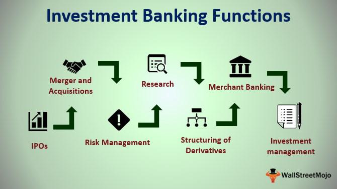

## Table of Contents

## What are the basic principles of investing for beginners?

Investing can seem hard at first, but it's really about some simple ideas that can help you grow your money over time. One key idea is to start early. The sooner you begin investing, the more time your money has to grow through something called compound interest. This is when the money you earn from your investments starts earning money too. Another important principle is to spread out your investments, which is called diversification. This means you don't put all your money in one place, like just stocks or just real estate. By spreading it out, you lower the risk of losing a lot of money if one investment does badly.

Another basic principle is to understand your own comfort with risk. Some investments, like stocks, can go up and down a lot, which might make you nervous. Others, like bonds, are usually safer but don't grow as fast. Knowing how much risk you can handle helps you pick the right investments for you. Finally, it's important to keep learning and staying informed. The world of investing changes, and what worked yesterday might not work tomorrow. By reading and learning, you can make better choices and adjust your investments as needed.

## How do the recommended books cater to different levels of investing experience?

Recommended books on investing are designed to meet the needs of people at different stages of their investing journey. For beginners, books like "The Intelligent Investor" by Benjamin Graham offer a solid foundation. This book explains the basics of investing in a way that's easy to understand. It teaches you about the importance of value investing and how to think about the market over the long term. Another good book for beginners is "A Random Walk Down Wall Street" by Burton G. Malkiel. It's great for those just starting out because it explains different investment strategies and helps you understand the stock market without getting too complicated.

For people with some experience, books like "The Little Book of Common Sense Investing" by John C. Bogle are very helpful. This book focuses on index fund investing, which is a strategy that's good for people who want to keep things simple but still grow their money. It's written in a way that's easy to follow, even if you're not an expert. For more advanced investors, "Security Analysis" by Benjamin Graham and David Dodd is a classic. This book goes into a lot of detail about how to analyze stocks and bonds. It's more complex, but it's perfect for someone who wants to dive deep into the world of investing and make more sophisticated decisions.

In summary, there are books for everyone, no matter where you are in your investing journey. Beginners can start with simple, foundational texts, while those with more experience can move on to books that offer deeper insights and more advanced strategies. By choosing the right book for your level, you can learn and grow as an investor.

## What makes a book on investing a must-read for someone just starting out?

A book on investing becomes a must-read for beginners if it explains the basics in a clear and simple way. It should teach you about important ideas like diversification, which means not putting all your money in one place, and the power of compound interest, which is how your money can grow over time. A good book will also help you understand how to start investing without feeling overwhelmed. For example, "The Intelligent Investor" by Benjamin Graham is great because it breaks down these concepts in a way that's easy to understand, helping you feel more confident about making your first investments.

Another reason a book is a must-read for beginners is if it helps you figure out how much risk you're comfortable with. Some investments can be risky, like stocks, while others, like bonds, are safer. A good book will explain these differences and help you pick investments that match your comfort level. "A Random Walk Down Wall Street" by Burton G. Malkiel does this well, guiding you through different investment strategies and helping you understand the stock market without using complicated language. By reading a book like this, you'll learn how to start investing in a way that feels right for you.

## Can you explain the key concepts covered in each of the top seven books?

"The Intelligent Investor" by Benjamin Graham teaches about value investing. It explains how to find stocks that are worth more than their current price. The book also talks about the importance of thinking long-term and not getting too excited about short-term changes in the market. It introduces the idea of a "margin of safety," which means buying investments at a price low enough to protect you from big losses. Graham also stresses the need to understand your own emotions and how they can affect your investing decisions.

"A Random Walk Down Wall Street" by Burton G. Malkiel explains that it's hard to predict the stock market. The book suggests that instead of trying to pick individual stocks, you should invest in a broad range of stocks through index funds. It covers different investment strategies and helps you understand the risks and rewards of each. Malkiel also talks about the efficient market hypothesis, which says that all known information is already included in stock prices, making it tough to beat the market consistently.

"The Little Book of Common Sense Investing" by John C. Bogle focuses on index fund investing. Bogle explains that index funds are a simple and effective way to invest because they track the overall market, which tends to grow over time. The book emphasizes the importance of keeping costs low, as fees can eat into your returns. Bogle also discusses the benefits of long-term investing and how it can help you achieve your financial goals without taking on too much risk. "Security Analysis" by Benjamin Graham and David Dodd is more advanced. It goes into detail about how to analyze stocks and bonds to find good investments. The book covers different methods for valuing companies and understanding financial statements. It's a deep dive into the world of investing, perfect for those who want to make more sophisticated investment decisions.

## How do these books help in developing a personal investment strategy?

These books help you develop a personal investment strategy by teaching you the basics and guiding you through different approaches. "The Intelligent Investor" by Benjamin Graham shows you how to find good investments by looking for stocks that are undervalued. It also teaches you to think long-term and not to panic when the market goes up and down. This helps you create a strategy that focuses on value and patience. "A Random Walk Down Wall Street" by Burton G. Malkiel suggests that instead of trying to pick individual stocks, you should invest in index funds. This book helps you understand that the market is hard to predict, so a strategy that spreads your money across many stocks can be safer and more effective.

"The Little Book of Common Sense Investing" by John C. Bogle reinforces the idea of using index funds to build your investment strategy. It explains how keeping costs low can help your money grow faster over time. This book encourages you to think about the long term and to keep your investments simple. "Security Analysis" by Benjamin Graham and David Dodd is for those who want to dive deeper. It teaches you how to analyze stocks and bonds in detail, which can help you make more informed decisions. By understanding how to value companies, you can develop a strategy that is more tailored to your specific goals and risk tolerance. Together, these books give you the tools and knowledge to create a personal investment strategy that works for you.

## What are the different investment philosophies presented in these books?

"The Intelligent Investor" by Benjamin Graham teaches the philosophy of value investing. This means looking for stocks that are priced lower than what they are really worth. Graham believes in buying these undervalued stocks and holding them for a long time. He also talks about the importance of having a "margin of safety," which means buying stocks at a price that protects you from big losses. This philosophy helps you stay calm during market ups and downs and focus on the long-term growth of your investments.

"A Random Walk Down Wall Street" by Burton G. Malkiel introduces the efficient market hypothesis. This idea says that it's hard to beat the market because all known information is already included in stock prices. Malkiel suggests that instead of trying to pick individual stocks, you should invest in index funds. These funds track the overall market, which tends to grow over time. This philosophy encourages a simple and effective strategy that spreads your money across many stocks, reducing risk and helping you achieve steady growth.

"The Little Book of Common Sense Investing" by John C. Bogle also supports index fund investing. Bogle believes that index funds are the best way to invest because they have low costs and track the market's performance. He emphasizes the importance of keeping your investment costs low, as high fees can eat into your returns. Bogle's philosophy is about long-term investing and keeping things simple, which can help you reach your financial goals without taking on too much risk. "Security Analysis" by Benjamin Graham and David Dodd focuses on a more detailed approach to investing. It teaches you how to analyze stocks and bonds to find good investments. This philosophy is about understanding the financial health of companies and making informed decisions based on that analysis. It's a more advanced strategy that can help you tailor your investments to your specific goals and risk tolerance.

## How do the authors of these books approach risk management in investing?

In "The Intelligent Investor," Benjamin Graham talks about managing risk by focusing on the idea of a "margin of safety." This means buying stocks at a price that is much lower than what they are really worth. By doing this, you protect yourself from big losses if the stock price goes down. Graham also suggests that you should not get too excited about short-term changes in the market and instead think about the long term. This helps you stay calm and make better decisions, which is a big part of managing risk.

Burton G. Malkiel in "A Random Walk Down Wall Street" and John C. Bogle in "The Little Book of Common Sense Investing" both suggest using index funds to manage risk. They believe that it's hard to predict the market, so instead of trying to pick individual stocks, you should spread your money across many stocks through index funds. This way, if one stock does badly, it won't hurt your whole investment as much. Both authors also talk about the importance of keeping costs low, because high fees can eat into your returns and increase your risk.

In "Security Analysis," Benjamin Graham and David Dodd take a more detailed approach to risk management. They teach you how to analyze stocks and bonds to understand their true value and financial health. By doing this, you can make more informed decisions and avoid investments that are too risky. This method helps you manage risk by focusing on the quality of your investments and making sure they fit with your comfort level and financial goals.

## What are some advanced techniques discussed in these books for experienced investors?

In "Security Analysis" by Benjamin Graham and David Dodd, they talk about advanced techniques for experienced investors. They explain how to deeply analyze stocks and bonds to find their true value. This means looking at a company's financial statements and understanding its business to see if it's a good investment. They also teach you about different ways to value companies, like looking at their earnings or assets. By using these methods, experienced investors can find undervalued stocks and make smart decisions based on detailed information.

"The Intelligent Investor" by Benjamin Graham also has some advanced ideas for those with more experience. Graham talks about the idea of a "margin of safety," which means buying stocks at a much lower price than they are worth. This helps protect you from big losses. He also discusses how to manage a portfolio, which means balancing different investments to reduce risk. Graham suggests that experienced investors should focus on long-term growth and not get too excited about short-term market changes. By following these advanced techniques, investors can build a strong and safe investment strategy.

## How do these books address the psychological aspects of investing?

"The Intelligent Investor" by Benjamin Graham talks a lot about the psychological side of investing. Graham says that your emotions can make you do things that aren't good for your investments. He explains that when the market goes up and down, it's easy to get scared or too excited. But if you can stay calm and think about the long term, you'll make better choices. Graham calls this being a "defensive investor." He says that by focusing on the value of your investments and not the daily changes, you can keep your emotions in check and stick to your plan.

In "A Random Walk Down Wall Street," Burton G. Malkiel also talks about how our feelings can affect our investing. He explains that many people think they can predict the market, but this often leads to bad decisions. Malkiel says that if you understand that the market is hard to predict, you won't get too caught up in trying to time it. Instead, you'll invest in a way that spreads your money across many stocks, which helps you feel less worried about the ups and downs. By keeping things simple and focusing on the long term, you can manage your emotions better and make smarter investment choices.

## What case studies or real-world examples are used in these books to illustrate investing principles?

In "The Intelligent Investor," Benjamin Graham uses a lot of real-world examples to show how his investing ideas work. One famous example is about a company called Northern Pipeline. Graham explains how he bought shares in this company when they were very cheap, and then waited until the company was bought out at a much higher price. This shows how his idea of value investing can lead to big gains if you are patient and buy stocks when they are undervalued. Another example Graham uses is about GEICO, an insurance company he invested in. He shows how understanding a company's business can help you see its true value, even when others don't.

"A Random Walk Down Wall Street" by Burton G. Malkiel also uses real-world examples to explain his ideas. One example is about the stock market crash of 1987, where the market fell a lot in one day. Malkiel uses this to show that trying to predict the market is very hard and often leads to bad decisions. He suggests that instead of trying to time the market, you should invest in a way that spreads your money across many stocks. Another example he uses is about index funds, showing how they have done better than most actively managed funds over time. This helps illustrate his point that keeping things simple and investing in the whole market can lead to better results.

## How have these books influenced successful investors, and can you provide examples?

"The Intelligent Investor" by Benjamin Graham has had a big impact on many successful investors. One famous example is Warren Buffett. He learned a lot from Graham and used his ideas to become one of the richest people in the world. Buffett says that Graham's book taught him to focus on the value of companies and to buy them when they are cheap. This helped him make smart investments and grow his money over time. Another example is Seth Klarman, who also follows Graham's ideas and has done well by finding undervalued stocks and holding them for the long term.

"A Random Walk Down Wall Street" by Burton G. Malkiel has also influenced many investors. One example is Jack Bogle, who started Vanguard and created the first index fund for regular people. Bogle liked Malkiel's idea that you can't beat the market, so he made it easy for people to invest in the whole market through index funds. This has helped many people grow their money without taking big risks. Another example is David Swensen, who manages Yale University's money. He uses index funds as part of his strategy, which has helped Yale's investments do very well over the years.

## What are the criticisms or limitations of the investment strategies suggested in these books?

Some people say that the strategies in these books have some problems. For example, "The Intelligent Investor" by Benjamin Graham focuses on value investing, which means buying stocks when they are cheap. But sometimes, stocks can stay cheap for a long time, and you might lose money waiting for them to go up. Also, finding undervalued stocks takes a lot of time and work. Not everyone has the time or the skills to do this kind of research. Another criticism is that Graham's ideas might not work as well today because the market has changed a lot since he wrote the book.

In "A Random Walk Down Wall Street" by Burton G. Malkiel, the idea of using index funds is popular, but some people think it's too simple. They say that by just following the market, you won't make as much money as you could by picking individual stocks. Also, index funds don't protect you from big drops in the market. If the whole market goes down, your investment will go down too. In "The Little Book of Common Sense Investing" by John C. Bogle, the focus is also on index funds, and some people think this strategy might not be exciting enough for investors who want to take more risks and try to beat the market.

## References & Further Reading

[1]: Graham, Benjamin. ["The Intelligent Investor."](https://www.amazon.com/Intelligent-Investor-Definitive-Investing-Essentials/dp/0060555661) Harper & Brothers, 1949.

[2]: Tobias, Andrew. ["The Only Investment Guide You'll Ever Need."](https://www.amazon.com/Only-Investment-Guide-Youll-Ever/dp/0544781937) Harcourt Brace Jovanovich, 1978.

[3]: Housel, Morgan. ["The Psychology of Money."](https://www.amazon.com/Psychology-Money-Timeless-lessons-happiness/dp/0857197681) Harriman House, 2020.

[4]: Chan, Ernest P. ["Algorithmic Trading: Winning Strategies and Their Rationale."](https://github.com/ftvision/quant_trading_echan_book) Wiley, 2013.

[5]: López de Prado, Marcos. ["Advances in Financial Machine Learning."](https://www.amazon.com/Advances-Financial-Machine-Learning-Marcos/dp/1119482089) Wiley, 2018.

[6]: Clenow, Andreas F. ["Trading Evolved: Anyone Can Build Killer Trading Strategies in Python."](https://www.amazon.com/Trading-Evolved-Anyone-Killer-Strategies/dp/109198378X) Independently Published, 2019.

[7]: Tharp, Van K. ["Trade Your Way to Financial Freedom."](https://www.amazon.com/Trade-Your-Way-Financial-Freedom/dp/007147871X) McGraw-Hill Education, 2007.

[8]: Weissman, Richard L. ["Mechanical Trading Systems."](https://www.amazon.com/Mechanical-Trading-Systems-Psychology-Technical/dp/0471654353) Wiley, 2004.

[9]: Clenow, Andreas F. ["Following the Trend: Diversified Managed Futures Trading."](https://www.amazon.com/Following-Trend-Diversified-Managed-Futures/dp/1118410858) Wiley, 2012.

[10]: Ariely, Dan. ["Predictably Irrational."](https://www.amazon.com/Predictably-Irrational-Revised-Expanded-Decisions/dp/0061353248) Harper Perennial, 2008.

[11]: Montier, James. ["Behavioral Investing: A Practitioner's Guide to Applying Behavioural Finance."](https://onlinelibrary.wiley.com/doi/book/10.1002/9781118673430) Wiley, 2007.

[12]: Lebron, Agustin. ["The Laws of Trading: A Trader's Guide to Better Decision-Making for Everyone."](https://www.amazon.com/Laws-Trading-Traders-Decision-Making-Everyone/dp/1119574218) Wiley, 2019.

[13]: Chan, Ernest P. ["Quantitative Trading: How to Build Your Own Algorithmic Trading Business."](https://github.com/ftvision/quant_trading_echan_book) Wiley, 2008.

[14]: Narang, Rishi K. ["Inside the Black Box: The Simple Truth About Quantitative Trading."](https://www.amazon.com/Inside-Black-Box-Quantitative-Trading/dp/0470432063) Wiley, 2013.

[15]: Joshi, Mark S. ["The Concepts and Practice of Mathematical Finance."](https://www.amazon.com/Concepts-Practice-Mathematical-Finance-Mathematics/dp/0521514088) Cambridge University Press, 2008.