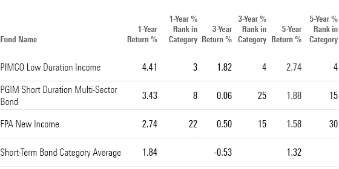

## Table of Contents

## What are short-term bond funds?

Short-term bond funds are a type of investment where money is put into bonds that will mature in a short time, usually one to three years. These funds are considered safer than long-term bond funds because they are less affected by changes in interest rates. This makes them a good choice for people who want to keep their money safe but still earn a little bit of interest.

These funds invest in various types of bonds, like government bonds, corporate bonds, and municipal bonds. Because the bonds mature quickly, the money can be returned to investors faster if needed. This makes short-term bond funds a good option for people who might need their money back soon and want to avoid the risk of long-term investments.

## Why should someone consider investing in short-term bond funds?

Someone should consider investing in short-term bond funds if they want a safe place to put their money while still earning some interest. These funds are less risky than long-term bond funds because they are not as affected by changes in interest rates. This makes them a good choice for people who want to protect their money but also want it to grow a little bit.

Short-term bond funds are also a good option for people who might need their money back soon. Since the bonds in these funds mature in one to three years, the money can be returned to investors faster if needed. This makes short-term bond funds a smart choice for those who want to keep their money safe and accessible without taking on too much risk.

## What were the top-performing short-term bond funds in 2020?

In 2020, one of the top-performing short-term bond funds was the PIMCO Low Duration Fund (Class A). This fund did well because it focused on bonds that would mature soon, which helped it stay safe from big changes in the market. The fund earned a good return for its investors, making it a popular choice for people looking for a safe place to put their money.

Another top performer in 2020 was the Vanguard Short-Term Bond Index Fund (Admiral Shares). This fund did well by investing in a mix of government and corporate bonds that were set to mature in the near future. It provided a steady return and was a good option for those who wanted to keep their money safe but still see some growth.

Overall, these funds showed that short-term bond funds can be a smart choice for investors, especially during uncertain times like 2020. They offered a balance of safety and returns, making them attractive to people who wanted to protect their money while still earning some interest.

## How do short-term bond funds differ from long-term bond funds?

Short-term bond funds and long-term bond funds are different in how long the bonds they invest in take to mature. Short-term bond funds focus on bonds that will mature in one to three years. This makes them less risky because they are not as affected by changes in interest rates. On the other hand, long-term bond funds invest in bonds that take much longer to mature, often 10 years or more. Because of this, they are more sensitive to interest rate changes, which can make them riskier.

Another difference is how quickly you can get your money back. With short-term bond funds, since the bonds mature soon, you can get your money back faster if you need it. This makes them a good choice for people who might need their money in the near future. Long-term bond funds, however, lock your money in for a longer time. If you need to get your money out before the bonds mature, you might have to sell them at a loss, which can be a problem if the market is not doing well.

## What are the key metrics to look at when evaluating short-term bond funds?

When looking at short-term bond funds, one key thing to check is the yield. The yield tells you how much money the fund is earning from the bonds it holds. A higher yield means more money for you, but it might also mean the fund is taking on more risk. Another important metric is the duration. Duration shows how sensitive the fund is to changes in interest rates. A shorter duration means the fund is less affected by rate changes, which is good for short-term bond funds.

Another thing to look at is the expense ratio. This is how much the fund charges you to manage your money. A lower expense ratio means more of your money stays in your pocket. You should also check the fund's credit quality. This tells you how safe the bonds in the fund are. Higher credit quality means the bonds are less likely to default, making the fund safer. Finally, look at the fund's performance over time. This can give you an idea of how well the fund has done in the past and if it's likely to do well in the future.

## How did the economic climate of 2020 affect short-term bond funds?

In 2020, the economic climate had a big impact on short-term bond funds. The year was full of uncertainty because of the COVID-19 pandemic. This made many people worried about their money, and they wanted to keep it safe. Short-term bond funds did well because they were seen as a safe place to put money. They were less affected by the big changes in the market that happened because of the economic uncertainty. This made them a popular choice for people who wanted to protect their money while still earning a little bit of interest.

The Federal Reserve also played a big role in how short-term bond funds did in 2020. The Fed lowered interest rates to help the economy. This made short-term bonds less sensitive to interest rate changes, which helped the funds stay stable. Because of this, many short-term bond funds were able to give their investors steady returns, even when the rest of the market was going up and down. Overall, the economic climate of 2020 made short-term bond funds a good choice for people who wanted to keep their money safe during a tough time.

## What are the risks associated with investing in short-term bond funds?

Investing in short-term bond funds comes with some risks. One big risk is interest rate risk. Even though short-term bond funds are less affected by interest rate changes than long-term bond funds, they can still lose value if rates go up a lot. When interest rates rise, the value of the bonds in the fund can go down, which means the fund's price might drop.

Another risk is credit risk. This means that the companies or governments that issued the bonds might not be able to pay back the money they owe. If a bond issuer defaults, the fund could lose money. Short-term bond funds usually invest in high-quality bonds to lower this risk, but it's still something to think about.

Lastly, there's the risk of inflation. If inflation goes up a lot, the money you earn from the fund might not be worth as much as you thought. Inflation can eat away at the buying power of your returns, making it harder to reach your financial goals. So, while short-term bond funds are seen as safe, it's good to know these risks before you invest.

## Can you explain the role of interest rates in the performance of short-term bond funds in 2020?

In 2020, interest rates played a big role in how short-term bond funds did. The Federal Reserve decided to lower interest rates to help the economy during the COVID-19 pandemic. When interest rates go down, the value of bonds usually goes up. This is because new bonds that are issued will have lower interest rates, making the older bonds with higher rates more valuable. Since short-term bond funds hold bonds that mature soon, they were less affected by these changes in interest rates than long-term bond funds. This helped short-term bond funds stay stable and perform well during a time when the market was very uncertain.

Because of the low interest rates, short-term bond funds were able to give investors steady returns. People were looking for safe places to put their money during the economic uncertainty of 2020, and short-term bond funds fit the bill. They were not as risky as stocks or long-term bonds, and the low interest rates helped them keep their value. This made them a popular choice for investors who wanted to protect their money while still earning a little bit of interest.

## How did the top short-term bond funds of 2020 manage their portfolios?

The top short-term bond funds of 2020, like the PIMCO Low Duration Fund and the Vanguard Short-Term Bond Index Fund, managed their portfolios by focusing on bonds that would mature soon. They chose bonds that would pay back the money in one to three years. This helped them stay safe from big changes in the market. These funds also looked for high-quality bonds, like those from the government or good companies, to lower the risk of not getting their money back.

These funds also paid attention to interest rates. In 2020, the Federal Reserve lowered interest rates to help the economy during the COVID-19 pandemic. The funds took advantage of this by holding onto bonds that had higher interest rates than new bonds being issued. This helped them keep their value and give steady returns to investors. By being careful and choosing the right bonds, these funds did well in a year that was full of uncertainty.

## What are the tax implications of investing in short-term bond funds?

When you invest in short-term bond funds, you need to think about taxes. The money you earn from these funds is usually taxed as regular income. This means you'll pay the same tax rate on your earnings as you do on your salary. If the fund invests in government bonds, like those from the U.S. Treasury, the interest you earn might not be taxed at the state level, but you'll still have to pay federal taxes on it.

Another thing to know is that if you sell your shares in the fund for more money than you paid for them, you might have to pay capital gains tax. This tax is usually lower than the tax on regular income. But if you hold the shares for less than a year, the gain is taxed as regular income. So, it's good to think about how long you plan to keep your money in the fund when you're figuring out the taxes.

## How can an investor incorporate short-term bond funds into a diversified investment portfolio?

Short-term bond funds can be a good part of a diversified investment portfolio. They can help balance out riskier investments like stocks. If you have money in stocks and the stock market goes down, the short-term bond funds might not go down as much. This can help keep your overall portfolio more stable. You can decide how much of your money to put into short-term bond funds based on how much risk you want to take. If you want to be safer, you might put more money into these funds. If you want to take more risk for the chance of bigger returns, you might put less money into them.

Adding short-term bond funds to your portfolio can also give you some money to use if you need it soon. Since these funds invest in bonds that mature in one to three years, you can get your money back faster than with long-term investments. This makes them a good choice if you might need to use some of your investment money in the next few years. By mixing short-term bond funds with other types of investments, you can have a portfolio that grows but is also safe and ready for your future needs.

## What advanced strategies can be used to optimize returns from short-term bond funds?

One way to get more out of short-term bond funds is by using a laddering strategy. This means you buy bonds that mature at different times. For example, you might buy some bonds that mature in one year, some in two years, and some in three years. When the one-year bonds mature, you can use that money to buy new bonds that mature in three years. This way, you always have bonds maturing soon, which can help you get a better return and keep your money safe. It also lets you take advantage of changes in interest rates, because you can buy new bonds at the best rates available when your old ones mature.

Another strategy is to pay attention to the fund's duration and yield. If you think interest rates might go up, you can choose funds with a shorter duration to protect your money. If you think rates will stay low, you might pick funds with a higher yield to get more money. You can also look for funds that invest in a mix of different types of bonds, like government and corporate bonds, to spread out the risk. By keeping an eye on these things and adjusting your investments, you can try to get the best returns from your short-term bond funds.

## What are short-term bond funds?

Short-term bond funds are investment vehicles that allocate capital into bonds with maturities ranging from a few months to a few years. These bonds typically fall within the short end of the yield curve, which makes them less susceptible to fluctuations in interest rates compared to their long-term counterparts. The reduced sensitivity to interest rate changes is primarily rooted in the shorter duration of these bonds, which can be expressed mathematically as:

$$
\text{Duration} = \frac{\sum \left( \text{PV of Cash Flow}_t \times t \right)}{\sum \text{PV of Cash Flow}_t}
$$

where $t$ represents the time periods until the cash flows are received, and $\text{PV of Cash Flow}_t$ is the present value of the cash flows at time $t$.

Investors are drawn to short-term bond funds mainly for capital preservation and minimizing [volatility](/wiki/volatility-trading-strategies). These investments are often considered a safe haven during volatile market conditions, providing a buffer against more aggressive asset classes such as equities. The stability offered by short-term bond funds is further bolstered by their investment in high-quality bonds, often focusing on those issued by government entities or corporations with strong credit ratings.

The prioritization of high-quality bonds contributes significantly to the safety profile of these funds. High-quality bonds are typically associated with lower default risks, providing investors with confidence in the preservation of their principal. This emphasis on quality is a key [factor](/wiki/factor-investing) differentiating short-term bond funds from other more speculative or high-yield fixed-income investments.

In summary, short-term bond funds offer a strategic option for investors aiming to maintain [liquidity](/wiki/liquidity-risk-premium) and preserve capital with reduced exposure to [interest rate](/wiki/interest-rate-trading-strategies) risk. These attributes make them a fitting choice for those looking to protect their financial assets while potentially [earning](/wiki/earning-announcement) stable returns.

## References & Further Reading

[1]: Bergstra, J., Bardenet, R., Bengio, Y., & Kégl, B. (2011). ["Algorithms for Hyper-Parameter Optimization."](https://dl.acm.org/doi/10.5555/2986459.2986743) Advances in Neural Information Processing Systems 24.

[2]: ["Advances in Financial Machine Learning"](https://www.amazon.com/Advances-Financial-Machine-Learning-Marcos/dp/1119482089) by Marcos Lopez de Prado

[3]: ["Evidence-Based Technical Analysis: Applying the Scientific Method and Statistical Inference to Trading Signals"](https://www.amazon.com/Evidence-Based-Technical-Analysis-Scientific-Statistical/dp/0470008741) by David Aronson

[4]: ["Machine Learning for Algorithmic Trading"](https://github.com/stefan-jansen/machine-learning-for-trading) by Stefan Jansen

[5]: ["Quantitative Trading: How to Build Your Own Algorithmic Trading Business"](https://www.amazon.com/Quantitative-Trading-Build-Algorithmic-Business/dp/1119800064) by Ernest P. Chan