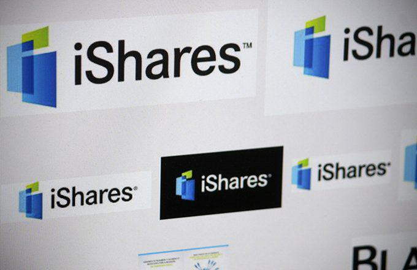

The financial world offers a myriad of investment opportunities and strategies, catering to various investor needs and preferences. These include investment funds, stock markets, small-cap index funds, and algorithmic trading, each playing a crucial role in the investment landscape. This article aims to explore these key investment options and strategies, providing readers with the necessary insights to make informed investment decisions.

Investment funds, such as mutual funds and exchange-traded funds (ETFs), pool resources from multiple investors to invest in a diversified portfolio of securities. These funds offer broad market exposure and are an essential tool for investors seeking diversification. The stock market, a complex ecosystem, is a pivotal component of the global economy. Understanding its dynamics, including market indices like the S&P 500 and their reflection of market conditions, is vital for investors aiming to engage with this intricate system.



Small-cap index funds represent an investment in smaller companies with significant growth potential. These funds, such as the Russell 2000 Index, provide opportunities for higher returns, albeit with increased risk. Algorithmic trading, leveraging computer programs for trade execution, is revolutionizing the financial landscape by optimizing trading efficiency and reducing emotional biases.

This article will emphasize the interplay between traditional investment strategies and modern technological advancements, providing a comprehensive overview of these elements to aid investors in navigating the complex financial landscape. By integrating insights from both conventional methods and contemporary innovations, investors can align their strategies with evolving market conditions to optimize risk-return profiles.

## Table of Contents

## Understanding Investment Funds

Investment funds represent a sophisticated mechanism whereby capital is collectively gathered from multiple investors to purchase a diversified portfolio of securities. This aggregation enables investors to achieve broad market exposure that may be challenging to attain individually, especially for those with limited capital. The primary types of investment funds are mutual funds, index funds, and exchange-traded funds (ETFs), each offering distinctive features and challenges.

### Mutual Funds

Mutual funds are professionally managed investment vehicles that pool money to purchase a diversified basket of stocks, bonds, or other securities. Active management is a hallmark of mutual funds, where fund managers make decisions on the allocation of assets within the fund to outperform specific benchmarks. The advantages of mutual funds include professional management and instant diversification. However, they often come with higher expense ratios due to management fees and can [carry](/wiki/carry-trading) risks of underperforming their benchmarks due to misjudgments by active managers.

### Index Funds

Index funds aim to mirror the performance of a specific market index, like the S&P 500. Unlike mutual funds, index funds engage in passive management, reducing the need for strategic buy-sell decisions within the fund. The passive nature generally translates to lower expense ratios and tax efficiencies. By investing in index funds, investors benefit from lower turnover rates and an inherent diversification that mirrors the entire index. However, the drawbacks include limited flexibility since the fund is obligated to reflect its underlying index, making it difficult to react swiftly to market disruptions.

### Exchange-Traded Funds (ETFs)

ETFs are investment funds traded on stock exchanges, similar to individual stocks. These funds combine elements of both mutual funds and index funds, offering diversified exposure with the flexibility of stock-like characteristics. ETFs can be actively or passively managed, but they commonly track indices similar to index funds. The primary benefit of ETFs is their [liquidity](/wiki/liquidity-risk-premium); they can be bought and sold throughout the trading day at market prices. They also tend to have lower expense ratios compared to mutual funds. Nevertheless, ETFs might involve brokerage fees and potential market spreads that can affect investment costs.

### Choosing the Right Investment Fund

Selecting the appropriate investment fund hinges on aligning with the investor's financial goals and risk tolerance. Investors aiming for long-term growth might lean towards index funds or ETFs for their cost-efficient and broad-market exposure. For those prioritizing active engagement and potential market outperformance, mutual funds might be more suitable.

Risk tolerance plays a critical role; conservative investors might prefer funds with stable, income-producing securities, while aggressive investors could favor funds that invest in high-growth sectors. Furthermore, understanding management fees, tax implications, and fund performance history is essential in making informed investment decisions.

Overall, the decision to choose a specific type of investment fund should involve a comprehensive assessment of investment objectives, such as growth, income, or preservation of capital, while considering the trade-offs associated with each type of fund.

## The Stock Market and Its Dynamics

The stock market is a multifaceted ecosystem, serving as a foundational element of the global economy. It acts as a marketplace where securities, including stocks and bonds, are bought and sold, providing companies with access to capital and investors with a slice of corporate ownership. 

Understanding market indices is fundamental for grasping market conditions and trends. Indices like the S&P 500, encompassing 500 of the largest U.S. companies, serve as benchmarks for overall market health. These indices are weighted by market capitalization, reflecting the performance of a broad spectrum of industries. The calculation is often expressed mathematically as:

$$
\text{Index Level} = \left( \frac{\text{Sum of Adjusted Market Capitalizations}}{\text{Divisor}} \right)
$$

where the divisor adjusts for stock splits, changes in composition, and other factors to preserve continuity.

Stock exchanges, such as the New York Stock Exchange (NYSE) and NASDAQ, facilitate the trading of these securities. Their role extends beyond mere transaction platforms; they ensure transparency, liquidity, and regulatory compliance. Global economic events significantly influence stock market performance. For instance, geopolitical tensions can lead to market [volatility](/wiki/volatility-trading-strategies), while economic stimuli, such as reduced interest rates, can bolster market confidence and drive investment activity.

Investing in stocks requires a strategic approach. Fundamental analysis involves evaluating a company's financial statements, management, and competitive advantages to determine its intrinsic value. Key metrics include the price-to-earnings (P/E) ratio, earnings per share (EPS), and return on equity (ROE). Conversely, technical analysis interprets chart patterns and market signals based on historical price performance. Tools such as moving averages, oscillators, and [volume](/wiki/volume-trading-strategy) indicators aid in identifying potential entry and [exit](/wiki/exit-strategy) points:

```python
import pandas as pd
import matplotlib.pyplot as plt

def moving_average(prices, period=20):
    return prices.rolling(window=period).mean()

# Sample data
prices = pd.Series([120, 122, 121, 119, 125, 129, 130, 128, 126, 124])
moving_avg = moving_average(prices)

plt.plot(prices, label='Stock Prices')
plt.plot(moving_avg, label='20-day Moving Average')
plt.legend()
plt.show()
```

Both strategies have their merits and risks. Fundamental analysis is suited for long-term investments, hinging on the belief that a company's true value will eventually be reflected in its stock price. Technical analysis caters to short-term traders, leveraging price patterns for quick gains. Successful stock market investment often involves blending these analytical techniques, tempered by an understanding of market trends and individual financial goals.

## Exploring Small-Cap Index Funds

Small-cap index funds are designed to invest in smaller companies that often display significant growth potential. These funds track indices such as the Russell 2000 Index, which includes approximately 2,000 of the smallest publicly traded companies in the United States. One of the popular exchange-traded funds (ETFs) that mirror this index is the iShares Russell 2000 [ETF](/wiki/etf-trading-strategies). 

### Advantages of Small-Cap Index Funds

One of the primary benefits of investing in small-cap index funds is the potential for high returns. Historically, smaller companies have shown a greater capacity for growth compared to their larger counterparts. This growth is often attributed to the nimbleness and innovation of small-cap entities, which can adapt more rapidly to market changes and new opportunities.

Furthermore, small-cap index funds offer diversification benefits. Investing in a broad array of smaller companies can reduce the risk associated with the volatility of individual stocks. By spreading investment across multiple companies within a small-cap index, investors can mitigate the risk inherent in betting on a single entity.

### Risks Involved

While small-cap index funds offer high return potential, they also come with increased risks. Smaller companies tend to be more volatile than large-cap stocks, leading to greater fluctuations in stock prices. Economic downturns can disproportionately affect smaller companies, which may lack the resources and financial stability of larger corporations. This sensitivity to economic conditions underscores the importance of risk management for investors considering small-cap funds.

### Comparison with Large-Cap and Mid-Cap Funds

When compared to large-cap and mid-cap funds, small-cap funds present a different risk-reward profile. Large-cap funds typically consist of well-established companies with steady returns and lower volatility. They are often perceived as safer, particularly during periods of economic uncertainty, but may offer lower growth potential. Mid-cap funds, sitting between large and small-cap, provide a moderate balance of growth and stability. They possess characteristics of both, offering better growth potential than large caps and more stability than small caps.

### Key Considerations for Investors

Investors interested in small-cap index funds should consider several factors before committing. It is crucial to assess one's risk tolerance, as the inherent volatility of small-cap stocks may not suit conservative investors. Furthermore, understanding the economic cycle can be beneficial, as timing entry and exit points relative to economic conditions can influence investment outcomes.

A long-term investment horizon is often advised, as it allows investors to weather short-term volatility while capitalizing on the growth potential of small-cap stocks. Additionally, considering fees and expense ratios associated with these funds is essential, as they can impact overall returns.

In summary, small-cap index funds can be a valuable addition to an investment portfolio, offering growth potential and diversification. However, they require careful consideration of their unique characteristics and associated risks.

## The Role of Algorithmic Trading

Algorithmic trading involves the use of computer algorithms to automate the process of buying and selling financial securities. This method leverages the speed and computational power of computers to analyze market data and execute trades faster and more efficiently than human traders. The primary advantage of [algorithmic trading](/wiki/algorithmic-trading) is its ability to enhance trading efficiency and reduce emotional biases that can affect decision-making.

By eliminating human emotions such as fear or greed, algorithmic trading adheres strictly to a predefined set of rules for trading, which can be based on statistical data or strategies like moving averages, mean reversion, and [momentum](/wiki/momentum) trading. This automation ensures consistency in trading strategies, ultimately aiming to optimize trading performance.

### Impact on Market Volatility and Liquidity

Algorithmic trading significantly influences market volatility and liquidity. In small-cap markets, where the trading volume is generally lower, the introduction of algorithmic trading can lead to increased liquidity. This is because algorithms facilitate a higher frequency of trades, thereby tightening bid-ask spreads and improving market depth. However, there is a concern that algorithmic trading can exacerbate market volatility. High-frequency trading ([HFT](/wiki/high-frequency-trading-strategies)), a subset of algorithmic trading, can lead to sudden and large price swings if a significant number of trades are executed simultaneously, potentially destabilizing markets.

### Potential Risks and Regulatory Concerns

Several risks and regulatory issues are associated with algorithmic trading. The systemic risk posed by algorithms executing substantial trades in milliseconds could lead to flash crashes, where stock prices plummet sharply and recover quickly. Regulatory bodies, such as the U.S. Securities and Exchange Commission (SEC), have established guidelines to oversee algorithmic trading activities. These regulations aim to ensure transparency and fairness, prevent market manipulation, and safeguard against systemic risks that could harm broader financial market stability.

### Managing Small-Cap and Index Fund Portfolios

Algorithmic strategies hold particular significance in managing portfolios, including small-cap index funds. Algorithms can be programmed to identify favorable conditions based on historical patterns and statistical models, allowing for precise timing in buying or selling securities. For small-cap portfolios, which often experience high volatility and low liquidity, algorithmic trading can enhance returns by swiftly capitalizing on short-term market inefficiencies. 

In the context of index funds, algorithms help maintain index tracking accuracy by efficiently managing the fund rebalancing process. This includes adjusting the fund's holdings to match changes in the underlying index composition, which can happen frequently in dynamic market environments.

### Python Example of a Simple Moving Average Strategy

Here’s a simple example of a Python code implementing a basic moving average crossover strategy using two moving averages—short-term (SMA50) and long-term (SMA200):

```python
import pandas as pd

# Assuming 'data' is a DataFrame containing stock prices with a 'Close' column
data['SMA50'] = data['Close'].rolling(window=50).mean()
data['SMA200'] = data['Close'].rolling(window=200).mean()

def generate_signals(data):
    signals = pd.DataFrame(index=data.index)
    signals['Signal'] = 0.0

    # Short-term moving average crosses above the long-term moving average
    signals['Signal'][50:] = np.where(data['SMA50'][50:] > data['SMA200'][50:], 1.0, 0.0) 

    # Generate trading orders
    signals['Position'] = signals['Signal'].diff()

    return signals

signals = generate_signals(data)
```

In this example, the algorithm generates a buy signal when the short-term moving average crosses above the long-term moving average, indicating a potential upward trend. Such strategies, when automated and back-tested, can be optimized for better performance and risk management in both small-cap and index fund portfolios.

## Synergizing Strategies for Optimal Investment

Combining small-cap index funds with algorithmic trading can significantly enhance portfolio performance by leveraging the high growth potential of small-cap equities and the efficiency of algorithmic strategies. This section explores strategies that investors can use to balance growth potential and risk through diverse portfolio allocations while also highlighting the integration of financial advisors and the use of modern tools for dynamic allocation.

**Balancing Growth and Risk Through Diversification**

Investors seeking to balance growth potential and risk in their portfolios may consider diversifying across asset classes, including small-cap index funds, to capitalize on the historical growth trajectories of smaller companies. Small-cap companies typically demonstrate higher volatility but can offer substantial returns over time. An optimal strategy involves allocating a certain percentage of the portfolio to small-cap index funds while maintaining exposure to less volatile asset classes, such as bonds or large-cap stocks.

**Case Studies on Strategy Integration**

To illustrate the successful integration of small-cap index funds and algorithmic trading, consider the case of a technology-focused investment firm that allocates 20% of its portfolio to small-cap technology stocks within the Russell 2000 Index, using algorithmic trading to manage entry and exit points. By employing [machine learning](/wiki/machine-learning) algorithms to predict market trends and optimize every transaction, the firm maximizes its returns while limiting downside risk. Historical data and [backtesting](/wiki/backtesting) of these algorithms enable precise adjustments to portfolio allocations, enhancing overall performance.

**Role of Financial Advisors**

Financial advisors play a crucial role in facilitating the effective use of small-cap index funds and algorithmic trading strategies. They guide investors in understanding the nuances of these strategies, including risk assessment and the selection of appropriate algorithmic models. Advisors also provide insights into market trends and assist in compliance with regulatory requirements associated with algorithmic trading.

**Dynamic Allocation and Strategy Adaptation Tools**

The dynamic nature of financial markets necessitates the use of modern tools that enable real-time data analysis and strategy adaptation. Tools such as Python-based trading platforms allow for the quick implementation and testing of algorithmic models. For instance, using libraries like `pandas` for data handling, and `numpy` for numerical calculations, investors can efficiently monitor market conditions and adjust their portfolio allocations accordingly. The following Python code snippet illustrates a simple framework for rebalancing a portfolio dynamically in response to market changes:

```python
import pandas as pd
import numpy as np

# Define initial portfolio weights
portfolio_weights = {'small_cap': 0.2, 'large_cap': 0.5, 'bonds': 0.3}

# Function to update portfolio weights
def rebalance_portfolio(market_trends, current_weights):
    if market_trends['small_cap'] > market_trends['large_cap']:
        current_weights['small_cap'] += 0.05
        current_weights['large_cap'] -= 0.05
    elif market_trends['large_cap'] > market_trends['small_cap']:
        current_weights['large_cap'] += 0.05
        current_weights['small_cap'] -= 0.05
    # Re-normalize weights to sum up to 1
    total = sum(current_weights.values())
    return {asset: weight / total for asset, weight in current_weights.items()}

# Simulated market trends
market_trends = {'small_cap': 0.15, 'large_cap': 0.10}

# Update portfolio based on trends
updated_weights = rebalance_portfolio(market_trends, portfolio_weights)
print(updated_weights)
```

Using such tools, investors are better positioned to adapt their strategies dynamically based on changing market conditions, thereby optimizing returns while managing risks efficiently.

Overall, the combination of small-cap index funds and algorithmic trading presents a compelling approach to modern investing, particularly when supported by strategic diversification, expert advice, and advanced analytical tools.

## Conclusion

Investment funds, stock markets, small-cap index funds, and algorithmic trading together form a robust framework for contemporary investing. Leveraging the blend of these traditional and technological strategies enables investors to fine-tune the balance between risk and potential reward. Each component within this landscape offers distinct advantages: investment funds, such as mutual funds and ETFs, provide diversification and access to a wide range of assets, while the stock market offers opportunities for growth through direct equity investments. Small-cap index funds present the possibility of high returns due to the growth potential of smaller companies, albeit with higher volatility. Algorithmic trading, on the other hand, brings efficiency and precision, reducing the impact of human bias and swiftly responding to market changes.

To maximize investment success, an understanding of these elements' unique strengths is crucial. Learning how they complement one another can significantly enhance decision-making processes. Continual education is vital, given the rapid pace of advancements in technology and shifts in economic conditions. Investors must stay informed to adapt strategies as needed, evolving with changes in the financial landscape. 

Ultimately, the alignment of investment approaches to personal financial goals and risk tolerance is essential. Each investor's situation is unique, and strategies should be tailored accordingly to achieve optimal outcomes. As opportunities continue to evolve, maintaining a flexible and informed approach will serve investors well in achieving their financial aspirations.

## References & Further Reading

- Bogle, J. C. _Common Sense on Mutual Funds: New Imperatives for the Intelligent Investor_. This book by John Bogle, the founder of Vanguard Group, offers timeless insights into mutual fund investment, advocating for low-cost and diversified funds, and the importance of long-term investment strategies.

- French, K. R., & Fama, E. F. "The Cross-Section of Expected Stock Returns." _The Journal of Finance_. This seminal paper introduces the Fama-French three-factor model, enhancing the understanding of asset returns by considering factors such as size, value, and market risk, which are crucial for analyzing stock market dynamics.

- Lopez de Prado, M. _Advances in Financial Machine Learning_. This book brings forward the application of machine learning in finance, providing advanced techniques and methodologies that improve trading strategies, particularly in algorithmic trading, offering insights into the future of financial technology.

- Chan, E. P. _Quantitative Trading: How to Build Your Own Algorithmic Trading Business_. This resource guides the process of establishing an algorithmic trading business, covering strategy development, backtesting, and implementation, and is particularly useful for those interested in leveraging quantitative techniques for trading.

- Jansen, S. _Machine Learning for Algorithmic Trading_. This work explores the integration of machine learning models in trading strategies, covering tools and techniques that allow traders to develop and deploy robust algorithms adaptable to market changes, with Python being the primary programming language used throughout the book.

