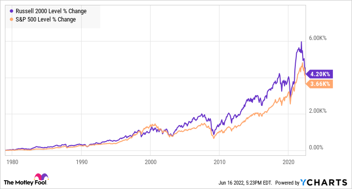

## Table of Contents

## What are small-cap index funds?

Small-cap index funds are a type of investment that focuses on companies with smaller market values. These companies usually have a market capitalization between $300 million and $2 billion. Because these companies are smaller, they can grow quickly, which might lead to higher returns for investors. However, they can also be riskier because they are more sensitive to economic changes.

Investing in small-cap index funds means you're buying a little bit of many small companies all at once. This helps spread out the risk because if one company does poorly, it won't hurt your entire investment. These funds try to match the performance of a small-cap index, like the Russell 2000. This means they aim to do as well as the average of all the small companies in that index, rather than trying to beat the market.

## Why should someone consider investing in small-cap index funds?

Someone should consider investing in small-cap index funds because they offer the chance for big growth. Small companies can grow a lot faster than big ones. If you invest in a small-cap index fund, you're betting on a bunch of these small companies. If they do well, your investment could grow a lot. This is good if you want your money to grow over time.

Another reason is that small-cap index funds help spread out risk. When you buy a small-cap index fund, you're not just betting on one company. You're investing in many small companies at once. If one company does badly, it won't ruin your whole investment. This makes it safer than [picking](/wiki/asset-class-picking) just one or two small companies to invest in. Plus, these funds are easy to buy and manage, which is great if you're new to investing.

## How do small-cap index funds differ from large-cap index funds?

Small-cap index funds and large-cap index funds are different mainly because of the size of the companies they invest in. Small-cap funds focus on smaller companies, usually with a market value between $300 million and $2 billion. These companies are often newer or in their growth phase. On the other hand, large-cap funds invest in big, well-known companies that have a market value of $10 billion or more. These companies are usually more stable and have been around for a long time.

Because of these differences, small-cap and large-cap funds can have different levels of risk and reward. Small-cap funds can offer bigger growth because small companies can grow quickly. But they are also riskier because they are more affected by economic changes. Large-cap funds are usually safer because big companies are more stable. They might not grow as fast, but they are less likely to lose a lot of value quickly. So, if you want the chance for big growth and are okay with more risk, small-cap funds might be good for you. If you want a safer investment with steady growth, large-cap funds could be better.

## What are the risks associated with investing in small-cap index funds?

Investing in small-cap index funds can be riskier than investing in larger companies. Small companies can be more affected by economic changes. If the economy slows down, these companies might struggle more than bigger ones. This means the value of your investment in a small-cap fund could go down a lot if the economy isn't doing well.

Another risk is that small companies might not have as much money or resources as big companies. This can make it harder for them to grow or survive tough times. If a small company in the index fund goes bankrupt, it can hurt the overall performance of the fund. So, while small-cap funds can offer big growth, they also come with a higher chance of losing money.

## Can you list some of the top-performing small-cap index funds?

Some top-performing small-cap index funds include the Vanguard Small-Cap Index Fund (VSMAX) and the Schwab U.S. Small-Cap [ETF](/wiki/etf-trading-strategies) (SCHA). The Vanguard Small-Cap Index Fund aims to match the performance of the CRSP US Small Cap Index, which includes a wide range of small companies. It has low fees, which means more of your money stays invested and can grow over time. The Schwab U.S. Small-Cap ETF follows the Dow Jones U.S. Small-Cap Total Stock Market Index and also has low costs, making it a good choice for investors looking to spread their money across many small companies.

Another good small-cap index fund is the iShares Russell 2000 ETF (IWM). This fund tracks the Russell 2000 Index, which is made up of the 2000 smallest companies in the Russell 3000 Index. The iShares Russell 2000 ETF is popular because it gives investors a way to invest in a broad range of small companies with just one fund. It's also known for its low costs and ability to give investors exposure to the growth potential of small-cap stocks.

## What are the expense ratios for these top small-cap index funds?

The Vanguard Small-Cap Index Fund (VSMAX) has an expense ratio of 0.05%. This means for every $100 you invest, you pay just 5 cents each year to own the fund. The low expense ratio helps keep more of your money working for you over time, which can lead to better returns.

The Schwab U.S. Small-Cap ETF (SCHA) has an expense ratio of 0.04%. This is even lower than the Vanguard fund, so you only pay 4 cents per $100 invested each year. Like the Vanguard fund, the low costs help your investment grow more over time.

The iShares Russell 2000 ETF (IWM) has a slightly higher expense ratio at 0.19%. This means you pay 19 cents per $100 invested each year. While it's higher than the other two funds, it's still considered low for an ETF and can be a good choice if you want to invest in the Russell 2000 Index.

## How do the returns of small-cap index funds compare to the overall market?

Small-cap index funds can sometimes do better than the overall market. This is because small companies can grow a lot faster than big ones. If you look at the long-term numbers, small-cap index funds have often beaten the overall market, like the S&P 500. But this isn't always true. Some years, small-cap funds might do worse than the market. It depends on what's happening in the economy and how well the small companies in the fund are doing.

But small-cap index funds are also riskier. They can go up and down a lot more than the overall market. When the economy is doing well, small-cap funds might do really well. But when things get tough, like during a recession, small-cap funds can lose a lot more money than the overall market. So, while they can offer bigger rewards, they come with more risk. If you're thinking about investing in small-cap index funds, you need to be okay with this extra risk.

## What are the criteria used to select stocks for small-cap index funds?

Small-cap index funds pick stocks based on the market value of companies, which is how much the company is worth in total. Usually, a company is considered small-cap if its market value is between $300 million and $2 billion. The fund managers look at an index like the Russell 2000 or the CRSP US Small Cap Index, which lists many small companies. They then try to buy the same stocks in the same amounts as the index, so their fund matches the index's performance.

Besides market value, the selection also depends on how the index is set up. For example, the Russell 2000 includes the 2000 smallest companies from the Russell 3000 Index. So, the stocks in a small-cap index fund that follows the Russell 2000 will be the same 2000 companies. This means the fund isn't just picking any small company; it's picking the ones that fit into the specific index it's trying to match. This helps keep the fund's performance in line with the overall performance of small-cap stocks.

## How does market capitalization affect the performance of small-cap index funds?

Market capitalization, or market cap, is how much a company is worth in total. For small-cap index funds, this means they invest in companies that are worth between $300 million and $2 billion. Because these companies are smaller, they can grow a lot faster than bigger companies. If a small company does well, its value can go up a lot, which can make the small-cap index fund do better than funds that invest in bigger companies. This is why small-cap index funds can sometimes have bigger returns than the overall market.

But, market cap also adds risk to small-cap index funds. Smaller companies can be hit harder by bad economic times. If the economy slows down, these companies might struggle more than bigger ones. This means the value of the small-cap index fund can go down a lot if the economy isn't doing well. So, while small-cap index funds can offer big growth, they also come with more risk because of the market cap of the companies they invest in.

## What are the tax implications of investing in small-cap index funds?

When you invest in small-cap index funds, you need to think about taxes. These funds can create capital gains, which are profits from selling stocks within the fund. If the fund sells a stock for more than it paid, it has to pass those gains to you, the investor. You'll then have to pay taxes on those gains. The tax rate depends on how long the fund held the stock before selling it. If it was less than a year, it's a short-term capital gain, and you'll pay your regular income tax rate. If it was more than a year, it's a long-term capital gain, and you'll pay a lower tax rate.

Another thing to think about is dividends. Small-cap companies might pay dividends to their shareholders, and if the fund gets these dividends, it has to pass them on to you. You'll have to pay taxes on these dividends too. The tax rate on dividends can be different, but it's usually lower than your regular income tax rate. So, while small-cap index funds can help your money grow, remember that you might have to pay taxes on the gains and dividends you get from them.

## How can one assess the liquidity of small-cap index funds?

Liquidity means how easily you can buy or sell something without it affecting the price too much. For small-cap index funds, you can look at how many shares of the fund trade each day. If a lot of shares trade every day, it's easier to buy or sell your shares without changing the price a lot. You can find this information on financial websites or in the fund's fact sheet. A higher trading volume usually means better [liquidity](/wiki/liquidity-risk-premium).

Another way to check liquidity is to see how much the price of the fund changes from day to day. If the price stays pretty steady, it's a sign of good liquidity. Big price swings can mean it's harder to buy or sell shares without affecting the price. So, when you're thinking about investing in a small-cap index fund, look at the trading volume and price changes to get a sense of how easy it will be to get your money in and out of the fund.

## What advanced strategies can be used to optimize a portfolio with small-cap index funds?

One advanced strategy to optimize a portfolio with small-cap index funds is to use dollar-cost averaging. This means you invest a set amount of money at regular times, like every month. By doing this, you buy more shares when the price is low and fewer shares when the price is high. Over time, this can help you pay a lower average price for the shares in the fund. It's a good way to smooth out the ups and downs of the market and can be especially helpful with small-cap funds because they can be more volatile.

Another strategy is to rebalance your portfolio regularly. This means you check your investments every so often and make sure they still match your goals. If small-cap funds have grown a lot and now make up too big a part of your portfolio, you might sell some of them and buy other types of investments. This can help keep your risk at a level you're comfortable with. By rebalancing, you're also buying low and selling high, which can help your portfolio do better over time.

## What are the dynamics of the stock market?

The stock market is a multifaceted ecosystem, serving as a foundational element of the global economy. It acts as a marketplace where securities, including stocks and bonds, are bought and sold, providing companies with access to capital and investors with a slice of corporate ownership. 

Understanding market indices is fundamental for grasping market conditions and trends. Indices like the S&P 500, encompassing 500 of the largest U.S. companies, serve as benchmarks for overall market health. These indices are weighted by market capitalization, reflecting the performance of a broad spectrum of industries. The calculation is often expressed mathematically as:

$$
\text{Index Level} = \left( \frac{\text{Sum of Adjusted Market Capitalizations}}{\text{Divisor}} \right)
$$

where the divisor adjusts for stock splits, changes in composition, and other factors to preserve continuity.

Stock exchanges, such as the New York Stock Exchange (NYSE) and NASDAQ, facilitate the trading of these securities. Their role extends beyond mere transaction platforms; they ensure transparency, liquidity, and regulatory compliance. Global economic events significantly influence stock market performance. For instance, geopolitical tensions can lead to market [volatility](/wiki/volatility-trading-strategies), while economic stimuli, such as reduced interest rates, can bolster market confidence and drive investment activity.

Investing in stocks requires a strategic approach. Fundamental analysis involves evaluating a company's financial statements, management, and competitive advantages to determine its intrinsic value. Key metrics include the price-to-earnings (P/E) ratio, earnings per share (EPS), and return on equity (ROE). Conversely, technical analysis interprets chart patterns and market signals based on historical price performance. Tools such as moving averages, oscillators, and [volume](/wiki/volume-trading-strategy) indicators aid in identifying potential entry and [exit](/wiki/exit-strategy) points:

```python
import pandas as pd
import matplotlib.pyplot as plt

def moving_average(prices, period=20):
    return prices.rolling(window=period).mean()

# Sample data
prices = pd.Series([120, 122, 121, 119, 125, 129, 130, 128, 126, 124])
moving_avg = moving_average(prices)

plt.plot(prices, label='Stock Prices')
plt.plot(moving_avg, label='20-day Moving Average')
plt.legend()
plt.show()
```

Both strategies have their merits and risks. Fundamental analysis is suited for long-term investments, hinging on the belief that a company's true value will eventually be reflected in its stock price. Technical analysis caters to short-term traders, leveraging price patterns for quick gains. Successful stock market investment often involves blending these analytical techniques, tempered by an understanding of market trends and individual financial goals.

## References & Further Reading

- Bogle, J. C. _Common Sense on Mutual Funds: New Imperatives for the Intelligent Investor_. This book by John Bogle, the founder of Vanguard Group, offers timeless insights into mutual fund investment, advocating for low-cost and diversified funds, and the importance of long-term investment strategies.

- French, K. R., & Fama, E. F. "The Cross-Section of Expected Stock Returns." _The Journal of Finance_. This seminal paper introduces the Fama-French three-factor model, enhancing the understanding of asset returns by considering factors such as size, value, and market risk, which are crucial for analyzing stock market dynamics.

- Lopez de Prado, M. _Advances in Financial Machine Learning_. This book brings forward the application of machine learning in finance, providing advanced techniques and methodologies that improve trading strategies, particularly in algorithmic trading, offering insights into the future of financial technology.

- Chan, E. P. _Quantitative Trading: How to Build Your Own Algorithmic Trading Business_. This resource guides the process of establishing an algorithmic trading business, covering strategy development, backtesting, and implementation, and is particularly useful for those interested in leveraging quantitative techniques for trading.

- Jansen, S. _Machine Learning for Algorithmic Trading_. This work explores the integration of machine learning models in trading strategies, covering tools and techniques that allow traders to develop and deploy robust algorithms adaptable to market changes, with Python being the primary programming language used throughout the book.

