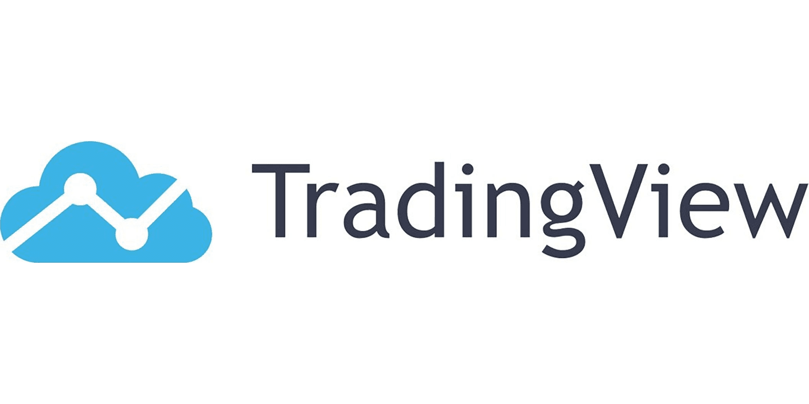

The landscape of investment is undergoing rapid transformation, driven by technological advancements that enable more sophisticated tools and strategies. Stock screeners and algorithmic trading have emerged as crucial components in equipping investors with the insights required to make informed decisions. As of October 2024, these tools are not just advantageous but necessary for investors aiming to navigate the complexities of modern financial markets.

Stock screeners serve as digital assistants, enabling investors to filter through vast amounts of stock data based on specific criteria. They have evolved significantly, integrating artificial intelligence (AI) technologies that provide precise data analysis and predictive capabilities. This evolution allows investors to identify potential investment opportunities more effectively, tailoring their strategies to align with personal or institutional goals.

Algorithmic trading, or algo trading, leverages computer programs to execute trades with high efficiency and at speeds unachievable by human traders. The progression of algo trading is marked by the incorporation of machine learning and big data analytics, which facilitate the development of more robust trading strategies. These technologies enable algorithms to learn and adapt to market conditions, offering benefits such as reduced human error, enhanced back-testing, and the ability to capitalize on market fluctuations.

Understanding the interplay between stock screeners and algorithmic trading can significantly enhance trading capabilities for both individual and institutional investors. When combined, these tools present a powerful synergy: stock screeners supply the necessary data and criteria, while algorithms execute the trades, resulting in a seamless and efficient investment process. This integration supports investors in crafting strategies that are both responsive to real-time market developments and anticipatory of future trends.

In conclusion, stock screeners and algorithmic trading have become indispensable in the world of investment. These tools not only streamline operations and support informed decision-making but also democratize trading by leveling the playing field between individual investors and large institutions. In a financial environment that is continuously evolving, staying educated on these technologies and their applications is vital for achieving sustained success.

## Table of Contents

## What are Stock Screeners?

Stock screeners are digital platforms that facilitate investors in filtering and sorting through stocks based on predetermined criteria. These tools stand as an invaluable asset in the financial landscape of October 2024, having advanced significantly with the integration of [artificial intelligence](/wiki/ai-artificial-intelligence). The AI-driven capabilities enable users to conduct more precise data analyses and generate accurate market predictions. 

The essential characteristics of stock screeners include customizable filters, which allow investors to tailor searches based on parameters such as market capitalization, price-to-earnings ratios, dividend yields, and sector performance. Such specificity aids investors in pinpointing stocks that closely align with their individual investment philosophies and goals.

Real-time data updates feature prominently in 2024 stock screeners, ensuring that users have access to the most current market information. This aspect is critical for making timely investment decisions, as market conditions can shift rapidly. In addition to real-time updates, advanced stock screeners provide comprehensive analytics that deliver insights into stock performance trends and potential market movements.

By leveraging these functionalities, investors can efficiently identify promising investment opportunities that are in sync with their strategies. The strategic use of stock screeners ultimately contributes to time savings, as investors can expeditiously eliminate unsuitable options and focus on prospects with higher potential. Furthermore, these tools significantly enhance the decision-making process by offering detailed evaluations of market data, thus empowering investors to make more informed decisions.

## The Evolution of Algo Trading

Algorithmic trading, commonly referred to as algo trading, utilizes computer programs to execute trades with unmatched speed and efficiency. These programs employ predefined criteria to make trading decisions, eliminating the emotional biases often associated with human trading. Since its initial development, algo trading has made significant strides, evolving with the adoption of more sophisticated algorithms capable of learning and adapting to the dynamic nature of financial markets.

By 2024, the confluence of [machine learning](/wiki/machine-learning) and big data analytics has become pivotal in crafting robust [algorithmic trading](/wiki/algorithmic-trading) strategies. Machine learning enables algorithms to process vast datasets, uncovering patterns and insights that are otherwise indiscernible to human traders. This capacity for pattern recognition and predictive modeling is enhanced with big data analytics, which allows for real-time analysis of market movements and economic indicators. As a result, algorithms can swiftly adjust trading strategies in response to new data, optimizing profits and minimizing losses.

One of the principal advantages of algorithmic trading lies in its ability to minimize human error. By relying on algorithms to execute trades, the subjective decisions and potential for error inherent in manual trading are significantly reduced. Additionally, algo trading facilitates back-testing — a process where trading strategies are tested against historical data to evaluate their efficacy. This process aids traders in refining strategies prior to deploying them in the live market, ensuring a higher probability of success.

Algorithmic trading also excels in capitalizing on market fluctuations. High-frequency trading ([HFT](/wiki/high-frequency-trading-strategies)), a subset of algo trading, exploits small price changes that occur over short time frames, executing a large [volume](/wiki/volume-trading-strategy) of trades to generate cumulative gains. This approach demands precise algorithms capable of executing trades in milliseconds, underscoring the importance of cutting-edge technology in maintaining competitive advantage.

In the competitive landscape of 2024, institutional investors and hedge funds heavily depend on algorithmic trading to sustain a competitive edge. These entities commit substantial resources to develop proprietary trading algorithms, often encompassing features like natural language processing to interpret news events and sentiment analysis to gauge market mood. The resultant strategies are not only reactive but also predictive, allowing institutions to anticipate shifts and act proactively.

In summary, the evolution of algorithmic trading reflects the broader integration of advanced technologies into financial markets. With continued innovations in machine learning and data analytics, algo trading is poised to further transform the trading landscape, offering enhanced capabilities and strategic opportunities for traders worldwide.

## Integrating Stock Screeners with Algo Trading

Combining stock screeners with algorithmic trading forms a robust investment strategy by marrying data accessibility with automated execution. Stock screeners are instrumental in identifying potential investment opportunities by filtering stocks based on specific criteria. They provide a framework of data and criteria essential for making informed decisions. Once these parameters are set, algorithmic trading executes trades at optimal speeds, significantly reducing the latency that could affect outcomes.

The integration of these tools enables a seamless flow of operation; screeners analyze stocks in real-time, ensuring that any movement in the market or relevant news is reflected instantaneously. Such immediacy enhances the accuracy of signals used in algorithmic trading, leading to swift trade executions that capitalize on fleeting opportunities. This level of precision is crucial for achieving maximum potential returns in volatile or fast-moving markets.

In 2024, investors are utilizing these integrated systems to craft strategies that are both reactive to current market conditions and proactive in anticipating trends. For instance, an investor might set criteria using a stock screener to identify undervalued stocks and then program an algorithm to execute trades when predefined conditions are met, such as a certain price threshold or market signal. This approach allows strategies to be continuously refined and remain dynamic as market conditions evolve.

The customization of both stock screeners and algorithms is a significant advantage, allowing investors to personalize their investment strategies beyond broad market indices or standard trading practices. By tailoring the criteria and execution algorithms to individual preferences and risk appetites, it is possible to achieve highly specialized investment objectives. This customization is made feasible through user-friendly platforms that offer flexible coding environments and robust analytics.

In summary, the combination of stock screeners and algorithmic trading not only streamlines the investment process but also enhances the precision and effectiveness of investment strategies. This powerful synergy represents a critical advancement for both individual and institutional investors looking to maintain an edge in a technologically evolving financial landscape.

## Key Benefits for Investors

Both stock screeners and algorithmic trading are crucial tools that help investors mitigate risks and streamline investment strategies. By delivering comprehensive data and ensuring rapid execution of trades, these tools minimize the uncertainties inherent in investing. The ability to access a vast array of data points and execute trades at lightning speed reduces the likelihood of human error, a significant [factor](/wiki/factor-investing) in investment risk.

These tools enable investors to diversify their portfolios with relative ease. Stock screeners facilitate the search for a broad array of prospective investments, tailored to specific criteria such as market cap, industry, or financial performance metrics. This streamlined process allows investors to easily create a diversified portfolio, thereby reducing exposure to any single asset class or market sector. Algorithmic trading complements this by executing diversified trading strategies across different markets and asset classes automatically, optimizing the portfolio in response to market changes.

Efficiency is significantly enhanced by allowing investors to monitor an extensive range of opportunities concurrently. With the assistance of stock screeners, investors can filter and track thousands of stocks based on chosen parameters, ensuring they never miss a potential opportunity. Meanwhile, algorithmic trading systems can handle multiple trades across various markets simultaneously, maximizing the use of real-time data.

Access to historical data and predictive analytics is another major advantage. Both tools provide investors with detailed historical and current market data, which can be analyzed to forecast future trends. This predictive capability helps investors make more informed decisions, bolstering their ability to anticipate market movements and adjust their strategies accordingly. Machine learning algorithms can be used to analyze past performance data and develop predictive models that identify trends, patterns, and potential investment opportunities.

Ultimately, these tools serve to empower investors, providing capabilities that were once exclusive to large financial institutions. By leveling the playing field, individual investors can now exploit the same sophisticated strategies employed by larger entities. This democratization of investment technology ensures that investors at all levels can engage with the markets more effectively, using advanced tools to navigate the complex financial landscape.

## Choosing the Right Tools for 2024

Selecting the appropriate stock screener and algorithmic trading tools in 2024 is critical for leveraging technology in investment strategies. When choosing these tools, usability is a key factor; an intuitive interface facilitates a smoother user experience and efficient navigation. Customization options are paramount, enabling investors to tailor criteria and algorithms to suit specific strategies, ensuring that the tools align closely with individual investment goals.

Real-time data updates are essential for making timely decisions in dynamic markets. The ability to access live data ensures that investors are reacting to current conditions rather than historical data, which can prevent costly delays in decision-making processes. Security and reliability are also critical considerations. Investors should prioritize platforms with robust security measures and a track record of reliability. Platforms with positive user reviews and strong technical support often indicate security and reliability, providing peace of mind and ensuring operational continuity.

Cost-effectiveness is another important consideration. Investors should assess not only the upfront cost of tools but also long-term value. Platforms that offer trial periods allow potential users to evaluate functionality and performance firsthand, minimizing the risk of costly commitments. Value-added features, such as analytical tools, educational resources, and integration capabilities, can enhance the overall utility and justify higher costs.

Finally, staying informed about market trends and technological advancements is crucial. As technology evolves, so too do the capabilities of stock screeners and algorithmic trading platforms. By remaining informed about emerging trends, investors can ensure they are utilizing tools that incorporate the latest developments, thus maintaining a competitive edge in the complex financial landscape of 2024.

## Conclusion

As financial markets become increasingly intricate, the role of stock screeners and algorithmic trading tools continues to be indispensable for investors. The synergy between these tools enhances the efficiency of investment operations and sharpens decision-making processes. By October 2024, technological advancements have made these tools not only more accessible but also more robust, offering investors powerful resources to navigate the complexities of the market.

The continuous evolution of these technologies means investors must remain vigilant and informed about emerging trends to maintain a competitive edge. Familiarity with the latest developments can significantly broaden an investor's capability to utilize cutting-edge features that optimize investment strategies and outcomes.

Effective use of stock screeners and algorithmic trading can result in sustained investment success. These tools empower investors by providing faster access to data and enabling quicker implementation of strategies based on real-time analysis. Thus, leveraging these technologies intelligently can transform the way investments are managed, offering unique opportunities for growth and risk mitigation. The commitment to education and adaptation in this technological landscape is pivotal for investors aiming to capitalize on the enhanced tools available in 2024.

## References & Further Reading

[1]: Bergstra, J., Bardenet, R., Bengio, Y., & Kégl, B. (2011). ["Algorithms for Hyper-Parameter Optimization."](https://papers.nips.cc/paper/4443-algorithms-for-hyper-parameter-optimization) Advances in Neural Information Processing Systems 24.

[2]: ["Advances in Financial Machine Learning"](https://www.amazon.com/Advances-Financial-Machine-Learning-Marcos/dp/1119482089) by Marcos Lopez de Prado

[3]: ["Evidence-Based Technical Analysis: Applying the Scientific Method and Statistical Inference to Trading Signals"](https://www.amazon.com/Evidence-Based-Technical-Analysis-Scientific-Statistical/dp/0470008741) by David Aronson

[4]: ["Machine Learning for Algorithmic Trading"](https://github.com/PacktPublishing/Machine-Learning-for-Algorithmic-Trading-Second-Edition) by Stefan Jansen

[5]: ["Quantitative Trading: How to Build Your Own Algorithmic Trading Business"](https://books.google.com/books/about/Quantitative_Trading.html?id=j70yEAAAQBAJ) by Ernest P. Chan