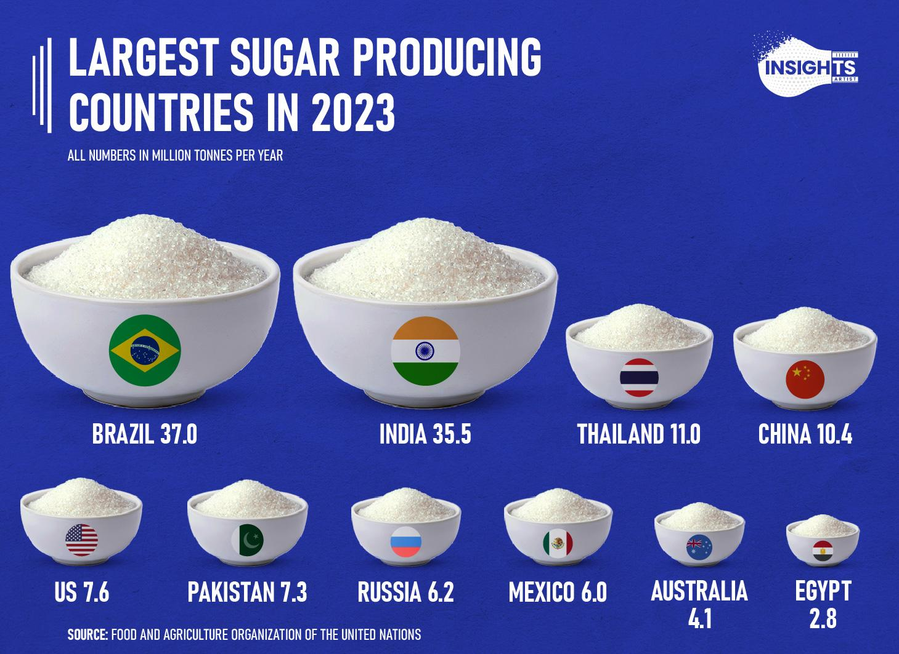

## Table of Contents

## What is sugar and how is it produced?

Sugar is a sweet-tasting substance that people often use to make food and drinks taste better. It comes from plants, mainly sugarcane and sugar beets. Sugarcane is a tall plant that grows in warm places, and sugar beets are a type of root vegetable that grows in cooler places. Both plants have a lot of sugar in them, which is why they are used to make sugar.

To make sugar, farmers first grow sugarcane or sugar beets. When the plants are ready, they are harvested. For sugarcane, the stalks are cut and crushed to get the juice out. For sugar beets, the beets are washed, sliced, and then soaked in hot water to get the sugar out. The juice from both plants is then boiled to make it thicker. As it boils, sugar crystals start to form. These crystals are separated from the liquid, washed, and dried. The result is the white sugar that you can buy in stores.

## Which countries are the top producers of sugar?

Brazil is the biggest producer of sugar in the world. It grows a lot of sugarcane because the weather there is good for it. India is the second biggest producer. It also grows a lot of sugarcane. Both countries make a lot of sugar because they have big farms and good weather for sugarcane.

The European Union, Thailand, and China are also important for making sugar. The European Union grows mostly sugar beets, which do well in its cooler climate. Thailand and China grow sugarcane. These countries help to make sure there is enough sugar for everyone around the world.

Together, these countries make most of the sugar that people use every day. They work hard to grow the plants and turn them into sugar that we can buy in stores.

## How much sugar does the leading country produce annually?

Brazil is the top country for making sugar. Every year, Brazil makes about 42 million metric tons of sugar. That's a lot of sugar! Brazil can make so much because it has big farms and the weather is just right for growing sugarcane.

Sugarcane grows really well in Brazil because it's warm and sunny there. Farmers in Brazil work hard to plant, grow, and harvest the sugarcane. After they harvest it, they turn it into sugar that people all over the world can use.

## What types of sugar crops are primarily used in these countries?

In Brazil, the main sugar crop is sugarcane. Sugarcane grows really well there because the weather is warm and sunny. Farmers in Brazil plant a lot of sugarcane because it's perfect for making sugar. They harvest the sugarcane and then turn it into sugar that people all over the world can use.

In India, sugarcane is also the main crop used for making sugar. The climate in India is good for growing sugarcane, so farmers there grow a lot of it. They harvest the sugarcane and process it to make sugar that is used both in India and sent to other countries.

In the European Union, the main sugar crop is sugar beets. Sugar beets grow well in cooler climates, which is why they are used there instead of sugarcane. Farmers in the European Union grow sugar beets, harvest them, and then process them to make sugar. This sugar is used in Europe and also exported to other parts of the world.

## How does climate affect sugar production in these countries?

Climate plays a big role in how much sugar countries like Brazil, India, and the European Union can make. In Brazil and India, the warm and sunny weather is perfect for growing sugarcane. Sugarcane needs a lot of heat and sunlight to grow well, so these countries can grow a lot of it. This helps them produce a lot of sugar because they have the right weather for sugarcane to thrive.

In the European Union, the climate is cooler, which is why they grow sugar beets instead of sugarcane. Sugar beets do well in cooler weather, so farmers there can grow them easily. Even though sugar beets don't need as much heat as sugarcane, they still need the right amount of rain and cooler temperatures to grow well. This helps the European Union produce a good amount of sugar from sugar beets.

## What are the economic impacts of sugar production on these countries?

Sugar production has a big impact on the economies of countries like Brazil, India, and the European Union. In Brazil, sugar is a major part of the economy. It creates a lot of jobs for people who work on the sugarcane farms and in the factories where the sugar is made. Brazil also makes a lot of money by selling sugar to other countries. This helps the country's economy grow because it brings in money from other places.

In India, sugar production is also very important. It helps a lot of farmers make a living because they can grow sugarcane and sell it. The money they make helps them take care of their families. India also exports sugar, which means it sells sugar to other countries. This brings in money that helps the whole country's economy. Just like in Brazil, the sugar industry in India creates jobs and helps the economy grow.

In the European Union, sugar from sugar beets is important too. It helps farmers earn money and creates jobs in the places where the sugar is made. The European Union also sells sugar to other countries, which helps its economy. Even though the European Union grows sugar beets instead of sugarcane, the sugar industry still plays a big role in helping the economy stay strong.

## How have sugar production techniques evolved in these top countries?

In Brazil, sugar production techniques have changed a lot over time. They used to do everything by hand, but now they use big machines to plant, harvest, and process the sugarcane. This makes it faster and easier to make sugar. They also use new ways to make the sugarcane grow better, like using special fertilizers and water systems. These changes help Brazil make more sugar and make it cheaper. The new machines and methods also help to make sure the sugar is good quality and clean.

In India, the way they make sugar has also gotten better. They used to use old machines and do a lot of the work by hand, but now they use modern machines to do the work. This means they can make more sugar faster. They also use new kinds of sugarcane that grow better and give more sugar. These new kinds of sugarcane help the farmers make more money. The new machines and better sugarcane help India make more sugar and sell it to other countries.

In the European Union, the way they make sugar from sugar beets has also changed. They used to use a lot of people to do the work, but now they use big machines to plant, harvest, and process the sugar beets. This makes it easier and faster to make sugar. They also use new ways to make the sugar beets grow better, like using special seeds and better ways to take care of the soil. These changes help the European Union make more sugar and make it cheaper. The new machines and methods also help to make sure the sugar is good quality and clean.

## What are the major challenges faced by sugar-producing countries?

One big challenge for sugar-producing countries is the weather. If it's too dry or too wet, the sugarcane or sugar beets might not grow well. This can make it hard for farmers to make enough sugar. Also, if the weather changes a lot because of climate change, it can be even harder to grow the crops. Farmers have to find new ways to take care of their plants and make sure they can still make sugar even when the weather is not perfect.

Another challenge is the price of sugar. Sometimes the price goes up and down a lot, and this can be hard for farmers and the people who make sugar. If the price is low, farmers might not make enough money to keep growing sugarcane or sugar beets. This can make it hard for them to keep their farms going. Also, other countries might start making more sugar, which can make the price go down even more. This means that sugar-producing countries have to find ways to make their sugar cheaper and better so they can keep selling it.

Lastly, there are problems with the environment. Making sugar can use a lot of water and can make the soil less good for growing things. This can hurt the land and make it hard to keep growing sugar in the same place. Also, the machines used to make sugar can make the air dirty. Sugar-producing countries have to find ways to make sugar that do not hurt the environment as much. They need to use less water, take better care of the soil, and make sure the air stays clean.

## How does global trade affect the sugar industry in these countries?

Global trade has a big impact on the sugar industry in countries like Brazil, India, and the European Union. When these countries sell their sugar to other countries, it helps their economies grow. Brazil and India, being the biggest sugar producers, rely a lot on selling sugar to other places. If the price of sugar goes up in the global market, they can make more money. But if the price goes down, it can be hard for them to make enough money to keep their farms and factories going.

Global trade also means that these countries have to compete with each other and with other sugar-producing countries. If one country can make sugar cheaper or better, they might sell more sugar and take business away from others. This competition can push countries to find new ways to make their sugar cheaper and better. But it can also make it hard for them if they can't keep up with the competition. So, global trade can help the sugar industry grow, but it can also make things more challenging for the countries involved.

## What are the environmental impacts of sugar production in these countries?

Sugar production can have a big impact on the environment in countries like Brazil, India, and the European Union. One big problem is that it uses a lot of water. Growing sugarcane and sugar beets needs a lot of water, and this can be hard on places where water is already scarce. Also, the way they grow these crops can hurt the soil. Farmers often use a lot of chemicals to help the plants grow better, but these chemicals can make the soil less good for growing things over time. This can make it hard to keep using the same land for farming.

Another problem is that making sugar can make the air dirty. The machines used to process the sugarcane and sugar beets can let out smoke and other bad things into the air. This can make the air harder to breathe and can hurt the environment. In Brazil and India, where they burn the leaves of the sugarcane before harvesting, this can make the air even dirtier. So, sugar production can have a big impact on the environment, and countries need to find ways to make sugar that do not hurt the air, water, and soil as much.

## How do government policies influence sugar production and export?

Government policies can really change how much sugar a country makes and sells to other places. In Brazil, the government helps farmers by giving them money and telling them how to grow sugarcane better. This makes it easier for farmers to make more sugar and sell it to other countries. But sometimes, the government also puts rules on how much sugar can be sold outside the country. This can make it harder for farmers to sell all their sugar, but it can also help keep the price of sugar steady.

In India, the government also has a big say in sugar production. They set rules on how much sugar can be sold inside the country and how much can be sent to other places. This helps make sure there is enough sugar for people in India to use. But these rules can also make it hard for farmers if they can't sell all their sugar. The government also gives money to farmers to help them grow more sugarcane, which can help the country make more sugar and sell it to other countries.

In the European Union, government policies also affect sugar production. They have rules about how much sugar can be made from sugar beets and how much can be sold to other countries. These rules help keep the sugar market stable and make sure there is enough sugar for people in the European Union. The government also gives money to farmers to help them grow sugar beets better. This can help the European Union make more sugar and sell it to other places, but it also means farmers have to follow a lot of rules.

## What future trends are expected in the sugar production of these countries?

In the future, sugar production in Brazil, India, and the European Union is expected to change in a few ways. Brazil will likely keep being the biggest sugar maker because it has good weather for sugarcane and big farms. But they might use even more new machines and ways to grow sugarcane that are better for the environment. This can help them make more sugar and sell it to other countries without hurting the land and water as much. Also, Brazil might start making more sugar from other plants, like sugar beets, to help the environment even more.

In India, sugar production will probably grow too. They might use more new kinds of sugarcane that give more sugar and need less water. This can help farmers make more money and use less of the earth's resources. The government might also help more by giving money to farmers to use these new kinds of sugarcane. But India will still have to be careful about the weather and the price of sugar, which can change a lot and make it hard for farmers.

In the European Union, they might keep making sugar from sugar beets but use new ways to grow them that are better for the environment. They could use less water and chemicals to help the soil stay good for farming. The European Union might also start making more sugar from other plants, like sugarcane, if they can find ways to grow it in their cooler climate. But they will still have to follow a lot of rules from the government about how much sugar they can make and sell.

## References & Further Reading

[1]: ["Advances in Financial Machine Learning"](https://www.amazon.com/Advances-Financial-Machine-Learning-Marcos/dp/1119482089) by Marcos Lopez de Prado.

[2]: ["Quantitative Trading: How to Build Your Own Algorithmic Trading Business"](https://www.amazon.com/Quantitative-Trading-Build-Algorithmic-Business/dp/1119800064) by Ernest P. Chan.

[3]: ["Machine Learning for Algorithmic Trading"](https://github.com/stefan-jansen/machine-learning-for-trading) by Stefan Jansen. 

[4]: "Global Sugar Market Trends and Prospects," Food and Agriculture Organization of the United Nations, [FAO Sugar Report](https://www.fao.org/markets-and-trade/commodities-overview/basic-foods/sugar/).

[5]: "World Sugar Production and Trade," International Sugar Organization, [ISO Sugar Yearbook](https://www.isosugar.org/publication/380/iso-sugar-yearbook-2024).