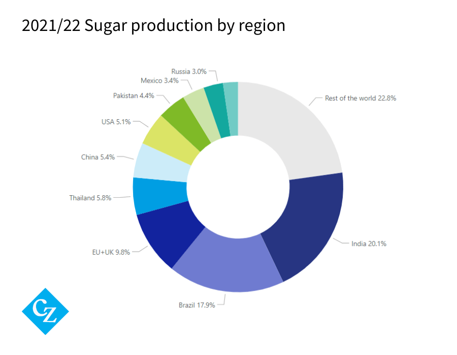

The global sugar industry stands as a pivotal component of agricultural trade, influencing both economic landscapes and market dynamics worldwide. This industry not only provides a critical source of livelihood for millions of farmers but also offers insights into global supply chain mechanisms and international trade relations. At the center of understanding these dynamics is the identification and analysis of the top sugar producers. Countries like Brazil, India, Thailand, China, and the United States are leading contributors, each playing a crucial role in steering the market trends due to their substantial production volumes and export capacities. 

In recent years, algorithmic trading has gained prominence as an essential tool for managing market complexities and enhancing decision-making processes within the sugar industry. By leveraging advanced computational techniques and data analytics, algorithmic trading enables market participants to efficiently navigate price fluctuations, manage risk, and optimize trade executions.



This article sheds light on the principal sugar-producing nations, the intricate attributes of the sugar industry, and the significant role of algorithmic trading in managing its market dynamics. By unveiling these aspects, we aim to provide a comprehensive understanding of the forces shaping the global sugar market.

## Table of Contents

## Top Sugar Producing Countries

Brazil, India, Thailand, China, and the United States are prominent leaders in global sugar production, each significantly contributing to the market's output and dynamics.

India has emerged as the largest sugar producer worldwide, with a remarkable output of 34,300,000 tonnes. The country's sugar industry primarily relies on sugarcane, cultivated extensively in its tropical regions, which provides a substantial economic base for millions. Factors such as favorable climatic conditions, government support, and modern agricultural techniques have propelled India to the forefront of sugar production.

Brazil, another major player, follows with an impressive production figure of 27,732,026 tonnes. The Brazilian sugar industry is noteworthy for its dual production capability, utilizing sugarcane for both sugar and ethanol. This diversification allows Brazil not only to dominate the sugar market but also to influence the global ethanol supply.

Thailand and China also hold significant positions in global sugar production. Thailand's industry benefits from well-established infrastructure and government encouragement, fostering continuous growth and innovation. Additionally, Thailand has invested in renewable energy sources related to sugarcane, aligning with global sustainability trends.

China, a large sugar producer, has made substantial investments in its sugar industry, emphasizing efficiency and modernization. Despite domestic production challenges, China remains a key player, supported by its vast consumption needs.

In these nations, varying factors such as climate, technological advancements, and governmental policies play crucial roles in shaping the landscape and output of the sugar industry.

## The Sugar Industry Landscape

Sugar production is predominantly concentrated in tropical and subtropical regions, where sugarcane thrives as the principal crop. This spatial distribution is largely due to the crop's climatic requirements, which include high temperatures, plentiful rainfall, and adequate sunlight. Countries such as Brazil and India, situated in these climate zones, dominate sugarcane cultivation and consequently contribute significantly to global sugar production. [1]

Climatic conditions exert a substantial influence on sugar production trends, as they determine the viability and yield of sugarcane crops. Variability in weather patterns, including the timing and abundance of rainfall, can lead to fluctuations in crop output. For example, excessive rainfall or drought conditions can adversely affect harvest levels, thereby impacting global sugar supply and prices.

Political factors also play a crucial role in shaping the sugar industry landscape. Government policies, including subsidies and trade tariffs, can affect production costs and the competitiveness of sugar on international markets. In some regions, government incentives promote the production of ethanol from sugarcane, impacting the allocation of resources between sugar and ethanol production.

The demand for ethanol, particularly in countries prioritizing biofuel development as a renewable energy source, adds another layer of complexity to sugar production trends. In Brazil, for instance, the sugarcane industry is a significant driver of both sugar and ethanol markets, with production decisions often influenced by the relative profitability of these commodities.

Additionally, the emergence of sugar beet production in northern climates has introduced new dynamics into the sugar industry, notably within the European Union. Unlike sugarcane, sugar beet is grown in temperate regions, enabling countries with cooler climates to participate in sugar production. The EU, for example, has leveraged sugar beet as a key component of its agricultural framework, contributing to the diversification of sugar production sources.

By incorporating sugar beet alongside sugarcane, the global sugar industry benefits from increased production flexibility and a broader geographical spread of production regions. This diversification helps mitigate some of the risks associated with weather [volatility](/wiki/volatility-trading-strategies) and geopolitical factors that can impact sugar supply chains. 

Together, these factors create a complex and ever-evolving landscape for sugar production that involves balancing climatic conditions, political influences, and shifting market demands.

**References:**

1. "Sugar Cane and Climate Change." International Sugar Organization, [Link].

## The Role of Algo Trading in Sugar Production

Algorithmic trading, an automated method of executing trades using pre-programmed instructions, has revolutionized the way commodities, including sugar, are traded on global markets. By improving efficiency and reducing the time required to complete trades, algo trading offers significant advantages over traditional trading methods. Specifically, in the sugar industry, where price volatility is a common challenge, algorithmic tools play a crucial role in managing risk and optimizing trade execution.

One of the primary advantages of [algorithmic trading](/wiki/algorithmic-trading) in the sugar market is its ability to handle vast amounts of data swiftly. Modern algorithms can scan large datasets including weather forecasts, geopolitical developments, and market trends, which are integral to predicting price movements. For instance, changes in weather patterns, such as a sudden drought in a major sugar-producing region, can impact sugarcane yield forecasts and, consequently, sugar supply. By integrating such data into their models, algorithms are able to anticipate price shifts and execute trades accordingly.

Furthermore, advanced algorithms employ techniques from [machine learning](/wiki/machine-learning) and [artificial intelligence](/wiki/ai-artificial-intelligence) to enhance their predictive capabilities. These algorithms can identify patterns and correlations in historical data, enabling them to forecast future market conditions with a higher degree of accuracy. Python, a popular programming language in the field of data science, provides an excellent platform for developing such sophisticated models. For example, a simple modeling strategy could involve using Python to implement a linear regression model on sugar price data:

```python
import pandas as pd
from sklearn.model_selection import train_test_split
from sklearn.linear_model import LinearRegression

# Load sugar market data
data = pd.read_csv('sugar_price_data.csv')

# Define features and target variable
X = data.drop('price', axis=1)
y = data['price']

# Split data into training and testing sets
X_train, X_test, y_train, y_test = train_test_split(X, y, test_size=0.2, random_state=42)

# Initialize linear regression model
model = LinearRegression()

# Fit model
model.fit(X_train, y_train)

# Predict and evaluate
y_pred = model.predict(X_test)
```

In addition to predictive modeling, algo trading in sugar markets often involves the optimization of futures and Contracts for Difference (CFDs). These financial instruments allow traders to hedge against potential losses and speculate on future price movements without holding the physical commodity. For example, traders can use algorithms to optimize the timing of futures contracts, buying when prices are anticipated to rise and selling when they are set to fall based on algorithmic predictions.

Moreover, as these trading systems can operate around the clock without human intervention, they are well-suited to respond rapidly to any change in market conditions. This is particularly beneficial in the sugar industry, where unexpected events can trigger significant price fluctuations.

In summary, algorithmic trading empowers sugar market participants by minimizing human error, improving trade execution speed, and enhancing the capacity to process complex data sets. Through the integration of advanced analytics and automated trading strategies, stakeholders can better navigate the inherent volatilities of the sugar market, ultimately leading to more informed and strategic trading decisions.

## Investing in Sugar Markets

Investing in sugar markets offers a range of opportunities for traders and investors. These markets can be accessed through various financial instruments, notably futures, stocks, and Exchange-Traded Funds (ETFs) that specialize in sugar. 

1. **Sugar Futures**: Futures contracts are a popular way to invest in sugar markets. They involve a legal agreement to buy or sell a particular quantity of sugar at a predetermined price in the future. The sugar futures market is primarily divided into two types: white sugar and raw sugar contracts. Each type caters to different segments of the market and offers distinct opportunities and risks.

   - **White Sugar Futures**: These contracts are typically traded on exchanges such as the London International Financial Futures and Options Exchange (LIFFE). White sugar futures are standardized contracts specifying the quantity and quality of sugar to be delivered. They are often used by manufacturers and processors who need refined sugar for their products.

   - **Raw Sugar Futures**: These contracts are mainly traded on the Intercontinental Exchange (ICE). Raw sugar futures are suited for market participants involved in the initial stages of sugar production, who either produce or require sugarcane or beet for further processing. 

   Understanding these contracts involves recognizing the respective market dynamics, delivery terms, and potential for [arbitrage](/wiki/arbitrage). The key to successful trading and hedging strategies lies in accurately forecasting consumption patterns, production levels, and geopolitical influences on sugar prices.

2. **Contracts for Difference (CFDs)**: CFDs are financial derivatives that allow traders to speculate on sugar price movements without having to own the physical commodity. By entering a CFD, traders agree to exchange the difference in the price of sugar from the contract's start to its end. This can be profitable in both rising and falling markets, depending on the trader's predictions of future price directions. CFDs offer flexibility and leverage, making them appealing for speculative activities, although they inherently carry higher risk.

3. **Stocks and ETFs**: Investing in stocks of companies involved in the sugar industry provides indirect exposure to sugar markets. These companies may include sugar manufacturers, refiners, and those engaged in sugar-related transportation and logistics. ETFs, on the other hand, are investment funds that track indices or baskets of sugar-related stocks, offering a diversified approach and reducing specific company risk.

The financial strategies employed in sugar market investments can vary significantly. Here is an example of how a basic algorithmic strategy might be implemented in Python to analyze sugar futures data:

```python
import pandas as pd
import numpy as np

# Assuming 'sugar_data.csv' contains columns 'date', 'price', and 'volume'
data = pd.read_csv('sugar_data.csv')
data['date'] = pd.to_datetime(data['date'])
data.set_index('date', inplace=True)

# Calculate moving averages
data['short_mavg'] = data['price'].rolling(window=40).mean()
data['long_mavg'] = data['price'].rolling(window=100).mean()

# Simple moving average crossover strategy
data['signal'] = 0
data['signal'][40:] = np.where(data['short_mavg'][40:] > data['long_mavg'][40:], 1, 0)
data['positions'] = data['signal'].diff()

# Plotting the strategy
import matplotlib.pyplot as plt

plt.figure(figsize=(12, 6))
plt.plot(data['price'], label='Sugar Price', alpha=0.5)
plt.plot(data['short_mavg'], label='40-day MA')
plt.plot(data['long_mavg'], label='100-day MA')
plt.plot(data.loc[data.positions == 1].index, data.short_mavg[data.positions == 1], '^', markersize=10, color='g', label='Buy Signal')
plt.plot(data.loc[data.positions == -1].index, data.short_mavg[data.positions == -1], 'v', markersize=10, color='r', label='Sell Signal')
plt.title('Sugar Price Strategy with Moving Averages')
plt.legend()
plt.show()
```

This script demonstrates a simple moving average strategy, identifying potential buy and sell signals based on crossovers in the sugar price data. Such strategies can form part of a broader investment and trading toolkit to effectively manage risk and seek profits in the volatile sugar markets. Understanding the interplay between financial instruments and market dynamics remains critical for investors seeking to capitalize on sugar market trends.

## Challenges and Opportunities

Sugar production is characterized by several challenges that influence both market stability and the industry's future landscape. One of the primary challenges is market volatility. Sugar prices are frequently influenced by factors such as fluctuating agricultural yields, global economic conditions, and political instability in producing regions. These variables lead to unpredictable price changes, making it difficult for producers and traders to maintain stable revenue streams.

Global consumption trends are also shifting. Increasing health consciousness and campaigns against the detrimental health impacts of excessive sugar consumption, particularly in developed countries, are leading to reduced demand. This shift is compelling the sugar industry to adapt by researching and developing alternative sweeteners that meet consumer preferences for healthier options.

Environmental regulations pose another significant challenge. As awareness of climate change consequences grows, there is increased pressure on the sugar industry to comply with stringent environmental standards. This involves reducing carbon emissions associated with sugar production, implementing sustainable agricultural practices, and managing water usage efficiently.

Despite these challenges, there are several opportunities that can be harnessed to drive growth and innovation in sugar production. Sustainable practices, such as crop rotation and organic farming, present an opportunity to meet environmental standards while enhancing soil health and yield. Additionally, technological advancements in agricultural equipment and processes are improving efficiency and reducing costs. For example, precision agriculture techniques, which utilize data analytics and GPS technology, can optimize resource use and improve crop management.

The shift towards renewable energy in sugar-producing countries also offers opportunities. Sugarcane, a primary source of sugar, is increasingly being used to produce ethanol, a renewable energy source. This diversification not only provides an additional revenue stream but also aids in meeting global energy demands sustainably.

Strategic investments, particularly in research and development, can lead to breakthroughs in production techniques and product diversification, ensuring competitiveness in the market. Furthermore, the integration of algorithmic trading offers sophisticated tools for managing price volatility. Algorithmic trading systems can process large datasets, incorporating factors such as weather predictions, geopolitical events, and historical market data to forecast price movements. This allows traders to make informed decisions, optimize trade execution, and hedge against potential losses effectively. A simple Python program to simulate algorithmic trading might include data collection, processing, and decision-making algorithms that rely on machine learning:

```python
import numpy as np
import pandas as pd

# Sample historic sugar price data
data = pd.read_csv('sugar_prices.csv') # Assume this is a dataset with sugar prices and relevant indicators

# Example moving average calculation
data['SMA_20'] = data['Price'].rolling(window=20).mean()
data['SMA_50'] = data['Price'].rolling(window=50).mean()

# Example trading signal
data['Signal'] = 0
data['Signal'][20:] = np.where(data['SMA_20'][20:] > data['SMA_50'][20:], 1, 0)

# Buy/Sell signal (1 represents buy, 0 represents sell)
data['Position'] = data['Signal'].diff()

# Display the final dataframe
print(data[['Price', 'SMA_20', 'SMA_50', 'Signal', 'Position']])
```

Overall, the sugar industry faces a complex array of challenges, but these are balanced by opportunities for innovation, sustainability, and enhanced market strategies. For stakeholders, understanding these elements is crucial for navigating this dynamic market effectively.

## Conclusion

The sugar industry remains a vital component of global agriculture and trade, providing essential economic benefits and supporting the livelihoods of millions worldwide. The top sugar-producing countries, such as India, Brazil, Thailand, China, and the United States, play a pivotal role in shaping the direction and trends within this market. The substantial contributions from these producers underscore the importance of understanding the dynamics that influence sugar production and trade.

Algorithmic trading has emerged as an indispensable tool in managing the complexities and volatilities inherent in the sugar markets. With its ability to process vast amounts of data and execute trades with remarkable speed and precision, algorithmic trading helps market participants navigate price fluctuations and optimize their trading strategies. This technological advancement provides traders with insights into market movements by analyzing variables such as weather patterns, geopolitical events, and consumption trends, ultimately enhancing their decision-making processes.

As the sugar production landscape continues to evolve, staying informed and leveraging advanced trading strategies will be crucial for achieving success in this dynamic industry. The integration of algorithmic tools offers opportunities for growth and risk management, allowing traders and investors to remain competitive in a market characterized by volatility and changing global consumption patterns. By staying attuned to these developments, market participants can effectively adapt to the shifting landscape of the sugar industry and position themselves for potential gains in this critical sector of global trade.

## References & Further Reading

[1]: ["Advances in Financial Machine Learning"](https://www.amazon.com/Advances-Financial-Machine-Learning-Marcos/dp/1119482089) by Marcos Lopez de Prado.

[2]: ["Quantitative Trading: How to Build Your Own Algorithmic Trading Business"](https://www.amazon.com/Quantitative-Trading-Build-Algorithmic-Business/dp/1119800064) by Ernest P. Chan.

[3]: ["Machine Learning for Algorithmic Trading"](https://github.com/stefan-jansen/machine-learning-for-trading) by Stefan Jansen. 

[4]: "Global Sugar Market Trends and Prospects," Food and Agriculture Organization of the United Nations, [FAO Sugar Report](https://www.fao.org/markets-and-trade/commodities-overview/basic-foods/sugar/).

[5]: "World Sugar Production and Trade," International Sugar Organization, [ISO Sugar Yearbook](https://www.isosugar.org/publication/380/iso-sugar-yearbook-2024).