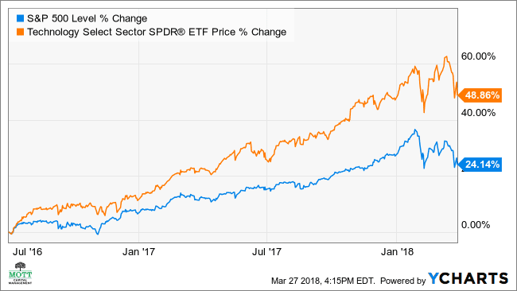

The stock market landscape in 2024 is being shaped by a convergence of economic factors, geopolitical events, and technological advancements. This year, the financial markets continue to adapt to the lasting impacts of recent global events and shifting economic policies. A key driver of this evolving landscape is the rise of technology investments, which have progressively reshaped the dynamics of stock market participation and performance.

Technology stocks, often referred to as "tech stocks," are becoming increasingly significant within investment portfolios. This is largely due to their potential for high growth and innovation. Companies within sectors such as artificial intelligence (AI), cybersecurity, and fintech are leading this charge, providing not only novel solutions but also resilient revenue streams that appeal to investors seeking both stability and growth. The heightened focus on sustainability and digital transformation has further bolstered the attractiveness of tech stocks, allowing them to outperform traditional sectors in recent years.



Parallel to this trend, algorithmic trading has emerged as a transformative force in market transactions. By leveraging algorithms and computer systems, traders can execute orders at speeds and frequencies that were previously unachievable by human traders. This increased efficiency and precision not only enhance liquidity but also influence price discovery in financial markets.

The intent of this article is to guide readers on how best to approach tech investments and leverage algorithmic trading opportunities in 2024. By understanding the current market landscape and these growing innovations, readers can better navigate the complexities of today's stock market, align their investment strategies with emerging trends, and optimize their potential for returns. As the stock market continues to evolve, staying informed and adaptable becomes paramount for investors seeking to capitalize on technology-driven opportunities.

## Table of Contents

## The State of the Stock Market in 2024

The stock market in 2024 is characterized by dynamic trends shaped by a convergence of technological advancements, economic factors, geopolitical events, and evolving investor behaviors. As global economies continue to recover and evolve post-pandemic, several key elements are shaping the landscape of the stock market this year.

**Current Market Trends and Economic Factors**

The global stock market in 2024 is influenced by a diverse range of trends and economic factors. Continued economic recovery from the COVID-19 pandemic has resulted in relatively steady interest rates and inflation levels, though persistent concerns about potential future hikes remain. Economic growth in major regions like the United States, China, and the European Union has been uneven, influenced by fluctuating commodity prices and supply chain disruptions. In many developed markets, a shift towards sustainable and socially responsible investing has gained [momentum](/wiki/momentum), reflecting growing awareness and regulatory pressures.

**Role of Technology**

Technology continues to be a driving force in reshaping global financial markets. Artificial Intelligence (AI) and [machine learning](/wiki/machine-learning) have become essential in processing large datasets to facilitate real-time decision-making. Blockchain and decentralized finance (DeFi) offer new mechanisms for trading and transactions, increasing efficiency and transparency. The rise of digital currencies and assets also plays a significant role, with more traditional institutions incorporating these within their portfolios. These technologies not only accelerate transaction speeds but also lower operation costs, influencing market [liquidity](/wiki/liquidity-risk-premium) and [volatility](/wiki/volatility-trading-strategies).

**Investor Sentiment and Behavior**

At the start of 2024, investor sentiment exhibits cautious optimism. While some investors are looking towards the prospect of economic expansion and innovation, concerns about market volatility and valuations persist. Retail investors, empowered by online platforms and social trading communities, continue to make significant impacts on market movements. This trend is coupled with an increased emphasis on environmental, social, and governance ([ESG](/wiki/esg-investing)) factors within investment decisions, reflecting broader societal shifts towards sustainability.

**Challenges and Opportunities**

Investors in 2024 face several significant challenges and opportunities. Market volatility, driven by geopolitical tensions and unpredictable economic indicators, remains a major concern. The ongoing adaptation of businesses to new technologies and regulatory environments presents opportunities for those able to identify and invest in emerging sectors. Furthermore, the rapid transformation of traditional industries through digitalization offers substantial growth prospects, though it presents challenges for investors unable to adapt to these changes.

**Impact of Geopolitical Events and Policy Changes**

Geopolitical events and policy changes critically impact market dynamics. Tensions between major economic powers, such as the United States and China, have implications for trade agreements, tariffs, and supply chain dynamics. Policy changes in taxation, environmental regulation, and corporate governance standards affect business operations globally. Furthermore, regional conflicts and political instability exert pressure on market stability, contributing to investor cautiousness.

Overall, the stock market landscape in 2024 necessitates a nuanced understanding of the multiple factors influencing market behavior. Awareness of technological advancements, investor sentiment, and the implications of geopolitical and policy shifts is crucial for navigating the challenges and opportunities present within this dynamic environment.

## Why Technology Stocks Are Essential for Your Portfolio

In recent years, technology stocks have demonstrated remarkable performance, significantly outpacing other sectors in the financial markets. This trend reflects the growing influence of technological innovation on global economies and underscores the importance of including tech stocks in a diversified portfolio. Analysis of the NASDAQ-100, a benchmark heavily weighted towards technology firms, reveals a compound annual growth rate (CAGR) of approximately 20% over the past decade, highlighting the sector's robust growth potential.

One of the primary reasons to invest in tech stocks is their inherent capacity for innovation. Companies in the technology sector continuously break new ground, developing products and services that revolutionize industries and consumer lifestyles. This innovative drive translates into substantial growth potential, offering investors opportunities for significant returns. For instance, advancements in [artificial intelligence](/wiki/ai-artificial-intelligence) (AI), quantum computing, and the Internet of Things (IoT) are creating new markets and enhancing efficiencies across existing industries, contributing to the resilience and attractiveness of tech stocks.

Innovation aside, technology stocks are integral to investment portfolios due to their growth potential and resilience. The rapid evolution of sectors such as AI, where companies focus on machine learning and data processing, and fintech, which merges finance with technology, enhances financial services' accessibility and efficiency. Cybersecurity remains another critical area, driven by the increasing need to protect data in a digitally connected world. These sectors promise high returns as businesses and governments alike continue to invest in securing their digital infrastructure and leveraging AI for competitive advantage.

In 2024, several technology companies are positioned to perform well, drawing investor attention for their strategic advancements and market leadership. Alphabet Inc., with its significant investments in AI and cloud computing, continues to be a powerhouse in the industry. Similarly, Microsoft Corporation's focus on cloud solutions and enterprise software positions it well for sustained growth. In the electric vehicles (EV) sector, Tesla, Inc. remains a leader due to its ongoing innovations in automotive technology and sustainable energy solutions. These companies exemplify how leading tech firms capitalize on emerging trends to maintain competitive edges and deliver shareholder value.

Investing in tech stocks, however, is not without risks. Market volatility, regulatory challenges, and rapidly changing technologies can impact tech companies adversely. For instance, shifts in privacy laws or antitrust regulations may affect major technology firms' operations and valuations. To mitigate these risks, investors can diversify their portfolios by incorporating a mix of tech stocks alongside other asset classes, ensuring potential losses in one sector are offset by gains in another. Additionally, staying informed about industry trends and regulatory changes can help investors make timely decisions to adjust their strategies.

In conclusion, technology stocks offer compelling opportunities for investors due to their innovation, growth potential, and resilience. By paying close attention to market dynamics and aligning investments with emerging technological trends, investors can enhance their portfolios and potentially reap substantial returns.

## Algorithmic Trading: The Future of Market Transactions

Algorithmic trading, often referred to as algo trading, has become a pivotal component in the landscape of market transactions as of 2024. This approach utilizes complex algorithms and automated models to execute trades at speeds and frequencies that human traders cannot match, offering significant advantages to both retail and institutional investors.

### Explanation and Prevalence

Algorithmic trading involves the use of computer programs to follow a set of pre-defined instructions for placing a trade in order to generate profits at a speed and frequency that is impossible for a human trader. The increasing prevalence of algo trading in 2024 can be attributed to advancements in computing power, data availability, and artificial intelligence. Approximately 70-80% of trades in major financial markets are now executed algorithmically.

### Advantages for Investors

- **Speed and Efficiency**: Algo trading allows for rapid trade execution and processing, reducing the chances of significant market shifts between the decision to trade and the actual transaction.

- **Accuracy**: By minimizing the manual intervention in trading, algorithmic systems reduce human error and enhance precision.

- **Cost Reduction**: Automated systems minimize transaction costs by enabling trades to be executed at the most favorable prices without manual execution costs.

- **Strategic Flexibility**: Algorithms can be customized to accommodate a wide array of strategies, from simple moving averages to complex quantitative models.

### Technological Advancements

The effectiveness of [algorithmic trading](/wiki/algorithmic-trading) has been greatly enhanced through technological advancements such as:

- **Machine Learning**: AI algorithms can analyze vast datasets to identify patterns and predict market movements more accurately. 

- **High-Frequency Trading (HFT)**: Utilizing powerful algorithms to execute a large number of orders at extremely high speeds.

- **Cloud Computing**: Offers scalable resources for intense computation and storage needs, making sophisticated trading models accessible to more users.

### Challenges and Criticisms

Despite its advantages, algorithmic trading faces notable challenges:

- **Market Volatility**: Algorithms may exacerbate market volatility due to rapid buying and selling, leading to flash crashes. 

- **Complexity and Risk**: The complexity of algorithms can sometimes lead to unintended consequences if not properly managed.

- **Regulatory Concerns**: The lack of transparency around algorithmic processes can pose challenges for regulatory oversight, prompting calls for stricter controls.

### How to Start Algo Trading

For those interested in starting with algorithmic trading, here are key tools, platforms, and strategies:

- **Tools and Platforms**: 
  - **Python**: Widely used for coding trading algorithms due to its extensive libraries like NumPy, pandas, and Scikit-learn.
  - **Trading Platforms**: Interactive Brokers, MetaTrader, and QuantConnect offer resources for developing and deploying algorithms.

- **Strategies**: 
  - **Statistical Arbitrage**: Exploiting price differentials between assets.
  - **Trend Following**: Using historical market trends to inform trading strategies.
  - **Market Making**: Providing liquidity by continuously buying and selling on the market.

- **Learning Resources**: Books, online courses, and webinars can help build knowledge in quantitative finance and data analytics.

### Example of a Simple Algorithm in Python

To illustrate, here is a simple moving average crossover strategy using Python:

```python
import pandas as pd
import numpy as np

# Sample prices in a DataFrame
data = pd.DataFrame({'price': [...]})

# Calculate moving averages
data['SMA_50'] = data['price'].rolling(window=50).mean()
data['SMA_200'] = data['price'].rolling(window=200).mean()

# Generate buy/sell signals
data['Signal'] = np.where(data['SMA_50'] > data['SMA_200'], 1, 0)
data['Position'] = data['Signal'].diff()

# Display the positions
print(data[data['Position'].notnull()])
```

This code calculates two simple moving averages and generates buy and sell signals based on their crossover points. With further refinement and integration into a trading platform, such models can serve as the foundation for complex trading strategies. 

As algorithmic trading continues to evolve, its role in the financial markets is destined to expand, driven by ongoing technological advancements and the ever-increasing demand for efficiency and precision in trading.

## Top Tech Stocks to Watch in 2024

### Criteria for Selecting the Best Technology Stocks

When identifying top technology stocks to invest in for 2024, several criteria should be considered. These include the company's historical performance, financial health, growth potential, competitive positioning, and management effectiveness. Additionally, the stock's valuation metrics, such as price-to-earnings (P/E) ratio, revenue growth, and market share in their respective fields, are crucial indicators of potential future success.

### Curated List of Tech Stocks Expected to Outperform in 2024

Based on thorough analysis, the following tech stocks are anticipated to excel in 2024:

1. **Microsoft Corporation (MSFT)**: Known for its robust cloud computing division, Azure, Microsoft's continuous innovation in artificial intelligence (AI) and enterprise solutions positions it as a market leader.

2. **Tesla, Inc. (TSLA)**: As a pioneer in electric vehicles (EVs), Tesla's aggressive expansion and advancements in autonomous driving technology are expected to propel its growth.

3. **Alphabet Inc. (GOOGL)**: With its leadership in internet services and advertising, Alphabet's ventures into AI, cloud services, and autonomous vehicles offer substantial growth opportunities.

4. **NVIDIA Corporation (NVDA)**: Renowned for its graphics processing units (GPUs), NVIDIA's dominance in AI and gaming, along with its burgeoning data center business, make it a promising investment.

5. **Amazon.com, Inc. (AMZN)**: Beyond e-commerce, Amazon's cloud computing arm, Amazon Web Services (AWS), continues to drive significant revenue and growth.

### Detailed Analysis of Each Stock's Fundamentals, Performance, and Growth Prospects

**Microsoft Corporation (MSFT)**: As of 2023, Microsoft's revenue was driven predominantly by its cloud division, Azure, which experienced a year-over-year growth of 30%. The company's P/E ratio remains stable, reflecting investor confidence in its ability to maintain strong cash flows and expand AI capabilities. Microsoft's commitment to sustainability and digital transformation solutions further enhances its growth prospects.

**Tesla, Inc. (TSLA)**: Tesla reported a production increase of 25% in 2023, with revenues from energy products also rising significantly. The P/E ratio, although historically high, indicates the market's expectation of continued innovation in battery technology and global EV market penetration. New gigafactories and AI-driven autonomous systems are pivotal to its strategy.

**Alphabet Inc. (GOOGL)**: Alphabet's fast-growing cloud division, coupled with advancements in generative AI, supports its robust financial performance. The company's aggressive investment in Waymo, its autonomous driving unit, and sustainable energy projects solidify its diversified portfolio, with a moderate P/E ratio indicating steady growth potential.

**NVIDIA Corporation (NVDA)**: NVIDIA's leadership in the AI and gaming industries is underpinned by a revenue increase of 40% from its data center division in 2023. Its innovative chip designs and partnerships in AI and machine learning sectors forecast continued dominance. The company's P/E ratio reflects potential undervaluation relative to its growth trajectory.

**Amazon.com, Inc. (AMZN)**: AWS's substantial contribution to Amazon's profits is accompanied by continuous geographic expansion and service diversification. The rise in digital advertising and media streaming revenues supports its robust business model. Amazon's P/E ratio suggests potential undervaluation, benefiting from AI and logistics technology advancements.

### Sector-Specific Insights: Cloud Computing, Electric Vehicles, and AI

**Cloud Computing**: The sector is anticipated to maintain rapid growth, fueled by increasing demand for data storage and analytics. Companies like Microsoft and Amazon are positioned well to benefit through their scalable and secure cloud services.

**Electric Vehicles**: The global shift towards renewable energy and lower carbon emissions will continue driving growth in the EV sector. Tesla remains a leader in technological advances and market share.

**AI**: AI technology is expected to revolutionize numerous industries. Companies like NVIDIA and Alphabet are at the forefront, offering AI solutions that enhance productivity and innovation across various sectors.

### Expert Opinions and Forecasts for the Future of These Tech Stocks

Industry experts predict substantial growth in the tech sector, driven by AI integration, green technology initiatives, and digital infrastructure expansion. Microsoft's strategic acquisitions and product innovations are expected to sustain its market leadership. Tesla's expansion into diverse international markets is likely to bolster its revenue streams. Alphabet's continuous investment in emerging technologies positions it as a key player in future tech advancements. NVIDIA's cutting-edge GPU technology aligns with the swelling demand for AI-driven applications. Amazon's comprehensive ecosystem and logistics advancements are projected to further entrench its market dominance.

In conclusion, the selected tech stocks present robust growth potential for investors in 2024, backed by innovation and market-leading positions in their respective sectors.

## Strategies for Successful Tech Investing and Algo Trading

Identifying your investment goals and risk tolerance is a critical first step in crafting a successful strategy for tech investing and algorithmic trading. This involves understanding your financial objectives, whether they are capital preservation, income generation, or growth. Additionally, evaluating your risk tolerance helps shape your investment approach, ensuring you align with your comfort level regarding market volatility.

Balancing tech stocks with other asset classes is essential for a diversified portfolio. Tech stocks, while offering significant growth potential, can also exhibit high volatility. To mitigate this risk, consider allocating a portion of your portfolio to other asset classes such as bonds, real estate, or commodities. A diversified portfolio can provide stability, reducing exposure to sector-specific downturns while capitalizing on various market opportunities.

Developing an informed approach to algorithmic trading requires a combination of technical knowledge and strategic insight. Algorithmic trading, which utilizes computer programs to execute trades based on predefined criteria, offers speed and efficiency. To effectively engage in algo trading, prospective traders should familiarize themselves with key programming languages like Python. The following simple Python code snippet demonstrates how one might start by using basic libraries such as `pandas` for data manipulation and `ta` (technical analysis library) for implementing trading strategies:

```python
import pandas as pd
import ta

# Load your stock data
data = pd.read_csv('stock_data.csv')

# Calculate a simple moving average (SMA)
data['SMA'] = ta.trend.sma_indicator(data['Close'], window=20)

# Signaling buy and sell
data['Signal'] = 0
data['Signal'][20:] = np.where(data['Close'][20:] > data['SMA'][20:], 1, 0)

# Positions based on the signals
data['Position'] = data['Signal'].diff()
```

Leveraging technology and data analytics is crucial for making smarter investment decisions. Modern tools provide comprehensive data access and analytics, allowing investors to gain insights into market trends, price movements, and potential investment opportunities. Platforms offering real-time data, along with advanced analytics capabilities, enable investors to make informed decisions quickly, capitalizing on market inefficiencies.

To stay ahead in the fast-paced world of tech investments, continuous learning and adaptation are paramount. This involves staying updated with the latest market trends, technological advancements, and regulatory changes. Joining investment communities, attending webinars, and subscribing to financial journals are effective ways to enhance your knowledge base. Additionally, utilizing online tools and resources can help refine strategies and improve decision-making processes.

By establishing clear goals, diversifying your portfolio, embracing technological tools, and maintaining an adaptive learning mindset, investors can navigate the complexities of tech investing and algorithmic trading more effectively.

## Conclusion

Integrating technology stocks into your investment strategy has become increasingly essential due to their significant role in driving innovation and growth in today's economic landscape. Over recent years, technology companies have consistently demonstrated resilience, adaptability, and the capacity for substantial returns, making them indispensable to a diversified portfolio. The rapid advancements in fields such as artificial intelligence, cybersecurity, and financial technology not only accentuate the growth potential of tech stocks but also bolster their position as a cornerstone for future investments.

Algorithmic trading offers a sophisticated approach to maximizing returns by leveraging computer algorithms to execute trades with speed and precision, often outperforming traditional trading methods. As we move further into 2024, the advantages of algorithmic trading continue to grow, driven by technological innovations and greater accessibility for both retail and institutional investors. However, it is crucial to remain cognizant of the challenges that might arise, particularly in volatile markets, necessitating an informed and cautious approach.

Staying informed and adaptive in the ever-evolving stock market environment is paramount. Investors should continuously monitor technological trends and market dynamics to identify opportunities and mitigate risks. By conducting thorough research and remaining proactive, investors can make informed decisions that align with their financial goals and risk tolerance.

As a call to action, investors interested in enhancing their portfolios with technology investments and algorithmic trading strategies should start by exploring current market data, understanding sector-specific trends, and using analytical tools to assess individual stock performance. Engaging with the latest industry reports, financial publications, and academic journals can provide valuable insights and guidance.

For further reading, consider resources such as the "Journal of Financial Economics" for academic insights on market behavior, "The Wall Street Journal" for up-to-date financial news, and platforms like Investopedia for foundational knowledge on stock markets, technology investments, and algorithmic trading. By leveraging these resources, investors can build a robust understanding that aids in making strategic financial decisions in 2024 and beyond.

## References & Further Reading

[1]: Bergstra, J., Bardenet, R., Bengio, Y., & Kégl, B. (2011). ["Algorithms for Hyper-Parameter Optimization."](https://dl.acm.org/doi/10.5555/2986459.2986743) Advances in Neural Information Processing Systems 24.

[2]: ["Advances in Financial Machine Learning"](https://www.amazon.com/Advances-Financial-Machine-Learning-Marcos/dp/1119482089) by Marcos Lopez de Prado

[3]: ["Evidence-Based Technical Analysis: Applying the Scientific Method and Statistical Inference to Trading Signals"](https://www.amazon.com/Evidence-Based-Technical-Analysis-Scientific-Statistical/dp/0470008741) by David Aronson

[4]: ["Machine Learning for Algorithmic Trading"](https://github.com/stefan-jansen/machine-learning-for-trading) by Stefan Jansen

[5]: ["Quantitative Trading: How to Build Your Own Algorithmic Trading Business"](https://books.google.com/books/about/Quantitative_Trading.html?id=j70yEAAAQBAJ) by Ernest P. Chan