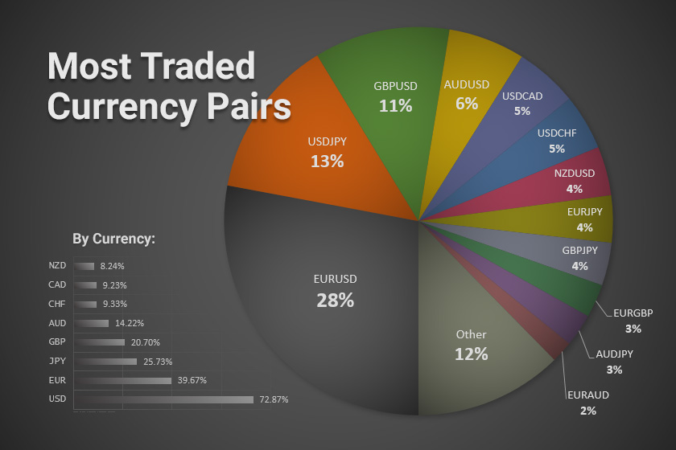

## Table of Contents

## What are currency pairs and why are they important in forex trading?

Currency pairs are the foundation of the foreign exchange, or forex, market. They represent how much of one currency is needed to buy another currency. For example, if you see the pair EUR/USD, it shows how many US dollars (USD) you need to buy one Euro (EUR). In forex trading, you always trade one currency for another, so understanding currency pairs is crucial.

Currency pairs are important in forex trading because they help traders make decisions about buying and selling currencies. When you think a currency will become stronger compared to another, you can buy that currency pair. If you believe it will weaken, you can sell it. The movement in the value of currency pairs can be influenced by many things, like economic news, interest rates, and political events. By watching these pairs, traders can try to predict future movements and make profits from the changes in value.

## What is the most commonly traded currency pair and why?

The most commonly traded currency pair is the EUR/USD, which stands for Euro against US Dollar. This pair is popular because the Euro and the US Dollar are two of the biggest currencies in the world. Many countries use these currencies for international trade, so there's always a lot of buying and selling happening with them.

People trade EUR/USD a lot because it's easy to find information about these currencies. News about the Eurozone and the United States affects their value, and there's plenty of news to follow. Also, the EUR/USD pair usually moves a lot, which means traders can make money from the changes in its value. That's why it's the top choice for many traders.

## How do major, minor, and exotic currency pairs differ?

Currency pairs are grouped into three types: major, minor, and exotic. Major pairs are the most popular and include currencies from big economies like the US, Europe, Japan, Britain, Switzerland, Canada, and Australia. They are traded a lot because they are stable and there's a lot of information about them. Examples are EUR/USD, USD/JPY, and GBP/USD. These pairs are easy to trade because they have low costs and move a lot, which is good for making money.

Minor pairs, also called cross-currency pairs, don't include the US Dollar. They are less traded than major pairs but still important. Examples are EUR/GBP, EUR/CHF, and GBP/JPY. These pairs can be a bit harder to trade because they might not move as much and can have higher costs. But they are still popular among traders who want to avoid the US Dollar.

Exotic pairs include one major currency and one from a smaller or emerging economy, like USD/SGD (US Dollar/Singapore Dollar) or EUR/TRY (Euro/Turkish Lira). These pairs are the least traded and can be risky because the currencies from smaller economies can be less stable. They often have higher costs and bigger price gaps, which makes them harder to trade. But some traders like them because they can offer big profits if you guess right.

## What factors should a beginner consider when choosing a currency pair to trade?

When you're new to [forex](/wiki/forex-system) trading, it's important to start with currency pairs that are easy to understand and trade. The best choice for beginners is usually the major pairs, like EUR/USD or USD/JPY. These pairs are popular because they involve big and stable economies, so there's a lot of information and news about them. This makes it easier for you to learn about what might affect their prices. Also, major pairs have low trading costs and move a lot, which can help you make money as you learn.

Another thing to think about is how much the currency pair moves. If a pair moves a lot, you might make more money, but it can also be riskier. For beginners, it's better to start with pairs that don't move too wildly, so you can learn without losing too much. You should also look at the trading costs, like the spread, which is the difference between the buy and sell price. Lower costs mean you keep more of your profits. So, starting with major pairs with low costs and moderate movement can help you learn the ropes of forex trading without too much risk.

## How does liquidity affect the choice of currency pairs?

Liquidity is how easy it is to buy or sell a currency pair without changing its price too much. If a currency pair is very liquid, it means a lot of people are trading it, so you can quickly buy or sell without waiting. This is important for beginners because it makes trading easier and less risky. Major currency pairs like EUR/USD or USD/JPY are very liquid because many people trade them. So, if you're new to forex trading, choosing a major pair can help you trade more smoothly.

On the other hand, if a currency pair is not very liquid, it can be harder to trade. This is often the case with exotic pairs, which involve currencies from smaller economies. If you try to buy or sell these pairs, you might not find someone to trade with right away, and the price might jump around a lot. This can make trading more stressful and risky, especially for beginners. So, when you're starting out, it's better to stick with liquid currency pairs to keep things simple and less risky.

## What are the typical spreads for the top tradable currency pairs?

The spread is the difference between the buy price and the sell price of a currency pair. For the most traded currency pairs, like EUR/USD, the spread is usually very small. This is because a lot of people trade these pairs, so there's always someone ready to buy or sell. A typical spread for EUR/USD might be around 1 to 2 pips. A pip is a small unit used to measure changes in currency values, and it's usually the last decimal place in most currency pairs.

For other major pairs like USD/JPY or GBP/USD, the spreads are also quite small but can be a bit higher than EUR/USD. For example, USD/JPY might have a spread of around 1 to 3 pips. These spreads can change a bit depending on the time of day or if there's big news happening, but they stay pretty low because these pairs are so popular. Choosing pairs with low spreads can help you save money on trading costs, which is good for beginners.

## How do geopolitical events impact currency pair volatility?

Geopolitical events can make currency pairs move a lot more than usual. When big news happens, like a country's leader making a surprising decision or a war starting, it can make people worried about the future. This worry can make them want to buy or sell currencies quickly, which makes the prices go up and down a lot. For example, if there's news about a new trade deal between two countries, the currencies of those countries might become more valuable because people think their economies will do better.

These events can also make people move their money to safer places. If a country is having problems, people might sell its currency and buy a currency from a more stable country. This can make the troubled country's currency go down in value and the safe country's currency go up. So, if you're trading currencies, you need to keep an eye on the news and understand how it might change the value of the currency pairs you're watching.

## What are the best times to trade specific currency pairs?

The best times to trade currency pairs depend on when the markets are open in different parts of the world. The forex market is open 24 hours a day from Monday to Friday, but it's busiest when the big financial centers are open. For example, if you're trading EUR/USD, the best time is usually when both the European and American markets are open at the same time. This happens from around 8 AM to 12 PM Eastern Time. During these hours, there's a lot of trading happening, so the prices move a lot, which can be good for making money.

For other pairs like USD/JPY, you might want to trade when the Asian and American markets overlap. This is usually from around 7 PM to 11 PM Eastern Time. During this time, the Japanese market is open, and the American market is still trading, so there's a lot of activity. If you're trading pairs that involve currencies from smaller countries, like exotic pairs, the best times can be harder to figure out because they might not have as much trading happening. But in general, the more people trading a pair, the more chances you have to make a trade at a good price.

## How can traders use technical analysis to predict movements in currency pairs?

Traders use technical analysis to look at past price movements of currency pairs and try to guess what will happen next. They do this by looking at charts and using special tools called indicators. These indicators help them see patterns in the prices, like if the price is going up and down a lot or if it's staying steady. Some common indicators are moving averages, which show the average price over a certain time, and the Relative Strength Index (RSI), which tells if a currency is being bought or sold too much. By watching these patterns and indicators, traders can decide when it might be a good time to buy or sell a currency pair.

For example, if a trader sees that the price of EUR/USD has been going up and the RSI is high, they might think the price is going to go down soon. This is because when a currency is bought a lot, it can become overvalued and then drop. On the other hand, if the price is going down and the RSI is low, the trader might think the price will go up soon because it's undervalued. By using these tools, traders can make better guesses about future price movements and plan their trades to make money.

## What role does interest rate differentials play in currency pair trading?

Interest rate differentials are important in currency [pair trading](/wiki/pair-trading) because they can affect how much money you can make from holding a currency. When you trade currencies, you can earn interest on the currency you buy and pay interest on the currency you sell. If the [interest rate](/wiki/interest-rate-trading-strategies) of the currency you buy is higher than the one you sell, you can make money from the difference. This is called carrying a trade. For example, if you buy a currency with a 3% interest rate and sell one with a 1% interest rate, you earn the 2% difference as long as you keep the trade open.

Traders watch interest rate changes closely because they can make currency pairs move a lot. If a country's central bank raises its interest rates, its currency usually becomes more valuable because people want to buy it to earn more interest. On the other hand, if interest rates go down, the currency might become less valuable. So, knowing about interest rate differentials can help traders guess which way a currency pair might move and make better trading decisions.

## How do carry trades work with currency pairs and what are the risks involved?

Carry trades are a way to make money in forex trading by using the difference in interest rates between two currencies. You do this by borrowing money in a currency with a low interest rate and then using that money to buy a currency with a higher interest rate. For example, if you borrow Japanese Yen, which has a low interest rate, and use it to buy Australian Dollars, which have a higher interest rate, you can earn the difference between the two rates. As long as you keep the trade open, you make money from this interest rate difference. This can be a good way to earn money if the exchange rate between the two currencies stays the same or if the currency you bought goes up in value.

But [carry](/wiki/carry-trading) trades can be risky. One big risk is that the exchange rate might change against you. If the currency you borrowed goes up in value compared to the currency you bought, you could lose more money than you made from the interest rate difference. For example, if the Yen suddenly becomes more valuable, it will cost you more Yen to buy back the Australian Dollars you borrowed, and you could lose money. Another risk is that interest rates can change. If the country with the high interest rate lowers its rates, or if the country with the low interest rate raises its rates, the profit from your carry trade could go away. So, while carry trades can be profitable, they also come with a lot of risk that you need to be careful about.

## What advanced strategies can expert traders use to maximize profits in currency pair trading?

Expert traders can use a strategy called [scalping](/wiki/gamma-scalping) to make small profits many times a day. They watch the market very closely and trade quickly, trying to make money from small changes in the price of a currency pair. This works best with very liquid pairs like EUR/USD, where there are always people buying and selling, so the price moves a lot. Scalpers use tools like moving averages and the Relative Strength Index (RSI) to help them decide when to buy or sell. Because they make many trades, even small profits can add up to a lot if they do it right. But it's also risky because one big loss can wipe out many small wins.

Another strategy is called hedging, where traders try to reduce their risk by opening two trades that go in opposite directions. For example, if a trader thinks the EUR/USD might go up but isn't sure, they can buy EUR/USD and also sell it at the same time. If the price goes up, they make money on the buy trade, but if it goes down, they make money on the sell trade. This can help protect their money, but it also means they might not make as much profit because they're paying for two trades. Expert traders also use advanced tools like Fibonacci retracement and Elliott Wave theory to predict where the price might go next, helping them make better trading decisions.

## References & Further Reading

[1]: Abarbanel, B., & Baum, C. F. (2009). ["Algorithmic Trading in Foreign Exchange Markets."](https://assets.cambridge.org/97813165/19639/frontmatter/9781316519639_frontmatter.pdf) Journal of International Financial Markets, Institutions and Money.

[2]: Johnson, L. (2010). ["Forex Revolution: An Insider's Guide to the Real World of Foreign Exchange Trading"](https://books.google.com/books/about/Forex_Revolution.html?id=JeO_Z52lN_oC) by Peter Rosenstreich

[3]: Chaboud, A. P., Chiquoine, B., Hjalmarsson, E., & Vega, C. (2009). ["Rise of the Machines: Algorithmic Trading in the Foreign Exchange Market."](https://www.jstor.org/stable/43612951) International Finance Discussion Papers 980. Board of Governors of the Federal Reserve System (U.S.).

[4]: Aldridge, I. (2013). ["High-Frequency Trading: A Practical Guide to Algorithmic Strategies and Trading Systems"](https://books.google.com/books/about/High_Frequency_Trading.html?id=8QpIsVUMhmEC) by Irene Aldridge

[5]: King, M. R., & Rime, D. (2010). ["The $4 trillion question: what explains FX growth since the 2007 survey?"](https://www.bis.org/publ/qtrpdf/r_qt1012e.pdf) BIS Quarterly Review. 

[6]: Harris, L. (2003). ["Trading and Exchanges: Market Microstructure for Practitioners"](https://www.amazon.com/Trading-Exchanges-Market-Microstructure-Practitioners/dp/0195144708) by Larry Harris

[7]: Lo, A. W. (2008). ["Hedge Funds: An Analytic Perspective"](https://www.jstor.org/stable/j.ctt7rq28) by Andrew W. Lo