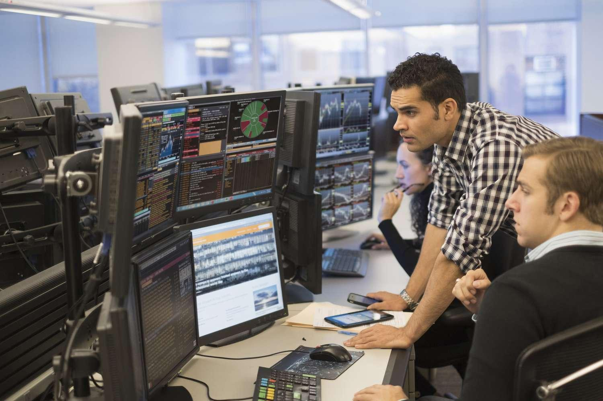

## Table of Contents

## What is day trading and why might someone pursue it as a career?

Day trading is when someone buys and sells stocks or other financial things within the same day. They try to make money from small changes in the price. Instead of keeping the stocks for a long time, day traders quickly buy and sell to make profits from the ups and downs in the market.

People might want to do day trading as a job because it can be very exciting and give them a chance to make a lot of money quickly. It lets them be their own boss and work from anywhere with a computer and internet. But, it's also very risky and needs a lot of focus and knowledge about the market. So, someone might choose day trading if they like the challenge and are willing to learn a lot and take risks.

## What are the basic educational requirements for becoming a day trader?

To become a day trader, you don't need a specific degree, but having a good education in finance, economics, or business can help a lot. Many successful day traders have at least a bachelor's degree in these fields. This education gives them a strong understanding of how markets work, how to analyze data, and how to make smart trading decisions.

Besides formal education, it's really important to keep learning on your own. Day trading involves a lot of new tools and strategies that you can learn from [books](/wiki/algo-trading-books), online courses, and trading communities. You'll need to understand technical analysis, which is about studying charts and patterns, and [fundamental analysis](/wiki/fundamental-analysis), which looks at a company's financial health. The more you learn and practice, the better you'll get at making quick and smart trades.

## How can an undergraduate degree help in preparing for a career in day trading?

An undergraduate degree, especially in finance, economics, or business, can be really helpful for someone who wants to become a day trader. These degrees teach you important stuff like how markets work, how to read financial statements, and how to analyze data. This knowledge is super important for [day trading](/wiki/day-trading-spy) because you need to understand what's going on in the market to make good decisions. Plus, these programs often teach you about risk management, which is a big part of day trading since it's all about making quick trades and managing your money wisely.

Besides the knowledge you get, an undergraduate degree also helps you develop important skills. You'll learn how to think critically, solve problems, and make decisions quickly, which are all crucial for day trading. You'll also get better at using math and numbers, which you'll need to do a lot of when you're analyzing the market. Overall, a degree gives you a solid foundation and the skills you need to start trading, but remember, you'll still need to keep learning and practicing to be good at day trading.

## Which undergraduate degrees provide the most relevant knowledge for day trading?

Degrees in finance are probably the best for day trading. They teach you all about how money moves around in the economy, how to look at company reports, and how to understand market trends. You'll learn about things like stock prices, interest rates, and how to manage risks. This is super important for day trading because you need to know how to make quick decisions based on what's happening in the market.

Degrees in economics are also really helpful. They focus on how the economy works as a whole, which can help you understand big trends that affect the market. You'll learn about things like supply and demand, inflation, and how government policies can change the economy. Knowing this stuff can help you predict what might happen in the market and make better trading decisions.

A business degree, especially one with a focus on finance or investments, can also be useful. You'll learn about how businesses work, how they make money, and how to analyze their financial health. This can help you pick which stocks to trade. Plus, you'll get good at using numbers and making decisions, which are key skills for a day trader.

## What specific skills should aspiring day traders develop during their undergraduate studies?

Aspiring day traders should focus on developing strong analytical skills during their undergraduate studies. This means getting good at looking at numbers and data to understand what's going on in the market. Classes in finance and economics will teach you how to do this. You'll learn how to read charts, understand trends, and make sense of financial statements. These skills are super important because day trading is all about making quick decisions based on what you see in the market.

Another key skill to develop is risk management. Day trading can be risky, so you need to know how to handle that risk. Your undergraduate studies can help you learn how to manage your money wisely and make decisions that balance potential profits with potential losses. Courses in finance and business will teach you about different ways to manage risk, like setting stop-loss orders and diversifying your investments. Being good at risk management will help you stay in the game longer and avoid big losses.

Lastly, it's important to work on your decision-making skills. Day trading happens fast, so you need to be able to think on your feet and make smart choices quickly. Your undergraduate studies can help you get better at this by teaching you how to solve problems and think critically. Whether you're in a finance class analyzing a case study or in an economics class discussing market trends, you'll be practicing how to make decisions under pressure. This will prepare you well for the fast-paced world of day trading.

## How important is a degree in finance or economics for day trading success?

A degree in finance or economics can really help you succeed as a day trader. These degrees teach you about how markets work, how to read financial statements, and how to analyze data. This knowledge is super important for day trading because you need to understand what's going on in the market to make good decisions. Plus, these programs often teach you about risk management, which is a big part of day trading since it's all about making quick trades and managing your money wisely.

But, you don't absolutely need a degree to be a successful day trader. What's more important is that you keep learning and practicing. There are a lot of resources out there like books, online courses, and trading communities where you can learn about day trading. The key is to understand technical analysis, which is about studying charts and patterns, and fundamental analysis, which looks at a company's financial health. So, while a degree in finance or economics can give you a strong start, what really matters is your willingness to keep learning and improving your skills.

## Can degrees in other fields like mathematics or computer science be beneficial for day traders?

Yes, degrees in mathematics or computer science can be really helpful for day traders. Math teaches you how to work with numbers and understand complex patterns. This is important for day trading because you need to analyze data and spot trends quickly. A math degree can help you get good at things like [statistics](/wiki/bayesian-statistics) and probability, which you use a lot when you're trying to predict what the market will do next. 

Computer science is also useful because day trading involves a lot of technology. You can learn how to write programs that help you trade faster and more efficiently. For example, you might create algorithms that automatically buy or sell stocks based on certain conditions. Plus, knowing how to use computers and software well can help you keep track of the market and make decisions quickly. So, even though math and computer science are different from finance, they can still give you important skills for day trading.

## What are the key courses one should look for in an undergraduate program to prepare for day trading?

In an undergraduate program, courses in finance are super important for anyone wanting to get into day trading. You should look for classes like Financial Markets and Institutions, which teach you how money moves around and how different markets work. Another key [course](/wiki/best-algorithmic-trading-courses) is Investments, where you learn about stocks, bonds, and other things you can trade. These classes help you understand how to analyze a company's financial health and make smart trading decisions. Also, courses in Corporate Finance can teach you about how businesses manage their money, which is useful when you're [picking](/wiki/asset-class-picking) which stocks to trade.

Courses in economics can also be really helpful. Look for classes like Macroeconomics, which will teach you about the big picture of the economy, like inflation and unemployment. This knowledge can help you understand what might affect the market as a whole. Microeconomics is also important because it focuses on how individual businesses work, which can help you make better trading choices. Together, these economics courses give you a solid understanding of the factors that move the market.

Finally, don't forget about math and computer science courses. Statistics and Probability can help you predict market trends and understand risk better. If you're interested in using technology to trade, courses in Computer Programming or Data Analysis can teach you how to create trading algorithms and manage data effectively. These skills can make you a faster and more efficient day trader.

## How do different undergraduate degrees impact the strategies and tools a day trader might use?

Different undergraduate degrees can affect the strategies and tools a day trader uses in important ways. For example, someone with a finance degree might focus on fundamental analysis, which means looking at a company's financial health to make trading decisions. They might use tools like financial statements, earnings reports, and valuation models to decide which stocks to buy or sell. On the other hand, a person with a math degree might lean more towards technical analysis, which involves studying charts and patterns to predict market movements. They might use tools like statistical software and mathematical models to find trading opportunities based on numbers and data.

Degrees in computer science can also influence the tools and strategies a day trader uses. These traders might be more likely to use [algorithmic trading](/wiki/algorithmic-trading), where they write computer programs to automatically buy and sell stocks based on certain conditions. They could use programming languages like Python or R to create these algorithms, which can help them trade faster and more efficiently. Meanwhile, someone with an economics degree might focus on understanding broader market trends and how economic policies affect stock prices. They might use economic indicators and macroeconomic data to guide their trading decisions, helping them see the bigger picture of the market.

## What are the advanced analytical skills that top undergraduate programs teach that are useful in day trading?

Top undergraduate programs teach advanced analytical skills that are really useful for day trading. These skills include being able to look at a lot of data and find patterns that can help you predict what the market might do next. For example, you learn about statistical analysis, which lets you use numbers to understand how likely something is to happen. This can be super helpful when you're trying to guess if a stock's price will go up or down. Programs also teach you about risk analysis, which is all about understanding how much you could lose and how to manage that risk. This is key for day trading because you need to know how to protect your money while trying to make more of it.

Another important skill you learn is how to do technical analysis. This means studying charts and graphs to see trends and patterns in stock prices. Top programs teach you how to use tools like moving averages and relative strength index (RSI) to make better trading decisions. You also learn about fundamental analysis, which is looking at a company's financial health to see if it's a good investment. This involves understanding things like balance sheets and income statements. Being good at both technical and fundamental analysis can make you a smarter day trader because you can use different kinds of information to guide your trades.

## How can internships and practical experience during undergraduate studies enhance a day trader's career?

Internships and practical experience during undergraduate studies can really help someone who wants to be a day trader. They give you a chance to see how the real trading world works. You might get to watch experienced traders make decisions and see how they use different tools and strategies. This hands-on experience can help you understand what you learned in class better. It also lets you practice trading with real money, even if it's just a little bit, so you can learn from your mistakes without losing too much.

Plus, internships can help you build a network of people in the trading world. You can meet other traders, analysts, and professionals who can give you advice and maybe even help you get a job later on. Having this network can be a big advantage because you can learn from others and stay updated on what's happening in the market. Overall, internships and practical experience during your undergrad can make you more ready for a career in day trading by giving you real-world skills and connections.

## What ongoing education or certifications should day traders consider after completing their undergraduate degree?

After finishing their undergraduate degree, day traders should keep learning to stay sharp in the fast-changing world of trading. One good option is to get a certification like the Chartered Financial Analyst (CFA) or the Certified Financial Technician (CFTe). These certifications teach you a lot about financial analysis and technical trading, which are super important for day trading. They also show others that you know your stuff, which can help you get better jobs or clients.

Besides certifications, day traders should also keep up with online courses and workshops. Websites like Coursera, Udemy, and even specialized trading platforms offer courses on everything from advanced trading strategies to new software tools. Joining trading communities and forums can also help because you can learn from other traders and stay updated on the latest trends and news. Keeping your skills fresh and learning new things is key to being a successful day trader.

## References & Further Reading

[1]: Bergstra, J., Bardenet, R., Bengio, Y., & Kégl, B. (2011). ["Algorithms for Hyper-Parameter Optimization."](https://papers.nips.cc/paper/4443-algorithms-for-hyper-parameter-optimization) Advances in Neural Information Processing Systems 24.

[2]: ["Advances in Financial Machine Learning"](https://www.amazon.com/Advances-Financial-Machine-Learning-Marcos/dp/1119482089) by Marcos Lopez de Prado

[3]: ["Evidence-Based Technical Analysis: Applying the Scientific Method and Statistical Inference to Trading Signals"](https://www.amazon.com/Evidence-Based-Technical-Analysis-Scientific-Statistical/dp/0470008741) by David Aronson

[4]: ["Machine Learning for Algorithmic Trading"](https://github.com/stefan-jansen/machine-learning-for-trading) by Stefan Jansen

[5]: ["Quantitative Trading: How to Build Your Own Algorithmic Trading Business"](https://www.amazon.com/Quantitative-Trading-Build-Algorithmic-Business/dp/1119800064) by Ernest P. Chan