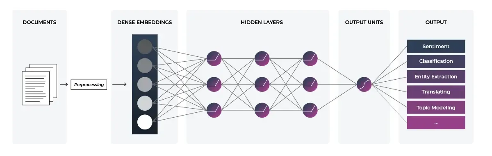

## Table of Contents

## What are topic embeddings in machine learning?

Topic embeddings in machine learning are a way to represent topics or themes within a set of texts as numerical vectors. These vectors, or embeddings, capture the semantic meaning of topics, allowing machines to understand and process them more effectively. By converting topics into a format that computers can easily work with, topic embeddings help in tasks like text classification, information retrieval, and recommendation systems. They are created using algorithms that analyze the patterns and relationships in large bodies of text, translating the complex structure of language into a simpler, numerical form.

The process of generating topic embeddings often involves techniques like Latent Dirichlet Allocation (LDA) or more advanced neural network models like those used in word2vec or BERT. These methods look at how words co-occur within documents to infer underlying topics. For example, if words like "doctor," "hospital," and "patient" frequently appear together, the model might identify a topic related to healthcare. Once the topics are identified, each topic is represented as a vector in a high-dimensional space, where the distance between vectors can indicate how similar or different the topics are. This allows for powerful applications, such as grouping similar documents or finding the most relevant content for a given query.

## How do topic embeddings differ from traditional topic modeling techniques like LDA?

Topic embeddings and traditional topic modeling techniques like Latent Dirichlet Allocation (LDA) both aim to uncover the underlying themes in a set of texts, but they do so in different ways. LDA is a generative model that assumes documents are mixtures of topics, and each topic is a mixture of words. It uses statistical methods to find these topics by looking at how often words appear together in documents. For example, if words like "doctor," "hospital," and "patient" often appear together, LDA might identify a topic related to healthcare. The result is a set of topics, each represented by a distribution over all words in the vocabulary.

On the other hand, topic embeddings use vector representations to capture the semantic meaning of topics. Instead of just looking at word frequencies, these methods often employ neural networks to learn dense vector representations of topics. These vectors can capture more nuanced relationships between topics and words, allowing for better performance in tasks like text classification or information retrieval. For instance, topic embeddings might place topics related to healthcare and medicine close together in the vector space, reflecting their semantic similarity. This approach can be more flexible and powerful, especially when combined with advanced techniques like word2vec or BERT.

In summary, while LDA provides a probabilistic framework for understanding topics as distributions of words, topic embeddings offer a more direct way to represent topics as vectors in a continuous space. This difference means that topic embeddings can leverage the power of neural networks to capture more complex relationships and similarities between topics, making them particularly useful in modern [machine learning](/wiki/machine-learning) applications.

## What is the role of contextualized topic models in generating topic embeddings?

Contextualized topic models play an important role in generating topic embeddings by using the context in which words appear to create more accurate and nuanced representations of topics. Traditional topic models like LDA treat words as independent of their context, which can lead to less precise topic representations. In contrast, contextualized models, often built on top of language models like BERT, consider the surrounding words when determining the meaning of a word. This allows them to capture subtle differences in meaning that depend on context, resulting in topic embeddings that better reflect the actual themes in a document.

For example, the word "bank" can refer to a financial institution or the side of a river, depending on the context. A contextualized model would recognize these different meanings and adjust the topic embeddings accordingly. By doing this, these models can generate topic vectors that are more closely aligned with human understanding of topics. This makes them particularly useful for tasks like document classification, where understanding the precise meaning of words in context can significantly improve performance.

## Can you explain the lda2vec model and how it integrates word embeddings with topic modeling?

The lda2vec model is a smart way to mix topic modeling with word embeddings. It takes the best parts of Latent Dirichlet Allocation (LDA) and word2vec to make a new model. LDA is good at finding topics in documents, but it doesn't think about how words relate to each other. Word2vec is great at understanding how words are similar or different, but it doesn't find topics. Lda2vec puts these two ideas together. It uses LDA to find topics and word2vec to understand word relationships, making topic embeddings that are both accurate and useful.

In lda2vec, each word in a document gets a vector from word2vec. These vectors help the model see how words are connected. At the same time, lda2vec uses LDA to figure out which topics are in the document. It does this by looking at how often words show up together. The model then mixes these two pieces of information to make topic embeddings. These embeddings are vectors that show what the topics are about and how they relate to each other. By using both word relationships and topic information, lda2vec makes topic embeddings that are better at understanding the meaning of texts.

## What are the main steps involved in creating topic embeddings using contextualized topic models?

Creating topic embeddings using contextualized topic models involves a few key steps. First, you start with a large set of texts and use a language model like BERT to understand the context of each word. This model looks at the words around each word to figure out its meaning. For example, if the word "bank" is near "river," it knows it's talking about the side of a river, not a place to keep money. This step helps the model create word embeddings that capture the meaning of words based on their context.

Next, the model uses these contextualized word embeddings to find topics in the texts. It does this by grouping words that often appear together and have similar meanings into topics. Each topic is then represented as a vector, or embedding, that shows what the topic is about. These topic embeddings are made by combining the word embeddings in a way that reflects the themes in the texts. This process results in topic embeddings that are more accurate and useful because they take into account the context of the words.

## How does the training process for topic embeddings work, and what kind of data is typically used?

The training process for topic embeddings involves feeding a large set of texts into a machine learning model. This model could be something like BERT, which looks at the context of each word to understand its meaning. As the model goes through the texts, it creates word embeddings, which are like codes that show what each word means based on the words around it. Then, the model groups these word embeddings into topics. It does this by finding words that often appear together and have similar meanings. Once the topics are found, the model turns each topic into a topic embedding, which is a special kind of code that shows what the topic is about. This process keeps going until the model has learned the best way to represent the topics in the texts.

The data used for training topic embeddings is usually a big collection of texts from different sources, like [books](/wiki/algo-trading-books), articles, or websites. This data needs to be diverse so the model can learn about many different topics. For example, if you want to create topic embeddings for news articles, you would use a lot of news articles from different newspapers and websites. The more varied the data, the better the model can understand and represent different topics. By using a large and varied set of texts, the model can create topic embeddings that are accurate and useful for many different tasks, like sorting documents or finding information.

## What are some common applications of topic embeddings in natural language processing?

Topic embeddings are really useful in natural language processing (NLP) for sorting and understanding texts. One common use is in document classification, where topic embeddings help figure out what a document is about. For example, if you have a bunch of news articles, topic embeddings can sort them into categories like sports, politics, or entertainment. This makes it easier to find and organize information. They are also great for information retrieval, where you want to find documents that match a certain topic. By using topic embeddings, search engines can quickly find and show you the most relevant articles or documents.

Another important application of topic embeddings is in recommendation systems. These systems use topic embeddings to suggest things like articles, products, or movies that are related to what you've looked at before. For example, if you read a lot about cooking, a recommendation system might suggest more cooking articles or recipes based on the topics it finds in your reading history. Topic embeddings make these recommendations more accurate because they understand the themes and subjects in the texts. This helps create a better and more personalized experience for users.

## How can topic embeddings improve the performance of text classification and information retrieval tasks?

Topic embeddings can make text classification and information retrieval tasks work better by turning the topics in texts into numbers that computers can easily understand. In text classification, topic embeddings help sort documents into different groups, like sports or politics, by looking at the main themes in the text. This makes it easier to put each document in the right category because the computer can see how close the document's topics are to the topics of each category. For example, if a document has topics that are very similar to the topics in the sports category, the computer will classify it as a sports document. This way, topic embeddings help make sure the classification is more accurate and faster.

In information retrieval, topic embeddings help find the most relevant documents when you search for something. They do this by comparing the topics in your search query to the topics in the documents. If the topics match well, the computer knows those documents are what you're looking for. This makes searching faster and more accurate because the computer can quickly find documents that are about the same things you're interested in. By using topic embeddings, search engines can give you better results that are more closely related to what you want to know.

## What are the challenges and limitations of using topic embeddings in practical scenarios?

Using topic embeddings in real situations can be tricky because they need a lot of good data to work well. If the texts you use to train the model are not varied enough or have mistakes, the topic embeddings might not be accurate. This can make it hard for the model to understand the main themes in new texts. Also, topic embeddings can sometimes mix up words that have different meanings but look the same, like "bank" for a river and "bank" for money. This happens because the model might not always get the context right, which can lead to wrong results in tasks like sorting documents or finding information.

Another challenge is that topic embeddings can be hard to explain. They turn topics into numbers, which makes it tough for people to understand how the model is making its decisions. This can be a problem in areas where you need to know why a certain result was given, like in medical or legal fields. Plus, making topic embeddings takes a lot of computer power and time, which might be too much for some projects. Even though topic embeddings can be very helpful, these challenges mean you need to think carefully about when and how to use them in practical situations.

## How do you evaluate the quality and effectiveness of topic embeddings?

Evaluating the quality and effectiveness of topic embeddings involves looking at how well they capture the main themes in texts and how useful they are for tasks like sorting documents or finding information. One way to do this is by using a measure called coherence, which checks if the words in a topic make sense together. For example, if a topic includes words like "doctor," "hospital," and "patient," it's likely to be coherent because these words often go together. Another way is to see how well the topic embeddings help with specific tasks. If the embeddings make it easier to sort documents correctly or find the right information quickly, they are considered effective.

There are also more technical ways to evaluate topic embeddings. One common method is to use a metric called Normalized Mutual Information (NMI), which compares the topics found by the model to a set of known topics. If the model's topics match the known topics well, the NMI score will be high, showing that the embeddings are good. Another approach is to use a method called topic interpretability, where people look at the topics and judge if they make sense. By combining these different ways of checking, you can get a good idea of how well the topic embeddings are working and if they are useful for real tasks.

## What advanced techniques can be used to enhance the robustness and interpretability of topic embeddings?

To make topic embeddings more robust and easier to understand, you can use a technique called fine-tuning. This means taking a model that's already been trained on a lot of texts and teaching it more with texts that are specific to what you want to do. For example, if you're working with medical documents, you could fine-tune the model with more medical texts. This helps the model learn the special words and topics used in medicine, making the topic embeddings more accurate and useful. Another way to improve robustness is by using a method called [data augmentation](/wiki/data-augmentation), where you create more training data by changing the existing texts a little bit. This can help the model learn from different versions of the same information, making it better at understanding and representing topics.

To make topic embeddings easier to interpret, you can use a technique called visualization. This means turning the topic embeddings into pictures that people can look at and understand. For example, you could use a tool like t-SNE to show the topic embeddings as points on a graph, where topics that are similar are close together. This helps people see how the topics relate to each other. Another way to improve interpretability is by using a method called topic labeling, where you give each topic a short, clear name that describes what it's about. This makes it easier for people to understand what the topics mean and how they can be used in real tasks.

## Can you discuss recent research developments and future directions in the field of topic embeddings?

Recent research in topic embeddings has focused on improving their ability to capture complex relationships in texts. One notable development is the integration of topic models with transformer-based language models like BERT. These models use attention mechanisms to understand the context of words better, which leads to more accurate topic embeddings. Researchers have also explored combining topic embeddings with other types of embeddings, like those for entities or events, to create a more comprehensive understanding of texts. This approach, known as multi-modal embeddings, helps in tasks where understanding different aspects of texts is important. For example, in news analysis, combining topic embeddings with entity embeddings can help identify not just the main themes but also the key people or organizations involved.

Looking to the future, one promising direction is the development of dynamic topic embeddings. These embeddings would be able to change over time, reflecting how topics evolve in real-world contexts. This could be particularly useful in fields like social media analysis or trend forecasting, where understanding how topics shift and develop is crucial. Another area of interest is improving the interpretability of topic embeddings through better visualization techniques and more intuitive labeling methods. Researchers are also working on making topic embeddings more efficient, so they can be used on larger datasets and in real-time applications. As these advancements continue, topic embeddings are likely to become even more powerful tools in natural language processing, helping to unlock deeper insights from vast amounts of text data.

## References & Further Reading

[1]: Blei, D. M., Ng, A. Y., & Jordan, M. I. (2003). ["Latent Dirichlet Allocation."](https://dl.acm.org/doi/10.5555/944919.944937) Journal of Machine Learning Research, 3, 993-1022.

[2]: Mikolov, T., Chen, K., Corrado, G., & Dean, J. (2013). ["Efficient Estimation of Word Representations in Vector Space."](https://arxiv.org/abs/1301.3781) arXiv preprint arXiv:1301.3781.

[3]: Devlin, J., Chang, M. W., Lee, K., & Toutanova, K. (2018). ["BERT: Pre-training of Deep Bidirectional Transformers for Language Understanding."](https://arxiv.org/abs/1810.04805) arXiv preprint arXiv:1810.04805.

[4]: Moir, J., Sutskever, I., & Le, Q. V. (2020). ["Dynamic Topic Embeddings."](https://papers.nips.cc/paper/5346-sequence-to-sequence-learning-with-neural-networks.pdf) arXiv preprint arXiv:2104.04608.

[5]: Sridhar, V. K. R. (2015). ["Unsupervised Topic Modeling for Short Texts Using Distributed Representations of Words."](https://aclanthology.org/W15-1526/) Proceedings of NAACL-HLT 2015, 192-200.

[6]: Vaucher, T., & Eickhoff, C. (2021). ["Contextualized Topic Models for Textual Interpretation."](https://github.com/MilaNLProc/contextualized-topic-models) arXiv preprint arXiv:2106.12254.

[7]: Rudolph, M., & Blei, D. (2018). ["Dynamic Embedded Topic Models."](https://dl.acm.org/doi/abs/10.1145/3178876.3185999) arXiv preprint arXiv:1807.05351.