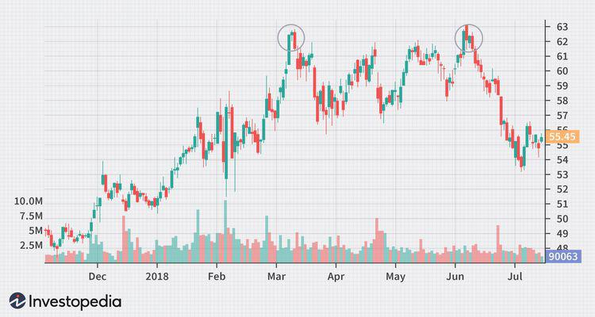

The world of trading is full of jargon, and one intriguing term is 'Toppy'. Within the dynamic landscape of financial markets, 'Toppy' is an informal term used by traders and analysts to describe a market, stock, or index that appears to be reaching unsustainable highs. This phenomenon often raises concerns about potential reversals or downward corrections.

Understanding 'Toppy' markets is especially significant when deploying algorithmic trading strategies. Algorithmic trading, or algo-trading, refers to the use of computer algorithms to automatically execute trades based on predefined criteria. In the context of toppy market conditions, the ability to promptly recognize when a market has become 'toppy' and to execute trades accordingly can greatly impact trading outcomes.



Identifying toppy markets involves technical and fundamental analysis to pinpoint indicators of potential reversals. Technical tools, including chart patterns like double tops and head-and-shoulders, as well as indicators like the Relative Strength Index (RSI) and stochastic oscillators, are commonly employed. These tools help in recognizing bearish divergences and other signs of overextension. Another facet involves fundamental analysis examining metrics such as price-to-earnings (P/E) ratios to assess whether valuations exceed sustainable levels.

The dynamics of toppy markets also challenge traders to adapt their strategies. Effective risk management and strategic planning become imperative as traders aim to protect their investments and exploit possible market volatility. Throughout this article, we will explore different strategies and tools that traders can utilize to manage their exposure to toppy conditions while maintaining a focus on algorithmic efficiency.

Understanding the meaning and implications of 'Toppy' markets is essential for traders who wish to navigate the complexities of financial markets successfully. By examining the factors contributing to toppy conditions and leveraging algorithmic trading functionalities, traders can aim for enhanced resilience and potential profitability in the face of unsustainable market highs.

## Table of Contents

## Defining a Toppy Market

Toppy is a term used within the financial markets to describe a situation where a market, whether it be a specific stock, sector, or a broader index, reaches levels that appear unsustainable. This condition is often characterized by extended gains in asset prices that suggest a forthcoming reversal. Traders and investors closely monitor these markets due to the potential risk of significant retracement or correction.

In a toppy market, the persistent upward movement in prices is often driven by a mix of technical and psychological factors. These markets tend to signal an imbalance between demand and supply, where demand temporarily outweighs supply, pushing prices to lofty levels. However, the sustainability of such growth becomes questionable when prices significantly detach from underlying fundamental values.

The term ‘toppy’ conveys a heightened risk of a market downturn. The sentiment among traders and analysts is that such elevated levels are unlikely to be maintained, which leads to increased caution and often prompts profit-taking measures. This behavior amplifies the possibility of a price correction as traders look to lock in gains before prices potentially decline.

Identifying a toppy market involves assessing various indicators and metrics that reflect the overextended nature of asset prices. Traders utilize both technical analysis, through patterns and indicators, and [fundamental analysis](/wiki/fundamental-analysis), involving financial ratios and underlying market conditions, to determine the legitimacy of a toppy market. The primary concern is that excessive optimism or speculative activities have inflated prices beyond the point of reasonable value, potentially leading to abrupt reversals when the market readjusts to align with its intrinsic value.

Overall, the concept of a toppy market is crucial for traders to understand as it underscores the inherent risks in markets showing unsustainable growth trajectories. Recognizing these conditions allows for more informed decision-making and strategic positioning to mitigate potential losses and capitalize on correction opportunities.

## Causes of Toppy Markets

Easy credit conditions significantly contribute to the formation of toppy markets. When borrowing costs are low, individuals and businesses can access capital more readily, often leading to increased investment in financial markets. This influx of capital tends to drive up asset prices, potentially beyond their intrinsic values, thus contributing to the development of toppy markets.

Asset bubbles are another critical [factor](/wiki/factor-investing) in the emergence of toppy market conditions. A bubble occurs when prices of assets, such as stocks or real estate, increase rapidly and exceed their fundamental values, driven by speculation and excessive optimism about future price increases. This disconnection from fundamental values is unsustainable, and eventually, the market corrects itself, leading to significant price declines.

Market sentiment, particularly driven by the fear of missing out (FOMO), also plays a crucial role in inflating prices during toppy market phases. As asset prices rise, more investors, fearing they might miss out on potential gains, enter the market, further pushing prices higher. This herd behavior can lead to irrational exuberance, where the valuation of assets skyrockets based purely on investor sentiment rather than fundamental metrics. Such sentiment-driven trading can exacerbate the rise of toppy market conditions.

## Identifying Toppy Markets

To identify toppy markets, traders and analysts rely on a combination of technical analysis tools and fundamental analysis metrics. Technical analysis provides an array of methods and indicators to recognize potential market reversals. Among these, chart patterns such as the double top and head and shoulders are particularly significant. 

The double top is a bearish reversal pattern that indicates a peak has been reached twice consecutively, suggesting a possible downturn. It is characterized by two peaks at approximately the same price level, with a moderate trough in between. If the price breaks below the intermediate support level, it signals a potential decline.

Similarly, the head and shoulders pattern is another reversal indicator. It consists of three peaks: the largest in the center (the head) and two smaller ones on either side (the shoulders). This pattern suggests a shift from bullish to bearish sentiment if the price breaks below the neckline, which is drawn by connecting the lowest points of the two troughs.

Japanese candlestick patterns are also instrumental in recognizing toppy markets. Patterns such as the bearish engulfing and evening star can suggest a potential decline from high market levels. Complementary to these patterns, [momentum](/wiki/momentum) indicators like the Relative Strength Index (RSI) and stochastic oscillators help detect bearish divergences. These divergences occur when prices continue to rise, but the momentum indicated by RSI or stochastic oscillators weakens, suggesting a potential reversal.

For fundamental analysis, thorough examination of valuation metrics helps identify when markets become toppy. One crucial metric is the price-to-earnings (P/E) ratio, which measures a company's current share price relative to its per-share earnings. A significantly high P/E ratio might indicate stock prices have risen beyond sustainable levels, driven by speculative demand rather than growth in earnings. A high P/E ratio compared to historical averages or industry peers can signal that the market may face a correction.

By combining these technical tools and fundamental analyses, traders can better anticipate toppy market conditions, enabling them to make informed trading decisions to mitigate risks associated with market corrections.

## Functionality in Algorithmic Trading

Algorithmic trading utilizes automated processes to make trading decisions informed by predefined criteria. In the context of toppy markets, algorithms offer a crucial advantage by quickly analyzing technical patterns and executing trades aimed at capitalizing on potential market reversals. The efficiency and speed inherent to [algorithmic trading](/wiki/algorithmic-trading) allow traders to identify and act on opportunities that might be missed during manual trading.

One of the fundamental functionalities in algorithmic trading is the implementation of stop-loss mechanisms. Stop-loss orders are designed to limit potential losses by automatically executing a sell order when a predetermined price level is reached. This is particularly vital in toppy market conditions where sudden reversals can lead to significant losses. By setting appropriate stop-loss levels, traders can protect their investments and manage risk effectively.

Another critical function is market trend analysis through the use of technical indicators and pattern recognition algorithms. Technical indicators such as the Relative Strength Index (RSI) and stochastic oscillators help determine the overbought or oversold conditions of an asset, providing signals that might indicate a potential market top. Algorithms can process vast amounts of historical and real-time data to detect common patterns, such as double tops or head and shoulders, which are often precursors to market corrections.

The ability to execute a large number of trades in a short period is facilitated by algorithmic trading, allowing for rapid response to changing market conditions. Algorithms can be programmed to monitor various market factors such as [volume](/wiki/volume-trading-strategy), [volatility](/wiki/volatility-trading-strategies), and price movements, dynamically adjusting trading strategies as conditions evolve. This adaptability is crucial for navigating the unpredictable nature of toppy markets.

In Python, for instance, a simplified representation of an algorithm detecting a potential market reversal could utilize a combination of RSI and moving average convergence divergence (MACD) indicators:

```python
import pandas as pd
import talib

def detect_reversal(data):
    rsi = talib.RSI(data['close'], timeperiod=14)
    macd, macdsignal, macdhist = talib.MACD(data['close'], fastperiod=12, slowperiod=26, signalperiod=9)

    sell_signal = (rsi > 70) & (macd < macdsignal)
    return data.index[sell_signal].tolist()

# Example usage with historical price data
historical_data = pd.read_csv('market_data.csv')
reversal_points = detect_reversal(historical_data)
print("Potential reversal points detected at:", reversal_points)
```

This code identifies potential reversal points when assets appear significantly overbought and MACD crosses below its signal line, suggesting a weakening upward momentum. Traders can further refine and adapt such algorithms to suit their specific objectives, incorporating various parameters and risk management protocols.

Overall, functionality in algorithmic trading plays a pivotal role in enabling traders to effectively manage positions in toppy markets, providing tools for enhanced decision-making, risk management, and operational efficiency.

## Strategies for Toppy Markets

In toppy market conditions, prudent capital management becomes vital for traders aiming to mitigate risks associated with potential market reversals. One effective strategy is shifting a portion of assets into cash. By doing so, traders preserve capital and maintain the flexibility to re-enter the market at more favorable valuation points, potentially after a correction or retracement has occurred. This approach provides a strategic buffer against abrupt market downturns, allowing traders to capitalize on future opportunities without the pressure of depreciating assets.

Another key strategy is to exercise caution when considering 'buying on dips.' In toppy markets, where valuations may have deviated significantly from fundamental values, what appears to be a minor dip could precede a larger market correction. As such, traders should evaluate whether the dip represents a genuine buying opportunity or if it is part of a broader unsustainable trend. It requires a detailed analysis of underlying market conditions and valuation metrics.

Portfolio risk management is another critical component in constructing a strategy for toppy markets. Engaging with professional brokers can provide valuable insights and recommendations on managing exposure effectively. Brokers can assist in assessing market conditions, gauging the level of risk tolerance, and suggesting potential portfolio adjustments.

Implementing stop-loss orders is another prudent measure. These orders automatically sell a security when it reaches a predetermined price, thereby limiting potential losses. The use of stop-loss mechanisms can serve as a safeguard against sudden market downturns by enforcing discipline and protecting capital in volatile conditions. Stop-loss orders must be set with careful consideration, acknowledging the specific dynamics of the market and the investor's risk appetite.

By employing these strategies—moving to cash, avoiding premature buying on dips, consulting with brokers, and implementing stop-loss measures—traders can better navigate the complexities posed by toppy markets, enhancing their resilience and capacity for strategic re-engagement in subsequent favorable conditions.

## Conclusion

Understanding the dynamics of toppy markets is crucial for traders, especially those utilizing automated systems for their trading strategies. These markets, characterized by unsustainable highs, present complex challenges that require a nuanced approach integrating technical, fundamental, and algorithmic tools.

Technical analysis offers an array of methods to identify potential market reversals. Indicators such as the Relative Strength Index (RSI) and Stochastic Oscillators can highlight when a market is overbought and prone to corrections. Chart patterns, including the double top and head and shoulders, signal possible trend reversals, while candlestick patterns indicate market sentiment changes crucial for timely decision-making.

Fundamentally, evaluating metrics like the Price-to-Earnings (P/E) ratio provides insights into whether valuations are unsustainable, serving as a red flag for potential downturns. In toppy markets, these metrics help ascertain whether current prices are justified by underlying financial performance or driven by speculative bubbles.

Algorithmic trading systems significantly enhance the ability to navigate these challenging market conditions. Algorithms can analyze vast amounts of data to detect patterns and execute trades at speeds unreachable for human traders. They implement pre-defined criteria to protect investments, such as executing stop-loss orders or adjusting trade positions based on market trends and volatility. An essential feature in toppy conditions is their ability to consistently interpret technical signals and respond swiftly to market changes, thus reducing the impact of human emotions such as fear and greed.

Being prepared with well-researched strategies is critical to ensuring resilience and potential profitability in toppy markets. Transitioning to cash positions can preserve capital and provide [liquidity](/wiki/liquidity-risk-premium) to capitalize on future opportunities at more reasonable valuations. Avoiding risky strategies, such as buying on dips in highly overextended markets, is prudent. Regular consultations with financial advisors and continual adjustments in trading strategies based on up-to-date market analysis are advisable.

In summary, combining rigorous technical, fundamental, and algorithmic approaches can empower traders to effectively manage the risks associated with toppy markets. This multifaceted strategy not only aids in safeguarding investments but also positions traders to seize profitable opportunities as markets stabilize.

## References & Further Reading

[1]: ["Advances in Financial Machine Learning"](https://www.amazon.com/Advances-Financial-Machine-Learning-Marcos/dp/1119482089) by Marcos Lopez de Prado

[2]: ["Evidence-Based Technical Analysis: Applying the Scientific Method and Statistical Inference to Trading Signals"](https://www.amazon.com/Evidence-Based-Technical-Analysis-Scientific-Statistical/dp/0470008741) by David Aronson

[3]: ["Machine Learning for Algorithmic Trading"](https://github.com/stefan-jansen/machine-learning-for-trading) by Stefan Jansen

[4]: ["Quantitative Trading: How to Build Your Own Algorithmic Trading Business"](https://www.amazon.com/Quantitative-Trading-Build-Algorithmic-Business/dp/1119800064) by Ernest P. Chan

[5]: Bergstra, J., Bardenet, R., Bengio, Y., & Kégl, B. (2011). ["Algorithms for Hyper-Parameter Optimization."](https://dl.acm.org/doi/10.5555/2986459.2986743) Advances in Neural Information Processing Systems 24.