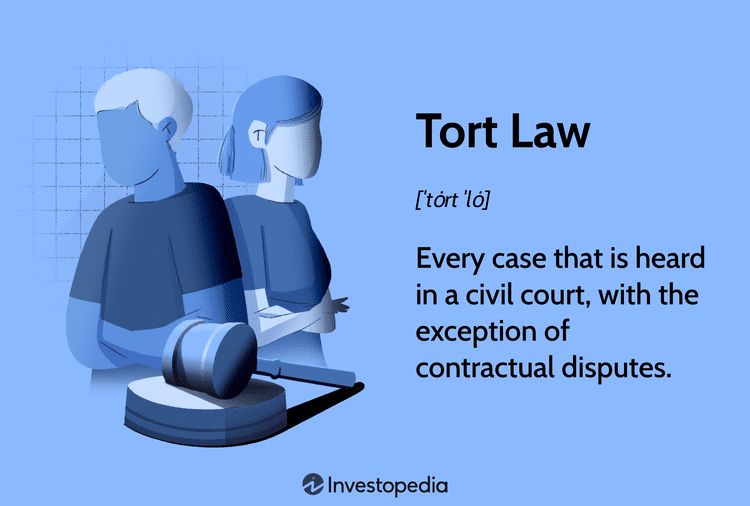

Tort law plays a fundamental role in rectifying civil wrongs and offering compensation to victims who have suffered injuries or losses. As our technological landscape evolves, traditional tort law is confronted with novel challenges, particularly because of the rapid advancements in algorithmic trading and artificial intelligence (AI). Algorithmic trading employs sophisticated computer programs to execute trades at speeds and frequencies beyond human capability. These systems can introduce complex legal questions, primarily concerning accountability when something goes awry. Concurrently, AI's decision-making capacity further complicates legal responsibility, as its functioning blurs the lines between human and machine liability.

This article examines the intersection of established tort law principles with the emerging legal complexities introduced by algorithm-driven decisions. Traditionally, tort law encompasses categories such as negligent torts, intentional torts, and strict liability torts, each with its frameworks for assessing culpability and providing justice. Understanding these categories is crucial for addressing the challenges presented by advancements in technology.

Algorithmic trading exemplifies how technological innovations challenge existing legal norms. The lack of clarity regarding accountability when algorithms execute erroneous trades prompts urgent questions: Should liability fall on developers, users, or the algorithm itself? Additionally, as algorithmic systems become more autonomous, the need for adaptive legal frameworks becomes apparent.

Through this exploration, the aim is to provide a nuanced view of tort law applications in technologically advanced contexts, using relevant examples to illustrate these challenges. Moreover, it is essential to consider whether current legal mechanisms need restructuring or enhancement to accommodate the unique attributes of AI and algorithmic activities. The conversation about adapting tort law to modern technological advancements is critical to ensuring that the legal system continues to provide adequate remedies for those affected by these technologies.

## Table of Contents

## Understanding Tort Law and its Mechanisms

Tort law is a fundamental component of the legal system that addresses civil wrongs, offering remedies primarily in the form of monetary compensation for injuries or losses sustained by individuals. Its foundations are built upon three primary categories: negligent torts, intentional torts, and strict liability torts, each serving distinct roles in addressing harmful actions.

Negligent torts form one of the most significant aspects of tort law and occur when an individual's failure to exercise reasonable care results in harm to another. This area of tort law examines whether a duty of care existed, whether it was breached, and if the breach directly caused the injury. The concept of negligence is central to numerous personal injury claims and requires a thorough analysis of the actor's conduct against the established standard of care. For example, a doctor misdiagnosing a patient due to lack of attention may be considered negligent, as this failure can result in harm that could have been prevented through the exercise of ordinary care.

Intentional torts differ from negligent torts as they involve deliberate actions that cause harm. In these cases, the actor intends to perform the act that leads to injury, whether or not they intended the actual outcome. Common examples include assault, battery, and false imprisonment. These types of torts highlight the law's focus on protecting individuals from intentional misconduct and ensuring that those who commit such acts are held accountable for their deliberate actions.

Strict liability torts, on the other hand, focus on activities that inherently present risks to others, regardless of the care exercised or the intent behind the actions. This category imposes liability without fault, emphasizing the act itself rather than the actor's intentions or precautions. Activities such as keeping wild animals or engaging in industrial operations that use hazardous substances may fall under strict liability due to their potential to cause substantial harm. The principle behind strict liability is to ensure that individuals or entities conducting potentially dangerous activities are responsible for any resultant damages, thus incentivizing greater precautionary measures.

These distinct yet interrelated categories of tort law address the nuances of civil wrongs. By offering a structured mechanism for redress, tort law provides victims with the necessary means to obtain compensation and justice while promoting societal norms of care and responsibility. As society and technology advance, the application of these principles continues to evolve, underscoring the role of tort law in addressing the aftermath of diverse harmful actions.

## Legal Examples of Tort Law in Action

Legal examples in tort law demonstrate how civil wrongs are addressed and how victims receive compensation. These examples show the variety of circumstances under which tort law operates, offering a clear view of its application across different domains.

In 2016, an incident involving a Google self-driving car and a public transit bus highlighted the complexities of liability in autonomous systems. The self-driving car, while operating in autonomous mode, collided with the bus as it attempted to merge into the center lane. The vehicle's software had miscalculated the situation, mistaking an approaching bus as one that would yield. Although the collision resulted in no serious injuries, it raised questions regarding accountability in autonomous vehicle technologies. This incident challenged traditional notions of liability, where the responsible party could be the manufacturer, the programmer, or perhaps the operators in charge of overseeing the software.

Another notable instance of negligence in tort law can be seen in the case of Amy Williams vs. Quest Diagnostics. In this case, a misclassification of genetic data by Quest Diagnostics led to incorrect medical treatment and consequent death. This case underscored the critical nature of accuracy and care in medical diagnostics and illustrated how negligence can have serious repercussions. It raised issues about the duty of care owed by medical testing companies to their patients and the importance of precise and accurate results to prevent harm.

The case of Hulk Hogan against Gawker Media provides a clear example of intentional tort. Gawker, a media company, published a private video of Hulk Hogan, which infringed upon his privacy rights. The court found that Gawker willfully invaded Hogan's privacy, leading to substantial damages awarded to the plaintiff. This case stressed on how intentional and conscious acts by an individual or entity, without regard for privacy, can result in significant legal liabilities and financial consequences.

These cases highlight the breadth of tort law, touching on sophisticated issues within autonomous technology, medical malpractice, and privacy invasion. They exemplify how tort law continues to evolve, addressing not only traditional issues but also contemporary challenges brought about by technological innovations.

## Tort Law and Algorithmic Trading

Algorithmic trading utilizes computer systems to execute trading orders at optimized speeds, enabling processes that are often too fast for human intervention. This technology, while efficient, introduces significant challenges within the scope of tort law, particularly concerning accountability and liability. As these systems operate, they can engage in erroneous trades that lead to substantial financial losses. Unlike human-driven transactions, the accountability for such errors is nebulous, posing questions about liability that conventional tort law principles struggle to resolve.

One primary issue is identifying the responsible party when an algorithm malfunctions or executes trades inappropriately. Is it the developer who created and programmed the algorithm, the user who employed it, or the algorithm itself? Traditional tort law operates under categories like negligence, intentional torts, and strict liability; however, these categories may need reevaluation when applied to algorithmic systems, which can act independently without direct human intention or oversight.

In negligence cases, tort law would typically require the demonstration of a duty of care, a breach of that duty, causation, and resultant damage. Algorithmic trading complicates this matrix by inserting automated decision-making processes that, while designed and anticipated by developers, operate autonomously. The code's complexities can obscure whether any party could reasonably foresee the resultant harm of its actions.

For example, consider a scenario where an algorithm unexpectedly triggers a massive sell-off due to a rare and unforeseen market signal. The investors who suffer losses might attempt to pursue legal actions against the developers of the trading algorithm. However, determining whether the developers were negligent hinges on whether the circumstances that led to the malfunction were reasonably foreseeable and whether adequate safeguards were implemented.

Furthermore, developers might defend by demonstrating rigorous testing protocols and compliance with industry standards, suggesting that the issue arose from anomalous market conditions not anticipated in the algorithm's design phase. This scenario illustrates the difficulties in applying traditional negligence standards, which often rely on human error, to machine operations.

Further complicating liability is the question of strict liability, which focuses on the act itself rather than the intent or negligence of the actor. In terms of [algorithmic trading](/wiki/algorithmic-trading), it raises the possibility of holding parties responsible regardless of fault, potentially expanding liability to users simply leveraging these trade systems for their inherent benefits.

The application of tort law to algorithmic trading thus demands a reevaluation and adaptation of current frameworks to accommodate the nuances introduced by sophisticated technology-driven processes. As the nature of these systems continues to evolve, legal doctrines may need reform or extension to ensure that accountability aligns with the broader objectives of justice and economic reliability. Such reforms might involve developing new liability models or clearer guidelines for responsibility distribution among the parties involved in deploying and operating these advanced systems.

## Challenges and Future Directions

The increasing complexity of digital and automated environments poses significant challenges for traditional tort law, necessitating an evolution in regulatory and legal frameworks to adequately address emerging issues. As technology advances, the clear attribution of causation and liability in tort cases becomes increasingly obscure, especially when dealing with algorithmic systems and [artificial intelligence](/wiki/ai-artificial-intelligence).

### Causation and Liability Attribution

In technologically advanced scenarios, the traditional mechanisms of tort law encounter difficulties in establishing causation and liability. Algorithms make decisions based on vast amounts of data and may operate autonomously with minimal human oversight. This autonomy complicates the direct tracing of liability, as several parties could potentially share responsibility, including developers, users, and the companies deploying these technologies. The concept of proximate cause, a fundamental element in tort law, is challenged by the intricate interactions between multiple algorithmic systems. The need for clear attribution of liability in these situations underscores the necessity for legal frameworks that can adequately interpret and apply tort principles to algorithm-driven actions.

### Legal Reform

Legal reform is essential to accommodate the emerging nuances of AI and algorithmic responsibilities. Existing tort principles, which were designed for contexts involving direct human actions, require recalibration to effectively handle scenarios where decision-making is decentralized across digital systems. Innovations in legal definitions and accountability structures are needed to engage with the unique challenges posed by these technologies. For instance, establishing standards for algorithmic transparency and accountability could provide clearer guidelines on the expectations and responsibilities of stakeholders involved in deploying such systems.

### Development of New Liability Models

The evolution of tort law may also entail the development of new liability models tailored to the technological landscape. Such models could incorporate concepts of shared or distributed liability to reflect the collaborative nature of algorithmic decision-making processes. For example, a distributed liability model might allocate responsibility proportionally among various parties based on their contribution to the algorithm's development, deployment, and application. This may involve a recalibrated approach to strict liability, where entities involved in deploying complex digital systems could be held liable for resulting harms even absent traditional negligence.

The path forward involves crafting comprehensive legal guidelines that align tort law with technological advances. By acknowledging the shifting paradigms of digital interaction and the capabilities of autonomous systems, legal reforms can create a balanced framework that upholds the foundational goals of tort law: to provide fair remedies for victims and deter wrongful conduct. Ensuring adaptability and foresight in regulatory measures will be crucial in maintaining the relevance and effectiveness of tort law in an increasingly digital world.

In conclusion, addressing the challenges posed by digital and automated environments requires a progressive approach to tort law, incorporating reforms and new models of liability that align with technological realities. Continued engagement with these issues will ensure that legal frameworks remain robust and relevant, providing adequate compensation and deterrence as society navigates the digital age.

## Conclusion

Tort law remains a crucial mechanism for addressing civil wrongs, yet as technology rapidly evolves, the legal landscape must adapt to these changes. Algorithmic trading and artificial intelligence (AI) present new challenges for tort law, especially in the areas of accountability and liability. To effectively navigate these challenges, a reevaluation of traditional tort principles is needed, incorporating insights from previous cases and examples of technological impact on legal frameworks.

The intersection of tort law with algorithm-driven activities necessitates an innovative approach to liability. By studying past examples, such as liability cases involving autonomous vehicles or privacy breaches due to AI errors, the legal community can extract valuable lessons that inform future decisions. These cases illustrate the practical application of tort principles and highlight areas requiring expansion or redefinition. 

For instance, attributing liability in algorithmic trading scenarios often becomes complex due to the autonomous nature of these systems. Determining whether responsibility lies with developers, users, or even the algorithms themselves requires a refined legal perspective. Algorithms operating at high speeds can exacerbate financial losses, prompting a need for legal systems to identify the appropriate entities responsible for such errors.

There is a growing recognition that traditional legal frameworks may not suffice in addressing these multifaceted issues. The evolving technological environment calls for proactive reform in tort law. This includes developing clearer guidelines and potentially new models of liability to accommodate AI and algorithmic activities. Establishing these frameworks ensures that tort law remains relevant and effective in providing remedies in the face of technological advancement.

In conclusion, while tort law continues to serve as an essential tool for redress and compensation, its adaptation to the digital age is critical. Ongoing dialogue and reform initiatives are vital to maintaining the efficiency and fairness of legal processes amidst these challenges, ensuring that victims can receive adequate compensation in the era of technology-driven impacts.

## References & Further Reading

[1]: Lopez de Prado, M. (2018). ["Advances in Financial Machine Learning."](https://www.amazon.com/Advances-Financial-Machine-Learning-Marcos/dp/1119482089) Wiley.

[2]: Aronson, D. R. (2006). ["Evidence-Based Technical Analysis: Applying the Scientific Method and Statistical Inference to Trading Signals."](https://www.amazon.com/Evidence-Based-Technical-Analysis-Scientific-Statistical/dp/0470008741) Wiley.

[3]: Jansen, S. (2020). ["Machine Learning for Algorithmic Trading."](https://github.com/stefan-jansen/machine-learning-for-trading) Packt Publishing.

[4]: Chan, E. P. (2008). ["Quantitative Trading: How to Build Your Own Algorithmic Trading Business."](https://github.com/ftvision/quant_trading_echan_book) Wiley.

[5]: Varian, H. R. (2014). ["Big Data: New Tricks for Econometrics."](https://pubs.aeaweb.org/doi/pdfplus/10.1257/jep.28.2.3) Journal of Economic Perspectives, 28(2), 3-27.