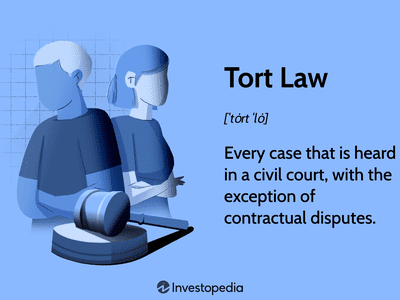

Exploring the intersection of tort law, legal liability, and algorithmic trading, this article examines the complexities faced by legal systems as they adapt to technological advancements. Traditionally, tort law addresses the redress for damages caused by one party to another. Over time, it has evolved to encompass cyber torts and issues arising from the deployment of AI and algorithm-driven systems. With the rapid growth of technology, legal systems worldwide grapple with integrating these novel concepts into established frameworks.

Algorithmic trading exemplifies the challenges faced by contemporary legal systems. This practice involves the use of computers to execute trading strategies based on pre-set instructions, often at speeds and volumes far surpassing human capabilities. While it offers significant advantages, such as increased efficiency and reduced transaction costs, it also presents unique legal challenges related to liability and the identification of tortfeasors. Algorithmic malfunctions or unintended actions can cause substantial financial harm, raising questions about accountability.

This article provides a comprehensive guide on how tort law is being applied in the digital age, with a specific focus on algorithmic trading and the potential liabilities it entails. The traditional tort law aspects, such as the roles of tortfeasors, are being re-examined to address legal issues surrounding new technologies. Furthermore, the emerging concept of a 'reasonable algorithm' standard is crucial in assessing algorithmic behavior against established legal norms.

We also consider the challenges algorithms pose to traditional legal frameworks, highlighting how legal systems are beginning to adapt to address these advancements. The development of legal approaches to manage the risks associated with technology can promote innovation while maintaining accountability, providing a secure foundation for continued growth in AI-driven markets.

## Table of Contents

## Understanding Tort Law and Tortfeasors

A tort is a wrongful act or an infringement of a right leading to legal liability. Its primary function is to offer redressal through compensation for individuals who have suffered harm due to the wrongful acts of others. Tortfeasors, those who commit these wrongful acts, play a central role in the judicial system as they are subject to liability for their actions that lead to a tort.

There are three primary categories of torts: strict liability, intentional torts, and negligent torts. Strict liability torts hold individuals or entities legally responsible for the damages their actions cause, regardless of intent or negligence. This is often applied in situations involving inherently dangerous activities or defective products. Intentional torts, on the other hand, occur when a person deliberately engages in actions that cause harm, such as battery, assault, or false imprisonment. Lastly, negligent torts arise from the failure to exercise a standard of care, leading to unintentional harm, commonly seen in cases like car accidents or medical malpractice.

Tort liability is typically determined by establishing a breach of duty that results in a legal injury. A duty is a legal obligation requiring a standard of conduct, and its breach constitutes a failure to meet this standard, resulting in harm. According to this framework, to prove tort liability, a claimant must demonstrate that the tortfeasor owed a duty to the plaintiff, breached this duty, and caused an injury that resulted in damages.

The implications of tort liabilities extend across various sectors, both commercial and personal. In the commercial sector, entities face tort claims related to product liabilities, workplace safety, and professional negligence. Personal settings may involve claims such as defamation, nuisance, or personal injury. These liabilities have significant financial and operational impacts, influencing how businesses operate and individuals interact.

Traditional torts have adapted to address digital scenarios fueled by technological advances. Cyberstalking, an adaptation of traditional stalking laws, includes persistent online harassment that leads to distress or fear. Data privacy violations, another example, occur when personal data is wrongfully accessed or disclosed, resulting in harm to individuals. These adaptations reflect the judicial system's efforts to address contemporary challenges posed by digital environments, ensuring that tort law remains relevant in modern contexts.

As legal systems confront the challenges emerging from digital transformations, understanding the foundational elements of tort law and the role of tortfeasors becomes crucial. This ensures that justice and compensation mechanisms remain robust in an evolving technological landscape.

## Algorithmic Trading and Legal Liability

Algorithmic trading, also known as algo-trading or black-box trading, represents a significant transformation in the way financial markets operate. It involves the use of computer algorithms to automatically execute a large number of trades at speeds unachievable by human traders. This method leverages complex mathematical models and high-frequency data to make trading decisions, often within milliseconds. Over the past two decades, [algorithmic trading](/wiki/algorithmic-trading) has grown dramatically, constituting a substantial portion of market activities across major exchanges globally.

**Risks and Benefits**

The adoption of algorithmic trading offers numerous benefits, such as increased market [liquidity](/wiki/liquidity-risk-premium), reduced transaction costs, and the ability to execute trades at optimal prices by eliminating the emotional aspects of human trading. However, it also brings about several risks. Algorithms can generate significant market [volatility](/wiki/volatility-trading-strategies) if they malfunction or interact in unpredictable ways. For instance, the Flash Crash of May 6, 2010, highlighted how algorithmic trading could lead to drastic price swings within minutes, causing concerns about systemic risk in the financial markets.

**Liability Concerns**

Just as individuals or corporations can be held liable for negligent or intentional acts, algorithms can inadvertently cause harm, raising unique liability issues. The key challenge lies in determining the extent of responsibility or blame when a trading algorithm behaves unexpectedly or causes financial damage. This is particularly complex given that algorithms can evolve and learn over time, potentially acting outside the scope of their original programming.

To assess algorithmic actions, the 'reasonable algorithm' standard has emerged as a potential legal benchmark, echoing the 'reasonable person' standard used in negligence law. This approach evaluates whether an algorithm's actions, under particular circumstances, were within what can be expected from a similarly functioning algorithm. Factors considered in this assessment include the algorithm's design, its testing and simulation adequacy, and whether it follows industry standards.

**Legal Precedents**

Recent cases highlight the evolving legal landscape concerning algorithmic trading. One example involves the case of [Knight Capital Group](https://en.wikipedia.org/wiki/Knight_Capital_Group), which experienced a $440 million loss in 2012 due to a software malfunction. This incident led to regulatory scrutiny and served as a cautionary tale about the importance of rigorous testing and safeguards. Similarly, [Citigroup](https://en.wikipedia.org/wiki/Citigroup) was fined by regulatory bodies for failing to manage risks associated with its algorithms, further emphasizing the legal ramifications of inadequate control measures.

These cases underscore the necessity for firms employing algorithmic trading to implement comprehensive risk management strategies. Ensuring algorithm integrity through exhaustive testing, regular updates, and compliance with financial regulations are crucial measures to mitigate potential liabilities. Consequently, as the reliance on algorithmic systems in trading increases, legal frameworks must adapt, incorporating standards and guidelines tailored to the nuanced challenges presented by algorithmic technology.

## The 'Reasonable Algorithm' Standard

The concept of the 'reasonable algorithm' standard aims to mirror the 'reasonable person' standard traditionally used in negligence law. In this legal framework, the actions of a human are evaluated based on what a typical, reasonable person would have done under similar circumstances. In translating this to algorithms, the 'reasonable algorithm' assesses whether an algorithm's actions are in line with what a competent and well-designed algorithm would execute in the same situation.

The criteria used to judge the reasonableness of an algorithm involve several key factors. Firstly, the design and development process of the algorithm is scrutinized, ensuring it adheres to industry standards and ethical guidelines. Secondly, continuous monitoring and auditing mechanisms must be in place to detect potential faults. Thirdly, the algorithm's adaptability to new data and conditions is essential; it should ideally incorporate learning mechanisms to update its models in real-time. Furthermore, transparency in decision-making processes is increasingly considered a criterion, requiring algorithms to explain their actions and predictions.

However, translating human-centric legal concepts to autonomous systems like algorithms presents significant challenges. Unlike humans, algorithms operate on data input and logic, lacking inherent moral or ethical reasoning—a core aspect of the reasonable person standard. Moreover, algorithms can have emergent behaviors resulting from complex interactions with other systems or data, which may not have been anticipated by their developers.

Understanding accountability for AI-driven actions under the 'reasonable algorithm' model could significantly influence the future legal landscape. This standard could lead to clearer guidelines and responsibilities, influencing how companies design and deploy AI systems. It might require firms to invest more in algorithm testing, validation, and documentation to ensure compliance with evolving legal standards. This shift could increase the accountability of developers and organizations, mandating more robust risk management strategies when utilizing AI technologies.

Examples where this standard could be applied include algorithmic trading systems making decisions with significant financial impacts. For instance, if an algorithm triggers a flash crash, determining if the algorithm acted 'reasonably' concerns whether it operated as a faultless and well-configured trading model. Another example is self-driving cars, where the 'reasonable algorithm' must ensure the car's decision-making combines safety, efficiency, and adaptability to different driving conditions.

## Case Studies and Emerging Legal Precedents

## Case Studies and Emerging Legal Precedents

In recent years, legal systems worldwide have grappled with the complexities of applying tort law to algorithmic trading and AI decision-making. Several notable legal cases have begun shaping the landscape of tort liability in these advanced technological contexts, offering insights into both the challenges and evolving solutions in this domain.

One significant case that highlights the complexities involved is the "Knight Capital" incident of 2012. Knight Capital Group, a financial services firm, experienced a software glitch in its algorithmic trading system, leading to a loss of approximately $460 million within just 45 minutes. The incident underscored the significant risks associated with algorithmic trading, especially relating to liability distribution. The aftermath involved scrutiny from regulatory bodies like the Securities and Exchange Commission (SEC), which imposed fines and required improvements in software controls and risk management systems. This case has set precedence emphasizing thorough testing and fail-safe mechanisms as crucial deterrents against algorithm-induced tortious harm.

The case of "Flash Crash" in 2010 further exemplifies the legal challenges faced. In just about 36 minutes, the Dow Jones Industrial Average fell by almost 1,000 points, partially attributed to algorithmic trading systems. Investigations revealed that while no single entity was entirely to blame, unintended interactions between different trading algorithms created a cascade effect, exacerbating market volatility. Regulatory responses, like the Commodity Futures Trading Commission (CFTC) report, introduced circuit breaker mechanisms to pause trading under extreme volatility and mitigate future risks.

Analysis of these cases reveals emerging legal precedents focusing on accountability in software deployment and the necessity of robust risk management frameworks. One takeaway for companies utilizing algorithms is the importance of establishing comprehensive oversight over algorithmic operations, including regular auditing and updating of algorithmic codes and ensuring compliance with regulatory requirements. Implementing risk mitigation strategies, such as real-time monitoring systems and automated shutdown protocols in cases of abnormal trading patterns, is also critical.

Regulatory bodies continue to play an essential role in addressing legal challenges associated with algorithmic trading. The European Union's Markets in Financial Instruments Directive II (MiFID II) and the SEC’s proposed Consolidated Audit Trail system are examples of regulatory efforts aiming to enhance transparency and traceability in trading activities. These measures highlight a global trend towards increased governance over algorithmic decision-making systems.

Experts note that the evolving nature of tort law in a tech-driven world requires adaptive legal frameworks that consider the unique aspects of autonomous systems. As legal systems gain expertise in algorithmic contexts, legal precedents are likely to guide companies in implementing preventive and corrective measures. The ongoing discourse suggests that while traditional tort principles provide a foundation, new legal standards, like the “reasonable algorithm” benchmark, may develop to better align with the advanced capabilities of AI systems.

In conclusion, the intersection of tort law and algorithmic trading underscores a dynamic legal landscape where adapting to technological advancements is pivotal. Companies harnessing algorithmic tools must remain agile, ensuring that their operations meet evolving legal requirements and embrace emerging standards as they materialize.

## Conclusion: Navigating Legal Liability in Algorithmic Contexts

Navigating legal liability in algorithmic contexts presents a multifaceted challenge as discussed throughout this article. The integration of algorithmic trading into financial markets necessitates a re-evaluation of traditional tort principles to adequately address new forms of potential harm. One of the intricacies lies in the complexities tort law faces when applied to actions performed by algorithms. These automated systems are neither human nor completely autonomous, requiring a unique approach to liability that accounts for both technological capabilities and limitations.

Balancing technological innovation with legal accountability is crucial. As businesses increasingly rely on algorithms for efficiency and competitiveness, they must remain vigilant about the legal risks involved. Encouraging innovation is vital for economic growth, yet it should not come at the expense of accountability and ethical obligations. Businesses can mitigate potential legal liabilities by implementing robust governance frameworks that ensure algorithms operate within ethical and legal boundaries. This might include regular audits, transparency in decision-making processes, and adherence to industry best practices.

Adapting legal frameworks to keep pace with AI and algorithmic advancements is fundamental. The current legal standards, largely developed for human actions, must evolve to incorporate the unique characteristics of algorithms. This evolution involves recognizing scenarios where algorithms might commit actions deemed negligent or harmful, thus necessitating the establishment of standards akin to the "reasonable algorithm" standard discussed earlier. By redefining the benchmarks for algorithmic behavior, the legal system can better handle AI-driven cases, providing clarity in disputes over liability.

Looking forward, the future of tort law in the digital age is poised to significantly impact both economic and legal systems. The increasing prevalence of algorithm-driven processes across various sectors indicates a trend towards more frequent interactions between law and technology. This not only challenges legal professionals to develop new analytical frameworks but also demands that businesses stay informed about legal developments and actively participate in shaping the regulatory landscape. As tort law continues to adapt, its effective alignment with modern technological contexts will be vital for maintaining both justice and economic vitality.

## References & Further Reading

[1]: Kaal, W., & Vermeulen, E. (2021). ["Data-Driven and AI-Driven Corporate Finance: Digital Transformation of Liability."](https://www.jstor.org/stable/26322665) European Corporate Governance Institute - Finance Working Paper No. 764.

[2]: Minsky, L. (2017). ["Knightmare on Wall Street: The Rise and Fall of Knight Capital and the Biggest Risk for Financial Markets."](https://www.amazon.com/Knightmare-Wall-Street-Capital-Financial/dp/0989657701) Palgrave Macmillan.

[3]: Scopino, G. (2015). ["Do We Need a New Law for High-Frequency Trading? Regulation, Legal Processes, and the Financial Risks of Algorithmic Trading."](https://www.mypescpe.com/private/shared/CPEpdfs/7910BTEXT.PDF) Fordham Journal of Corporate & Financial Law.

[4]: Pirrong, C. (2014). ["A Dynamic Model of the Flash Crash of May 6, 2010."](https://www.bauer.uh.edu/spirrong/economics-commodity-trading-firms.pdf) Journal of Financial Econometrics, 12(1), 80-118.

[5]: Lopez de Prado, M. (2018). ["Advances in Financial Machine Learning."](https://www.amazon.com/Advances-Financial-Machine-Learning-Marcos/dp/1119482089) Wiley.