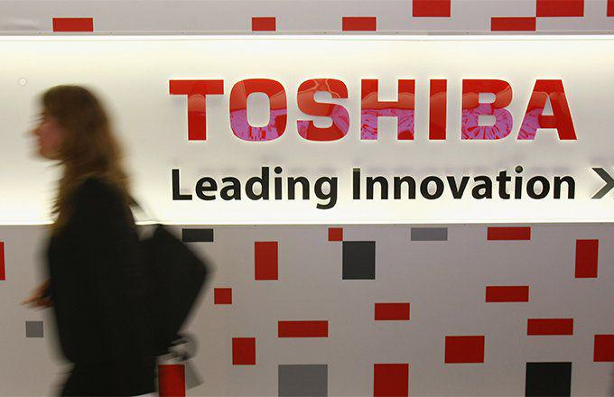

## Table of Contents

## What is the Toshiba Accounting Scandal?

The Toshiba Accounting Scandal happened in 2015. It was found out that Toshiba, a big Japanese company, had been lying about their profits for many years. They made their profits look bigger than they really were. This was done by the company's leaders and some workers. They did this from 2008 to 2014.

When the scandal was discovered, it caused a lot of problems for Toshiba. The company had to pay a big fine of about $60 million. Some of the leaders had to leave their jobs. The scandal also made people trust Toshiba less. It showed that even big companies can do bad things to look good. After this, Toshiba promised to be more honest and follow the rules better.

## When did the Toshiba Accounting Scandal occur?

The Toshiba Accounting Scandal happened in 2015. People found out that Toshiba had been lying about how much money they made for many years. They did this from 2008 to 2014. The leaders and some workers at Toshiba made their profits look bigger than they really were.

When the scandal was discovered, it caused big problems for Toshiba. They had to pay a fine of about $60 million. Some of the leaders had to leave their jobs. This made people trust Toshiba less. It showed that even big companies can do bad things to look good. After this, Toshiba promised to be more honest and follow the rules better.

## What were the main causes of the Toshiba Accounting Scandal?

The main causes of the Toshiba Accounting Scandal were pressure to meet high profit targets and a weak corporate governance system. Toshiba's leaders wanted to show big profits to make the company look successful. They set very high goals for their workers. When the workers couldn't meet these goals, they started to lie about the profits. They made the numbers look bigger than they really were to please the leaders.

Another big cause was that Toshiba's system for checking and controlling what was happening inside the company was not strong enough. The people who were supposed to make sure everything was honest and fair were not doing their job well. This made it easy for the leaders and workers to keep lying about the profits for many years without getting caught. If the company had better rules and checks, the scandal might not have happened.

## How was the scandal discovered?

The Toshiba Accounting Scandal was discovered because of a new rule in Japan. In 2015, a new law said that big companies had to get checked by outside experts. These experts are called independent auditors. They look at the company's books to make sure everything is honest. When these auditors looked at Toshiba's books, they found out that Toshiba had been lying about their profits for many years.

After the auditors found the problem, they told the company and the government. The government then did their own big investigation. They found out that Toshiba's leaders and some workers had been making the profits look bigger than they really were from 2008 to 2014. This was a big shock to everyone and caused a lot of trouble for Toshiba.

## What were the financial impacts on Toshiba due to the scandal?

The Toshiba Accounting Scandal had big financial impacts on the company. They had to pay a fine of about $60 million because they lied about their profits. This fine was a lot of money for Toshiba, and it made their financial situation worse. Also, Toshiba's stock price went down a lot when people found out about the scandal. Investors lost trust in the company and sold their shares, which made the stock price drop even more.

The scandal also made it harder for Toshiba to do business. Customers and other companies did not want to work with Toshiba as much because they could not trust them. This meant Toshiba lost money from deals they could have made. They also had to spend a lot of money to fix their problems and make their systems better so they could be more honest in the future. All these things together made Toshiba's financial situation very tough after the scandal.

## Who were the key figures involved in the Toshiba Accounting Scandal?

The key figures in the Toshiba Accounting Scandal were mostly the company's top leaders. Norio Sasaki, who was the CEO of Toshiba from 2009 to 2013, and Hisao Tanaka, who took over as CEO from 2013 to 2015, were both involved. They were the ones who set very high profit goals for the company. When these goals were not met, they allowed and sometimes encouraged the workers to lie about the profits to make the numbers look better.

Besides the CEOs, other important people included the company's board members and some of the workers in the accounting department. These people helped to make the profits look bigger than they really were. After the scandal was discovered, both Sasaki and Tanaka had to leave their jobs. They were also fined and faced other punishments for their part in the scandal.

## What actions did Toshiba take in response to the scandal?

After the Toshiba Accounting Scandal was discovered, the company took several steps to fix the problems and regain trust. They paid a big fine of about $60 million to the government as a punishment for lying about their profits. Toshiba also fired some of their top leaders, including the CEOs Norio Sasaki and Hisao Tanaka, because they were involved in the scandal. The company promised to be more honest and follow the rules better in the future.

To make sure this would not happen again, Toshiba made changes to how they do business. They set up new rules and systems to check their work more carefully. They also brought in outside experts to help make sure everything was being done the right way. These steps were important for Toshiba to show that they were serious about being honest and to start rebuilding the trust of their customers and investors.

## How did the scandal affect Toshiba's reputation and market position?

The Toshiba Accounting Scandal hurt the company's reputation a lot. People and companies did not trust Toshiba anymore because they found out that the company had been lying about their profits for many years. This made customers and other businesses not want to work with Toshiba. The company's name became known for being dishonest, which was very bad for them. It took a long time for Toshiba to start fixing their reputation and showing that they could be trusted again.

The scandal also made Toshiba's position in the market weaker. When the news about the scandal came out, Toshiba's stock price went down a lot. Investors sold their shares because they lost trust in the company. This made it harder for Toshiba to get money they needed to grow and do business. Other companies that Toshiba used to compete with got stronger because they did not have the same trust problems. Toshiba had to work hard to get back to where they were before the scandal happened.

## What were the legal consequences for those involved in the scandal?

The people involved in the Toshiba Accounting Scandal faced big legal consequences. Norio Sasaki and Hisao Tanaka, who were the CEOs during the time of the scandal, had to leave their jobs. They were also fined a lot of money. The government made them pay because they were the ones who allowed and sometimes told the workers to lie about the profits. Other leaders and workers who helped with the lying also got in trouble. They had to pay fines and some of them lost their jobs too.

The company itself had to pay a big fine of about $60 million to the government. This was a punishment for lying about their profits for many years. The government did a big investigation and found out that Toshiba had been dishonest from 2008 to 2014. After the scandal, Toshiba had to follow new rules and let outside experts check their work to make sure they were being honest. These legal consequences were important to show that lying about money is very serious and can lead to big punishments.

## What reforms did Toshiba implement to prevent future accounting issues?

After the Toshiba Accounting Scandal, the company made big changes to make sure they did not have the same problems again. They set up new rules and systems to check their work more carefully. Toshiba brought in outside experts, called independent auditors, to look at their books and make sure everything was honest. They also changed how they set goals for their workers. Instead of pushing for very high profits, they made more realistic targets so people would not feel the need to lie.

Toshiba also worked on making their corporate governance better. This means they made the rules and checks inside the company stronger. They set up a board of directors that would watch over the company more closely. This board had the power to stop any dishonest actions and make sure everyone followed the rules. By doing all these things, Toshiba hoped to show that they were serious about being honest and to start rebuilding trust with their customers and investors.

## How did the Toshiba Accounting Scandal influence corporate governance in Japan?

The Toshiba Accounting Scandal made a big impact on how companies in Japan are run. It showed that even big companies could lie about their money to look good. This made the government and other people want to make the rules stronger. They wanted to make sure this kind of lying would not happen again. So, Japan changed its laws to make companies get checked by outside experts more often. These experts look at the company's books to make sure everything is honest.

The scandal also made companies in Japan think more about how they do business. They started to set up better systems to watch over what was happening inside their companies. Companies made their boards of directors stronger so they could stop any dishonest actions. They also started to set more realistic goals for their workers so there would be less pressure to lie. All these changes helped to make sure that companies in Japan would be more honest and follow the rules better.

## What lessons can other companies learn from the Toshiba Accounting Scandal?

The Toshiba Accounting Scandal teaches other companies that it's very important to be honest about their money. When Toshiba lied about their profits, they got into big trouble. They had to pay a lot of money and their leaders lost their jobs. This shows that lying can hurt a company a lot. Other companies should always tell the truth about their money, even if it's not as good as they want it to be. Being honest helps keep the trust of customers and investors.

Another lesson is that companies need strong rules and checks to make sure everyone is doing the right thing. Toshiba's leaders set very high goals, which made workers feel they had to lie to meet them. If the company had better systems to watch over what was happening, the lying might not have happened. Companies should have people who can stop dishonest actions and make sure everyone follows the rules. This helps keep the company honest and avoids big problems like the ones Toshiba had.

## References & Further Reading

[1]: [Reuters. (2015). "Timeline: Toshiba's Accounting Scandal."](https://www.msn.com/en-ca/money/general/jeju-air-shares-slump-to-record-low-after-deadly-plane-crash/ar-AA1wFN1G) 

[2]: [The Wall Street Journal. (2015). "Toshiba Accounting Scandal: What You Need to Know."](https://www.wsj.com/news/archive/2024/12/24)

[3]: [Financial Times. (2015). "Toshiba: Under the Microscope."](https://en.wikipedia.org/wiki/Endemol_Shine_North_America)

[4]: Fukukawa, H., & Mock, T. J. (2017). ["Auditor Commitment in the Japanese Context: The Role of Organizational Factors in Audit Firms."](https://gsat.service.sci.tu.ac.th/textbooks/book-search/download/the%20routledge%20companion%20to%20tax%20avoidance%20research%20routledge%20companions%20in%20business%20management%20and%20accounting.pdf) Auditing: A Journal of Practice & Theory.

[5]: [BBC News. (2015). "Toshiba CEO Resigns Amid $1.2bn Accounting Scandal."](https://www.bbc.co.uk/news/live/uk-scotland-30841897?page=5)

[6]: [Bloomberg. (2015). "Toshiba Downgraded Again as Scandal Weighs on Credit Rating."](https://en.wikipedia.org/wiki/One_News_(TV_channel))

[7]: Ball, R. (2009). ["Market and Political/Regulatory Perspectives on the Recent Accounting Scandals."](https://onlinelibrary.wiley.com/doi/full/10.1111/j.1475-679X.2009.00325.x) Journal of Accounting Research.

[8]: [Nikkei Asia. (2015). "Toshiba to Overhaul Corporate Governance."](https://www.tradingview.com/news/te_news:442129:0-nikkei-225-climbs-1-1-on-record-high-japanese-budget/)

[9]: [Compliance Week. (2015). "New Crisis Puts Toshiba’s Corporate Governance in Crosshairs."](https://technologymagazine.com/top10/top-10-technology-leaders-in-mea)