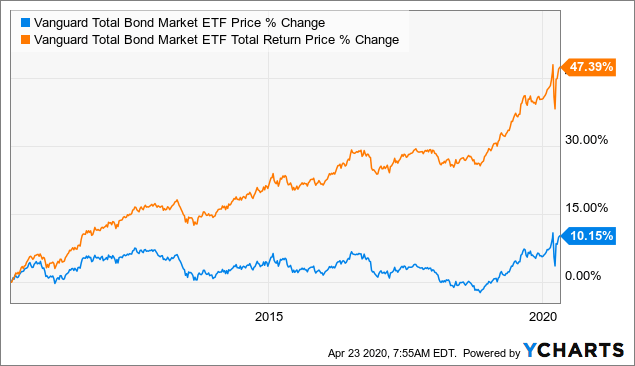

## Table of Contents

## What is a Total Bond Fund?

A Total Bond Fund is a type of investment fund that focuses on bonds. Bonds are like loans that you give to governments or companies, and in return, they pay you interest over time. A Total Bond Fund tries to include a wide variety of bonds in its portfolio, which can help spread out the risk. This means the fund might have bonds from different countries, different types of companies, and different lengths of time until they pay back the loan.

These funds are popular because they can offer a steady income from the interest payments, and they are often seen as safer than investing in just stocks. However, they are not completely risk-free. The value of the bonds can go up and down based on things like interest rates and the financial health of the companies or governments that issued the bonds. By investing in a Total Bond Fund, you get a piece of this diverse collection of bonds, which can help balance your overall investment strategy.

## How does a Total Bond Fund differ from other types of bond funds?

A Total Bond Fund is different from other bond funds because it tries to include a little bit of everything. It's like a big mix of different types of bonds, such as government bonds, corporate bonds, and even bonds from different countries. This mix helps spread out the risk, so if one type of bond doesn't do well, the others might help balance things out. Other bond funds might focus only on one type of bond, like just government bonds or just high-yield corporate bonds, which can be riskier because they don't have as much variety.

Another way a Total Bond Fund differs is in its goal to match the performance of a broad bond market index. This means the fund managers try to make the fund's performance similar to the overall bond market, rather than trying to beat it. Other types of bond funds, like actively managed bond funds, might try to pick specific bonds they think will do better than the market. These funds might charge higher fees because the managers are doing more work to try to find the best bonds. A Total Bond Fund, on the other hand, usually has lower fees because it's trying to match the market, not beat it.

## What are the main benefits of investing in a Total Bond Fund?

One of the main benefits of investing in a Total Bond Fund is that it helps spread out your risk. Because the fund includes many different types of bonds, like government bonds and corporate bonds from different countries, it's less likely that all the bonds will do badly at the same time. If one type of bond doesn't do well, the others might help balance things out. This makes a Total Bond Fund a safer choice compared to putting all your money into just one type of bond.

Another benefit is that Total Bond Funds usually have lower fees. Since these funds aim to match the performance of a broad bond market index rather than trying to beat it, the managers don't need to do as much work [picking](/wiki/asset-class-picking) specific bonds. This means they can charge less for managing the fund. Lower fees mean you get to keep more of your investment returns, which is good for your wallet over time.

## What are the risks associated with Total Bond Funds?

Even though Total Bond Funds try to spread out risk by holding many different types of bonds, they still have some risks. One big risk is changes in interest rates. When interest rates go up, the value of the bonds in the fund can go down. This is because new bonds will be issued with higher interest rates, making the older bonds with lower rates less attractive to investors. If you need to sell your shares in the fund when the bond values are down, you might lose money.

Another risk is that the companies or governments that issued the bonds might have trouble paying back the money they borrowed. If a company goes bankrupt or a government faces financial problems, they might not be able to pay the interest or return the money you lent them. This can hurt the value of the Total Bond Fund. Even though the fund has a mix of different bonds, if a lot of the bonds in the fund are from issuers that run into trouble, it can still affect the overall performance of the fund.

## How is the performance of a Total Bond Fund typically measured?

The performance of a Total Bond Fund is usually measured by comparing it to a bond market index. This index is like a big list of bonds that shows how the overall bond market is doing. The fund managers try to make the fund's performance match this index as closely as possible. They look at things like the total return, which is how much money the fund makes from interest payments and any changes in the value of the bonds.

Another way to measure the performance is by looking at the fund's yield. The yield tells you how much income you're getting from the bonds in the fund, usually shown as a percentage of the money you invested. It's important because it shows how much money you can expect to earn from the fund over time. By comparing the yield and total return of the fund to the bond market index, investors can see if the Total Bond Fund is doing a good job of matching the market's performance.

## What types of bonds are usually included in a Total Bond Fund?

A Total Bond Fund usually includes a mix of different types of bonds to spread out the risk. It might have government bonds, which are loans to governments like the U.S. Treasury bonds. These are often seen as safer because governments are less likely to go bankrupt. The fund might also include corporate bonds, which are loans to companies. These can be riskier but often pay more interest. Sometimes, the fund includes municipal bonds, which are loans to local governments or cities, and these can offer tax benefits.

The fund might also have bonds from different countries, not just the U.S. This can help spread out the risk even more because economic conditions can be different in different parts of the world. Another type of bond that might be in the fund is mortgage-backed securities, which are bonds backed by home loans. These can add more variety to the fund. Overall, by including all these different types of bonds, a Total Bond Fund tries to balance risk and return to match the performance of the overall bond market.

## How can a Total Bond Fund fit into a diversified investment portfolio?

A Total Bond Fund can be a great part of a diversified investment portfolio because it helps spread out your risk. When you invest in different types of assets, like stocks, bonds, and maybe even real estate, you're not putting all your eggs in one basket. A Total Bond Fund adds to this mix by including a wide variety of bonds, like government bonds, corporate bonds, and bonds from different countries. This means if the stock market goes down, the bonds in the fund might still do okay, helping to balance out your overall investment.

Another way a Total Bond Fund fits into a diversified portfolio is by providing a steady income. Bonds usually pay interest regularly, and a Total Bond Fund can give you a piece of this income. This can be especially helpful if you're looking for a more stable part of your investments to help cover your living expenses or to reinvest. By having a Total Bond Fund alongside other investments, you can have both the potential for growth from stocks and the stability and income from bonds, making your portfolio more balanced and less risky.

## What are the tax implications of investing in a Total Bond Fund?

When you invest in a Total Bond Fund, you need to think about taxes. The interest you earn from the bonds in the fund is usually taxed as regular income. This means you'll pay taxes on it at the same rate as your salary or wages. If you sell your shares in the fund for more than you paid for them, you might also have to pay capital gains tax. The rate for this tax depends on how long you held the shares. If you held them for a year or less, it's a short-term capital gain, and you'll pay the same rate as your regular income. If you held them for more than a year, it's a long-term capital gain, and the tax rate is usually lower.

Some Total Bond Funds might include municipal bonds, which can have different tax rules. Interest from municipal bonds is often free from federal income tax, and sometimes from state and local taxes too, if you live in the state where the bond was issued. This can make these funds more attractive if you're in a high tax bracket. But remember, not all bonds in a Total Bond Fund are tax-free, so you'll still need to pay taxes on the interest from other types of bonds. It's a good idea to talk to a tax advisor to understand how a Total Bond Fund will affect your taxes based on your specific situation.

## How do interest rate changes affect Total Bond Funds?

When interest rates go up, it usually means bad news for Total Bond Funds. Here's why: when new bonds are issued with higher interest rates, the old bonds in the fund that have lower rates become less attractive to investors. This makes the value of those old bonds go down. If you need to sell your shares in the Total Bond Fund at that time, you might get less money than you expected because the value of the bonds in the fund has dropped. So, rising interest rates can make the price of your Total Bond Fund go down.

On the flip side, when interest rates go down, it's good news for Total Bond Funds. The old bonds in the fund that have higher interest rates than the new ones being issued become more attractive to investors. This makes the value of those old bonds go up. If you need to sell your shares in the fund during this time, you might get more money than you expected because the value of the bonds in the fund has increased. So, falling interest rates can make the price of your Total Bond Fund go up.

## What are the management fees and other costs associated with Total Bond Funds?

Total Bond Funds usually have management fees, which are what you pay the fund managers for running the fund. These fees are often lower than those of actively managed bond funds because Total Bond Funds aim to match the performance of a broad bond market index, not beat it. The management fee is usually a small percentage of the total amount you have invested in the fund, often around 0.05% to 0.50% per year. This means if you have $10,000 invested, you might pay between $5 and $50 in management fees each year.

Besides management fees, there can be other costs too. One of these is the expense ratio, which is the total percentage of the fund's assets that go toward all the costs of running the fund, including the management fee. The expense ratio might also include things like administrative costs and marketing expenses. Another cost to watch out for is the trading costs, which happen when the fund buys and sells bonds. These costs can add up, especially if the fund trades a lot. It's a good idea to look at the expense ratio and understand all the costs before you decide to invest in a Total Bond Fund.

## How does the duration of bonds in a Total Bond Fund impact its sensitivity to interest rate changes?

The duration of bonds in a Total Bond Fund is really important because it tells you how sensitive the fund is to changes in interest rates. Duration is like a measure of how long it takes for you to get back the money you invested in the bond, including the interest payments. If a Total Bond Fund has bonds with a longer duration, it means the fund will be more affected by changes in interest rates. When interest rates go up, the value of these longer-duration bonds will drop more than shorter-duration bonds. On the other hand, if interest rates go down, the value of these longer-duration bonds will go up more too.

So, if you're thinking about investing in a Total Bond Fund, it's a good idea to check the average duration of the bonds in the fund. A fund with a shorter average duration will be less sensitive to [interest rate](/wiki/interest-rate-trading-strategies) changes, which might be better if you're worried about rates going up. But if you think interest rates will go down, a fund with a longer average duration could give you bigger gains. Understanding the duration helps you know how the fund might react to changes in interest rates and can help you make a smarter investment choice.

## What advanced strategies can be used to optimize returns from a Total Bond Fund?

One way to try to get more out of a Total Bond Fund is by using a strategy called laddering. This means you spread out your investments over time by buying bonds that will pay back at different times. Imagine you have a ladder with steps at different heights. Each step is like a bond that matures at a different time. By doing this, you can take advantage of different interest rates and have money coming back to you regularly. If interest rates go up, you can use the money from the bonds that mature to buy new bonds with higher rates. If rates go down, you still have some bonds locked in at the higher rates you got earlier.

Another strategy is to pay attention to the duration of the bonds in the fund. If you think interest rates are going to go up, you might want to choose a Total Bond Fund with shorter-duration bonds. These won't lose as much value if rates rise. On the other hand, if you think rates will go down, a fund with longer-duration bonds could give you bigger gains. You can also mix and match by having some money in shorter-duration bonds and some in longer-duration bonds. This way, you're ready for whatever happens with interest rates. By understanding and using duration, you can try to make the most out of your Total Bond Fund, no matter what the interest rates do.

## References & Further Reading

[1]: ["Bond Markets, Analysis, and Strategies"](https://www.amazon.com/Bond-Markets-Analysis-Strategies-tenth/dp/026204627X) by Frank J. Fabozzi

[2]: ["Algorithmic Trading: Winning Strategies and Their Rationale"](https://www.amazon.com/Algorithmic-Trading-Winning-Strategies-Rationale-ebook/dp/B00CY5HC0U) by Ernie Chan

[3]: ["Advances in Financial Machine Learning"](https://www.amazon.com/Advances-Financial-Machine-Learning-Marcos/dp/1119482089) by Marcos Lopez de Prado

[4]: ["Investment Analysis and Portfolio Management"](https://faculty.cengage.com/works/9780357988176) by Frank K. Reilly and Keith C. Brown

[5]: ["The Handbook of Fixed Income Securities"](https://www.amazon.com/Handbook-Fixed-Income-Securities-Ninth/dp/1260473899) by Frank J. Fabozzi