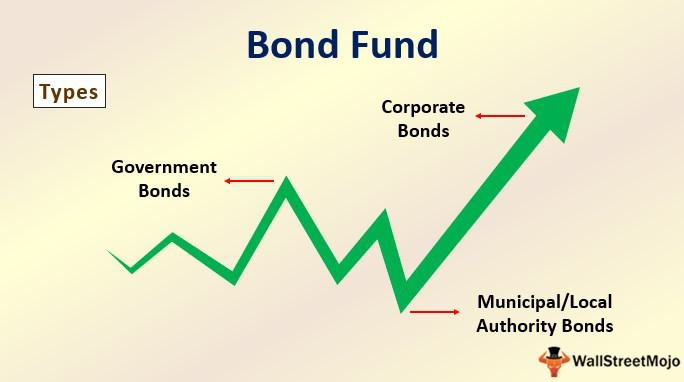

Bond investing and trading have undergone profound changes due to the advent of investment funds, total bond funds, and cutting-edge technologies like algorithmic trading. Investment funds, including mutual funds and Exchange Traded Funds (ETFs), have democratized access to diversified bond portfolios, thus broadening the scope for individual and institutional investors alike. Among these, total bond funds have emerged as pivotal instruments. They aim to replicate comprehensive bond indices, thereby offering a diversified exposure to both public and private sector bonds. This approach has alleviated barriers to entry and enhanced market participation, reflecting significant advancements in the accessibility and liquidity of bond markets.

Concurrently, algorithmic trading has revolutionized the traditional mechanisms of bond trading. Employing automated, rules-based programs, this technique enables the swift execution of trades by analyzing vast datasets, streamlining activities in otherwise less liquid bond markets. This advancement not only enhances operational efficiency but also integrates sophisticated predictive capabilities, frequently powered by artificial intelligence (AI) and machine learning, into the trading process. These technological innovations have substantially reshaped the landscape of bond trading, allowing for more data-driven and precise trading strategies.



This article investigates how these advancements are transforming the financial landscape of bond investing. By scrutinizing core concepts, assessing the benefits and inherent challenges, and exploring future prospects, the discussion provides insights into the profound impacts these elements have on bond investment practices. As technology continues to evolve, the delineation between traditional methods and modern, technologically-driven approaches to bond investing is expected to blur, offering investors new paradigms and opportunities in the bond market.

## Table of Contents

## Understanding Investment Funds and Total Bond Funds

Investment funds play a crucial role in modern financial markets by pooling resources from numerous investors to collectively invest in a variety of assets, including bonds. These funds primarily take two forms: mutual funds and exchange-traded funds (ETFs). Mutual funds offer a traditional and actively managed approach, where professional managers make investment decisions to outperform certain benchmarks. Conversely, ETFs provide a more flexible and cost-effective option by allowing investors to trade shares on stock exchanges, much like typical equities, throughout the trading day.

Total bond funds, a subset of these investment vehicles, provide investors with a diversified portfolio of bonds. They aim to replicate a broad bond index, granting exposure to different bond types across various sectors. Public sector bonds, such as government securities, and private sector bonds, such as corporate bonds, form the backbone of these funds. By spreading investments across multiple issuers and maturity dates, total bond funds reduce concentration risk, offering a balanced approach to bond investing.

One of the most recognized benchmarks for total bond funds is the Bloomberg Barclays Aggregate Bond Index. This index represents a comprehensive measure of the U.S. investment-grade bond market. It includes a wide array of fixed-income securities, such as Treasury bonds, corporate bonds, and mortgage-backed securities, amongst others. The index serves as a performance benchmark for fund managers and provides investors with a standard gauge for comparing the returns of their bond investments.

Investors favor total bond funds for their ability to achieve diversification without the need to select individual bonds, which can be time-consuming and require extensive research. Additionally, these funds offer [liquidity](/wiki/liquidity-risk-premium), as investors can easily buy or sell shares of the fund, unlike some individual bonds, which may lack active secondary markets.

In summary, investment funds, particularly total bond funds, have democratized access to bonds by allowing investors of all sizes to participate in diverse fixed-income markets. By leveraging key indices like the Bloomberg Barclays Aggregate Bond Index, these funds provide comprehensive exposure and serve as vital tools for investors seeking to balance risk and return in their portfolios.

## Mechanics and Benefits of Total Bond Funds

Total bond funds are designed to provide investors with liquidity and diversification across a wide array of bond types and maturities. These funds serve as a practical investment vehicle for those looking to gain exposure to multiple segments of the bond market without the complexity and effort of purchasing individual securities. This is achieved through the aggregation of bonds from different issuers and sectors, which helps mitigate the risk associated with holding a single bond or a small number of bonds.

One of the principal benefits of total bond funds is their ability to offer liquidity, enabling investors to buy or sell shares in the fund on any trading day. This contrasts with individual bonds, which may not trade frequently and could be harder to sell on short notice. The diversified nature of total bond funds also spreads out the default risk and [interest rate](/wiki/interest-rate-trading-strategies) risk inherent in bond investing. By holding a variety of bonds with different durations and credit qualities, these funds can better withstand market fluctuations.

Vanguard's Total Bond Market Index Fund is a prominent example of a total bond fund. This fund seeks to track the performance of the Bloomberg U.S. Aggregate Float Adjusted Index, which includes a comprehensive array of U.S. investment-grade bonds across various maturities and sectors like government, corporate, and mortgage-backed securities. By investing in this fund, investors obtain broad exposure to the U.S. bond market in a single package, benefiting from the fund's extensive diversification and expert management.

The mechanics of total bond funds are relatively straightforward. These funds pool money from numerous investors to purchase a diverse portfolio of bonds that aligns with the targeted benchmark index. Fund managers continuously monitor and adjust the composition of the fund to reflect changes in the benchmark and to maintain the desired balance between yield and risk. This active oversight and adjustment help ensure that the fund remains aligned with its investment objectives and provides optimal returns to its investors.

In summary, total bond funds simplify the process of bond investing, offering numerous advantages such as liquidity, diversification, and professional management. They allow investors to tap into the bond market's potential without the hassle of managing individual securities, making them an attractive option for both individual and institutional investors seeking consistent and reliable income streams.

## Algorithmic Trading in Bond Markets

Algorithmic trading has become an integral component of modern bond markets, leveraging automated processes to enhance trading efficiency and speed. These systems are programmed to execute trades based on pre-set criteria such as price, [volume](/wiki/volume-trading-strategy), and timing, which are determined through extensive data analysis and statistical models. This automation is particularly beneficial in bond markets, where liquidity can be variable, and timely execution can significantly impact investment outcomes.

One of the primary advantages of [algorithmic trading](/wiki/algorithmic-trading) in bond markets is its ability to handle large volumes of trade orders quickly and accurately, minimizing human error and reducing transaction costs. This efficiency is crucial in less liquid bond markets, where obtaining favorable prices can be challenging due to limited buyer and seller interactions.

The integration of [artificial intelligence](/wiki/ai-artificial-intelligence) (AI) and [machine learning](/wiki/machine-learning) further enhances the capabilities of algorithmic trading systems. These technologies enable algorithms to adapt and predict market trends with greater accuracy. Machine learning models can uncover complex patterns within vast datasets, continuously refining their predictive abilities as new data is incorporated. For instance, a regression algorithm may predict bond price movements based on historical prices, interest rates, and economic indicators. In Python, such a model could be implemented using libraries like `scikit-learn`:

```python
from sklearn.linear_model import LinearRegression
import numpy as np

# Sample data: historical bond prices, interest rates, economic indicators
features = np.array([[100, 2.5, 1.1], [101, 2.6, 1.2], [99, 2.4, 1.0]])
prices = np.array([100.5, 101.2, 99.7])

# Instantiating and training the model
model = LinearRegression()
model.fit(features, prices)

# Predicting future bond price
future_features = np.array([[102, 2.7, 1.3]])
predicted_price = model.predict(future_features)

print(f"Predicted Bond Price: {predicted_price[0]}")
```

This evolution towards data-driven trading is transforming bond markets by making them more responsive to real-time information, thereby allowing for more informed decision-making. The continuous enhancement of algorithmic trading systems through AI ensures that traders can maintain a competitive edge by anticipating market movements with increased precision.

In summary, the adoption of algorithmic trading in bond markets signifies a shift towards greater automation, speed, and data reliance. These advancements promise ongoing improvements in market efficiency, offering traders sophisticated tools to navigate complex financial environments.

## Challenges and Risks of Algorithmic Bond Trading

Algorithmic trading, while enhancing speed and precision in bond markets, also introduces several significant challenges and risks. One primary concern is systemic errors, which can occur due to coding mistakes or unanticipated market conditions affecting automated trading systems. These errors can lead to market disruptions, as seen in the past with flash crashes where algorithm-driven trading exacerbated market [volatility](/wiki/volatility-trading-strategies). Over-reliance on technology is another critical issue; traders may become dependent on algorithms and possibly underemphasize fundamental market analysis and human intuition in decision-making processes.

The technological arms race prevalent in financial markets presents additional risks. Sophisticated trading firms continuously seek cutting-edge technologies to gain a competitive edge, potentially creating barriers for other market participants who lack these resources. This can lead to disparities in access to market opportunities, where only those with advanced tools and infrastructure can effectively compete. Such an environment risks reducing market fairness and increasing the concentration of trading power among a few dominant players.

To mitigate these risks, robust risk management systems are imperative. These systems should include comprehensive testing and validation of algorithms under diverse market conditions to identify potential vulnerabilities. Regular audits and updates should be conducted to ensure continuous alignment with evolving market dynamics. Moreover, implementing fail-safes and circuit breakers can help prevent algorithm-driven market anomalies from escalating into broader financial instability.

Risk management protocols might employ predictive analytics and machine learning to anticipate and respond to emerging risks more effectively. By leveraging large datasets and advanced analytical models, firms can enhance the resilience of their algorithmic trading strategies against unforeseen events. Thus, while algorithmic trading offers substantial benefits, acknowledging and addressing its inherent risks is crucial to ensure the long-term stability and efficiency of bond markets.

## Future Trends in Bond Investing and Trading

Technological advancements are poised to bring substantial changes to bond markets, primarily by enhancing transparency and reducing costs. As digital platforms and processes evolve, the efficiency of bond trading is expected to improve. Market participants will benefit from better access to information, facilitating more informed decision-making and contributing to a more equitable investment environment. With the introduction of distributed ledger technologies, such as blockchain, the potential for streamlined settlement processes and reduced operational risks becomes significant. These advancements are likely to lower transaction costs, thus attracting a broader range of investors.

The integration of climate risk metrics into bond investment strategies is gaining prominence. Environmental, Social, and Governance ([ESG](/wiki/esg-investing)) factors are increasingly being recognized as critical elements in the assessment of bond risks and returns. As climate change poses financial risks, investors and issuers are incorporating metrics that evaluate the environmental impact of bonds, leading to the growth of green bonds. Such financial instruments, dedicated to financing environmentally sustainable projects, not only offer returns but also fulfill investors' sustainability objectives. This shift reflects a broader trend of evolving market structures that prioritize sustainability alongside profitability.

As technology continues to advance, traditional methods of bond investing and newer, technologically-driven strategies are expected to converge. Artificial Intelligence (AI) and machine learning will further infuse data-driven insights into bond trading and investment processes. These technologies provide more accurate pricing models and risk assessments, enabling investors to optimize their portfolios. Consequently, asset managers might increasingly rely on algorithms to navigate complex market environments and tailor their strategies to the evolving financial landscape.

Given these trends, the bond market is on the cusp of a transformation that blends traditional practices with cutting-edge technological innovations. This evolution is set to redefine how bonds are evaluated, traded, and utilized across the investment spectrum. As the financial industry embraces these changes, staying abreast of technological developments will be crucial for investors aiming to optimize their strategies in a rapidly changing market environment.

## Conclusion

Investment funds and algorithmic trading have undeniably redefined the landscape of bond investing. These advancements have significantly enhanced both access and efficiency, offering investors unprecedented opportunities to diversify their portfolios and execute trades with remarkable precision. 

Investment funds, such as mutual funds and ETFs, have democratized access to the bond market by enabling investors to gain exposure to a wide array of bonds without the need to purchase each security individually. This not only reduces transaction costs but also simplifies portfolio management by allowing small-scale investors to experience the benefits of diversified holdings. Algorithmic trading complements this by employing automation and advanced algorithms to conduct trades with unmatched speed and accuracy, a substantial improvement in less liquid markets like bonds.

However, to fully leverage these advancements, investors must stay informed about the rapid technological changes shaping financial markets. The integration of artificial intelligence and machine learning in trading systems is continuously evolving, promising a future where data-driven decisions become increasingly significant. This ongoing transformation suggests a future ripe with innovations in bond buying, selling, and management, potentially leading to more efficient market practices and reduced costs.

The trajectory of these developments points towards a convergence of traditional investment methodologies and cutting-edge technology. As the financial ecosystem adapts, those who actively pursue knowledge and understanding of these trends will be better positioned to harness forthcoming opportunities and mitigate associated risks. The stage is set for a future where the bond market becomes more accessible and efficient, thanks to the continuous integration of technological advancements in investment strategies.

## References & Further Reading

[1]: ["Bond Markets, Analysis, and Strategies"](https://www.amazon.com/Bond-Markets-Analysis-Strategies-tenth/dp/026204627X) by Frank J. Fabozzi

[2]: ["Algorithmic Trading: Winning Strategies and Their Rationale"](https://www.amazon.com/Algorithmic-Trading-Winning-Strategies-Rationale-ebook/dp/B00CY5HC0U) by Ernie Chan

[3]: ["Advances in Financial Machine Learning"](https://www.amazon.com/Advances-Financial-Machine-Learning-Marcos/dp/1119482089) by Marcos Lopez de Prado

[4]: ["Investment Analysis and Portfolio Management"](https://faculty.cengage.com/works/9780357988176) by Frank K. Reilly and Keith C. Brown

[5]: ["The Handbook of Fixed Income Securities"](https://www.amazon.com/Handbook-Fixed-Income-Securities-Ninth/dp/1260473899) by Frank J. Fabozzi