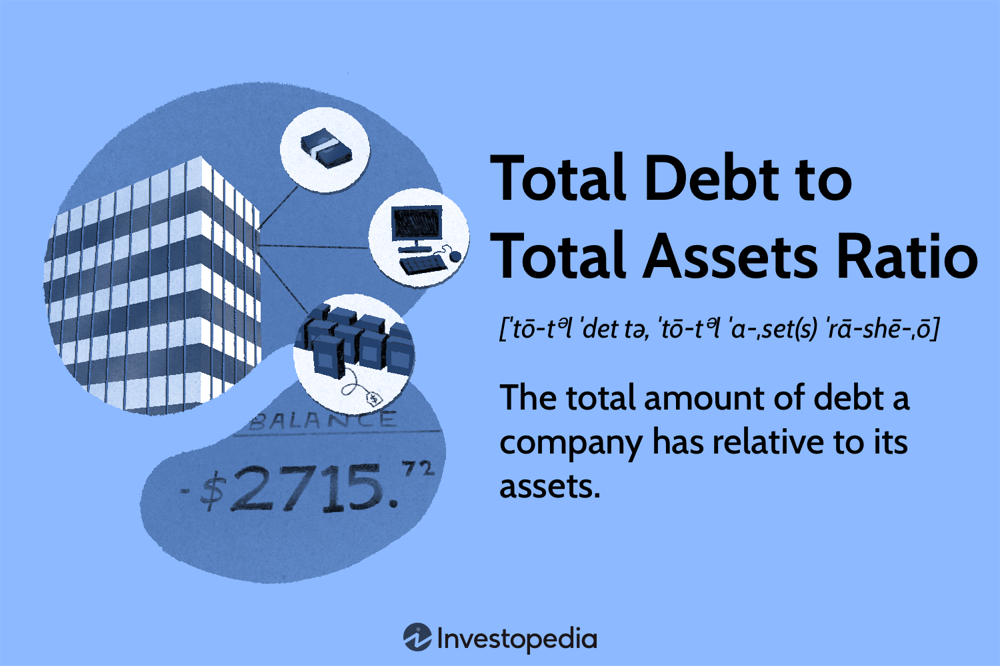

## Table of Contents

## What is the Total Debt-to-Assets Ratio?

The Total Debt-to-Assets Ratio is a financial metric that shows how much of a company's assets are funded by debt. It is calculated by dividing a company's total debt by its total assets. This ratio helps investors and analysts understand the level of financial risk a company is taking on. A higher ratio means more of the company's assets are financed by debt, which can be risky if the company struggles to pay back its loans.

This ratio is important because it gives a quick snapshot of a company's financial health. If the ratio is high, it might mean the company is using a lot of debt to grow, which could be dangerous if business conditions worsen. On the other hand, a low ratio might show that the company is more conservative with its financing, relying more on equity or retained earnings. By comparing this ratio over time or against other companies in the same industry, stakeholders can make better decisions about the company's financial stability and future prospects.

## How is the Total Debt-to-Assets Ratio calculated?

The Total Debt-to-Assets Ratio is calculated by dividing a company's total debt by its total assets. Total debt includes all the money the company owes, like loans and bonds. Total assets are everything the company owns, like buildings, equipment, and cash.

This ratio tells you what portion of the company's assets is paid for with borrowed money. If the ratio is 0.5, it means half of the company's assets are financed by debt. A higher ratio means the company relies more on debt, which can be riskier. A lower ratio means the company uses less debt, which might be safer but could also mean slower growth if the company isn't using debt to expand.

## Why is the Total Debt-to-Assets Ratio important for businesses?

The Total Debt-to-Assets Ratio is important for businesses because it shows how much of their stuff is paid for with borrowed money. If the ratio is high, it means the business is using a lot of loans to buy things like buildings or machines. This can be risky because if the business has trouble paying back the loans, it could get into big trouble. On the other hand, if the ratio is low, it means the business isn't relying too much on loans. This can be safer, but it might also mean the business isn't growing as fast as it could if it used more debt to expand.

This ratio helps business owners, investors, and bankers understand the financial health of a company. By looking at this number, they can see if a business is taking on too much risk or if it's being too cautious. Comparing this ratio over time or with other companies in the same industry can help them make better decisions. For example, if a business's Total Debt-to-Assets Ratio is much higher than others in its industry, it might be a sign that it's taking on too much debt and could face problems in the future.

## What does a high Total Debt-to-Assets Ratio indicate?

A high Total Debt-to-Assets Ratio means that a big part of a company's stuff is paid for with borrowed money. If the ratio is high, it shows that the company is using a lot of loans to buy things like buildings, machines, or to run its day-to-day operations. This can be risky because if the company has trouble paying back these loans, it could face big problems. It might struggle to keep up with payments, which could lead to financial trouble or even bankruptcy.

On the other hand, a high ratio might also mean that the company is trying to grow quickly. By using debt, the company can invest in new projects or expand its business faster than if it only used its own money. But this strategy comes with risks. If the new investments don't pay off as expected, the company could end up with a lot of debt and not enough money to pay it back. So, while a high Total Debt-to-Assets Ratio can be a sign of growth, it's also a warning sign that the company might be taking on too much risk.

## What does a low Total Debt-to-Assets Ratio indicate?

A low Total Debt-to-Assets Ratio means that a small part of a company's stuff is paid for with borrowed money. If the ratio is low, it shows that the company isn't using a lot of loans to buy things like buildings or machines. This can be safer because the company doesn't have to worry as much about paying back big loans. It means the company is relying more on its own money or money from investors to grow.

On the other hand, a low ratio might also mean that the company isn't growing as fast as it could. By not using debt, the company might be missing out on chances to invest in new projects or expand its business quickly. While being cautious with debt can be good, it might also mean the company is being too slow to take advantage of opportunities. So, a low Total Debt-to-Assets Ratio can be a sign of financial safety, but it might also mean the company is not taking enough risks to grow.

## How can the Total Debt-to-Assets Ratio be used by investors?

Investors can use the Total Debt-to-Assets Ratio to figure out how much risk a company is taking. If the ratio is high, it means the company is using a lot of borrowed money to buy things. This can be risky because if the company can't pay back its loans, it might get into big trouble. Investors might see a high ratio as a warning sign that the company could face financial problems in the future. They might decide to be careful about investing in a company with a high ratio or even avoid it altogether.

On the other hand, if the ratio is low, it means the company isn't using much borrowed money. This can be safer for investors because the company doesn't have a lot of debt to pay back. A low ratio might make investors feel more confident about the company's financial health. However, a very low ratio could also mean the company isn't growing as fast as it could. Investors might see this as a sign that the company is being too cautious and might miss out on opportunities to make more money. By comparing the Total Debt-to-Assets Ratio of different companies, investors can make better choices about where to put their money.

## What are the industry standards for the Total Debt-to-Assets Ratio?

Industry standards for the Total Debt-to-Assets Ratio can change a lot depending on the type of business. For example, industries like utilities and telecoms often have higher ratios because they need a lot of money to build things like power plants or networks. These businesses might have ratios around 0.5 or even higher, and that's seen as normal for them. On the other hand, industries like technology or retail might have lower ratios, around 0.3 or less, because they don't need as much money to start up and run their businesses.

It's important for investors and business owners to know what's normal for their industry when looking at the Total Debt-to-Assets Ratio. A ratio that's too high compared to other companies in the same industry might mean a business is taking on too much risk. But if a company's ratio is lower than the industry average, it might mean the company is being too careful and not growing as fast as it could. By understanding these industry standards, people can make better decisions about the financial health and future of a business.

## How does the Total Debt-to-Assets Ratio vary across different industries?

The Total Debt-to-Assets Ratio can be very different depending on the type of business. For example, industries like utilities and telecoms often have higher ratios because they need a lot of money to build things like power plants or networks. These businesses might have ratios around 0.5 or even higher, and that's seen as normal for them. On the other hand, industries like technology or retail might have lower ratios, around 0.3 or less, because they don't need as much money to start up and run their businesses.

Understanding these differences is important for investors and business owners. A high ratio in an industry where most companies have low ratios might mean a business is taking on too much risk. But if a company's ratio is lower than the industry average, it might mean the company is being too careful and not growing as fast as it could. By knowing what's normal for their industry, people can make better decisions about the financial health and future of a business.

## What are the limitations of using the Total Debt-to-Assets Ratio?

The Total Debt-to-Assets Ratio can be helpful, but it has some limitations. One big problem is that it doesn't tell you anything about when the debt needs to be paid back. Some debts might need to be paid back soon, while others might not be due for a long time. This makes a big difference in how risky the debt is, but the ratio doesn't show this. Also, the ratio doesn't take into account how well a company can pay back its debts. A company might have a high ratio but still have enough money coming in to easily pay its loans.

Another issue is that different industries have different normal levels for this ratio. What's a high ratio in one industry might be normal in another. If you don't know the industry standards, you might think a company is in trouble when it's actually doing fine. Also, the ratio doesn't tell you about the quality of the assets. Some assets might be easy to sell if the company needs money, while others might be hard to turn into cash. This can make a big difference in how safe the company's financial situation really is.

## How can a company improve its Total Debt-to-Assets Ratio?

A company can improve its Total Debt-to-Assets Ratio by paying off its debts. When a company pays back loans, the total debt goes down. This makes the ratio smaller because the debt part of the equation gets smaller while the assets stay the same or even grow. Another way to improve the ratio is by selling off assets that aren't needed anymore. If the company uses the money from selling these assets to pay down debt, the ratio will get better. Also, the company can try to make more money from its business so it can use that extra money to pay off debts faster.

Another way to improve the ratio is by being careful about taking on new debt. If a company can find other ways to grow, like using its own money or getting money from investors instead of borrowing, the ratio will stay low or even get better. Sometimes, a company can also talk to its lenders about changing the terms of its loans. If they can get a longer time to pay back the debt or lower interest rates, it can make it easier to pay off the debt and improve the ratio. By doing these things, a company can make its financial situation safer and show investors that it's managing its money well.

## What are the implications of changes in the Total Debt-to-Assets Ratio over time?

When a company's Total Debt-to-Assets Ratio changes over time, it can tell us a lot about its financial health. If the ratio goes up, it means the company is using more borrowed money to buy things. This could be because the company is trying to grow quickly or because it's having trouble making enough money to pay for things without borrowing. A rising ratio can be a warning sign that the company is taking on more risk. If the company can't pay back its loans, it might face big problems. Investors and bankers will watch this closely because it might make them worry about the company's future.

On the other hand, if the ratio goes down, it means the company is using less borrowed money. This could be because the company is paying off its debts or because it's making more money from its business and doesn't need to borrow as much. A falling ratio usually means the company is getting safer financially. It's less likely to have trouble paying back loans, which can make investors and bankers feel more confident about the company's future. But if the ratio goes down too much, it might also mean the company isn't growing as fast as it could. So, changes in the Total Debt-to-Assets Ratio over time can give important clues about a company's financial strategy and health.

## How does the Total Debt-to-Assets Ratio relate to other financial ratios like the Debt-to-Equity Ratio?

The Total Debt-to-Assets Ratio and the Debt-to-Equity Ratio are both used to understand a company's financial health, but they look at things a bit differently. The Total Debt-to-Assets Ratio tells you what part of a company's stuff is paid for with borrowed money. It's calculated by dividing the total debt by the total assets. This ratio shows how much risk the company is taking because it shows how much of its things are owned by others who loaned them money. On the other hand, the Debt-to-Equity Ratio compares the money the company borrowed to the money it got from its owners or investors. It's found by dividing total debt by total equity. This ratio tells you how the company is balancing the money it owes with the money it owns.

Both ratios help investors and business owners understand how a company is using debt to grow. A high Total Debt-to-Assets Ratio means a lot of the company's stuff is paid for with borrowed money, which can be risky if the company can't pay back its loans. A high Debt-to-Equity Ratio means the company is using a lot more borrowed money compared to the money from its owners. If both ratios are high, it might mean the company is taking on a lot of risk. But if both ratios are low, it might mean the company is being careful with debt, but it might also mean it's not growing as fast as it could. By looking at these ratios together, people can get a better picture of the company's financial strategy and health.

## What is the understanding of Debt Ratio?

The debt ratio, commonly referred to as the total debt-to-total assets ratio, serves as a pivotal metric in assessing a company's financial leverage. This ratio is calculated by dividing a company's total debt by its total assets:

$$
\text{Debt Ratio} = \frac{\text{Total Debt}}{\text{Total Assets}}
$$

This metric provides insights into the extent to which a company’s assets are financed through debt, reflecting on both financial risk and stability. A high debt ratio, typically more than 0.5, suggests that a significant portion of the company's assets are financed by liabilities, which can imply greater financial risk and potential solvency issues, particularly in times of economic [volatility](/wiki/volatility-trading-strategies). Conversely, a lower debt ratio indicates that a company relies less on borrowed capital, which is often perceived as a sign of financial robustness and lower risk.

For stakeholders, understanding the debt ratio is crucial in evaluating a company's fiscal health. In the context of investment, a high debt ratio might signal an aggressive growth strategy funded by borrowing, but it could also suggest a higher likelihood of default if the company faces downturns in cash flow or market conditions. Conversely, a company with a lower debt ratio may be seen as more conservative or prudent in its financial practices, potentially signaling steadier performance under economic strains.

By analyzing a company’s debt ratio, investors and financial analysts can gauge investment risk, make informed decisions on credit evaluations, and predict financial stability. It is an essential [factor](/wiki/factor-investing) when assessing investment opportunities, as it helps in identifying companies that maintain an optimal balance between debt and equity, ensuring sustainable growth and risk management.

## What is the relationship between Algorithmic Trading and Financial Metrics?

Algorithmic trading utilizes automated processes to execute trades based on predefined financial metrics, offering a systematic approach to trading activities. By employing quantitative data, these automated systems facilitate swift transactions, enhancing engagement in the marketplace. This method reduces human error and emotional biases, providing a more consistent and efficient way to capitalize on market opportunities.

Key performance metrics are instrumental in evaluating the effectiveness of trading strategies within the context of [algorithmic trading](/wiki/algorithmic-trading). The Sharpe Ratio, for example, is a popular metric that measures the risk-adjusted return of an investment portfolio. It is calculated as:

$$
\text{Sharpe Ratio} = \frac{R_p - R_f}{\sigma_p}
$$

where $R_p$ represents the portfolio return, $R_f$ is the risk-free rate, and $\sigma_p$ denotes the standard deviation of the portfolio's excess return. A higher Sharpe Ratio suggests a more favorable balance between risk and return.

Another critical metric is the Maximum Drawdown, which quantifies the largest peak-to-trough decline in the value of an investment portfolio before reaching a new peak. This metric is crucial for understanding the historical risks and potential losses that a strategy could encounter.

The Profit Factor, defined as the ratio of gross profits to gross losses, is utilized to assess the profitability of trading strategies. A Profit Factor greater than 1 indicates that trades are profitable on aggregate, with higher values denoting better performance.

By integrating these financial metrics into algorithmic trading systems, traders can refine their strategies to increase precision and profitability. The incorporation of such metrics enables traders to systematically evaluate and optimize strategies based on quantitative analysis. Consequently, this integration enhances the overall effectiveness of algorithmic trading, allowing traders to achieve superior returns while effectively managing risk.

## How can we evaluate algorithmic trading strategies?

Evaluating algorithmic trading strategies involves the analysis of several key performance metrics that help determine the strategy's effectiveness, risk management, and return optimization. Among these metrics, the Sharpe Ratio, Maximum Drawdown, Win Rate, and Profit Factor are crucial for providing comprehensive insights into trading strategies.

The **Sharpe Ratio** measures the risk-adjusted return of an investment. It is calculated by subtracting the risk-free rate from the strategy's average return and dividing by the standard deviation of the return. The formula is as follows:

$$

\text{Sharpe Ratio} = \frac{E[R] - R_f}{\sigma_R} 
$$

where $E[R]$ is the expected return, $R_f$ is the risk-free rate, and $\sigma_R$ is the standard deviation of the return. A higher Sharpe Ratio indicates better risk-adjusted performance.

**Maximum Drawdown** represents the largest peak-to-trough decline in the strategy's capital over a given period. This metric is critical for assessing the risk of potential losses and understanding the strategy's resilience under adverse conditions. It is defined as:

$$

\text{Maximum Drawdown} = \frac{\text{Trough Value} - \text{Peak Value}}{\text{Peak Value}}
$$

A lower maximum drawdown is desirable, indicating a strategy with lower risk exposure.

**Win Rate** is the ratio of profitable trades to total trades and is an indicator of the strategy's success rate. It is expressed as a percentage:

$$

\text{Win Rate} = \left( \frac{\text{Number of Winning Trades}}{\text{Total Number of Trades}} \right) \times 100 
$$

While a high win rate is positive, it should be evaluated alongside other metrics, as it does not account for the magnitude of wins and losses.

**Profit Factor** is calculated by dividing the total profit by the total loss generated by the trading strategy. It provides a clear picture of a strategy's overall profitability:

$$

\text{Profit Factor} = \frac{\text{Total Profit}}{\text{Total Loss}} 
$$

A profit factor greater than 1 indicates a profitable strategy, with higher values signifying more efficient trading.

Regular evaluation of these metrics ensures that trading strategies remain aligned with market conditions and investor expectations. Tools for performance evaluation include [backtesting](/wiki/backtesting) software and analytical platforms that simulate trading strategies over historical data, offering insights into potential future performance. Challenges faced in evaluation include overfitting, where a strategy performs well on historical data but poorly in live markets, and the dynamic nature of financial markets, which requires strategies to be adaptable.

Addressing these challenges involves continuous monitoring and adjustment of trading parameters, integrating [machine learning](/wiki/machine-learning) techniques for adaptive strategies, and employing robust risk management practices. By systematically evaluating and refining algorithmic trading strategies based on these key performance metrics, investors can enhance their ability to achieve optimal returns while managing associated risks.

## What is the conclusion?

Incorporating financial metrics such as the debt and assets ratios within algorithmic trading processes greatly enhances decision-making capabilities. By effectively understanding and applying these metrics, traders are better equipped to manage risks and seize opportunities within dynamic market environments.

The debt ratio, calculated as:

$$
\text{Debt Ratio} = \frac{\text{Total Debt}}{\text{Total Assets}}
$$

provides an indicator of financial leverage and risk. A higher debt ratio might signal increased risk, prompting strategies to mitigate potential disadvantages in volatile markets.

Conversely, the assets ratio helps assess a firm's efficiency in utilizing its resources to meet obligations. Having a balanced assets ratio reflects adept resource management, critical for maintaining market stability, thus influencing trading decisions in favor of sustained profitability.

Algorithmic trading, which relies on quantitative and data-driven analyses, benefits immensely from precise metric measurements. This integration allows traders to craft strategies that align closely with market movements and investor objectives. Furthermore, mastery of these metrics enables investors to strategically position themselves for optimal market engagement and improved returns.

As financial markets continue to evolve, continuous learning and adaptation remain crucial for investors aiming to maximize their algorithmic trading strategies. By continually refining their understanding of financial metrics, traders can enhance their strategic frameworks and elevate their success in the trading landscape.

## References & Further Reading

[1]: Bergstra, J., Bardenet, R., Bengio, Y., & Kégl, B. (2011). ["Algorithms for Hyper-Parameter Optimization."](https://papers.nips.cc/paper/4443-algorithms-for-hyper-parameter-optimization) Advances in Neural Information Processing Systems 24.

[2]: ["Advances in Financial Machine Learning"](https://www.amazon.com/Advances-Financial-Machine-Learning-Marcos/dp/1119482089) by Marcos Lopez de Prado

[3]: ["Evidence-Based Technical Analysis: Applying the Scientific Method and Statistical Inference to Trading Signals"](https://www.amazon.com/Evidence-Based-Technical-Analysis-Scientific-Statistical/dp/0470008741) by David Aronson

[4]: ["Machine Learning for Algorithmic Trading"](https://github.com/PacktPublishing/Machine-Learning-for-Algorithmic-Trading-Second-Edition) by Stefan Jansen

[5]: ["Quantitative Trading: How to Build Your Own Algorithmic Trading Business"](https://books.google.com/books/about/Quantitative_Trading.html?id=j70yEAAAQBAJ) by Ernest P. Chan