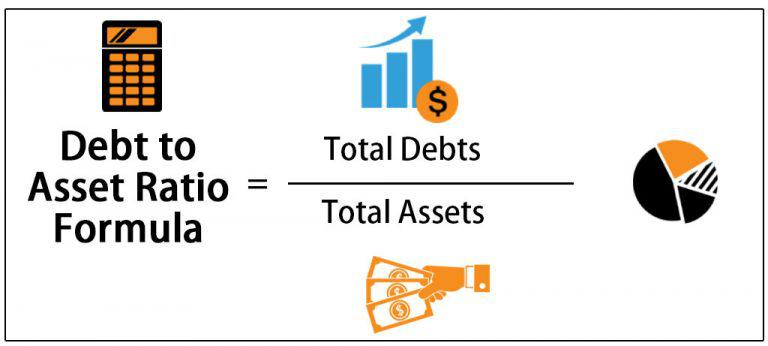

In finance, understanding financial metrics is vital for accurate analysis and strategic decision-making. Financial metrics are quantifiable measures used to assess the financial health of a company. Among these, the debt ratio and total assets ratio stand out as fundamental tools for both investors and traders. The debt ratio, a measure of financial leverage, indicates how much of a company’s assets are financed by debt. It serves as a proxy for financial risk, where a high ratio may suggest potential instability, particularly in fluctuating market conditions. On the other hand, the total assets ratio provides insight into a company’s ability to cover its liabilities with its assets, reflecting its overall financial sustainability.

In recent years, the integration of these financial metrics into algorithmic trading has transformed investment approaches. Algorithmic trading, which utilizes automated systems to execute trades based on predefined criteria, benefits significantly from the precision offered by these metrics. By incorporating metrics like the debt ratio into trading algorithms, traders can execute transactions more efficiently, capitalize on opportunities promptly, and manage risks effectively.



For investors and traders, mastering these essential financial metrics not only aids in interpreting a company's fiscal well-being but also helps in anticipating market movements and making informed trading decisions. This article aims to provide a comprehensive overview of these metrics, illustrating their functions and demonstrating their influence on algorithmic trading strategies. Through thoughtful application, these tools can enhance decision-making processes and optimize trading outcomes within the ever-evolving financial markets.

## Table of Contents

## Understanding Debt Ratio

The debt ratio, commonly referred to as the total debt-to-total assets ratio, serves as a pivotal metric in assessing a company's financial leverage. This ratio is calculated by dividing a company's total debt by its total assets:

$$
\text{Debt Ratio} = \frac{\text{Total Debt}}{\text{Total Assets}}
$$

This metric provides insights into the extent to which a company’s assets are financed through debt, reflecting on both financial risk and stability. A high debt ratio, typically more than 0.5, suggests that a significant portion of the company's assets are financed by liabilities, which can imply greater financial risk and potential solvency issues, particularly in times of economic [volatility](/wiki/volatility-trading-strategies). Conversely, a lower debt ratio indicates that a company relies less on borrowed capital, which is often perceived as a sign of financial robustness and lower risk.

For stakeholders, understanding the debt ratio is crucial in evaluating a company's fiscal health. In the context of investment, a high debt ratio might signal an aggressive growth strategy funded by borrowing, but it could also suggest a higher likelihood of default if the company faces downturns in cash flow or market conditions. Conversely, a company with a lower debt ratio may be seen as more conservative or prudent in its financial practices, potentially signaling steadier performance under economic strains.

By analyzing a company’s debt ratio, investors and financial analysts can gauge investment risk, make informed decisions on credit evaluations, and predict financial stability. It is an essential [factor](/wiki/factor-investing) when assessing investment opportunities, as it helps in identifying companies that maintain an optimal balance between debt and equity, ensuring sustainable growth and risk management.

## Analyzing Financial Metrics in Trading

Financial metrics play a crucial role in trading by offering insights into a company's operational performance and potential for investment. These metrics provide traders with quantifiable data that inform strategic decisions, enabling them to craft trading strategies that aim to maximize returns while mitigating risks. Typically, financial metrics include indicators such as earnings per share (EPS), price-to-earnings ratio (P/E), return on equity (ROE), and debt-to-equity ratio (D/E), among others.

In the context of trading strategies, these metrics assist traders in assessing a company's value and potential growth against its peers. For example, a trader analyzing a company's P/E ratio may compare it with industry standards to determine if a stock is undervalued or overvalued. A P/E ratio lower than the industry average might indicate a potentially undervalued stock, presenting a buying opportunity, whereas a higher P/E ratio could signal caution or the need for further analysis.

Furthermore, metrics such as ROE and ROA (Return on Assets) provide insights into how effectively a company uses its equity and assets to generate profits. Elevated ROE values might suggest efficient use of investor funds, driving positive sentiment and investment viability.

Traders often employ these assessments in conjunction with technical analysis, utilizing software platforms and algorithms to scrutinize large datasets. The integration of financial metrics with algorithmic models enhances predictive accuracy. For instance, a basic Python script could be used to calculate and compare financial ratios:

```python
def calculate_pe_ratio(market_price, earnings_per_share):
    return market_price / earnings_per_share

def compare_to_industry_average(company_ratio, industry_average):
    if company_ratio < industry_average:
        return "Undervalued"
    elif company_ratio > industry_average:
        return "Overvalued"
    else:
        return "Fairly valued"
```

By employing such scripts and models, traders can swiftly assess numerous companies, drawing strategic insights from these metrics to inform buying or selling decisions. Ultimately, the comparative analysis of financial metrics not only unveils growth opportunities but also highlights areas where caution is warranted, enabling traders to navigate markets with greater precision.

## The Role of Assets Ratio in Financial Analysis

The assets ratio, a measure crucial in financial analysis, evaluates a firm's ability to meet its obligations using its total assets and total liabilities. This metric, often represented as $\text{Assets Ratio} = \frac{\text{Total Assets}}{\text{Total Liabilities}}$, provides a quantitative assessment of a company's control over its resources and financial obligations. A balanced assets ratio suggests proficient resource management, which is essential for consistent market performance and financial stability.

When the assets ratio is significantly above one, it typically signifies that a company has more assets than liabilities, reflecting a company well-positioned to manage its debts and continue operations without relying excessively on external financing. This can indicate strong financial health, appealing to investors seeking stable opportunities. Conversely, an assets ratio below one may raise concerns about the company's ability to fulfill its financial obligations, potentially implying financial distress or the need for strategic reassessment.

For investors, the assets ratio serves as a vital tool to examine asset utilization efficiency. By understanding how effectively a company utilizes its assets to generate earnings and manage liabilities, investors can make informed decisions. An efficiently managed assets ratio not only reflects the company's operational effectiveness but also its strategic foresight in resource allocation, ultimately guiding trading decisions towards more promising investments. In summary, the assets ratio is a key metric in assessing a firm's financial capability and in assisting investors to navigate and capitalize on market opportunities.

## Algorithmic Trading and Financial Metrics

Algorithmic trading utilizes automated processes to execute trades based on predefined financial metrics, offering a systematic approach to trading activities. By employing quantitative data, these automated systems facilitate swift transactions, enhancing engagement in the marketplace. This method reduces human error and emotional biases, providing a more consistent and efficient way to capitalize on market opportunities.

Key performance metrics are instrumental in evaluating the effectiveness of trading strategies within the context of [algorithmic trading](/wiki/algorithmic-trading). The Sharpe Ratio, for example, is a popular metric that measures the risk-adjusted return of an investment portfolio. It is calculated as:

$$
\text{Sharpe Ratio} = \frac{R_p - R_f}{\sigma_p}
$$

where $R_p$ represents the portfolio return, $R_f$ is the risk-free rate, and $\sigma_p$ denotes the standard deviation of the portfolio's excess return. A higher Sharpe Ratio suggests a more favorable balance between risk and return.

Another critical metric is the Maximum Drawdown, which quantifies the largest peak-to-trough decline in the value of an investment portfolio before reaching a new peak. This metric is crucial for understanding the historical risks and potential losses that a strategy could encounter.

The Profit Factor, defined as the ratio of gross profits to gross losses, is utilized to assess the profitability of trading strategies. A Profit Factor greater than 1 indicates that trades are profitable on aggregate, with higher values denoting better performance.

By integrating these financial metrics into algorithmic trading systems, traders can refine their strategies to increase precision and profitability. The incorporation of such metrics enables traders to systematically evaluate and optimize strategies based on quantitative analysis. Consequently, this integration enhances the overall effectiveness of algorithmic trading, allowing traders to achieve superior returns while effectively managing risk.

## Evaluating Algorithmic Trading Strategies

Evaluating algorithmic trading strategies involves the analysis of several key performance metrics that help determine the strategy's effectiveness, risk management, and return optimization. Among these metrics, the Sharpe Ratio, Maximum Drawdown, Win Rate, and Profit Factor are crucial for providing comprehensive insights into trading strategies.

The **Sharpe Ratio** measures the risk-adjusted return of an investment. It is calculated by subtracting the risk-free rate from the strategy's average return and dividing by the standard deviation of the return. The formula is as follows:

$$

\text{Sharpe Ratio} = \frac{E[R] - R_f}{\sigma_R} 
$$

where $E[R]$ is the expected return, $R_f$ is the risk-free rate, and $\sigma_R$ is the standard deviation of the return. A higher Sharpe Ratio indicates better risk-adjusted performance.

**Maximum Drawdown** represents the largest peak-to-trough decline in the strategy's capital over a given period. This metric is critical for assessing the risk of potential losses and understanding the strategy's resilience under adverse conditions. It is defined as:

$$

\text{Maximum Drawdown} = \frac{\text{Trough Value} - \text{Peak Value}}{\text{Peak Value}}
$$

A lower maximum drawdown is desirable, indicating a strategy with lower risk exposure.

**Win Rate** is the ratio of profitable trades to total trades and is an indicator of the strategy's success rate. It is expressed as a percentage:

$$

\text{Win Rate} = \left( \frac{\text{Number of Winning Trades}}{\text{Total Number of Trades}} \right) \times 100 
$$

While a high win rate is positive, it should be evaluated alongside other metrics, as it does not account for the magnitude of wins and losses.

**Profit Factor** is calculated by dividing the total profit by the total loss generated by the trading strategy. It provides a clear picture of a strategy's overall profitability:

$$

\text{Profit Factor} = \frac{\text{Total Profit}}{\text{Total Loss}} 
$$

A profit factor greater than 1 indicates a profitable strategy, with higher values signifying more efficient trading.

Regular evaluation of these metrics ensures that trading strategies remain aligned with market conditions and investor expectations. Tools for performance evaluation include [backtesting](/wiki/backtesting) software and analytical platforms that simulate trading strategies over historical data, offering insights into potential future performance. Challenges faced in evaluation include overfitting, where a strategy performs well on historical data but poorly in live markets, and the dynamic nature of financial markets, which requires strategies to be adaptable.

Addressing these challenges involves continuous monitoring and adjustment of trading parameters, integrating [machine learning](/wiki/machine-learning) techniques for adaptive strategies, and employing robust risk management practices. By systematically evaluating and refining algorithmic trading strategies based on these key performance metrics, investors can enhance their ability to achieve optimal returns while managing associated risks.

## Conclusion

Incorporating financial metrics such as the debt and assets ratios within algorithmic trading processes greatly enhances decision-making capabilities. By effectively understanding and applying these metrics, traders are better equipped to manage risks and seize opportunities within dynamic market environments.

The debt ratio, calculated as:

$$
\text{Debt Ratio} = \frac{\text{Total Debt}}{\text{Total Assets}}
$$

provides an indicator of financial leverage and risk. A higher debt ratio might signal increased risk, prompting strategies to mitigate potential disadvantages in volatile markets.

Conversely, the assets ratio helps assess a firm's efficiency in utilizing its resources to meet obligations. Having a balanced assets ratio reflects adept resource management, critical for maintaining market stability, thus influencing trading decisions in favor of sustained profitability.

Algorithmic trading, which relies on quantitative and data-driven analyses, benefits immensely from precise metric measurements. This integration allows traders to craft strategies that align closely with market movements and investor objectives. Furthermore, mastery of these metrics enables investors to strategically position themselves for optimal market engagement and improved returns.

As financial markets continue to evolve, continuous learning and adaptation remain crucial for investors aiming to maximize their algorithmic trading strategies. By continually refining their understanding of financial metrics, traders can enhance their strategic frameworks and elevate their success in the trading landscape.

## References & Further Reading

[1]: Bergstra, J., Bardenet, R., Bengio, Y., & Kégl, B. (2011). ["Algorithms for Hyper-Parameter Optimization."](https://papers.nips.cc/paper/4443-algorithms-for-hyper-parameter-optimization) Advances in Neural Information Processing Systems 24.

[2]: ["Advances in Financial Machine Learning"](https://www.amazon.com/Advances-Financial-Machine-Learning-Marcos/dp/1119482089) by Marcos Lopez de Prado

[3]: ["Evidence-Based Technical Analysis: Applying the Scientific Method and Statistical Inference to Trading Signals"](https://www.amazon.com/Evidence-Based-Technical-Analysis-Scientific-Statistical/dp/0470008741) by David Aronson

[4]: ["Machine Learning for Algorithmic Trading"](https://github.com/PacktPublishing/Machine-Learning-for-Algorithmic-Trading-Second-Edition) by Stefan Jansen

[5]: ["Quantitative Trading: How to Build Your Own Algorithmic Trading Business"](https://books.google.com/books/about/Quantitative_Trading.html?id=j70yEAAAQBAJ) by Ernest P. Chan