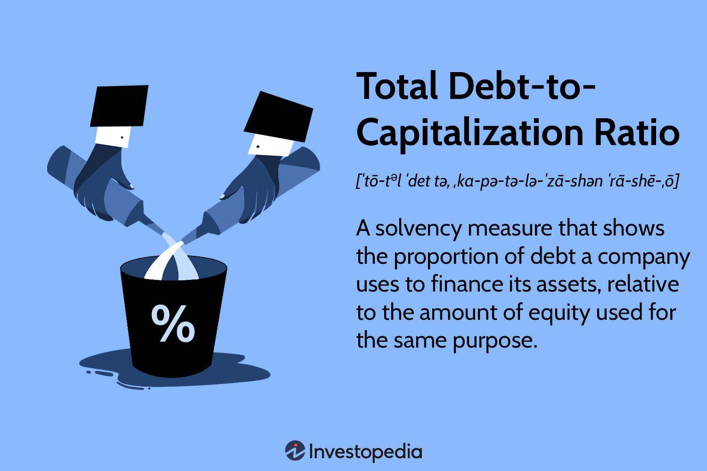

## Table of Contents

## What is the Total Debt-to-Capitalization Ratio?

The Total Debt-to-Capitalization Ratio is a financial metric that shows how much a company relies on debt to fund its operations compared to its total capital. It is calculated by dividing a company's total debt by its total capitalization, which is the sum of its total debt and total equity. This ratio helps investors and analysts understand the company's financial structure and risk level. A higher ratio means the company uses more debt, which can be riskier because it has to pay back the debt with interest.

This ratio is important because it gives a quick snapshot of a company's financial health. If the ratio is high, it might mean the company could struggle to pay its debts if its earnings drop. On the other hand, a lower ratio suggests the company is less dependent on borrowed money and might be in a stronger financial position. Investors often look at this ratio to decide if they want to invest in a company, as it helps them gauge the level of financial risk involved.

## Why is the Total Debt-to-Capitalization Ratio important?

The Total Debt-to-Capitalization Ratio is important because it tells us how much a company uses borrowed money compared to its own money. This ratio helps people who might want to invest in the company or lend it money to understand if the company is taking on too much risk. If a company has a high ratio, it means it relies a lot on debt, which can be risky because the company needs to pay back that debt with interest. On the other hand, a low ratio shows that the company uses more of its own money and less borrowed money, which can make it seem safer to investors.

This ratio is a key part of understanding a company's financial health. It gives a quick look at how the company is balancing its use of debt and equity. If the ratio is high, it might mean the company could have trouble paying its debts if its earnings go down. But if the ratio is low, it suggests the company is in a stronger financial position and less likely to face problems with debt repayment. Investors and analysts use this ratio to make decisions about whether to invest in or lend money to a company, helping them gauge the level of financial risk involved.

## How is the Total Debt-to-Capitalization Ratio calculated?

The Total Debt-to-Capitalization Ratio is calculated by dividing a company's total debt by its total capitalization. Total debt includes all the money the company owes, like loans and bonds. Total capitalization is the sum of the company's total debt and its total equity, which is the value of the shares owned by shareholders.

To find this ratio, you first add up all the debt the company has. Then, you add this debt to the company's total equity to get the total capitalization. After that, you divide the total debt by the total capitalization. The result is a number that shows what percentage of the company's funding comes from debt. A higher number means the company uses more debt, while a lower number means it uses more equity.

## What does a high Total Debt-to-Capitalization Ratio indicate?

A high Total Debt-to-Capitalization Ratio means that a company is using a lot of borrowed money to run its business. This can be risky because the company has to pay back this money, plus interest. If the company's earnings drop, it might struggle to make these payments, which could lead to financial trouble.

On the other hand, using a lot of debt can also help a company grow faster if it uses the borrowed money wisely. But it's a balancing act. Investors and lenders often see a high ratio as a sign of higher risk, which might make them think twice before investing or lending more money to the company.

## What does a low Total Debt-to-Capitalization Ratio suggest?

A low Total Debt-to-Capitalization Ratio means a company is not using much borrowed money. Instead, it is relying more on its own money, which comes from the owners or shareholders. This can make the company seem safer to investors and lenders because it doesn't have a lot of debt to pay back.

Having less debt can be good because it means the company has less risk of running into money problems if its earnings go down. It might grow more slowly than a company with a lot of debt, but it's often seen as more stable and less risky. This can make it more attractive to people who want to invest in or lend money to the company.

## How does the Total Debt-to-Capitalization Ratio differ from the Debt-to-Equity Ratio?

The Total Debt-to-Capitalization Ratio and the Debt-to-Equity Ratio are both used to understand how a company uses debt compared to its own money. The Total Debt-to-Capitalization Ratio looks at a company's total debt as a part of its total funding, which includes both debt and equity. To find this ratio, you divide the total debt by the total debt plus total equity. This gives you a number that shows what percentage of the company's funding comes from debt.

The Debt-to-Equity Ratio, on the other hand, focuses just on how much debt the company has compared to its equity. You find this ratio by dividing the total debt by the total equity. This ratio tells you how much the company relies on borrowed money for every dollar of its own money. Both ratios help investors and lenders see if a company is using too much debt, but they look at it in slightly different ways. The Total Debt-to-Capitalization Ratio gives a broader view of the company's financial structure, while the Debt-to-Equity Ratio is more specific about the balance between debt and equity.

## What are the industry standards for the Total Debt-to-Capitalization Ratio?

Industry standards for the Total Debt-to-Capitalization Ratio can vary a lot depending on the type of business. Some industries, like utilities or telecoms, often have higher ratios because they need a lot of money to build and maintain their big projects. These companies might have ratios around 50% or even higher, and that's seen as normal for them. On the other hand, industries like technology or retail might have lower ratios, usually below 30%, because they don't need as much money to run their businesses.

What's considered a good or bad Total Debt-to-Capitalization Ratio also depends on the economy and how easy it is to borrow money at the time. During good economic times, companies might take on more debt because it's cheaper and easier to get loans. But in tough economic times, a high ratio can be risky because it might be harder for the company to pay back its debts if things go wrong. So, it's important to look at the ratio in the context of the industry and the current economic situation.

## How can a company improve its Total Debt-to-Capitalization Ratio?

A company can improve its Total Debt-to-Capitalization Ratio by paying off its debts. When a company pays down its loans, the total amount of debt goes down. This makes the ratio smaller because the total debt is a smaller part of the company's total funding. The company can use its profits to pay off debt, or it might sell some of its assets to get the money needed to reduce the debt. Another way is to not take on new debt and focus on growing the business with the money it already has.

Another way to improve the ratio is by increasing the company's equity. This can be done by selling more shares to investors, which brings in more money without increasing the debt. When the company has more equity, the total capitalization goes up, and since the debt stays the same or goes down, the ratio gets smaller. The company might also keep its profits instead of paying them out as dividends, which adds to the equity and helps improve the ratio. Both of these methods help make the company's financial structure look healthier and less risky to investors and lenders.

## What are the limitations of using the Total Debt-to-Capitalization Ratio as a financial metric?

The Total Debt-to-Capitalization Ratio is a helpful tool, but it has some limits. One big limit is that it doesn't tell you about the types of debt a company has. Some debts might have low interest rates and be easy to pay back, while others might have high interest rates and be riskier. This ratio treats all debt the same, so it might not give you a full picture of how risky the company's debt really is.

Another limit is that this ratio doesn't consider how well the company is doing in other ways. A company might have a high debt ratio but still be making a lot of money and growing quickly. Or, a company might have a low debt ratio but not be doing well at all. So, looking at this ratio alone might not tell you everything you need to know about a company's financial health. It's important to use it along with other financial metrics to get a better understanding of the company's situation.

## How does the Total Debt-to-Capitalization Ratio impact a company's credit rating?

The Total Debt-to-Capitalization Ratio can affect a company's credit rating because it shows how much the company relies on borrowed money. If a company has a high ratio, it means it uses a lot of debt to run its business. This can make lenders and credit rating agencies worried because it might be harder for the company to pay back its debts if things go wrong. So, a high ratio might lead to a lower credit rating, which means the company could have to pay more interest on new loans or might find it harder to get new loans at all.

On the other hand, a low Total Debt-to-Capitalization Ratio can make a company look safer to lenders and credit rating agencies. If the company doesn't rely too much on debt, it's seen as less risky because it has less debt to pay back. This can lead to a higher credit rating, which can help the company get better loan terms and lower interest rates. So, the ratio is an important part of how credit rating agencies decide a company's credit rating.

## Can the Total Debt-to-Capitalization Ratio be used to compare companies across different industries?

The Total Debt-to-Capitalization Ratio can be used to compare companies, but it's not always fair to compare companies from different industries. Different industries have different ways of working and different needs for money. For example, a company in the utility industry might need a lot of money to build power plants and might use a lot of debt, so its Total Debt-to-Capitalization Ratio might be high. But that's normal for that industry. On the other hand, a tech company might not need as much money to run its business and might have a lower ratio. So, if you compare these two companies just by looking at their ratios, it might seem like the tech company is safer, but that might not be true when you think about the different needs of their industries.

To make a fair comparison, you need to look at the average Total Debt-to-Capitalization Ratio for each industry. If you know what's normal for each industry, you can see if a company's ratio is high or low compared to others in its industry. This way, you can get a better idea of how much debt a company is using compared to its peers. But even then, it's important to use other financial metrics too, because the ratio by itself might not tell the whole story about a company's financial health.

## What advanced financial strategies can be employed to optimize the Total Debt-to-Capitalization Ratio?

To optimize the Total Debt-to-Capitalization Ratio, a company can use several advanced financial strategies. One strategy is debt restructuring, where the company might negotiate with lenders to change the terms of its existing debt. This can mean getting lower interest rates or longer repayment periods, which makes the debt easier to handle and can lower the ratio. Another strategy is to use financial instruments like convertible bonds. These are bonds that can be turned into shares of the company's stock. By issuing convertible bonds, the company can raise money without immediately increasing its debt, because if the bonds are converted, they become equity instead.

Another approach is to engage in sale-leaseback transactions. In this strategy, the company sells some of its assets, like buildings or equipment, to another company and then leases them back. This brings in money that can be used to pay down debt, which lowers the Total Debt-to-Capitalization Ratio. Additionally, a company might use off-balance-sheet financing, where it creates a separate company to take on debt. This debt doesn't show up on the main company's balance sheet, so it doesn't affect the ratio directly. However, this strategy can be risky and needs to be used carefully to avoid future financial problems.

## What is the Debt-to-Capitalization Ratio and how can it be understood?

The debt-to-capitalization ratio is a key financial metric used to assess a company's financial leverage and capital structure. It measures the proportion of debt in comparison to the total capitalization, which includes both shareholder equity and debt. The formula for calculating the debt-to-capitalization ratio is:

$$
\text{Debt-to-Capitalization Ratio} = \frac{\text{Total Debt}}{\text{Total Debt} + \text{Shareholders' Equity}}
$$

This ratio offers valuable insights into a company's financial structure and its reliance on debt financing. A higher debt-to-capitalization ratio suggests that a company is more heavily financed by debt, which may indicate elevated financial risk. Companies with higher ratios are often more vulnerable to economic downturns, as debt obligations remain fixed regardless of business performance.

For example, if a company has a total debt of $500 million and shareholders' equity of $500 million, its debt-to-capitalization ratio would be:

$$
\text{Debt-to-Capitalization Ratio} = \frac{500}{500 + 500} = 0.5 \text{ or } 50\%
$$

This implies that 50% of the company's capital structure is financed through debt. Investors and analysts use this ratio to determine the risk associated with a company's financial strategy, especially in capital-intensive industries where higher debt levels may be common. Understanding the nuances of the debt-to-capitalization ratio helps stakeholders make informed decisions about investment potentials and the financial resilience of a business.

## References & Further Reading

For a more comprehensive understanding of the debt-to-capitalization ratio and its application in corporate finance, it is advisable to explore foundational texts such as "Principles of Corporate Finance" by Richard A. Brealey, Stewart C. Myers, and Franklin Allen. This resource offers detailed explanations on the mechanics and implications of financial ratios, including capitalization ratios, which play a significant role in assessing company leverage and risk.

In the field of algorithmic trading, "Algorithmic Trading and DMA: An Introduction to Direct Access Trading Strategies" by Barry Johnson provides keen insights into how financial metrics can be integrated into trading models. This work covers the fundamental concepts of algorithmic trading and introduces the use of financial ratios to inform algorithmic decisions and enhance trading strategies.

For practical insights and case studies, consider reading "Financial Modeling" by Simon Benninga. This book provides real-world examples and elaborates on how financial modeling, including the application of key financial ratios, is used to conduct in-depth financial analysis. These case studies help illustrate the challenges faced by companies with high debt-to-capitalization ratios and the strategies they employ to mitigate risk.

Additionally, research articles and papers published in journals such as the "Journal of Finance" or the "Journal of Financial Economics" often include empirical studies and analyses on financial metrics and algorithmic trading, offering a wealth of knowledge and case-specific insights. These resources contribute significantly to understanding how theoretical concepts are applied in practice.

