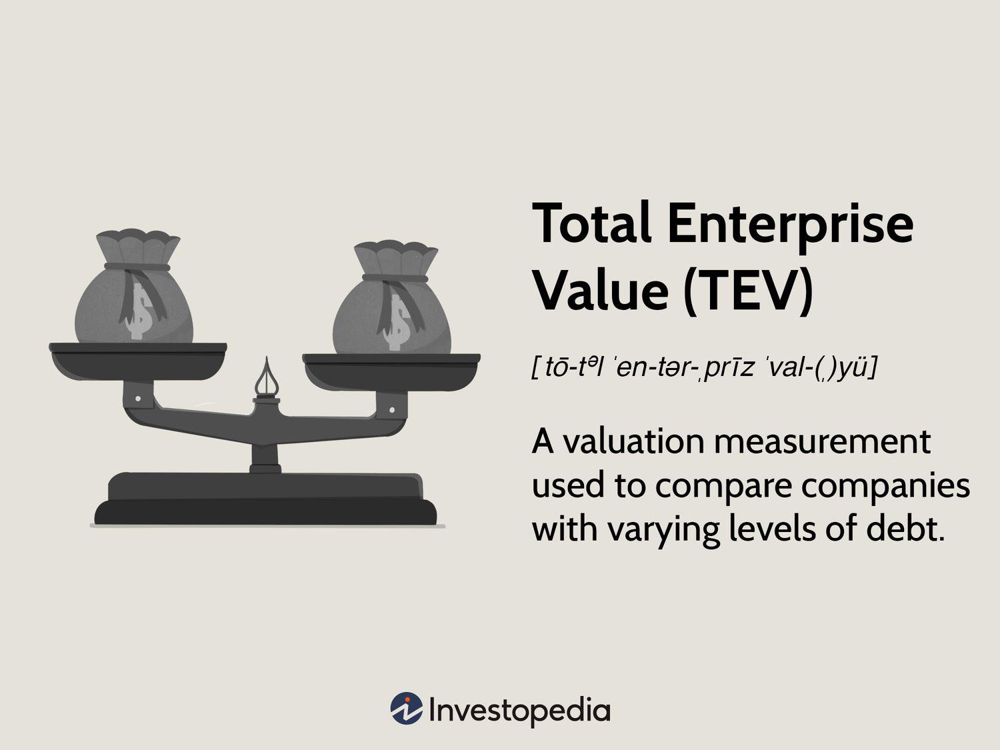

Understanding the intrinsic value of a business is crucial in today's competitive marketplace. Determining this value accurately helps investors, stakeholders, and analysts make informed decisions about investments, acquisitions, and strategic directions. Business valuation methods offer frameworks to estimate a company's worth, with Total Enterprise Value (TEV) being a notable metric. TEV provides a comprehensive measure by incorporating both equity and debt while subtracting cash and cash equivalents, allowing for a more thorough evaluation than market capitalization alone.

In recent years, algorithmic trading platforms have increasingly utilized valuation metrics like TEV in their trading strategies. Algorithmic trading, which relies on pre-programmed instructions for executing trades at high speeds, benefits from precise and robust financial metrics. By integrating TEV into their systems, these platforms can identify potentially undervalued or overvalued stocks, thus generating trading signals and facilitating profitable opportunities.



This article examines the relationship between enterprise valuation and algorithmic trading, emphasizing the role and calculation of Total Enterprise Value. Through this exploration, we aim to highlight the significance of TEV in refining trading algorithms and informing broader business strategic decision-making processes.

## Table of Contents

## What is Business Valuation?

Business valuation is the analytical process of determining a company's economic value, which is essential for various financial and strategic applications. Accurate valuations serve as a basis for making informed decisions in mergers, acquisitions, investments, and other strategic business undertakings.

The process of business valuation encompasses multiple methodologies, each offering unique perspectives and applicable in different scenarios. The three primary categories of business valuation methods are market-based, income-based, and asset-based approaches.

1. **Market-Based Approaches**: This category relies on comparing the subject company to similar companies in the marketplace. The most common method under this approach is the Comparable Company Analysis (CCA), which involves evaluating the financial metrics of peer companies to determine an appropriate valuation multiple. This multiple is then applied to the subject company's corresponding financial metrics to estimate its value. Market-based approaches are particularly useful when there is ample market data available on similar companies.

2. **Income-Based Approaches**: These approaches assess a company's value based on its ability to generate future income. The Discounted Cash Flow (DCF) method is widely used within this category. It involves projecting the company’s future cash flows and discounting them to their present value using an appropriate discount rate, often the company's weighted average cost of capital (WACC). The DCF formula is represented as:
$$
   \text{DCF} = \sum \frac{CF_t}{(1 + r)^t}

$$
   where $CF_t$ is the cash flow at time $t$, and $r$ is the discount rate. The income-based approach is favored for its focus on fundamental financial performance and potential future growth.

3. **Asset-Based Approaches**: This method estimates the value of a company based on the total value of its tangible and intangible assets. The Net Asset Value (NAV) calculation is a common form of asset-based valuation, determined by subtracting total liabilities from total assets. This approach is most applicable for companies with significant tangible asset holdings, such as real estate or manufacturing businesses.

Business valuation is a pivotal component of mergers and acquisitions (M&A), enabling parties to negotiate fair prices and assess the strategic fit of a target company. Furthermore, it informs investment decisions, guides tax assessments, and impacts legal proceedings such as bankruptcy.

Overall, business valuation provides insights into the intrinsic value of a company, helping stakeholders make coherent and strategic business decisions aligned with economic realities.

## Understanding Total Enterprise Value (TEV)

Total Enterprise Value (TEV) serves as a comprehensive metric for gauging a company's overall worth, encompassing more variables than market capitalization alone. TEV takes into account not only the equity value of a company but also the market value of its debt, providing a clearer perspective on its financial health and investment viability. This metric accounts for both cash and cash equivalents, subtracting them from the combined equity and debt values, thus reflecting the actual cost of acquiring the entire enterprise.

The formula for calculating TEV is expressed as:

$$
\text{TEV} = \text{Market Capitalization} + \text{Total Debt} - \text{Cash and Cash Equivalents}
$$

The inclusion of the market value of debt in the calculation marks a critical distinction from market capitalization, which solely represents the market value of equity. By considering debt levels, TEV offers a more nuanced view of a company’s financial obligations and [liquidity](/wiki/liquidity-risk-premium) position. For example, two companies with identical market capitalizations may present vastly different TEVs if one has significant debt or substantial cash reserves compared to the other. 

This comprehensive approach makes TEV a more robust metric for evaluating a company's financial structure, especially when comparing companies across sectors with varying capital structures. TEV has become instrumental for investors and analysts seeking a holistic measurement of corporate value beyond market capitalization.

## Calculating Total Enterprise Value (TEV)

Total Enterprise Value (TEV) is a crucial metric in business valuation, offering a comprehensive view of a company's overall worth. Calculating TEV involves summing the market capitalization (the total market value of a company's outstanding shares) with its total debt and then subtracting cash and cash equivalents. This calculation is expressed in the formula:

$$

\text{TEV} = \text{Market Capitalization} + \text{Total Debt} - \text{Cash and Cash Equivalents} 
$$

An important consideration in this calculation is the inclusion of preferred stock. Preferred stock possesses characteristics of both equity and debt, which is why it is often added to the calculation of TEV. This inclusion acknowledges its unique financing nature and its impact on a company's valuation.

TEV serves as a more standardized measure across companies with diverse capital structures. This standardization is crucial because companies may have varying levels of debt and cash. By factoring in both, TEV provides a normalized valuation metric that enhances comparability. For instance, two companies with the same market capitalization might have different debt levels and cash reserves. TEV accounts for these differences, yielding a more accurate picture of each company's true economic value.

In practice, calculation of TEV can be automated using programming languages such as Python. The following Python snippet demonstrates how TEV might be computed given hypothetical inputs:

```python
def calculate_tev(market_cap, total_debt, cash_equivalents, preferred_stock=0):
    tev = market_cap + total_debt + preferred_stock - cash_equivalents
    return tev

# Example usage:
market_capitalization = 500000000  # Example: $500 million
total_debt = 200000000  # Example: $200 million
cash_and_equivalents = 100000000  # Example: $100 million
preferred_stock = 50000000  # Example: $50 million

tev = calculate_tev(market_capitalization, total_debt, cash_and_equivalents, preferred_stock)
print(f"Total Enterprise Value (TEV): ${tev}")
```

Here, the function `calculate_tev()` computes the TEV based on input values for market capitalization, total debt, cash, and optionally, preferred stock. Adjusting these values allows businesses and investors to gauge TEV under different financial scenarios, reinforcing its role as a key tool in valuation analysis.

## TEV vs. Market Capitalization

Market capitalization is a widely recognized metric that measures a company's equity value. It is calculated by multiplying the current stock price by the total number of outstanding shares. This figure provides a snapshot of how the market perceives a company's value at a given point. However, it solely considers equity and omits significant financial information, such as the levels of debt and cash, which are crucial components in understanding a company's financial health and operational scale.

Market capitalization can be particularly misleading in situations where companies have varying capital structures. A company with a high level of debt, for instance, might appear undervalued if one evaluates solely based on market cap. This is because the debt obligations that the company needs to meet are not visible in this metric. Similarly, a company with substantial cash reserves might seem comparably valued to a competitor with lesser cash, even though the former is in a healthier financial position. 

Total Enterprise Value (TEV) fills in these gaps by offering a more comprehensive evaluation. TEV is computed as follows:

$$
\text{TEV} = \text{Market Capitalization} + \text{Total Debt} - \text{Cash}
$$

This calculation includes all the interests held in a company (equity holders and debt holders) and subtracts the cash that could potentially be used to pay down debt. By factoring in debt, TEV acknowledges the obligation aspect of capital structure, and by deducting cash, it recognizes the liquidity available to the business.

TEV is particularly valuable when comparing companies across different industries or geographic regions, where there may be diverse capital structures and varying levels of leverage. It provides a neutral basis that normalizes these factors, allowing investors to make more informed comparisons between companies with different financial architectures. This normalized view gives TEV its reputation as a superior metric for assessing a company's value comprehensively. 

In summary, while market capitalization offers a quick and accessible measure of a company's equity value, TEV provides a deeper insight by incorporating both the company's debts and available cash. This makes TEV invaluable for investors and analysts seeking to understand the true economic value of a company beyond its market impression.

## The Role of TEV in Algorithmic Trading

Total Enterprise Value (TEV) plays a significant role in [algorithmic trading](/wiki/algorithmic-trading) by offering a more comprehensive understanding of a company's valuation. This metric goes beyond traditional market capitalization by including the market value of debt and subtracting cash and cash equivalents. Consequently, TEV provides traders with a holistic view of a company's financial position, which is crucial for identifying undervalued or overvalued stocks.

Algorithmic trading platforms utilize TEV as a pivotal component in constructing trading strategies. By integrating TEV into algorithms, traders can develop models that better assess a company's worth, thus generating more accurate trading signals. For instance, a trading algorithm might be programmed to compare a company's TEV with its industry peers. If the TEV is significantly lower than the average, despite similar earnings or growth prospects, this could indicate that the stock is undervalued, prompting a buy signal.

Python is often the language of choice for implementing these algorithmic strategies. Here's a simple example of how one might use Python to compare TEV values across companies in the same sector:

```python
import pandas as pd

# Sample data for TEV and company metrics
data = {
    'Company': ['A', 'B', 'C'],
    'Market Cap': [500, 700, 650],
    'Total Debt': [80, 120, 100],
    'Cash': [50, 60, 55]
}

# Create a DataFrame
df = pd.DataFrame(data)

# Calculate TEV for each company
df['TEV'] = df['Market Cap'] + df['Total Debt'] - df['Cash']

# Average TEV of the industry
industry_tev_avg = df['TEV'].mean()

# Identify undervalued companies
df['Undervalued'] = df['TEV'] < industry_tev_avg

print(df)
```

In this example, companies with a TEV below the industry average are flagged as potentially undervalued, which could inform a trading strategy focused on buying these stocks.

TEV also enhances the robustness of trading systems by accounting for variations in a company's capital structure. Unlike market capitalization, TEV takes into account the debt levels, providing a more equitable basis for comparison across companies with different financing arrangements. This insight is particularly valuable in volatile markets, where discrepancies between a company's market cap and its true economic value can lead to mispricing and profitable [arbitrage](/wiki/arbitrage) opportunities.

In conclusion, incorporating TEV into algorithmic trading frameworks allows traders to optimize their strategies by utilizing a comprehensive valuation metric that captures the full economic worth of a company. This not only enhances the strategic precision of trading algorithms but also potentially increases the profitability of trading activities.

## Using TEV for Takeovers and Acquisitions

Total Enterprise Value (TEV) is an indispensable metric for comprehensively assessing the cost associated with acquiring a company. Unlike market capitalization, which only accounts for equity, TEV provides a holistic view by factoring in a company's debt and subtracting its cash reserves, thereby revealing the full financial obligations and resources involved in an acquisition.

When considering takeovers, TEV offers crucial insights into the financing arrangements necessary for executing such transactions. This is achieved by the formula:

$$
\text{TEV} = \text{Market Capitalization} + \text{Total Debt} - \text{Cash and Cash Equivalents}
$$

Preferred stock may also be incorporated into this calculation, acknowledging its dual characteristics of debt and equity.

Potential acquirers use TEV to understand the economic implications of a takeover, as it reflects the actual cost of assumption, beyond the surface value of the stock price. By highlighting the leverage a company holds, TEV guides acquirers in structuring the financial components of the acquisition, be it through cash, stock swaps, or a mix. For instance, a high debt level may signal required financing adjustments, possibly influencing the terms of the acquisition deal.

Furthermore, TEV's ability to standardize valuation across companies with varied capital structures enhances comparative analyses, allowing acquirers to make more informed strategic decisions. By using TEV, businesses can better assess whether the acquisition aligns with their financial goals and strategic direction, ensuring a thorough evaluation of potential acquisition targets.

## Conclusion

Total Enterprise Value (TEV) serves as a comprehensive measure for evaluating a company's economic valuation. Unlike simpler metrics that only consider a company's equity value, TEV includes both debt and cash positions, offering a more complete picture of a firm's financial standing. This holistic view is crucial for investors and analysts when making informed decisions about investments, strategic business moves, or potential mergers and acquisitions.

In the context of business analysis, TEV proves indispensable by allowing comparison across firms with diverse capital structures. It levels the playing field between companies that might have significant differences in their financial strategies, such as borrowing or cash hoarding. This makes TEV a fundamental component in the toolkit of any analyst or investor looking to understand the intrinsic value of a company more accurately.

Algorithmic trading, a domain that thrives on precision and speed, benefits significantly from metrics like TEV. By incorporating TEV into their decision-making models, algorithmic trading systems can identify undervalued or overvalued stocks with greater accuracy. This integration of robust valuation metrics enhances the trading strategies by enabling more precise trading signals. Consequently, traders can optimize their positions and potential for profit.

Overall, Total Enterprise Value is not just a valuation tool but a strategic asset in financial analysis and algorithmic trading. Its ability to provide a nuanced understanding of a company's economic value makes it vital for driving more informed decisions across various financial contexts.

## References & Further Reading

[1]: ["Valuation: Measuring and Managing the Value of Companies"](https://www.amazon.com/Valuation-Measuring-Managing-Companies-Finance/dp/1119610885) by McKinsey & Company Inc, Tim Koller, Marc Goedhart, and David Wessels

[2]: ["Corporate Finance: Theory and Practice"](https://onlinelibrary.wiley.com/doi/book/10.1002/9781119208372) by Pierre Vernimmen, Pascal Quiry, Maurizio Dallochio, Yann Le Fur, and Antonio Salvi

[3]: Damodaran, A. (2012). ["Investment Valuation: Tools and Techniques for Determining the Value of Any Asset"](https://books.google.com/books/about/Investment_Valuation.html?id=5SRHAAAAQBAJ). John Wiley & Sons.

[4]: ["Algorithmic Trading: Winning Strategies and Their Rationale"](https://www.amazon.com/Algorithmic-Trading-Winning-Strategies-Rationale-ebook/dp/B00CY5HC0U) by Ernie Chan

[5]: Harris, R. S., & Street, F. W. (1999). ["The Role of Cash and Debt in Achieving Temporal Modularity in Enterprise Domains"](https://onlinelibrary.wiley.com/doi/abs/10.1111/b.9780631218616.2006.00014.x). Information Systems and e-Business Management.