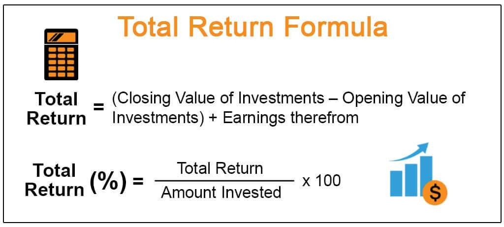

The digital era has markedly reshaped the financial landscape, ushering in innovative approaches such as algorithmic trading and sophisticated financial computations. Central to these modern financial strategies is the concept of total return, a comprehensive metric that measures investment performance by accounting for all sources of investment returns, including capital gains, interest, dividends, and distributions. This holistic view distinguishes total return from other performance measures focused solely on price appreciation or income generation.

The critical importance of understanding total return extends beyond individual investors to financial professionals who leverage algorithmic trading. As these practitioners engage with dynamic market conditions, reliance on robust metrics like total return ensures a more accurate evaluation of an investment's complete performance. This article is designed to impart a thorough understanding of total return, emphasizing the methodologies employed in its calculation, its role in investment analysis, and its application within algorithmic trading.



A precise grasp of total return calculations can significantly influence investment strategies, providing a foundation for measuring an asset's growth over time against benchmarks and facilitating direct comparisons between disparate investment options. By leveraging this knowledge, investors and financial analysts can enhance decision-making processes, optimize algorithmic trading strategies, and ultimately improve portfolio performance.

Through the exploration of methodologies and practical examples, this article will highlight the importance of incorporating total return calculations into investment and trading practices. As the financial markets continue to evolve, integrating total return metrics into strategic frameworks remains a vital practice for maintaining a competitive edge in investment performance evaluation.

## Table of Contents

## Understanding Total Return

Total return serves as a comprehensive measure of an investment's actual rate of return over a specified period, offering a broad perspective on its performance. This metric integrates various components, including interest, capital gains, dividends, and distributions, to provide an all-encompassing view of an investment’s effectiveness in generating returns. By incorporating these elements, total return enables investors to gauge the complete financial outcome of holding an asset.

The components of total return can be broken down as follows:

1. **Capital Gains**: These reflect the increase in the asset’s value over the investment period. When an asset appreciates in price from its initial purchase value, the difference constitutes a capital gain. Conversely, if the asset's price declines, it results in a capital loss. Capital gains are realized when the asset is sold; however, for total return calculations, both realized and unrealized gains and losses can be considered.

2. **Income**: This includes dividends from stocks and interest from bonds. Dividends represent a company's distribution of profit to shareholders. They can be in the form of cash payments or additional shares and play a significant role in the total return of equity investments. Interest, on the other hand, is the income earned from bond investments, reflecting the periodic payments made by bond issuers to bondholders.

3. **Distributions**: These are payouts from investment funds that may comprise both dividends and capital gains. They are often reinvested back into the fund to buy additional shares, contributing to the compound growth of the investment.

Total return is expressed as a percentage of the initial investment. To calculate it, one uses the formula:

$$
\text{Total Return (\%)} = \left( \frac{\text{End Value of Investment} - \text{Beginning Value of Investment} + \text{Income Received}}{\text{Beginning Value of Investment}} \right) \times 100
$$

This formula encompasses both the changes in the investment’s value (capital gains or losses) and the income generated (such as dividends and interest). Through this calculation, total return provides a crucial metric for evaluating an investment’s comprehensive performance, allowing investors to make informed decisions regarding the viability and profitability of different investment opportunities.

## Components and Formula of Total Return

Total return is a crucial concept in investment analysis because it represents the entirety of an investment's performance, encapsulating both capital gains and income. Capital gains occur when the value of an asset appreciates, leading to profits for the investor. For instance, if an investor purchases a stock for $100 and later sells it for $150, the capital gain is $50. This component directly reflects the increase in the asset’s market value over time.

Income, the other component of total return, comprises earnings generated by the investment, such as dividends from stocks or interest from bonds. These earnings contribute to the total return by adding regular cash flows. For example, if the aforementioned stock pays a dividend of $3 annually, this amount is considered part of the investment’s income.

The formula for calculating total return is given by:

$$
\text{Total Return} = \frac{(P_{\text{end}} - P_{\text{begin}}) + D}{P_{\text{begin}}} \times 100
$$

Where:
- $P_{\text{end}}$ is the ending price of the investment
- $P_{\text{begin}}$ is the initial purchase price
- $D$ is the income received from the investment (e.g., dividends or interest)

To illustrate this with an example: consider an investor who buys a stock at $100, the stock grows to $120, and they receive dividends amounting to $5. The total return is calculated as follows:

$$
\text{Total Return} = \frac{(120 - 100) + 5}{100} \times 100 = 25\%
$$

This example shows how total return captures both appreciation and cash flows, providing a holistic view of investment performance.

An important aspect of total return is the concept of adjusted returns, which consider factors like inflation or currency exchange fluctuations, providing a more accurate measure of real performance. Additionally, reinvested income, such as dividends, can significantly impact total returns due to compounding effects. When dividends are reinvested, they purchase additional shares, potentially increasing future returns as those shares appreciate and generate additional dividends.

Reinvestment can be depicted in Python to compute total return with reinvestment:

```python
def calculate_total_return_with_reinvestment(initial_price, final_price, dividends, number_of_shares):
    shares_acquired_from_dividends = dividends / final_price
    total_shares = number_of_shares + shares_acquired_from_dividends
    total_value = total_shares * final_price
    return_value = (total_value - (initial_price * number_of_shares)) / (initial_price * number_of_shares) * 100
    return return_value

initial_price = 100
final_price = 120
dividends = 5
number_of_shares = 1

total_return = calculate_total_return_with_reinvestment(initial_price, final_price, dividends, number_of_shares)
print(f"Total Return with Reinvestment: {total_return:.2f}%")
```

With reinvestment, the illustrated calculation reflects how even modest dividend yields, when reinvested, can enhance overall returns significantly over time. This integration into calculations emphasizes total return’s importance in investment strategy and assessment.

## Significance of Total Return in Investment Analysis

Total return is a critical metric in investment analysis as it provides a comprehensive view of an investment's growth over time. This measure is instrumental in making informed investment decisions, as it accounts for all forms of income and capital appreciation that an investment generates. By incorporating both capital gains and income (such as dividends or interest), total return offers a holistic assessment of an asset's performance. This comprehensive perspective is essential because it goes beyond the price appreciation of an asset, providing investors with a complete picture of the returns generated from their investments.

Total return is particularly useful when comparing different investments. By expressing return as a percentage of the initial investment, investors can easily assess the performance of various assets, regardless of their price or income structure. For instance, consider two stocks: one that appreciates significantly in value but pays no dividends, and another that grows modestly but offers a high dividend yield. By calculating the total return for both, investors gain insights into which stock provided a better overall return when accounting for both price appreciation and dividend income.

Another key aspect of total return is its role in benchmarking. Investors often compare an asset's total return against relevant market benchmarks or indices to evaluate how well their investments are performing relative to the broader market. This comparison aids in gauging the effectiveness of a particular investment strategy or fund manager. When total return surpasses benchmarks, it indicates superior performance, while underperformance may prompt a reevaluation of investment strategies.

Total return is particularly significant for investments that produce regular income, such as bonds and dividend-paying stocks. In fixed-income securities, for instance, the interest payments constitute a substantial part of the return, while stock dividends contribute to the total return in equities. By focusing on total return, investors can better understand the contribution of these income streams to overall performance, which is crucial for assets that rely heavily on income generation.

For financial planners and individual investors, total return is an invaluable tool for future planning, particularly for growth and retirement strategies. It provides a realistic estimate of an investment's ability to generate wealth over time, which is vital for setting and achieving financial goals. By projecting future total returns, investors can plan withdrawals, growth targets, and assess the sustainability of their investment portfolios to secure their financial future.

In summary, total return encompasses a broad range of factors contributing to an investment's performance, providing investors and financial analysts with a nuanced and complete picture essential for sound investment analysis and decision-making.

## Algorithmic Trading and Total Return

Algorithmic trading, characterized by the automatic execution of trading decisions based on pre-defined algorithms, relies heavily on the accurate assessment of investment performance. In this context, total return is a crucial metric. Total return encompasses both capital gains and income generated by an investment, offering a holistic measure of an investment's performance over time. This measure is particularly beneficial when evaluating the effectiveness of trading algorithms and strategies.

In [algorithmic trading](/wiki/algorithmic-trading), the utilization of total return spans several critical areas:

1. **Backtesting Trading Strategies**: Before deploying trading strategies live, they must be rigorously tested against historical data to ensure their efficacy. Total return plays a vital role in this backtesting process. By calculating the total return during backtesting, traders can simulate the performance of strategies over a specified period, providing a comprehensive view of past success and potential future outcomes. A higher total return in historical backtests typically indicates greater potential for profitability.

2. **Performance Benchmarking**: For algorithmic traders, it is essential to compare the performance of different trading strategies against benchmarks, such as market indices or other standard performance indicators. Total return allows for a more accurate comparison by encompassing all aspects of an investment's gain, thus ensuring that the strategy's performance aligns with—or exceeds—market expectations.

3. **Risk Assessment**: Algorithmic trading strategies involve numerous risk factors, including market volatility and liquidity risks. By integrating total return into the risk assessment framework, traders can better understand the relationship between risk and return. Techniques such as the Sharpe ratio, which adjusts the total return by the portfolio's risk, provide additional insights, helping traders to identify strategies with the most favorable risk-return balance.

4. **Portfolio Management**: In managing a portfolio of algorithmically traded instruments, the total return metric is indispensable. It assists traders in optimizing portfolio allocation to improve overall returns. By regularly calculating the total return of a portfolio, traders can make informed decisions about reallocating assets to enhance performance or reduce exposure to underperforming strategies.

### Implementation Example
Consider a Python implementation aimed at calculating the total return for a portfolio managed through an algorithmic trading platform. Here's a simple example of how to compute the total return:

```python
import pandas as pd

# Sample data: portfolio returns and income
returns = pd.Series([0.05, 0.02, 0.03, 0.04])  # Capital gains
income = pd.Series([0.01, 0.015, 0.01, 0.02]) # Dividends or interest income

# Total return calculation
total_return = returns + income

# Cumulative total return
cumulative_total_return = (1 + total_return).prod() - 1

print(f"Cumulative Total Return: {cumulative_total_return:.2%}")
```

In this code snippet, the `returns` series represents capital gains from the portfolio, while the `income` series denotes the income generated through dividends or interest. By adding the two series, the total return for each period is obtained, thereafter calculating the cumulative total return over the entire timeframe. Such calculations empower algorithmic traders with data-driven insights into the efficacy of their strategies.

Through these applications, total return emerges not only as a measure of past performance but also as a guiding metric to refine strategies, balance risk, and manage portfolios in the evolving landscape of algorithmic trading.

## Advanced Techniques and Tools for Total Return Analysis

Incorporating advanced techniques, such as adjusted close prices and compounding returns, significantly enhances the reliability of total return calculations. The adjusted close price reflects a stock's value after accounting for corporate actions, such as dividends and stock splits, providing a more accurate base for calculating total returns. By including these adjustments, investors attain a clearer picture of an asset's performance:

$$
\text{Total Return} = \frac{\text{Adjusted Closing Price}_{\text{end}} - \text{Adjusted Closing Price}_{\text{start}} + \text{Dividends}}{\text{Adjusted Closing Price}_{\text{start}}}
$$

Compounding returns, another crucial technique, involve reinvesting returns to generate additional earnings over time. Compounding can be calculated using the formula:

$$
A = P \left(1 + \frac{r}{n}\right)^{nt}
$$

where $A$ is the amount after time $t$, $P$ is the principal investment, $r$ is the annual interest rate, and $n$ is the number of compounding periods per year.

Risk-adjusted metrics, such as the Sharpe ratio, are pivotal for comprehending an investment's performance relative to its risk. The Sharpe ratio is determined by subtracting the risk-free rate from the portfolio's return and dividing the result by the portfolio's standard deviation:

$$
\text{Sharpe Ratio} = \frac{R_p - R_f}{\sigma_p}
$$

where $R_p$ represents the portfolio return, $R_f$ the risk-free rate, and $\sigma_p$ the standard deviation of the portfolio's excess return.

In terms of tools and platforms, Python holds a prominent position for executing comprehensive total return analysis. Libraries such as NumPy and pandas facilitate data manipulation and analysis, while matplotlib and seaborn assist in visualizing data insights. Python's ecosystem also offers specialized software like QuantLib for quantitative finance operations, and Jupyter notebooks for interactive coding that supports detailed output visualization.

For a practical perspective, consider the following Python code to calculate the total return on a stock including dividends:

```python
import pandas as pd

# Sample data
data = {'Date': ['2023-01-01', '2023-12-31'],
        'Close': [100, 120],
        'Adjusted_Close': [98, 122],
        'Dividends': [2.5, 3.0]}

df = pd.DataFrame(data)

# Adjusted return calculation
start_price = df['Adjusted_Close'].iloc[0]
end_price = df['Adjusted_Close'].iloc[1]
dividends = df['Dividends'].sum()

total_return = (end_price - start_price + dividends) / start_price
total_return_percentage = total_return * 100

print(f"The total return is: {total_return_percentage:.2f}%")
```

The integration of [machine learning](/wiki/machine-learning) and [factor](/wiki/factor-investing) models also offers a sophisticated avenue for forecasting total returns. Machine learning algorithms can analyze vast datasets to identify patterns and factor models, such as the Fama-French model, which help account for various systemic factors affecting returns.

In summary, employing advanced techniques like adjusted prices and compounding, leveraging risk-adjusted metrics like the Sharpe ratio, and harnessing programming tools in Python and predictive models greatly improve total return analysis. These methodologies provide investors with an edge in optimizing portfolios and formulating robust investment strategies.

## Practical Example of Total Return Calculation

Calculating total return for a stock portfolio using Python provides a practical approach to understanding and implementing this key investment metric. In this example, we will incorporate income from dividends and demonstrate how to compute total return step-by-step using Python programming.

### Step-by-Step Breakdown

#### Step 1: Data Collection
First, gather historical price data and dividend information for the stocks in the portfolio. This data can typically be acquired from financial data providers such as Yahoo Finance, which allows for easy data extraction using Python libraries like `yfinance`.

```python
import yfinance as yf  # For more datasets, visit: https://paperswithbacktest.com/datasets

# Define the stock ticker and download historical data
ticker = 'AAPL'
data = yf.download(ticker, start='2020-01-01', end='2023-01-01', actions=True)
```

#### Step 2: Calculate Capital Gains
Capital gains are computed based on the change in stock prices over the investment period. The capital gain component is the percentage increase in the stock price from the start to the end of the period.

```python
start_price = data['Close'].iloc[0]
end_price = data['Close'].iloc[-1]
capital_gains = (end_price - start_price) / start_price
```

#### Step 3: Calculate Dividend Income
Dividend income is calculated by adding up the dividend payments received during the holding period. This requires looking at the `Dividends` column in the dataset.

```python
total_dividends = data['Dividends'].sum()
# Calculate dividend yield
dividend_yield = total_dividends / start_price
```

#### Step 4: Calculate Total Return
The total return is the sum of capital gains and dividend yield. This provides a comprehensive performance measure for the investment.

```python
total_return = capital_gains + dividend_yield
```

#### Step 5: Presentation of Results
Finally, present the results in a readable format to understand the overall performance of the investment.

```python
print(f"Capital Gains: {capital_gains:.2%}")
print(f"Dividend Yield: {dividend_yield:.2%}")
print(f"Total Return: {total_return:.2%}")
```

### Explanation of the Example
In this example, the total return calculation incorporates both capital appreciation and dividends received during the investment period. Using Python allows for efficient computation and analysis of large datasets, critical in algorithmic trading.

This example demonstrates how incorporating dividends into the total return can significantly affect the performance measurement of an investment. Algorithmic traders and analysts can automate this process, continuously assessing total returns to enhance investment strategies and portfolio management. By modifying the code to include different stocks or timeframes, users can adapt this method to various investment scenarios.

## Conclusion

Total return calculation is a vital component of investment analysis and the algorithmic trading process, offering a comprehensive view of investment performance. By combining capital gains and income over time, total return provides a clearer picture of an investment's profitability and growth. This holistic metric allows investors to evaluate how their investments truly fare in a dynamic market environment.

Leveraging advanced techniques, such as compounding and risk-adjusted measures, can significantly enhance the utility of total return metrics. By integrating these sophisticated methods into algorithmic trading systems, investors can optimize their strategies. Such integration helps in refining portfolio performance and aids in making more informed decisions about asset allocation and risk management. For instance, utilizing tools and platforms that incorporate machine learning might better forecast total returns, translating into sharper strategy adjustments.

As financial markets evolve continuously, keeping abreast with innovations in total return analysis is paramount for maintaining a competitive edge. The ability to swiftly adapt to changing market conditions through improved analytical techniques can differentiate successful investors from the rest. Continual refinement and upgrading of analytical processes will ensure total return remains an indispensable tool in modern financial analysis and algorithmic trading strategy development.

## References & Further Reading

[1]: Bodie, Z., Kane, A., & Marcus, A. J. (2014). ["Investments"](https://books.google.com/books/about/EBOOK_Investments_Global_edition.html?id=BMsvEAAAQBAJ). McGraw-Hill Education.

[2]: Hull, J. C. (2022). ["Options, Futures, and Other Derivatives"](https://www.pearson.com/en-us/subject-catalog/p/options-futures-and-other-derivatives/P200000005938/9780136939917). Pearson.

[3]: Fabozzi, F. J. (2007). ["Handbook of Finance, Financial Markets and Instruments"](https://archive.org/details/handbookoffinanc0003unse). Wiley.

[4]: Lopez de Prado, M. (2018). ["Advances in Financial Machine Learning"](https://www.amazon.com/Advances-Financial-Machine-Learning-Marcos/dp/1119482089). Wiley.

[5]: Chan, E. P. (2013). ["Algorithmic Trading: Winning Strategies and Their Rationale"](https://github.com/ftvision/quant_trading_echan_book). Wiley.