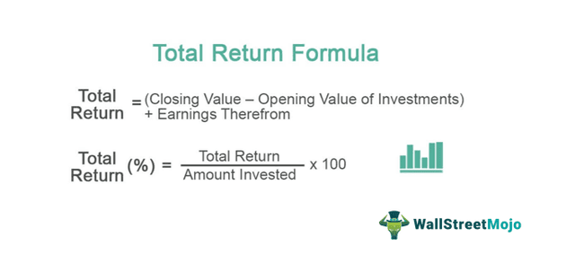

## Table of Contents

## What is total return in investing?

Total return in investing is the overall profit or loss you make from an investment over a certain period of time. It includes not just the change in the price of the investment, but also any income you earn from it, like dividends or interest. So, if you bought a stock and its price went up, and it also paid you dividends, the total return would be the sum of the price increase and the dividends.

For example, let's say you bought a stock for $100 and a year later it's worth $110. During that year, the stock also paid you $5 in dividends. Your total return would be the $10 increase in the stock price plus the $5 in dividends, which equals $15. This gives you a total return of 15% on your original $100 investment. Total return is important because it gives you a complete picture of how well your investment is doing.

## How do you calculate the total return on an investment?

To calculate the total return on an investment, you need to add up all the money you've made from it. This includes any increase in the price of the investment and any income it paid you, like dividends or interest. Start by finding out how much the investment's price has changed since you bought it. If you bought a stock for $100 and it's now worth $120, the price increase is $20. Next, add any dividends or interest you received. If the stock paid you $5 in dividends, you would add that to the $20 price increase, giving you a total return of $25.

To turn this total return into a percentage, you divide the total return by the original amount you invested and then multiply by 100. Using the same example, if you invested $100 and your total return was $25, you would divide $25 by $100 to get 0.25. Multiply 0.25 by 100 to get a total return percentage of 25%. This percentage shows you how much your investment has grown in total, taking into account both the price change and any income it generated.

## What is the difference between total return and simple return?

Total return and simple return are two ways to measure how well an investment is doing, but they look at different things. Simple return, also called price return, only looks at how much the price of the investment has changed. If you bought a stock for $100 and it's now worth $110, the simple return is 10% because the price went up by $10. Simple return doesn't care about any extra money you might get from the investment, like dividends or interest.

Total return, on the other hand, gives you a fuller picture by including both the change in price and any income the investment paid you. Using the same stock example, if the stock paid you $5 in dividends, the total return would be the $10 price increase plus the $5 in dividends, making it $15. That's a total return of 15%. Total return is important because it shows you all the money you made from the investment, not just the change in its price.

## Can you provide a basic example of total return calculation for a stock?

Let's say you bought a stock for $100. After a year, the stock's price went up to $110. During that year, the stock also paid you $5 in dividends. To find the total return, you add the price increase to the dividends. The price increase is $110 minus $100, which is $10. So, you add the $10 price increase to the $5 in dividends, giving you a total return of $15.

To turn this total return into a percentage, you divide the total return by the amount you originally invested and then multiply by 100. In this case, you divide $15 by $100 to get 0.15. Then, you multiply 0.15 by 100 to get a total return percentage of 15%. This means your investment grew by 15% over the year, taking into account both the price change and the dividends you received.

## How does dividend reinvestment affect total return?

Dividend reinvestment means using the money you get from dividends to buy more of the same stock instead of taking the cash. When you reinvest dividends, it can make your total return higher over time. This is because the extra shares you buy with the dividends can also grow in value and earn more dividends themselves. So, if you keep reinvesting, your investment can grow faster than if you just took the dividends as cash.

For example, let's say you bought a stock for $100 and it paid you $5 in dividends. If you reinvest those dividends to buy more stock, you'll have more shares. If the stock price goes up and it pays more dividends in the future, those extra shares will add to your total return. Over many years, this can make a big difference in how much your investment grows compared to just taking the dividends as cash.

## What role do capital gains and losses play in total return?

Capital gains and losses are important parts of total return. When you sell an investment for more than you paid for it, you have a capital gain. This gain adds to your total return because it's part of the money you made from the investment. On the other hand, if you sell the investment for less than you paid, you have a capital loss. This loss takes away from your total return because it means you lost money on the investment.

For example, if you bought a stock for $100 and sold it for $120, you have a $20 capital gain. If the stock also paid you $5 in dividends, your total return would be the $20 gain plus the $5 in dividends, which equals $25. But if you sold the stock for $90 instead, you would have a $10 capital loss. Adding the $5 in dividends, your total return would be -$5, meaning you lost money overall. Capital gains and losses, along with any income like dividends, help you see the full picture of how well your investment did.

## How can inflation impact the total return of an investment?

Inflation can make the total return of an investment seem less than it really is. When prices go up because of inflation, the money you get back from your investment might not buy as much as it used to. For example, if you made a 5% return on your investment but inflation was 3%, your real return is only 2%. This means the money you earned doesn't go as far as it would if there was no inflation.

It's important to think about inflation when looking at total return because it affects how much your investment is really worth. If inflation is high, you need to make sure your investment grows enough to keep up with it. Otherwise, even if your total return looks good on paper, you might find that your money doesn't buy as much as you hoped. Always consider inflation to get a true picture of your investment's performance.

## What are the common mistakes to avoid when calculating total return?

One common mistake people make when calculating total return is forgetting to include all the money they made from the investment. This means not just looking at how much the price went up or down, but also adding in any dividends or interest they got. If you only look at the price change, you might think your investment did worse than it really did. Always remember to add in any extra money you got from the investment to get the full picture.

Another mistake is not thinking about inflation. Inflation can make your money worth less over time, so even if your investment grew, it might not be as good as it seems if prices went up a lot too. You need to take inflation into account to see what your real return is. If you don't, you might think you made more money than you really did. Always consider inflation to understand how much your investment is really worth.

## How do taxes influence the total return of an investment?

Taxes can make your total return smaller because you have to pay them on the money you make from your investments. When you sell an investment for more than you paid for it, you might have to pay capital gains tax on the profit. Also, if your investment pays dividends or interest, you might have to pay taxes on that income too. These taxes take away from the total money you get to keep, so your real total return ends up being less than what you calculated before taxes.

It's important to think about taxes when figuring out your total return. Different kinds of investments can be taxed in different ways, and the tax rates can change depending on how long you held the investment or how much money you made. Always remember to subtract the taxes you owe from your total return to see how much money you really made. This gives you a clearer picture of your investment's performance after taxes.

## Can you explain how to calculate total return for a diversified portfolio?

To calculate the total return for a diversified portfolio, you need to look at all the different investments you have and add up the money you made from each one. Start by finding out how much each investment grew in price since you bought it. For example, if you have three stocks and one grew by $10, another by $5, and the third by $2, you add those up to get the total price increase. Then, add any income like dividends or interest from each investment. If one stock paid you $3 in dividends and another paid $2, you add those to the price increases. So, if your total price increase was $17 and your total dividends were $5, your total return for the portfolio would be $22.

After you have the total return in dollars, you can turn it into a percentage to see how well your whole portfolio did. To do this, divide the total return by the total amount you originally invested in the portfolio, and then multiply by 100. For example, if you started with $100 in your portfolio and your total return was $22, you would divide $22 by $100 to get 0.22. Then, multiply 0.22 by 100 to get a total return percentage of 22%. This percentage shows you how much your entire portfolio grew, taking into account both the price changes and any income from all your investments.

## What advanced metrics should be considered alongside total return for a comprehensive investment analysis?

When you're looking at how well your investments are doing, total return is important, but there are other things to think about too. One of these is the Sharpe Ratio, which tells you how much extra return you're getting for the risk you're taking. If your investment has a high Sharpe Ratio, it means you're getting good returns without taking too much risk. Another thing to look at is the Alpha, which shows how well your investment is doing compared to what you would expect from the market. A positive Alpha means your investment is doing better than expected, which is good.

Another useful metric is the Beta, which tells you how much your investment moves with the market. If your investment has a high Beta, it means it goes up and down a lot when the market does. This can be risky, but it can also mean bigger returns if the market does well. Lastly, you should also look at the Standard Deviation, which tells you how much your investment's returns change over time. A high Standard Deviation means your returns can be all over the place, which can be risky. By looking at all these metrics along with total return, you get a fuller picture of how your investments are doing and what risks you're taking.

## How do institutional investors use total return for performance benchmarking?

Institutional investors, like big pension funds or insurance companies, use total return to see how well their investments are doing compared to other investments or the market. They look at the total return of their whole portfolio, which includes all the money they made from price changes and any income like dividends or interest. By comparing this total return to a benchmark, like a stock market index, they can tell if they're doing better or worse than the market. This helps them decide if they need to change their investment strategy or if they're on the right track.

For example, if an institutional investor's portfolio has a total return of 10% over a year, but the market index they're comparing to only grew by 8%, they know they're doing better than the market. On the other hand, if their total return was only 6%, they might need to look at why they're not keeping up and make some changes. Using total return for benchmarking helps these big investors make smart choices about where to put their money and how to manage their portfolios to meet their goals.

## What is Understanding Total Return?

Total return serves as a comprehensive measure of an investment's actual rate of return over a specified period, offering a broad perspective on its performance. This metric integrates various components, including interest, capital gains, dividends, and distributions, to provide an all-encompassing view of an investment’s effectiveness in generating returns. By incorporating these elements, total return enables investors to gauge the complete financial outcome of holding an asset.

The components of total return can be broken down as follows:

1. **Capital Gains**: These reflect the increase in the asset’s value over the investment period. When an asset appreciates in price from its initial purchase value, the difference constitutes a capital gain. Conversely, if the asset's price declines, it results in a capital loss. Capital gains are realized when the asset is sold; however, for total return calculations, both realized and unrealized gains and losses can be considered.

2. **Income**: This includes dividends from stocks and interest from bonds. Dividends represent a company's distribution of profit to shareholders. They can be in the form of cash payments or additional shares and play a significant role in the total return of equity investments. Interest, on the other hand, is the income earned from bond investments, reflecting the periodic payments made by bond issuers to bondholders.

3. **Distributions**: These are payouts from investment funds that may comprise both dividends and capital gains. They are often reinvested back into the fund to buy additional shares, contributing to the compound growth of the investment.

Total return is expressed as a percentage of the initial investment. To calculate it, one uses the formula:

$$
\text{Total Return (\%)} = \left( \frac{\text{End Value of Investment} - \text{Beginning Value of Investment} + \text{Income Received}}{\text{Beginning Value of Investment}} \right) \times 100
$$

This formula encompasses both the changes in the investment’s value (capital gains or losses) and the income generated (such as dividends and interest). Through this calculation, total return provides a crucial metric for evaluating an investment’s comprehensive performance, allowing investors to make informed decisions regarding the viability and profitability of different investment opportunities.

## What are the components and formula of total return?

Total return is a crucial concept in investment analysis because it represents the entirety of an investment's performance, encapsulating both capital gains and income. Capital gains occur when the value of an asset appreciates, leading to profits for the investor. For instance, if an investor purchases a stock for $100 and later sells it for $150, the capital gain is $50. This component directly reflects the increase in the asset’s market value over time.

Income, the other component of total return, comprises earnings generated by the investment, such as dividends from stocks or interest from bonds. These earnings contribute to the total return by adding regular cash flows. For example, if the aforementioned stock pays a dividend of $3 annually, this amount is considered part of the investment’s income.

The formula for calculating total return is given by:

$$
\text{Total Return} = \frac{(P_{\text{end}} - P_{\text{begin}}) + D}{P_{\text{begin}}} \times 100
$$

Where:
- $P_{\text{end}}$ is the ending price of the investment
- $P_{\text{begin}}$ is the initial purchase price
- $D$ is the income received from the investment (e.g., dividends or interest)

To illustrate this with an example: consider an investor who buys a stock at $100, the stock grows to $120, and they receive dividends amounting to $5. The total return is calculated as follows:

$$
\text{Total Return} = \frac{(120 - 100) + 5}{100} \times 100 = 25\%
$$

This example shows how total return captures both appreciation and cash flows, providing a holistic view of investment performance.

An important aspect of total return is the concept of adjusted returns, which consider factors like inflation or currency exchange fluctuations, providing a more accurate measure of real performance. Additionally, reinvested income, such as dividends, can significantly impact total returns due to compounding effects. When dividends are reinvested, they purchase additional shares, potentially increasing future returns as those shares appreciate and generate additional dividends.

Reinvestment can be depicted in Python to compute total return with reinvestment:

```python
def calculate_total_return_with_reinvestment(initial_price, final_price, dividends, number_of_shares):
    shares_acquired_from_dividends = dividends / final_price
    total_shares = number_of_shares + shares_acquired_from_dividends
    total_value = total_shares * final_price
    return_value = (total_value - (initial_price * number_of_shares)) / (initial_price * number_of_shares) * 100
    return return_value

initial_price = 100
final_price = 120
dividends = 5
number_of_shares = 1

total_return = calculate_total_return_with_reinvestment(initial_price, final_price, dividends, number_of_shares)
print(f"Total Return with Reinvestment: {total_return:.2f}%")
```

With reinvestment, the illustrated calculation reflects how even modest dividend yields, when reinvested, can enhance overall returns significantly over time. This integration into calculations emphasizes total return’s importance in investment strategy and assessment.

## What are the advanced techniques and tools for total return analysis?

Incorporating advanced techniques, such as adjusted close prices and compounding returns, significantly enhances the reliability of total return calculations. The adjusted close price reflects a stock's value after accounting for corporate actions, such as dividends and stock splits, providing a more accurate base for calculating total returns. By including these adjustments, investors attain a clearer picture of an asset's performance:

$$
\text{Total Return} = \frac{\text{Adjusted Closing Price}_{\text{end}} - \text{Adjusted Closing Price}_{\text{start}} + \text{Dividends}}{\text{Adjusted Closing Price}_{\text{start}}}
$$

Compounding returns, another crucial technique, involve reinvesting returns to generate additional earnings over time. Compounding can be calculated using the formula:

$$
A = P \left(1 + \frac{r}{n}\right)^{nt}
$$

where $A$ is the amount after time $t$, $P$ is the principal investment, $r$ is the annual interest rate, and $n$ is the number of compounding periods per year.

Risk-adjusted metrics, such as the Sharpe ratio, are pivotal for comprehending an investment's performance relative to its risk. The Sharpe ratio is determined by subtracting the risk-free rate from the portfolio's return and dividing the result by the portfolio's standard deviation:

$$
\text{Sharpe Ratio} = \frac{R_p - R_f}{\sigma_p}
$$

where $R_p$ represents the portfolio return, $R_f$ the risk-free rate, and $\sigma_p$ the standard deviation of the portfolio's excess return.

In terms of tools and platforms, Python holds a prominent position for executing comprehensive total return analysis. Libraries such as NumPy and pandas facilitate data manipulation and analysis, while matplotlib and seaborn assist in visualizing data insights. Python's ecosystem also offers specialized software like QuantLib for quantitative finance operations, and Jupyter notebooks for interactive coding that supports detailed output visualization.

For a practical perspective, consider the following Python code to calculate the total return on a stock including dividends:

```python
import pandas as pd

# Sample data
data = {'Date': ['2023-01-01', '2023-12-31'],
        'Close': [100, 120],
        'Adjusted_Close': [98, 122],
        'Dividends': [2.5, 3.0]}

df = pd.DataFrame(data)

# Adjusted return calculation
start_price = df['Adjusted_Close'].iloc[0]
end_price = df['Adjusted_Close'].iloc[1]
dividends = df['Dividends'].sum()

total_return = (end_price - start_price + dividends) / start_price
total_return_percentage = total_return * 100

print(f"The total return is: {total_return_percentage:.2f}%")
```

The integration of [machine learning](/wiki/machine-learning) and [factor](/wiki/factor-investing) models also offers a sophisticated avenue for forecasting total returns. Machine learning algorithms can analyze vast datasets to identify patterns and factor models, such as the Fama-French model, which help account for various systemic factors affecting returns.

In summary, employing advanced techniques like adjusted prices and compounding, leveraging risk-adjusted metrics like the Sharpe ratio, and harnessing programming tools in Python and predictive models greatly improve total return analysis. These methodologies provide investors with an edge in optimizing portfolios and formulating robust investment strategies.

## References & Further Reading

[1]: Bodie, Z., Kane, A., & Marcus, A. J. (2014). ["Investments"](https://books.google.com/books/about/EBOOK_Investments_Global_edition.html?id=BMsvEAAAQBAJ). McGraw-Hill Education.

[2]: Hull, J. C. (2022). ["Options, Futures, and Other Derivatives"](https://www.pearson.com/en-us/subject-catalog/p/options-futures-and-other-derivatives/P200000005938/9780136939917). Pearson.

[3]: Fabozzi, F. J. (2007). ["Handbook of Finance, Financial Markets and Instruments"](https://archive.org/details/handbookoffinanc0003unse). Wiley.

[4]: Lopez de Prado, M. (2018). ["Advances in Financial Machine Learning"](https://www.amazon.com/Advances-Financial-Machine-Learning-Marcos/dp/1119482089). Wiley.

[5]: Chan, E. P. (2013). ["Algorithmic Trading: Winning Strategies and Their Rationale"](https://github.com/ftvision/quant_trading_echan_book). Wiley.