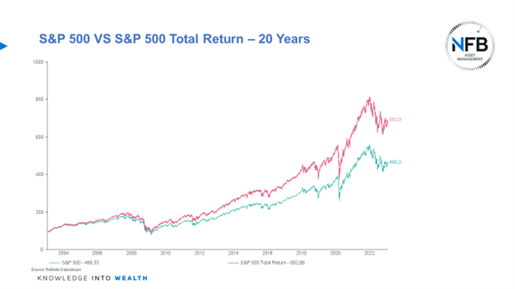

## Table of Contents

## What is a Total Return Index?

A Total Return Index is a type of stock market index that shows how much money an investor would have if they put money into a group of stocks and also got all the money from dividends. Dividends are extra money that companies sometimes give to people who own their stocks. So, a Total Return Index not only tracks the price changes of the stocks but also adds in the dividends, giving a fuller picture of the investment's performance.

This kind of index is useful because it shows the real growth of an investment over time. If you only look at the price of the stocks without including dividends, you might miss out on seeing the full benefit of owning those stocks. For example, if a company's stock price stays the same but it pays out big dividends, the Total Return Index would show that the investment is actually doing well, even if the stock price hasn't gone up.

## What is a Price Index?

A Price Index is a type of stock market index that only looks at the changes in the prices of stocks. It does not include any extra money, like dividends, that investors might get from owning the stocks. So, if you want to know how the prices of a group of stocks are going up or down, you can look at a Price Index.

This kind of index is useful for understanding how the market is doing based just on stock prices. But, it doesn't give you the full picture of what investors are [earning](/wiki/earning-announcement) because it leaves out dividends. For example, if a company's stock price goes down a little but it pays out big dividends, the Price Index would show a loss, even though the total return for investors might still be good.

## How do Total Return Index and Price Index differ?

A Total Return Index and a Price Index are two ways to measure how well a group of stocks is doing, but they look at different things. A Total Return Index shows the full picture of what investors earn from their stocks. It includes not just the changes in stock prices, but also the extra money, called dividends, that companies pay to their shareholders. So, if a company's stock price stays the same but it pays out big dividends, the Total Return Index would show that the investment is doing well.

On the other hand, a Price Index only looks at the changes in the prices of the stocks. It does not include dividends or any other extra money that investors might get. This means that if a company's stock price goes down a little but it still pays out big dividends, the Price Index would show a loss, even though the total return for investors might still be good. So, a Price Index gives you a simpler view of how stock prices are moving, but it doesn't show the full benefit of owning the stocks.

## What components are included in a Total Return Index that are not in a Price Index?

A Total Return Index includes the changes in stock prices, just like a Price Index. But it also adds in the dividends that companies pay to their shareholders. Dividends are extra money that investors get, on top of any increase in the stock's price. This makes the Total Return Index a fuller picture of how well an investment is doing.

A Price Index, on the other hand, only shows how the prices of stocks go up or down. It does not count the dividends. So, if a company's stock price stays the same but it pays out big dividends, the Price Index would not show any gain, even though the investors are actually earning more money. This is why a Total Return Index gives a better idea of the total earnings from an investment.

## Why might an investor prefer to use a Total Return Index over a Price Index?

An investor might prefer to use a Total Return Index over a Price Index because it gives a more complete picture of how well their investments are doing. A Total Return Index doesn't just look at how the prices of stocks go up or down. It also includes the money that companies pay out to their shareholders, called dividends. So, if a company's stock price stays the same but it pays out big dividends, the Total Return Index will show that the investment is actually doing well, even though the stock price hasn't changed.

Using a Total Return Index helps investors see the real growth of their investments over time. If you only look at a Price Index, you might miss out on seeing the full benefit of owning those stocks. For example, if a stock's price goes down a little but the company pays out big dividends, the Price Index would show a loss, even though the total return for the investor might still be good. This makes the Total Return Index a better tool for understanding the true performance of an investment.

## How does reinvestment of dividends affect the Total Return Index?

When dividends are reinvested, it means that instead of taking the money from dividends, investors use it to buy more of the same stock. This can make the Total Return Index go up more than if the dividends were just taken as cash. The reason is that reinvesting dividends lets the investor own more shares, and if the stock price goes up, those extra shares will be worth more money. So, the Total Return Index, which counts both the stock price changes and the dividends, will show a bigger increase because of the extra shares.

Reinvesting dividends can also make the Total Return Index grow faster over time because of something called compounding. Compounding happens when you earn money on your money, and then you earn money on that money too. When dividends are reinvested, they buy more shares, and those shares can earn more dividends, which can then be reinvested again. This cycle can make the Total Return Index grow much faster than if the dividends were not reinvested. So, reinvesting dividends can really boost how much the Total Return Index goes up.

## Can you explain the impact of corporate actions on both indices?

Corporate actions, like stock splits or mergers, can affect both Total Return Index and Price Index. A stock split happens when a company decides to split its stock into more shares, which usually makes the price of each share go down but doesn't change the total value of the investment. If a company does a stock split, the Price Index will show a drop in the stock's price, even though the value of the investment stays the same. The Total Return Index will also adjust to reflect the stock split, but it will still include the dividends, so it shows a more complete picture of the investment's value.

Mergers, where one company buys another, can also change both indices. If a company in the index gets bought out, the stock might be taken out of the index, or its price might change because of the merger. The Price Index will only show the change in the stock's price due to the merger. The Total Return Index will also reflect the price change, but it will keep counting the dividends from the stock until it's removed from the index. So, while both indices are affected by corporate actions, the Total Return Index gives a fuller view because it includes dividends.

## How do Total Return Index and Price Index reflect market performance differently?

A Total Return Index and a Price Index show how the market is doing, but they do it in different ways. A Total Return Index gives a complete picture of how well an investment is doing because it includes both the changes in stock prices and the money from dividends. So, if a company's stock price stays the same but it pays out big dividends, the Total Return Index will show that the investment is doing well. This makes it a better tool for understanding the real growth of an investment over time.

On the other hand, a Price Index only looks at how the prices of stocks go up or down. It does not include the dividends that companies pay out. This means that if a company's stock price goes down a little but it pays out big dividends, the Price Index would show a loss, even though the total return for investors might still be good. So, a Price Index gives a simpler view of how stock prices are moving, but it doesn't show the full benefit of owning the stocks.

## What are the common benchmarks used for Total Return Index and Price Index?

Common benchmarks for Total Return Index include the S&P 500 Total Return Index and the Dow Jones Industrial Average Total Return Index. These benchmarks are used to show how well a group of stocks is doing, including the money from dividends. For example, the S&P 500 Total Return Index tracks the 500 biggest companies in the U.S. and adds in the dividends they pay. This gives investors a good idea of how much they could earn from these stocks over time.

For Price Index, common benchmarks are the S&P 500 Price Index and the Dow Jones Industrial Average Price Index. These benchmarks only look at how the prices of the stocks go up or down. They don't count the dividends. So, if you want to know how the stock prices of the biggest companies in the U.S. are changing, you can look at the S&P 500 Price Index. It's a simpler way to see market performance, but it doesn't show the full picture of what investors are earning.

## How can Total Return Index be used to assess investment performance more accurately?

A Total Return Index helps investors see the full picture of how well their investments are doing. It does this by counting not just the changes in stock prices, but also the money that companies pay out as dividends. This means that if a company's stock price stays the same but it gives out big dividends, the Total Return Index will show that the investment is actually doing well. This is important because it gives a more complete view of how much money an investor is really making, not just how the stock prices are moving.

Using a Total Return Index can make it easier for investors to see the real growth of their investments over time. If you only look at a Price Index, which just shows how stock prices go up or down, you might miss out on seeing the full benefit of owning those stocks. For example, if a stock's price goes down a little but the company pays out big dividends, the Price Index would show a loss, even though the total return for the investor might still be good. So, by using a Total Return Index, investors can get a better idea of the true performance of their investments.

## What are the potential pitfalls of relying solely on Price Index for investment decisions?

Relying only on a Price Index for making investment choices can lead to some big mistakes. A Price Index just looks at how the prices of stocks go up or down. It doesn't count the money that companies pay out as dividends. So, if you only use a Price Index, you might think an investment is doing badly because the stock price went down, even if the company paid out big dividends. This could make you miss out on good investments that give you a lot of money from dividends, even if the stock price isn't going up.

Also, using just a Price Index can make you miss the real growth of your investments over time. When you reinvest the dividends, you buy more shares, and those extra shares can grow in value too. This is called compounding, and it can make your investment grow much faster. But if you only look at the Price Index, you won't see this growth because it doesn't include the dividends. So, by not using a Total Return Index, which includes both stock price changes and dividends, you might not get the full picture of how well your investments are really doing.

## How do advanced investors use the comparison of Total Return Index and Price Index for strategic asset allocation?

Advanced investors use the comparison of Total Return Index and Price Index to make smarter choices about where to put their money. They look at how much money they could make from both the changes in stock prices and the dividends that companies pay out. By comparing these two indices, they can see if an investment is doing well because of the dividends, even if the stock price isn't going up much. This helps them decide if they should invest more in stocks that pay good dividends or if they should look for stocks that might go up in price more.

For example, if an investor sees that the Total Return Index for a certain group of stocks is growing faster than the Price Index, it means the dividends are making a big difference. They might choose to put more money into those stocks because the dividends are helping their investment grow. On the other hand, if the Price Index is growing faster, it might mean the stock prices are going up a lot, and they could decide to invest in those stocks instead. By using both indices, advanced investors can balance their investments to get the best return possible.

## What is a Total Return Index and how does it work?

A Total Return Index measures the comprehensive performance of a group of assets by accounting for both capital gains and the reinvestment of dividends. Unlike a Price Index, which only tracks price changes, the Total Return Index captures the full return generated by an investment, making it a critical tool for investors seeking a complete understanding of asset performance.

### Components of a Total Return Index

1. **Price Appreciation**: This is the increase in the market value of the assets included in the index. It's calculated by comparing the current price of the assets to their initial price:
$$
   \text{Price Appreciation} = \frac{P_t - P_0}{P_0}

$$

   where $P_t$ is the current price, and $P_0$ is the initial price.

2. **Dividends**: Dividends are payments made by a company to its shareholders and can significantly contribute to the total returns of an investment. In a Total Return Index, dividends are assumed to be reinvested in the index. This reinvestment compounds over time, enhancing the index's performance.

3. **Cash Distributions**: Besides dividends, other forms of cash distributions such as special dividends or returns of capital are also factored into the Total Return Index. Each distribution is reinvested on the ex-dividend date, thereby reflecting its impact on the overall returns.

### Examples of Total Return Indices

- **S&P 500 Total Return Index**: Tracks the performance of 500 large-cap publicly traded companies in the United States, including the reinvestment of dividends. It is widely used to gauge the performance of the U.S. stock market.

- **MSCI World Total Return Index**: Encompasses a broad range of assets across 23 developed markets worldwide, providing investors with a global view of market performance, inclusive of dividends.

### Importance of Total Return Index

The Total Return Index offers investors a comprehensive view of an investment's performance over time by integrating all sources of returns. By acknowledging both price movements and income from dividends, it provides a more accurate reflection of an investment's profitability and sustainability. This holistic approach aids investors in making informed decisions, especially when formulating long-term investment strategies. In essence, understanding Total Return Indices is fundamental for optimizing investment outcomes and achieving financial success. 

Through this robust framework, investors can differentiate between merely holding an asset that appreciates in value and one that also generates recurring income, thereby enabling them to construct a more effective and resilient portfolio.

## What is a Price Index and How is it Explained?

A Price Index is a metric that reflects the changes in the price of a selection of assets, excluding any income generated from dividends. This index focuses solely on capturing the fluctuations in the market value of the securities that comprise it. The primary purpose of a Price Index is to provide an indication of the performance of the market or specific segments over time, without considering the additional returns that may be accrued from dividend payments. 

One of the most common representations of a Price Index is the formula:

$$
\text{Price Index} = \left( \frac{\text{Current Price Level}}{\text{Base Price Level}} \right) \times 100
$$

Here, the base price level refers to the price of the index at a chosen starting point, often set to 100 for simplification, allowing subsequent calculations to be easily represented as percentages of the base year.

Compared to a Total Return Index, which includes dividend reinvestments, a Price Index presents a less comprehensive view of an investment's returns. This distinction is crucial for investors seeking to assess the full spectrum of potential earnings. For example, an investor looking at a Price Index might not see the complete picture of their asset's performance if they rely on this metric alone, as it does not account for the total yield that dividends might provide.

Understanding the differences between Price Indices and Total Return Indices is vital for achieving an accurate assessment of a portfolio's performance. While the Price Index can indicate market sentiment and price movements effectively, it may not fully represent the total potential value gained from holding an asset over time. Therefore, it is often used in conjunction with other metrics for a well-rounded analysis of investment performance.

## What is Algorithmic Trading: Introduction and Calculations?

Algorithmic trading employs automated systems that execute trades based on predefined rules and inputs from market data. This method has revolutionized trading by enabling high-frequency trading ([HFT](/wiki/high-frequency-trading-strategies)) and the execution of complex strategies that are impossible for manual traders. At its core, [algorithmic trading](/wiki/algorithmic-trading) relies on mathematical models and sophisticated software to make decisions and evaluate outcomes.

High-frequency trading, a subset of algorithmic trading, leverages these automated systems to perform a significant number of trades within microseconds. This requires robust infrastructure, with low-latency networks and powerful computing hardware, to analyze and respond to market conditions almost instantaneously. The speed at which HFT systems operate enables traders to capitalize on small price discrepancies swiftly, contributing to market efficiency but also increasing the trading [volume](/wiki/volume-trading-strategy) significantly.

Algorithmic trading systems are tasked with calculating various types of returns to assess and optimize their strategies. These calculations often include:

1. **Absolute Returns**: This measures the simple return on an investment over a certain period, without adjusting for risk. The formula is straightforward:
$$
   \text{Absolute Return} = \frac{\text{Ending Value} - \text{Beginning Value}}{\text{Beginning Value}}

$$

2. **Relative Returns**: These returns compare the performance of the investment against a benchmark or another asset, providing insight into how the asset or strategy has performed in a comparative context.

3. **Risk-Adjusted Returns**: These take into account the risk taken to achieve the return, with common metrics being the Sharpe Ratio and the Sortino Ratio. For example, the Sharpe Ratio is calculated as:
$$
   \text{Sharpe Ratio} = \frac{\text{Average Return} - \text{Risk-Free Rate}}{\text{Standard Deviation of Return}}

$$

Backtesting is a crucial step in the algorithmic trading process. It involves testing a trading strategy on historical data to determine its viability before deployment in real-world markets. This process allows traders to refine their algorithms, identifying flaws and optimizing performance metrics. A typical [backtesting](/wiki/backtesting) procedure in Python can be implemented using libraries such as `pandas` for data manipulation and `[backtrader](/wiki/backtrader)` for the simulation environment.

Here is an example of a simple backtesting script using Python:

```python
import backtrader as bt

class SimpleMovingAverageStrategy(bt.Strategy):
    def __init__(self):
        self.sma = bt.indicators.SimpleMovingAverage(self.data.close, period=15)

    def next(self):
        if self.data.close[0] > self.sma[0]:
            self.buy(size=100)
        elif self.data.close[0] < self.sma[0]:
            self.sell(size=100)

# Create a data feed
data = bt.feeds.YahooFinanceData(dataname='AAPL', fromdate=datetime(2020, 1, 1), todate=datetime(2021, 1, 1))

# Set up the backtest
cerebro = bt.Cerebro()
cerebro.addstrategy(SimpleMovingAverageStrategy)
cerebro.adddata(data)
cerebro.run()
```

In this script, a simple moving average crossover strategy is implemented. The strategy buys 100 shares of Apple (AAPL) when the current price is above the 15-day SMA and sells when it falls below. Backtesting such strategies on historical data provides insights into how they could potentially perform, helping traders to enhance and adapt their algorithms for better results.

By marrying the precision of quantitative analysis with the ability to process and react to data in real-time, algorithmic trading stands as a fundamental component in the landscape of modern finance. It provides traders with sophisticated tools to manage both short-term market changes and longer-term investment strategies effectively.

## References & Further Reading

[1]: Benzoni, L., Collin-Dufresne, P., & Goldstein, R. S. (2007). ["Portfolio Choice over the Life-Cycle when the Stock and Labor Markets Are Cointegrated."](https://www.jstor.org/stable/4622331) Journal of Economic Dynamics and Control.

[2]: Fama, E. F., & French, K. R. (1992). ["The Cross-Section of Expected Stock Returns."](https://onlinelibrary.wiley.com/doi/full/10.1111/j.1540-6261.1992.tb04398.x) Journal of Finance.

[3]: Grinold, R. C., & Kahn, R. N. (1999). ["Active Portfolio Management: A Quantitative Approach for Producing Superior Returns and Controlling Risk."](https://www.amazon.com/Active-Portfolio-Management-Quantitative-Controlling/dp/0070248826) McGraw-Hill Education.

[4]: Sourial, M. "Understanding the S&P 500 Index and its Total Return Version." Investopedia. [Link](https://www.investopedia.com/articles/08/sp500.asp).

[5]: Aldridge, I. (2010). ["High-Frequency Trading: A Practical Guide to Algorithmic Strategies and Trading Systems."](https://onlinelibrary.wiley.com/doi/pdf/10.1002/9781119203803.fmatter) Wiley Trading.