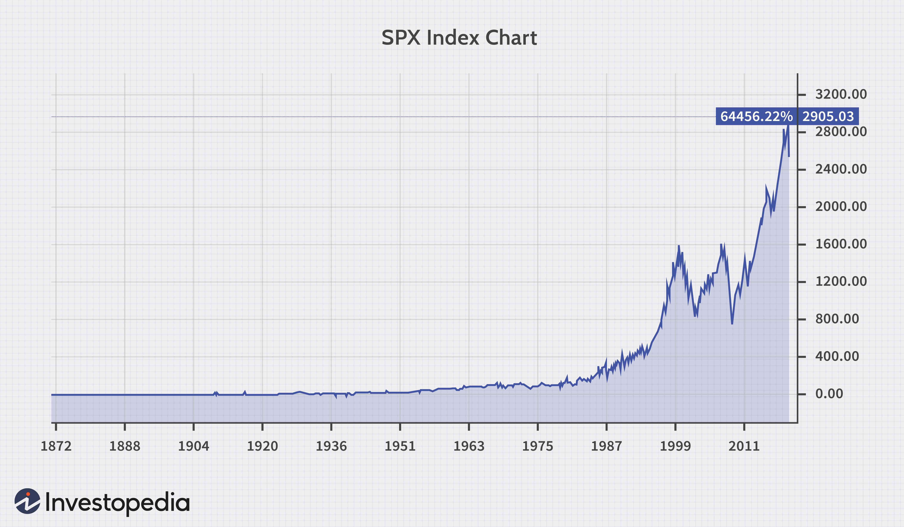

The world of investment is multifaceted, encompassing a wide array of strategies and metrics that professionals rely on to evaluate performance and make informed decisions. Among the crucial metrics used in assessing returns are the Total Return Index and the Price Index. These indices are fundamental tools in investment analysis, offering distinct insights into the market's performance. The Total Return Index provides a comprehensive measure of an investment's success by accounting for both capital gains and reinvested dividends, whereas the Price Index focuses solely on price changes, disregarding any income generated from dividends. 

In recent years, the advent of algorithmic trading has significantly transformed the investment landscape, introducing advanced methodologies and performance metrics. This trading approach utilizes automated systems to execute trades based on pre-defined rules, enhancing the efficiency and speed of trading processes. Algorithmic trading has not only increased market participation but has also brought new complexities in understanding market dynamics and returns calculations. 



This article examines the differences and synergies among Total Return Indices, Price Indices, and algorithmic trading strategies. Understanding these elements is crucial for optimizing investment strategies, as they provide diverse perspectives that can enhance decision-making and ultimately lead to financial success. By integrating knowledge of these indices with algorithmic tools, investors can gain comprehensive insights and leverage market opportunities effectively.

## Table of Contents

## Understanding Total Return Index

A Total Return Index measures the comprehensive performance of a group of assets by accounting for both capital gains and the reinvestment of dividends. Unlike a Price Index, which only tracks price changes, the Total Return Index captures the full return generated by an investment, making it a critical tool for investors seeking a complete understanding of asset performance.

### Components of a Total Return Index

1. **Price Appreciation**: This is the increase in the market value of the assets included in the index. It's calculated by comparing the current price of the assets to their initial price:
$$
   \text{Price Appreciation} = \frac{P_t - P_0}{P_0}

$$

   where $P_t$ is the current price, and $P_0$ is the initial price.

2. **Dividends**: Dividends are payments made by a company to its shareholders and can significantly contribute to the total returns of an investment. In a Total Return Index, dividends are assumed to be reinvested in the index. This reinvestment compounds over time, enhancing the index's performance.

3. **Cash Distributions**: Besides dividends, other forms of cash distributions such as special dividends or returns of capital are also factored into the Total Return Index. Each distribution is reinvested on the ex-dividend date, thereby reflecting its impact on the overall returns.

### Examples of Total Return Indices

- **S&P 500 Total Return Index**: Tracks the performance of 500 large-cap publicly traded companies in the United States, including the reinvestment of dividends. It is widely used to gauge the performance of the U.S. stock market.

- **MSCI World Total Return Index**: Encompasses a broad range of assets across 23 developed markets worldwide, providing investors with a global view of market performance, inclusive of dividends.

### Importance of Total Return Index

The Total Return Index offers investors a comprehensive view of an investment's performance over time by integrating all sources of returns. By acknowledging both price movements and income from dividends, it provides a more accurate reflection of an investment's profitability and sustainability. This holistic approach aids investors in making informed decisions, especially when formulating long-term investment strategies. In essence, understanding Total Return Indices is fundamental for optimizing investment outcomes and achieving financial success. 

Through this robust framework, investors can differentiate between merely holding an asset that appreciates in value and one that also generates recurring income, thereby enabling them to construct a more effective and resilient portfolio.

## Price Index Explained

A Price Index is a metric that reflects the changes in the price of a selection of assets, excluding any income generated from dividends. This index focuses solely on capturing the fluctuations in the market value of the securities that comprise it. The primary purpose of a Price Index is to provide an indication of the performance of the market or specific segments over time, without considering the additional returns that may be accrued from dividend payments. 

One of the most common representations of a Price Index is the formula:

$$
\text{Price Index} = \left( \frac{\text{Current Price Level}}{\text{Base Price Level}} \right) \times 100
$$

Here, the base price level refers to the price of the index at a chosen starting point, often set to 100 for simplification, allowing subsequent calculations to be easily represented as percentages of the base year.

Compared to a Total Return Index, which includes dividend reinvestments, a Price Index presents a less comprehensive view of an investment's returns. This distinction is crucial for investors seeking to assess the full spectrum of potential earnings. For example, an investor looking at a Price Index might not see the complete picture of their asset's performance if they rely on this metric alone, as it does not account for the total yield that dividends might provide.

Understanding the differences between Price Indices and Total Return Indices is vital for achieving an accurate assessment of a portfolio's performance. While the Price Index can indicate market sentiment and price movements effectively, it may not fully represent the total potential value gained from holding an asset over time. Therefore, it is often used in conjunction with other metrics for a well-rounded analysis of investment performance.

## Algorithmic Trading: Introduction and Calculations

Algorithmic trading employs automated systems that execute trades based on predefined rules and inputs from market data. This method has revolutionized trading by enabling high-frequency trading ([HFT](/wiki/high-frequency-trading-strategies)) and the execution of complex strategies that are impossible for manual traders. At its core, [algorithmic trading](/wiki/algorithmic-trading) relies on mathematical models and sophisticated software to make decisions and evaluate outcomes.

High-frequency trading, a subset of algorithmic trading, leverages these automated systems to perform a significant number of trades within microseconds. This requires robust infrastructure, with low-latency networks and powerful computing hardware, to analyze and respond to market conditions almost instantaneously. The speed at which HFT systems operate enables traders to capitalize on small price discrepancies swiftly, contributing to market efficiency but also increasing the trading [volume](/wiki/volume-trading-strategy) significantly.

Algorithmic trading systems are tasked with calculating various types of returns to assess and optimize their strategies. These calculations often include:

1. **Absolute Returns**: This measures the simple return on an investment over a certain period, without adjusting for risk. The formula is straightforward:
$$
   \text{Absolute Return} = \frac{\text{Ending Value} - \text{Beginning Value}}{\text{Beginning Value}}

$$

2. **Relative Returns**: These returns compare the performance of the investment against a benchmark or another asset, providing insight into how the asset or strategy has performed in a comparative context.

3. **Risk-Adjusted Returns**: These take into account the risk taken to achieve the return, with common metrics being the Sharpe Ratio and the Sortino Ratio. For example, the Sharpe Ratio is calculated as:
$$
   \text{Sharpe Ratio} = \frac{\text{Average Return} - \text{Risk-Free Rate}}{\text{Standard Deviation of Return}}

$$

Backtesting is a crucial step in the algorithmic trading process. It involves testing a trading strategy on historical data to determine its viability before deployment in real-world markets. This process allows traders to refine their algorithms, identifying flaws and optimizing performance metrics. A typical [backtesting](/wiki/backtesting) procedure in Python can be implemented using libraries such as `pandas` for data manipulation and `[backtrader](/wiki/backtrader)` for the simulation environment.

Here is an example of a simple backtesting script using Python:

```python
import backtrader as bt

class SimpleMovingAverageStrategy(bt.Strategy):
    def __init__(self):
        self.sma = bt.indicators.SimpleMovingAverage(self.data.close, period=15)

    def next(self):
        if self.data.close[0] > self.sma[0]:
            self.buy(size=100)
        elif self.data.close[0] < self.sma[0]:
            self.sell(size=100)

# Create a data feed
data = bt.feeds.YahooFinanceData(dataname='AAPL', fromdate=datetime(2020, 1, 1), todate=datetime(2021, 1, 1))

# Set up the backtest
cerebro = bt.Cerebro()
cerebro.addstrategy(SimpleMovingAverageStrategy)
cerebro.adddata(data)
cerebro.run()
```

In this script, a simple moving average crossover strategy is implemented. The strategy buys 100 shares of Apple (AAPL) when the current price is above the 15-day SMA and sells when it falls below. Backtesting such strategies on historical data provides insights into how they could potentially perform, helping traders to enhance and adapt their algorithms for better results.

By marrying the precision of quantitative analysis with the ability to process and react to data in real-time, algorithmic trading stands as a fundamental component in the landscape of modern finance. It provides traders with sophisticated tools to manage both short-term market changes and longer-term investment strategies effectively.

## Comparing Total Return Index and Price Index

A Total Return Index provides a comprehensive measure of an investment's performance by accounting for both price appreciation and income from dividends. This makes it particularly beneficial for long-term investors who seek a complete picture of portfolio growth. By reinvesting dividends, this index captures the full effect of compounded returns over time, offering a more holistic view of an investment's profitability compared to a Price Index.

On the other hand, a Price Index considers only the changes in stock prices, neglecting any income generated from dividends. This renders it more suited for assessing short-term market movements where the focus is on immediate price fluctuations rather than total profitability. For investors engaged in short-term trading strategies, the Price Index provides a targeted perspective that highlights price [volatility](/wiki/volatility-trading-strategies) and trends without the added complexity of dividend reinvestments.

Both indices offer valuable insights tailored to different investment horizons. For a comprehensive evaluation, investors should integrate analyses from both Total Return and Price Indices. Long-term investment planning benefits significantly from the enriched detail provided by Total Return Indices; incorporating dividend effects presents a fuller return picture. Conversely, for traders whose strategies revolve around short-term price action, Price Indices remain indispensable.

To effectively employ these indices, investors might develop strategic models using Python to simulate and project the differences in portfolio outcomes over various time frames. For instance:

```python
# Example: Simulating the impact of dividends on investment
import numpy as np

# Define parameters
initial_investment = 1000  # initial investment amount in dollars
annual_price_return = 0.05  # expected annual price return of 5%
annual_dividend_yield = 0.02  # expected annual dividend yield of 2%
years = 10  # investment period in years

# Calculate future investment value for Price Index
price_index_value = initial_investment * (1 + annual_price_return) ** years

# Calculate future investment value for Total Return Index
total_return_value = initial_investment
for _ in range(years):
    total_return_value += total_return_value * (annual_price_return + annual_dividend_yield)

# Output results
print(f"Price Index Value after {years} years: ${price_index_value:.2f}")
print(f"Total Return Index Value after {years} years: ${total_return_value:.2f}")
```

Employing such models aids in understanding the potential differences in end portfolio value, guiding investors to align their strategy with their investment objectives more precisely. Integrating insights from both indices ensures a balanced approach that leverages the strength of various market perspectives.

## The Role of Algorithmic Trading in Modern Finance

Algorithmic trading has significantly altered modern finance by incorporating speed and efficiency into trading operations. This approach utilizes advanced algorithms to automatically execute trades at a frequency and timing unattainable by human traders. The primary advantage of algorithmic trading is its ability to capture market micro trends and execute large volumes of trades with precision and minimal delay. By doing so, it helps in reducing the impact of market volatility and enhancing the [liquidity](/wiki/liquidity-risk-premium) of financial markets.

Algorithms used in trading are designed to optimize returns by considering multiple types of returns, including market returns and Net Asset Value (NAV) returns. Market returns refer to the gains or losses realized in the market prices of the securities over a period, while NAV returns focus on the change in the value of an investment fund's assets minus its liabilities. 

The strategies employed in algorithmic trading vary widely, ranging from simple moving average-based models to more complex strategies involving [machine learning](/wiki/machine-learning) and [artificial intelligence](/wiki/ai-artificial-intelligence). For example, a basic algorithm might buy a stock when its 50-day moving average crosses above its 200-day moving average, a strategy known as the "Golden Cross". 

Here is a simple example of a moving average crossover strategy implemented in Python:

```python
import pandas as pd
import numpy as np

# Assume 'data' is a DataFrame containing the historical prices with a 'Close' column
def moving_average_strategy(data, short_window=50, long_window=200):
    data['Short_MA'] = data['Close'].rolling(window=short_window, min_periods=1).mean()
    data['Long_MA'] = data['Close'].rolling(window=long_window, min_periods=1).mean()

    # Create signals
    data['Signal'] = 0
    data['Signal'][short_window:] = np.where(
        data['Short_MA'][short_window:] > data['Long_MA'][short_window:], 1, 0
    )

    # Generate trading orders
    data['Position'] = data['Signal'].diff()
    return data

# Example use:
# data = pd.read_csv('historical_prices.csv')
# result = moving_average_strategy(data)
```

Furthermore, algorithmic trading allows for the implementation of high-frequency trading (HFT), a specialized technique that involves a large number of orders executed at extremely high speeds. HFT typically leverages powerful computers with access to low-latency networks to ensure that they are executing trades faster than any competitors.

In terms of optimizing returns, algorithms can be designed to manage not only traditional market factors but also to mitigate risks and enhance performance through diversification and hedging strategies. This involves continuous adjustments based on real-time data analysis and execution that seamlessly integrates with the overall portfolio management strategy.

As financial markets continue to generate vast volumes of data, the role of algorithmic trading is set to expand further, driven by advances in data analytics, computational power, and artificial intelligence. This constant evolution promises to further refine how trades are executed and how returns are optimized in the foreseeable future.

## Integration into Investment Strategies

Incorporating insights from Total Return Indices and Price Indices can significantly enhance portfolio management strategies. Total Return Indices, which account for both capital gains and reinvested dividends, offer a comprehensive view of an investment's overall performance. By including dividends, these indices provide a more realistic measure of long-term returns. On the other hand, Price Indices focus solely on the price appreciation of assets, excluding dividends, and are often more applicable for evaluating short-term trading strategies where income from dividends is less relevant.

Aligning algorithmic trading with these indices allows investors to exploit market inefficiencies. Algorithmic trading leverages automated systems and predefined rules to execute trades swiftly in response to market conditions. These systems can incorporate Total Return and Price Index data to guide their trading decisions. For instance, an algorithm could utilize the comprehensive data from a Total Return Index to identify undervalued assets that offer substantial dividends, thus capitalizing on both price appreciations and dividend payouts.

Investors can achieve a balanced approach by integrating insights from Total Return Indices, Price Indices, and algorithmic trading into their investment strategies. For long-term portfolio management, an investor might prioritize a Total Return Index to evaluate and select assets that provide superior overall returns, including dividends. Meanwhile, algorithmic strategies can be employed to take advantage of short-term pricing anomalies highlighted by a Price Index, executing trades based on real-time data with high precision.

Moreover, using algorithmic trading in conjunction with these indices facilitates rigorous backtesting of potential strategies. By accessing historical data from both Total Return and Price Indices, investors can simulate the performance of their algorithmic models under various market conditions. This process can highlight potential strengths and weaknesses in strategies, facilitating optimization before actual capital is deployed.

In summary, the integration of Total Return Indices and Price Indices with algorithmic trading strategies offers a multi-dimensional approach to investing. It enables investors to capture a full scope of market opportunities while maintaining a robust risk management framework, ultimately optimizing investment outcomes.

## Conclusion

A comprehensive understanding of Total Return Indices, Price Indices, and algorithmic trading represents a critical foundation for successful investing. These tools serve unique roles: Total Return Indices encompass both capital gains and dividends, offering a holistic picture of an investment's yield, while Price Indices focus solely on price changes, which can be useful for short-term trading assessments. Algorithmic trading, on the other hand, leverages technology to optimize trading efficiency and strategies, often targeting both market trends and portfolio-specific objectives.

By integrating insights from these indices and trading methodologies, investors can make more informed decisions that reflect the entire spectrum of potential returns and risks. Total Return Indices provide a fuller grasp of long-term asset performance, whereas Price Indices offer clarity on market volatility and price movements. Algorithmic trading contributes by enhancing execution speeds and applying sophisticated strategies.

To maintain a competitive edge and optimize investment outcomes, investors should actively stay informed about the latest developments and methodologies in return calculation and algorithmic strategies. This knowledge is pivotal to refining risk management practices and seizing opportunities for superior financial performance.

Ultimately, the strategic combination of Total Return Indices, Price Indices, and algorithmic trading techniques empowers investors to achieve a balanced approach that enhances decision-making, enriches investment insight, and improves financial market performance.

## References & Further Reading

[1]: Benzoni, L., Collin-Dufresne, P., & Goldstein, R. S. (2007). ["Portfolio Choice over the Life-Cycle when the Stock and Labor Markets Are Cointegrated."](https://www.jstor.org/stable/4622331) Journal of Economic Dynamics and Control.

[2]: Fama, E. F., & French, K. R. (1992). ["The Cross-Section of Expected Stock Returns."](https://onlinelibrary.wiley.com/doi/full/10.1111/j.1540-6261.1992.tb04398.x) Journal of Finance.

[3]: Grinold, R. C., & Kahn, R. N. (1999). ["Active Portfolio Management: A Quantitative Approach for Producing Superior Returns and Controlling Risk."](https://www.amazon.com/Active-Portfolio-Management-Quantitative-Controlling/dp/0070248826) McGraw-Hill Education.

[4]: Sourial, M. "Understanding the S&P 500 Index and its Total Return Version." Investopedia. [Link](https://www.investopedia.com/articles/08/sp500.asp).

[5]: Aldridge, I. (2010). ["High-Frequency Trading: A Practical Guide to Algorithmic Strategies and Trading Systems."](https://onlinelibrary.wiley.com/doi/pdf/10.1002/9781119203803.fmatter) Wiley Trading.