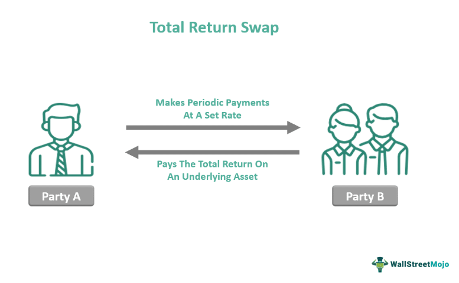

Financial derivatives are critical components in modern finance, serving as instruments that derive their value from underlying assets such as stocks, bonds, commodities, or interest rates. They are used for hedging risk, speculation, and to leverage positions in financial markets. Derivatives enable investors to manage exposure to various risks, thereby enhancing liquidity and enabling efficient price discovery in financial markets.

One prominent financial derivative is the Total Return Swap (TRS), a contract between two parties where one party agrees to pay the total return of a specified asset, usually an equity or bond, and the other party pays a fixed or floating interest rate. The asset's total return includes interest payments, dividends, and capital gains or losses over the payment period.



Total Return Swaps have gained particular relevance in the context of algorithmic trading. Algorithmic trading, which uses pre-programmed instructions to execute trades, leverages TRS to maximize returns through precise risk management and optimization strategies. The integration of TRS in algorithmic models allows traders to exploit market inefficiencies and react swiftly to dynamic market conditions.

This article explores intricate details and examples of Total Return Swaps, highlighting their benefits and diverse applications. Through comprehensive analysis, we will examine how TRS can hedge risks and enhance investment returns. The discussion will extend to real-world applications, outlining scenarios where TRS have proven advantageous.

Particular attention will be given to the role of algorithmic trading in maximizing returns with TRS. As financial markets grow increasingly electronic, the synergy between TRS and algorithmic trading offers sophisticated strategies for traders and businesses to achieve diverse financial objectives.

Understanding and effectively managing Total Return Swaps are crucial in today's dynamic market environments. As markets evolve, TRS continue to be pivotal in risk management and return optimization, providing invaluable tools for traders and financial institutions. Through this article, readers are encouraged to further explore financial derivatives to see how they can be utilized for optimizing financial strategies.

## Table of Contents

## Understanding Financial Derivatives

Financial derivatives are financial instruments whose value is derived from the performance of underlying assets, interest rates, or indices. These instruments are crucial in modern finance for hedging risk, leveraging positions, and arbitrating price discrepancies. Common types of financial derivatives include futures contracts, options, swaps, and forwards.

Derivatives work by creating a contractual relationship between two or more parties, typically involving a future transaction at an agreed-upon price. For example, a futures contract obligates the participant to buy or sell an asset at a predetermined price on a specific future date. Options provide the right, but not the obligation, to buy or sell, offering more flexibility than futures.

Total Return Swaps (TRS) stand out from other derivatives like futures and options due to their distinct structure. Unlike futures, where the primary focus is on price movements, TRS allows parties to exchange the total return of an asset. This includes income from dividends or interest and capital appreciation. This aspect provides a comprehensive exposure to the underlying asset's performance rather than just price movements.

The benefits of trading derivatives are significant. They provide a mechanism for risk management, hedging against price fluctuations, accessing otherwise inaccessible markets, and enhancing profitability through leverage. However, the risks are equally substantial, including market risk, credit risk, and the potential for significant losses due to leveraged positions.

Historically, financial derivatives have evolved from simple forward contracts, used in ancient civilizations for trading goods, to complex instruments used in sophisticated financial strategies today. The globalization of finance, technological advancements, and the growing complexity of financial markets have driven this evolution, resulting in rapid expansion during the latter half of the 20th century. This growth highlights the importance of these instruments in the fabric of modern financial markets, as they cater to the diverse needs of investors and institutions alike.

## Fundamentals of Total Return Swaps

Total Return Swaps (TRS) are a type of financial derivative that involves a contractual agreement between two parties to exchange the total economic performance of a particular asset. The asset in question could be an equity share, fixed-income instrument, or any other financial asset. Essentially, one party agrees to pay the other the total return, which includes both income and capital gains, of the underlying asset. In return, the second party typically agrees to pay a pre-determined rate, which could be either fixed or floating, such as the LIBOR plus a spread.

**Key Features and Components of TRS:**

1. **Underlying Asset:** The fundamental component of a TRS is the underlying asset, which determines the total return to be swapped. This asset can range from equities and bonds to baskets of different securities.

2. **Total Return Payer and Receiver:** In a TRS, one party is the total return payer, providing the total return on the underlying asset, while the other is the total return receiver, accepting these returns in exchange for a regular payment.

3. **Regular Payments:** These payments are typically based on a reference interest rate, like LIBOR, sometimes plus or minus a specified margin. This ensures both parties are compensated fairly.

4. **Contract Duration:** TRS contracts have a specified term, ranging from short-term (a few months) to long-term (years), depending on the parties’ strategic goals.

5. **Settlement:** Settlements can be made either in cash or by delivery of the actual asset, though cash settlements are more common due to their simplicity.

**Structure and Execution:**

Total Return Swap contracts are structured to align with the financial objectives of involved parties. They can be tailored with different terms, such as the frequency of payments and the index of the underlying asset. The execution of these contracts often involves investment banks or large financial institutions acting as intermediaries. These institutions may handle the complexities of calculating returns and payments and manage the risks involved through sophisticated risk management strategies.

**Advantages for Hedging and Investment:**

1. **Hedging:** Investors utilize TRS to hedge against downside risks associated with owning the asset directly. It allows them to maintain exposure to the asset without actually holding it on their balance sheet, which can have accounting and regulatory benefits.

2. **Leverage:** TRS can be used to achieve a synthetic leveraged position on an asset, providing investors exposure beyond their actual capital investment, thus potentially enhancing returns.

3. **Flexibility:** The customizable nature of TRS contracts provides flexibility in terms of duration, payment terms, and underlying assets, making them adaptable to various financial strategies.

**Real-World Scenarios:**

Total Return Swaps prove beneficial in several scenarios, such as allowing hedge funds to gain exposure to stock indices without purchasing individual equities, which optimizes their balance sheets and leverage. Financial institutions might use TRS for credit risk management when seeking exposure to credit without holding the risk directly on their [books](/wiki/algo-trading-books). Moreover, TRS is advantageous in structured finance and securitization transactions, offering investors tailored return profiles suited to their risk appetites. Thus, TRS remains a versatile tool in the derivative marketplace, fostering strategic financial management and risk diversification.

## Examples of Total Return Swap Transactions

Total Return Swaps (TRS) are versatile financial instruments utilized across various sectors, offering unique benefits and imposing specific challenges. This section explores illustrative examples of TRS applications, a case study on their use in managing credit risk by financial institutions, their employment by hedge funds for better portfolio performance, and examines the influence of market conditions on TRS outcomes.

### Illustrative Examples of TRS in Different Sectors

In the banking sector, TRS agreements are often used to reallocate risk. A bank might enter into a TRS with an investor wherein the investor receives the total return on a specific loan book, which includes interest payments and capital gains. This allows the bank to remove asset risk from its balance sheet without physically selling the asset, providing them with flexibility in managing capital requirements.

In the oil and gas industry, companies may utilize TRS to hedge against fluctuations in energy prices. For example, a company might swap the total return on a basket of energy-related securities with a financial institution to stabilize cash flows amidst volatile market prices, thereby reducing the risk of revenue shortfalls.

### Case Study: TRS in Managing Credit Risk

Financial institutions frequently employ TRS to manage credit risk, particularly in uncertain economic climates. For instance, a bank facing potential instability in its loan portfolio might use TRS to transfer both the risk and return related to specific loans to another party. This counterparty agrees to take on the credit exposure in exchange for a predetermined fee, effectively isolating the bank from credit defaults while maintaining an income stream.

### Use by Hedge Funds to Enhance Portfolio Performance

Hedge funds often leverage TRS to magnify returns on their portfolios. By swapping the total return of an underlying asset for a fixed or floating [interest rate](/wiki/interest-rate-trading-strategies), hedge funds can obtain synthetic exposure to assets without direct ownership. For example, a [hedge fund](/wiki/hedge-fund-trading-strategies) might use a TRS to gain synthetic exposure to a stock index, reaping the benefits of index performance while using leverage to amplify returns. This approach is useful for funds aiming to maintain flexibility and [liquidity](/wiki/liquidity-risk-premium) while exploring leveraged investment strategies.

### Impact of Market Conditions on TRS Outcomes

Market conditions significantly influence TRS outcomes. In a bullish market, the party receiving the floating leg (variable market returns) generally benefits, as positive asset performance culminates in higher returns. Conversely, in a bearish market, the payer of the swap is advantaged, having locked in a predetermined interest rate or fee. This dynamic nature necessitates that parties involved in a TRS carefully consider prevailing market conditions and future projections to optimize returns.

### Analysis of Typical Outcomes from TRS Transactions

The typical outcomes from TRS transactions vary, but they generally provide enhanced control over assets, flexibility, and risk management capabilities. For receivers of the total return, potential benefits include increased exposure to high-performing assets and the ability to leverage positions without direct asset purchase. Meanwhile, payers can secure steady cash inflows and better manage asset-liability mismatches, despite sacrificing potential upside in asset performance. 

In conclusion, these examples highlight the strategic importance of TRS in various sectors, illustrating how different entities utilize them to achieve diverse financial objectives while managing inherent risks effectively.

## Total Return Swaps in Algorithmic Trading

Algorithmic trading has revolutionized financial markets by employing sophisticated mathematical models and computational algorithms to automate the trading process. Its significant advantage lies in its ability to process vast amounts of data at high speeds to identify trading opportunities. Within this context, Total Return Swaps (TRS) are particularly beneficial as they offer a flexible instrument that algorithmic models can optimize to match specific trading strategies or hedging needs.

### Optimizing TRS with Algorithmic Trading

Algorithmic trading can enhance the use of TRS by leveraging real-time market data to dynamically adjust the swap positions based on predefined algorithms. For instance, an algorithm could be designed to respond to market conditions, such as pricing discrepancies or anticipated market trends, and instinctively modify TRS positions to maximize return or minimize risk exposure.

The optimization process might involve complex calculations where algorithms continuously monitor variables such as interest rates, underlying asset prices, and economic indicators. Suppose an algorithm identifies a potential increase in the underlying asset's value; it could strategically increase TRS exposure to capture enhanced returns. Conversely, in anticipation of a downside risk, the algorithm might reduce exposure or hedge the position.

### Technical Strategies for TRS Incorporation

Incorporating TRS into algorithmic models involves the utilization of advanced statistical techniques and quantitative analysis. One common approach is the application of regression models to predict underlying asset movements and determine optimal TRS positions. Such models might use:

```python
import numpy as np
from sklearn.linear_model import LinearRegression

# Example dataset with independent (market indicators) and dependent variables (asset price)
X = np.array([[1, 2], [2, 3], [3, 4], [4, 5]])
y = np.array([2, 3, 4, 5])

# Creating a linear regression model
model = LinearRegression().fit(X, y)

# Making predictions
predicted_price = model.predict(np.array([[5, 6]]))
```

Machine learning algorithms are also increasingly employed to enhance prediction accuracy and trading outcomes by adapting to new data patterns autonomously. Techniques such as [reinforcement learning](/wiki/reinforcement-learning) allow trading systems to learn optimal strategies through trial-and-error interactions with the market.

### Risk Management for Algorithmic TRS Trading

Effective risk management is crucial in [algorithmic trading](/wiki/algorithmic-trading) of TRS to mitigate potential downsides. Algorithms must be equipped with robust risk management parameters including stop-loss orders, position limits, and diversification rules. Automated systems should be designed to consistently monitor key risk metrics such as Value at Risk (VaR) and stress test scenarios to ensure resilience under adverse conditions.

Dynamic hedging strategies are frequently employed to adjust positions in response to market [volatility](/wiki/volatility-trading-strategies). For example, if an algorithm detects heightened market risk, it could automatically reallocate assets or amend TRS exposure to minimize potential losses.

### Future Prospects of Algorithmic Trading with TRS

The future of algorithmic trading involving TRS is poised for further growth, driven by advancements in [artificial intelligence](/wiki/ai-artificial-intelligence) and [machine learning](/wiki/machine-learning). As these technologies evolve, algorithms will become more adept at processing complex datasets and executing trades with greater precision.

Furthermore, the integration of blockchain technology could enhance transparency and reduce settlement times in TRS trades, fostering more efficient transactional flows. As financial markets continue to grow more complex, the symbiosis of TRS and algorithmic trading will likely play a pivotal role in developing innovative financial strategies and optimizing returns for investors. 

Overall, exploring TRS within the framework of algorithmic trading presents significant potential for enhanced performance and adaptability in dynamic market environments.

## Benefits and Risks of Trading Total Return Swaps

Total Return Swaps (TRS) present a compelling tool for investors and traders due to their advantageous characteristics and the risks they inherently possess. This section explores the benefits and potential risks associated with trading TRS, the influence of regulatory changes, risk mitigation strategies, and a comparison with other financial instruments.

**Advantages of TRS for Investors and Traders**

One of the primary benefits of Total Return Swaps is their flexibility. TRS allow investors to gain exposure to a wide variety of assets, including equities, bonds, and other financial products, without the need to own the underlying asset. This feature is particularly attractive for hedge funds and institutional investors seeking leveraged exposure to an asset class. The leverage effect can amplify potential returns, as traders can take larger positions than might otherwise be possible.

Moreover, TRS facilitate efficient balance sheet management. By engaging in a TRS, institutions can remove the underlying asset from their balance sheets, optimizing capital allocation and potentially improving their financial ratios. Another advantage is the ability to hedge risk. Investors can use TRS to protect against adverse price movements in an asset, essentially transferring the total economic risk, including income and capital gains, to another party.

**Discussion on the Risk Factors Involved in TRS Trading**

Despite their benefits, TRS [carry](/wiki/carry-trading) inherent risks. Counterparty risk is significant, as the profitability of a TRS depends on the financial health of the counterparty. If the counterparty defaults, the investor may face financial losses. Market risk is another concern, as fluctuations in the underlying asset's price can lead to unexpected outcomes, particularly if leverage is used.

Legal and operational risks also exist. TRS agreements are subject to legal interpretation, and any ambiguity can lead to disputes. Operational risks, including errors in managing, recording, or settling TRS transactions, can also result in losses.

**Impact of Regulatory Changes on TRS Trading Dynamics**

Regulatory changes play a crucial role in the dynamics of TRS trading. The implementation of the Dodd-Frank Act in the United States, for instance, introduced stricter reporting and transparency requirements, influencing how TRS are traded and managed. These regulations aim to mitigate systemic risk by enforcing clearing through central counterparties and increasing the collateral requirements.

Such changes can potentially reduce the appeal of TRS by increasing transaction costs and limiting the flexibility that makes them attractive. However, this also encourages the development of more robust risk management practices and greater market transparency.

**Strategies to Mitigate Risks Associated with TRS**

Investors can employ various strategies to mitigate the risks associated with TRS. Diversification is a fundamental approach, spreading the exposure across multiple swaps and counterparties to reduce dependency on any single entity. Utilizing central clearing mechanisms, as mandated in some jurisdictions, helps in reducing counterparty risk.

Incorporating robust counterparty evaluation processes, including credit assessments and ongoing monitoring, can further mitigate counterparty risk. Additionally, maintaining sufficient liquidity to meet collateral demands and potential cash flow mismatches is crucial in managing the operational risks related to TRS trading.

**Comparing TRS with Other Hedging and Investment Products**

When compared to other hedging and investment instruments, TRS offer unique advantages. Unlike futures and options, TRS incorporate both income and capital appreciation components of the underlying asset, providing a comprehensive exposure. While futures contracts are standardized and traded on exchanges, TRS are over-the-counter agreements offering greater customization. 

Options, on the other hand, provide the right but not the obligation to buy or sell the underlying asset, which can be advantageous in volatile markets. However, they typically require premiums, which is not the case with TRS. Therefore, the choice between these instruments depends on the specific needs and risk appetites of the investor.

In conclusion, Total Return Swaps are powerful tools in the financial derivatives landscape, offering significant advantages for investors and traders. Recognizing the associated risks and regulatory impacts, and implementing effective risk management strategies, is essential for successful TRS trading.

## Conclusion

Total Return Swaps (TRS) play a significant role in modern financial markets by offering both flexibility and opportunity for investors and traders seeking to maximize returns. As discussed, TRS are a type of financial derivative that allow participants to gain exposure to the total return of an underlying asset, without actually owning it. This mechanism enables traders to hedge risks or leverage their investment strategies by transferring the economic performance of assets to other parties.

The convergence of TRS with algorithmic trading brings forth a powerful synergy that enhances financial strategies. Algorithmic trading allows for the rapid execution of TRS transactions, optimizing their use by employing complex algorithms that analyze market data and execute trades at speeds beyond human capability. This fusion not only boosts efficiency but also helps manage risks through advanced computational methods.

Given the versatility of Total Return Swaps, businesses and traders are encouraged to explore these financial instruments to achieve diverse financial objectives. TRS can cater to various strategies including hedging, speculation, and portfolio diversification—providing a robust framework for addressing specific financial goals in constantly evolving market conditions.

Furthermore, the exploration and study of financial derivatives remain crucial as they form the backbone of innovative financial products and strategies. With derivatives like TRS continuing to evolve, there lies a vast landscape of possibilities for enhancing and protecting investments. Emphasizing the need for ongoing research and understanding in the field, stakeholders can better navigate the complexities of financial markets and harness the potential offered by these powerful financial tools.

## References & Further Reading

[1]: ["Total Return Swaps and Their Role in Modern Financial Markets"](https://www.investopedia.com/terms/t/totalreturnswap.asp) - Investopedia

[2]: ["Advances in Financial Machine Learning"](https://www.amazon.com/Advances-Financial-Machine-Learning-Marcos/dp/1119482089) by Marcos Lopez de Prado

[3]: Hull, J. C. (2018). ["Options, Futures, and Other Derivatives"](https://www.semanticscholar.org/paper/Options%2C-Futures%2C-and-Other-Derivatives-Hull/89bdee500c8623864fc9eb7a471546aa713acc44) - Pearson Education

[4]: ["The Basel III Accord: Understanding the Financial Regulation Framework and Its Impact on Total Return Swaps"](https://www.bis.org/bcbs/basel3.htm) - Bank for International Settlements

[5]: ["Swaps and Other Derivatives in Electronic Trading: A Case Study into the Role of Algorithmic Trading"](https://sites.duke.edu/djepapers/files/2016/08/schiffrin.pdf) - The Review of Financial Studies

[6]: ["Quantitative Trading: How to Build Your Own Algorithmic Trading Business"](https://github.com/LucindaYa/quant-resources/blob/master/Quantitative%20Trading%20How%20to%20Build%20Your%20Own%20Algorithmic%20Trading%20Business.pdf) by Ernest P. Chan

