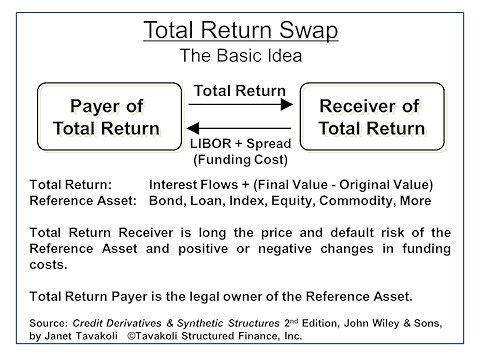

## Table of Contents

## What is a Total Return Swap (TRS)?

A Total Return Swap (TRS) is a financial agreement between two parties where one party agrees to pay the total return of an asset, like a stock or a bond, to the other party. In return, the other party pays a set rate, often based on a benchmark like LIBOR plus a spread. This swap allows the party receiving the total return to gain exposure to the asset without actually owning it, which can be useful for various investment strategies.

For example, if you want to benefit from the performance of a stock without buying it, you could enter into a TRS. You would receive any dividends and capital gains from the stock, but you would also have to pay any losses if the stock's value goes down. The other party, who might be a bank or another investor, would pay you based on the agreed rate. This way, both parties can achieve their financial goals without directly trading the underlying asset.

## How does a Total Return Swap work?

A Total Return Swap, or TRS, is like a bet between two people about how an asset, like a stock or a bond, will do over time. One person, called the "total return payer," agrees to give the other person, called the "total return receiver," all the money the asset makes, including any price increases and dividends. In return, the total return receiver pays the total return payer a fixed or floating rate, which is usually based on something like the LIBOR plus a little extra. This way, the total return receiver can make money from the asset without actually owning it.

For example, imagine you think a certain stock will go up in value, but you don't want to buy it directly. You can enter into a TRS where you are the total return receiver. If the stock goes up, you get all the gains and dividends. But if the stock goes down, you have to pay the total return payer for the loss. Meanwhile, the total return payer gets a steady payment from you, which can be useful if they want a predictable income. This swap helps both of you achieve your financial goals without trading the actual stock.

## What are the key components of a Total Return Swap?

A Total Return Swap involves two main parties: the total return payer and the total return receiver. The total return payer agrees to give the total return receiver all the money made from an asset, like a stock or bond. This includes any increase in the asset's price and any dividends it pays out. The total return receiver, on the other hand, pays the total return payer a regular fee, which is usually based on a benchmark rate like LIBOR, plus a little extra. This fee is called the financing leg of the swap.

The total return part of the swap is the key component because it allows the receiver to benefit from the asset's performance without actually owning it. If the asset goes up in value, the receiver gets the profit. But if it goes down, the receiver has to pay for the loss. The financing leg, or the regular fee, provides the payer with a steady income, which can be useful if they want predictable cash flow. Together, these components make the Total Return Swap a flexible tool for investors to manage their exposure to different assets.

## Who are the typical parties involved in a Total Return Swap?

The typical parties involved in a Total Return Swap are the total return payer and the total return receiver. The total return payer is usually a bank or a financial institution that owns the asset, like a stock or a bond. They agree to give the total return receiver all the money the asset makes, including any price increases and dividends. This can be useful for the payer if they want to get rid of the risk of owning the asset but still want to keep it on their books.

The total return receiver is often an investor or another financial institution that wants to benefit from the performance of the asset without actually buying it. They pay the total return payer a regular fee, which is based on a benchmark rate like LIBOR, plus a little extra. This way, the receiver can make money if the asset goes up in value, but they also have to pay if it goes down. Both parties can use the Total Return Swap to meet their financial goals without directly trading the asset.

## What are the benefits of using a Total Return Swap?

One of the main benefits of using a Total Return Swap is that it lets investors gain exposure to an asset without actually owning it. This can be really helpful if you want to benefit from a stock or a bond going up in value, but you don't want to buy it directly. It's like betting on a horse race without having to buy a horse. This can also help you avoid some of the costs and risks that come with owning the asset, like transaction fees and the risk of the asset losing value.

Another benefit is that Total Return Swaps can help you manage your investment risks better. For example, if you own a stock and you're worried it might go down in value, you can use a Total Return Swap to pass that risk onto someone else. At the same time, the other person might be happy to take on that risk because they think the stock will go up. This way, both parties can achieve their financial goals without having to buy or sell the actual asset.

## What are the risks associated with Total Return Swaps?

One big risk with Total Return Swaps is that you could lose a lot of money if the asset doesn't perform well. If you're the total return receiver and the stock or bond goes down in value, you have to pay the total return payer for the loss. This means you could end up owing more money than you expected, especially if the asset's value drops a lot. It's like betting on a horse that doesn't win; you could lose a lot more than you thought.

Another risk is that the other party in the swap might not be able to pay what they owe. If the total return payer can't give you the money they promised because they're having financial problems, you could be out of luck. This is called counterparty risk, and it can be a big deal, especially if you're dealing with a lot of money. It's important to make sure the other party is reliable before you enter into a Total Return Swap.

## How is the total return calculated in a Total Return Swap?

The total return in a Total Return Swap is calculated by adding up all the money the asset makes over a certain time. This includes any increase in the asset's price, which is called capital gains, and any dividends the asset pays out. If the stock or bond goes up in value, that increase is part of the total return. If it also pays dividends, those are added to the total return too. So, if a stock goes from $100 to $110 and pays a $2 dividend, the total return would be $12 ($10 from the price increase plus $2 from the dividend).

If the asset loses value, that loss is also part of the total return, but it's a negative number. So, if the stock goes down from $100 to $90, the total return would be a loss of $10. The total return receiver has to pay this loss to the total return payer. This way, the total return in a Total Return Swap reflects all the gains and losses from the asset, giving a complete picture of how it performed over the swap period.

## What types of assets are commonly used in Total Return Swaps?

Total Return Swaps are often used with stocks and bonds. Stocks are shares in a company, and if you use them in a Total Return Swap, you get any increase in their price and any dividends they pay out. Bonds are loans to a company or government, and if you use them in a swap, you get any interest they pay and any increase in their value. These are common because they are easy to value and people often want to bet on how they will perform without actually buying them.

Another type of asset used in Total Return Swaps is indexes, like the S&P 500. An index is a group of stocks that shows how a part of the market is doing. If you use an index in a swap, you get the total return of all the stocks in the index, which can be a good way to bet on the overall market without buying each stock separately. Sometimes, people also use commodities like gold or oil in Total Return Swaps, but these are less common because their prices can be more unpredictable.

## How do Total Return Swaps differ from other types of swaps?

Total Return Swaps are different from other types of swaps because they focus on giving one party the total return of an asset, including both the price changes and any dividends or interest it pays. In other swaps, like interest rate swaps or currency swaps, the focus is usually on exchanging one type of cash flow for another. For example, in an interest rate swap, you might trade a fixed interest rate for a floating one, but you're not dealing with the total return of an asset like you are with a Total Return Swap.

Another way Total Return Swaps differ is that they allow the total return receiver to benefit from an asset without actually owning it. This is different from, say, a credit default swap, where you're betting on whether a company will default on its debt. With a Total Return Swap, you're betting on how well the asset will do in terms of price changes and income, which makes it a more direct way to gain exposure to an asset's performance. This can be useful for investors who want to avoid the costs and risks of owning the asset directly.

## What are the regulatory considerations for Total Return Swaps?

Total Return Swaps, like many financial instruments, are subject to regulations that aim to protect investors and ensure the stability of financial markets. In the United States, the Dodd-Frank Act has rules that affect Total Return Swaps. These rules require that swaps be reported to a central database, which helps regulators keep an eye on the market and see where risks might be building up. Also, some swaps have to be traded on exchanges or through clearinghouses, which can help reduce the risk that one party won't be able to pay what they owe.

In Europe, the European Market Infrastructure Regulation (EMIR) sets similar rules for Total Return Swaps. EMIR also requires reporting of swap transactions and, in some cases, clearing through central counterparties. These regulations are meant to increase transparency and reduce the risk of a financial crisis caused by hidden risks in the swap market. Both sets of regulations make it more important for people using Total Return Swaps to understand the rules and make sure they are following them.

## How can Total Return Swaps be used for hedging purposes?

Total Return Swaps can be a useful tool for hedging because they let you protect yourself against losses on an asset you own. Imagine you own a stock and you're worried it might go down in value. You can enter into a Total Return Swap where you're the total return payer. This means you agree to give someone else all the money the stock makes, including any price increases and dividends. In return, they pay you a steady fee, usually based on a benchmark rate like LIBOR. If the stock goes down, you don't lose money because the other person has to pay you for the loss. This way, you can keep the stock on your books but avoid the risk of it losing value.

Another way Total Return Swaps can be used for hedging is if you want to protect against losses in a whole portfolio of assets. For example, if you have a bunch of different stocks and bonds and you're worried the market might crash, you can use a Total Return Swap on an index that represents the market. By being the total return payer on the index, you can pass on the risk of the market going down to someone else. They'll pay you if the market falls, helping you offset any losses in your portfolio. This can be a smart way to manage risk without having to sell your assets.

## What are some advanced strategies involving Total Return Swaps?

One advanced strategy with Total Return Swaps is using them to create synthetic positions. Imagine you want to own a stock but don't want to buy it directly. You can enter into a Total Return Swap where you're the total return receiver. This way, you get all the gains and dividends from the stock without actually owning it. You can then use the money you would have spent on the stock to invest in something else, like a bond or another stock. This lets you diversify your investments while still benefiting from the stock's performance. It's like having your cake and eating it too.

Another advanced strategy is using Total Return Swaps to leverage your investments. If you think a stock will go up a lot, you can use a Total Return Swap to bet on it without putting down a lot of money upfront. You become the total return receiver and only have to pay a small fee to the total return payer. If the stock goes up, you get all the gains, which can be much more than what you paid in fees. But be careful, because if the stock goes down, you could lose a lot more than you expected. This strategy can help you make big profits, but it also comes with big risks.

## References & Further Reading

[1]: ["Total Return Swaps and Their Role in Modern Financial Markets"](https://www.investopedia.com/terms/t/totalreturnswap.asp) - Investopedia

[2]: ["Advances in Financial Machine Learning"](https://www.amazon.com/Advances-Financial-Machine-Learning-Marcos/dp/1119482089) by Marcos Lopez de Prado

[3]: Hull, J. C. (2018). ["Options, Futures, and Other Derivatives"](https://www.semanticscholar.org/paper/Options%2C-Futures%2C-and-Other-Derivatives-Hull/89bdee500c8623864fc9eb7a471546aa713acc44) - Pearson Education

[4]: ["The Basel III Accord: Understanding the Financial Regulation Framework and Its Impact on Total Return Swaps"](https://www.bis.org/bcbs/basel3.htm) - Bank for International Settlements

[5]: ["Swaps and Other Derivatives in Electronic Trading: A Case Study into the Role of Algorithmic Trading"](https://sites.duke.edu/djepapers/files/2016/08/schiffrin.pdf) - The Review of Financial Studies

[6]: ["Quantitative Trading: How to Build Your Own Algorithmic Trading Business"](https://github.com/LucindaYa/quant-resources/blob/master/Quantitative%20Trading%20How%20to%20Build%20Your%20Own%20Algorithmic%20Trading%20Business.pdf) by Ernest P. Chan

