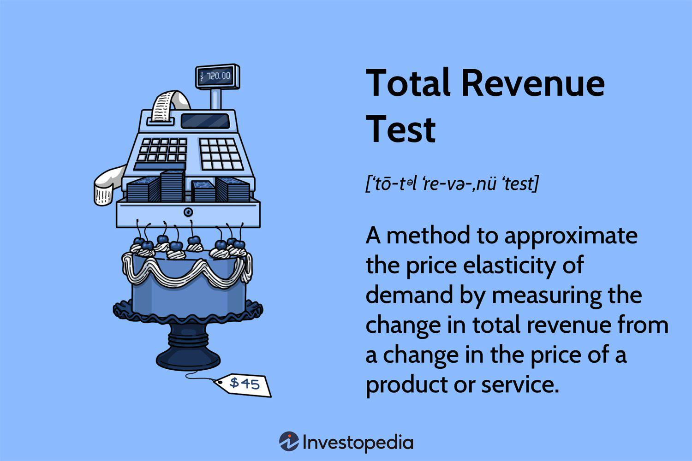

Total revenue, a fundamental concept in economics, is critical for analyzing pricing strategies and understanding market dynamics. It serves as a key indicator of business performance, representing the total income a company generates from the sale of goods or services. Mathematically, total revenue (TR) is calculated as the product of the quantity sold (Q) and the price per unit (P), expressed as:

$$
\text{TR} = P \times Q
$$



Within this framework, the relationship between total revenue and demand elasticity becomes paramount. Elasticity of demand measures how sensitive the quantity demanded of a good is to changes in price. By understanding this relationship, businesses can optimize their pricing strategies to maximize profits. Typically, if demand for a product is elastic, a decrease in price will result in an increase in total revenue, as the percentage increase in quantity demanded outweighs the percentage decrease in price. Conversely, if demand is inelastic, raising prices may lead to higher total revenue, since the quantity demanded does not significantly decrease.

This article focuses on the total revenue test, a tool employed to gauge the elasticity of demand and its implications for economic and business analysis. It is particularly relevant in the context of algorithmic trading and pricing strategies, where real-time data and automated pricing adjustments play crucial roles. The total revenue test aids in identifying whether a product falls within the elastic or inelastic phases of its demand curve, guiding businesses in setting prices that align with market behavior and consumer responsiveness.

We will explore how these concepts intersect with economics, pricing strategy, and algorithmic trading. By understanding and leveraging the total revenue test, businesses can gain insights into consumer price sensitivity, enabling them to enhance their profitability and strategic decision-making processes.

## Table of Contents

## What is a Total Revenue Test?

A total revenue test measures how changes in price affect total revenue, offering a way to infer demand elasticity. Demand elasticity is the responsiveness of the quantity demanded to a change in price. The test helps to identify whether a product's demand curve is in the elastic or inelastic phase. To perform this, one must observe the variations in total revenue as prices change and determine how these revenue changes correlate with elasticity.

When the total revenue increases as the price decreases, the demand for the product is considered elastic. This means that the percentage increase in quantity demanded is greater than the percentage decrease in price, leading to an overall increase in revenue. Conversely, if total revenue decreases when the price decreases, the demand is inelastic; the percentage decrease in price leads to a smaller percentage increase in quantity demanded, resulting in lower revenue.

The total revenue test is a useful analytical tool that operates under the assumption that all other external factors affecting revenue remain constant. This assumption is crucial because it isolates the relationship between price and revenue, allowing the test to focus solely on the demand elasticity. 

In mathematical terms, total revenue (TR) can be expressed as:

$$
TR = P \times Q
$$

where $P$ represents price, and $Q$ represents quantity demanded. The elasticity of demand can be categorized based on the relationship between price changes and total revenue:

- **Elastic Demand**: $\frac{\Delta TR}{\Delta P} < 0$, i.e., total revenue and price move in opposite directions.
- **Inelastic Demand**: $\frac{\Delta TR}{\Delta P} > 0$, i.e., total revenue and price move in the same direction.

This simple yet powerful framework offers a focused mechanism to assess consumer responsiveness to price changes, helping businesses align their pricing strategies effectively with market demand conditions.

## Pricing Strategy and the Role of Total Revenue Test

Businesses leverage the total revenue test to optimize pricing strategies by understanding and applying the concept of demand elasticity. Demand elasticity, which is the responsiveness of quantity demanded to a change in price, plays a critical role in determining the optimal price points that can maximize a firm's total revenue. The total revenue test helps in identifying the elasticity of demand for a product. When demand is elastic, a price decrease tends to increase total revenue because the proportional increase in quantity demanded outweighs the proportional decrease in price. Conversely, when demand is inelastic, increasing the price can boost total revenue since the proportional decrease in quantity demanded is less than the proportional increase in price. 

By harnessing knowledge of elasticity, businesses can make informed decisions regarding pricing, thus balancing the need to increase prices while maintaining or growing demand. For example, a firm may choose to lower prices on a highly elastic product to capture more market share and increase revenue, or raise prices on an inelastic product to maximize revenue without significantly affecting sales [volume](/wiki/volume-trading-strategy).

Algorithmic pricing models, which are becoming increasingly prevalent in modern business strategies, can incorporate the results of total revenue tests to automate and refine pricing strategies in real-time. These models use advanced algorithms to analyze market data, consumer behavior, and demand elasticity to adjust prices dynamically across various channels. This approach allows businesses to respond rapidly to changing market conditions, such as competitors’ pricing adjustments or shifts in consumer preferences, thereby ensuring optimal revenue outcomes.

In practice, the integration of algorithmic pricing with total revenue tests can be implemented using programming tools and languages such as Python. By incorporating elasticity calculations into pricing algorithms, businesses can continuously assess and adjust their pricing strategies. Below is a simple Python example demonstrating how one might calculate demand elasticity and adjust pricing accordingly:

```python
def calculate_elasticity(initial_price, new_price, initial_quantity, new_quantity):
    price_change = (new_price - initial_price) / initial_price
    quantity_change = (new_quantity - initial_quantity) / initial_quantity
    elasticity = quantity_change / price_change
    return elasticity

def adjust_price_based_on_elasticity(current_price, current_quantity, target_revenue_change):
    # Assume simplified scenario for illustration purposes
    elasticity = calculate_elasticity(current_price, new_price, current_quantity, new_quantity)

    if elasticity > 1:
        # Demand is elastic, decrease price to increase total revenue
        new_price = current_price * (1 - target_revenue_change)
    elif elasticity < 1:
        # Demand is inelastic, increase price to increase total revenue
        new_price = current_price * (1 + target_revenue_change)
    else:
        new_price = current_price  # Unitary elasticity, no change required

    return new_price
```

This code snippet represents a simplified model and would require additional data inputs and conditions for deployment in real-world business environments. Nonetheless, it underscores how businesses can integrate total revenue tests into algorithmic pricing processes to drive strategic decision-making and revenue optimization.

## Algorithmic Trading and Economic Pricing Strategy

Algorithmic trading utilizes data-driven insights and economic models to optimize decision-making, particularly through the integration of pricing strategies like the total revenue test. By embedding the total revenue test within trading algorithms, firms can effectively respond to market dynamics and enhance trading profitability. This integration allows algorithms to forecast demand shifts, enabling more accurate and timely decisions in fast-moving markets.

Economic pricing models within algorithmic frameworks can swiftly adjust to market changes. By examining historical pricing and demand data, algorithms can predict how price modifications might influence total revenue. The total revenue test plays a crucial role here by determining the elasticity of demand and enabling algorithms to implement strategies that maximize revenue. An elasticity analysis can indicate the optimal direction for price adjustment—either increasing or decreasing prices to achieve desired revenue outcomes.

For instance, consider the formula for price elasticity of demand (PED):

$$
\text{PED} = \frac{\%\text{ change in quantity demanded}}{\%\text{ change in price}}
$$

The algorithms use this information to ascertain whether demand is elastic or inelastic. If a product is found to be inelastic (|PED| < 1), the algorithm might raise prices to increase total revenue. Conversely, for elastic demand (|PED| > 1), reducing prices could be the right strategy to boost sales volume and revenue.

Ongoing monitoring and adaptation are key advantages of this integrated approach. Algorithms can continually reassess market conditions and consumer behavior, making real-time adjustments to pricing strategies. This continuous loop of analysis and adaptation allows businesses to remain competitive and responsive to external market pressures.

Python, a versatile programming language commonly used in [algorithmic trading](/wiki/algorithmic-trading), offers tools and libraries that facilitate such dynamic pricing models. Here is a simple example of how Python can be used to calculate price elasticity:

```python
def calculate_ped(initial_price, final_price, initial_quantity, final_quantity):
    price_change = (final_price - initial_price) / initial_price
    quantity_change = (final_quantity - initial_quantity) / initial_quantity
    ped = quantity_change / price_change
    return ped

initial_price = 100
final_price = 110
initial_quantity = 500
final_quantity = 480

ped = calculate_ped(initial_price, final_price, initial_quantity, final_quantity)
print(f"Price Elasticity of Demand: {ped}")
```

This ability to continuously monitor and adjust trading strategies ensures that companies can capitalize on both short-term opportunities and long-term market trends. As data analytics and computational power continue to advance, algorithmic trading systems will likely become even more sophisticated, incorporating broader data sets to refine economic pricing strategies further.

## Case Study: Total Revenue Test in Action

In this section, we explore the application of the total revenue test through a case involving a retail firm seeking to assess the elasticity of its product lines. This approach assists the firm in determining whether price adjustments can lead to increased revenues.

The retail firm decided to test the price elasticity of demand for its premium product line. Specifically, the firm increased the price of these premium products by 5% and monitored the total revenue over the subsequent sales period. In this context, total revenue (TR) is defined as:

$$
TR = P \times Q
$$

where $P$ is the price per unit and $Q$ is the quantity sold.

Upon raising prices, if total revenue increased, it would indicate that the demand for these products is inelastic. In economic terms, inelastic demand implies that the percentage change in quantity demanded is less than the percentage change in price. Consequently, consumers of the premium line exhibit a lower sensitivity to price changes, allowing the firm to increase prices without significantly reducing the quantity sold.

The analysis yielded results indicating that total revenue increased following the price adjustment. This outcome confirmed the inelasticity of demand for the premium product line, suggesting that consumers valued these premium products enough to absorb higher prices without substantially reducing their purchase quantities.

In Python, a simplified version of calculating the change in total revenue might look like this:

```python
# Initial conditions
initial_price = 100  # Initial price of premium product
initial_quantity = 1000  # Initial sales volume

# After price increase
price_increase = 0.05  # 5% increase
new_price = initial_price * (1 + price_increase)

# Assume new quantity based on observed sales data after price increase
new_quantity = 950  # An observed slight decrease in quantity sold

# Calculate total revenue
initial_revenue = initial_price * initial_quantity
new_revenue = new_price * new_quantity

# Evaluate the change in revenue
revenue_change = new_revenue - initial_revenue
print("Initial Revenue:", initial_revenue)
print("New Revenue:", new_revenue)
print("Revenue Change:", revenue_change)
```

The increase in revenue validated the firm's strategy to maximize profit by adjusting the pricing of its premium offerings. This case effectively illustrates the practical benefits of applying the total revenue test, allowing businesses to make data-driven decisions in developing their pricing strategies.

## Challenges and Limitations of Total Revenue Test

The total revenue test, although a valuable tool for understanding consumer demand elasticity, is not without its challenges and limitations. One primary assumption of this test is the constancy of external factors, which is a significant oversimplification in dynamic markets. In real-world scenarios, variables such as competitor responses, macroeconomic changes, and consumer preferences are in constant flux, potentially affecting the outcomes of the test and complicating its interpretation. 

For instance, competitors may alter their pricing strategies in response to a firm's price change, leading to shifts in market share that may not be anticipated by a static analysis like the total revenue test. Similarly, consumer behavior may not remain constant, as it is influenced by trends, income variations, and changes in tastes, all of which can modify demand elasticity over time.

Another notable limitation is the test's focus on short-term revenue reactions to price changes. The total revenue test, by its nature, is designed to evaluate immediate effects on revenue following a price adjustment. However, it often falls short in predicting long-term consequences, as it does not account for potential market adaptations or changes in customer loyalty and brand perception over an extended period.

Furthermore, the complexity of accurately measuring demand elasticity is inherent in the test. Calculating elasticity requires precise data on price and quantity sold, and any inaccuracies in these figures can lead to erroneous interpretations. Thus, while the test offers a snapshot of price sensitivity, relying solely on short-term revenue responses may not provide a comprehensive view necessary for sound strategic decision-making.

In summary, while the total revenue test is a useful instrument for assessing demand elasticity and informing pricing strategies, its application should be contextualized within a broader analytical framework that considers dynamic market conditions and longer-term implications.

## Conclusion

The total revenue test plays an essential role in developing strategic pricing approaches and making well-informed trading decisions. By providing clear insights into consumer price sensitivity, businesses can better understand how changes in pricing affect overall demand and sales. This understanding allows firms to fine-tune their revenue models to maximize profit efficiently.

When the insights from total revenue tests are combined with algorithmic trading, companies gain a powerful advantage, enabling them to adopt more flexible and responsive pricing strategies. Algorithmic trading systems, which are capable of analyzing large volumes of data and making real-time decisions, can integrate test results to dynamically adjust pricing based on market conditions and consumer behaviors. This synergy facilitates the development of cutting-edge strategies that are both proactive and responsive.

Looking ahead, advancements in [artificial intelligence](/wiki/ai-artificial-intelligence) (AI) and big data analytics will further enhance the integration of economic principles into practical business strategies. AI technologies can provide more precise predictions and automated decision-making processes, while big data analytics can process vast datasets to uncover deeper insights into consumer behavior and market trends. Together, these advancements promise to revolutionize the application of the total revenue test and expand its utility across various sectors, enhancing the capability of businesses to adapt to ever-changing market landscapes.

## References & Further Reading

[1]: Pindyck, R. S., & Rubinfeld, D. L. (2012). ["Microeconomics"](https://archive.org/details/microeconomics0007pind). Pearson Education.

[2]: Marshall, A. (1920). ["Principles of Economics"](https://oll.libertyfund.org/titles/marshall-principles-of-economics-8th-ed). Macmillan and Co., Ltd.

[3]: Varian, H. R. (1992). ["Microeconomic Analysis"](https://archive.org/details/microeconomicana0000vari_g1b1). W. W. Norton & Company.

[4]: "Artificial Intelligence for Humans, Volume 1: Fundamental Algorithms" by Jeffrey Heaton.

[5]: "Pricing and Profitability Management: A Practical Guide for Business Leaders" by Julie Meehan, Mike Simonetto, Larry Montan, and Chris Goodin.