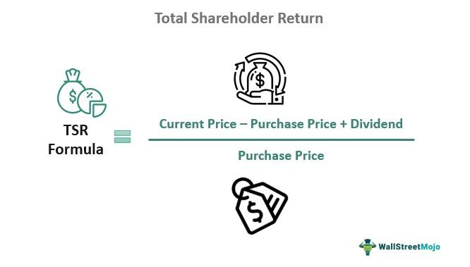

## Table of Contents

## What is Total Shareholder Return (TSR)?

Total Shareholder Return (TSR) is a way to measure how well a company is doing for its shareholders. It looks at how much money shareholders make from their investment in the company over a certain time. TSR includes any increase in the stock price, plus any dividends the company pays out. If you bought a stock for $100 and it went up to $110, and you also got $5 in dividends, your TSR would be 15%.

TSR is important because it shows the total gain from owning a stock, not just the price change. It helps investors see if they are getting a good return on their money. Companies often use TSR to compare themselves with other companies or to see how they are doing over time. A high TSR means the company is doing a good job of making money for its shareholders.

## Why is Total Shareholder Return important for investors?

Total Shareholder Return (TSR) is important for investors because it shows the total gain they get from owning a stock. It's not just about how much the stock price goes up or down. TSR also includes the dividends that a company pays out. This means it gives a full picture of how well an investor's money is working for them. By looking at TSR, investors can see if they are getting a good return on their investment.

Investors use TSR to compare different companies and see which ones are doing a better job at making money for their shareholders. If one company has a higher TSR than another, it might be a better choice for investing. TSR also helps investors track how well their investments are doing over time. If a company's TSR is growing, it means the company is doing well and the investor's money is growing too. This makes TSR a key tool for making smart investment decisions.

## What are the components of the Total Shareholder Return formula?

The Total Shareholder Return formula has two main parts: the change in the stock price and the dividends paid out. To find the change in the stock price, you take the price at the end of the period and subtract the price at the beginning. For example, if a stock was $100 at the start and $110 at the end, the change is $10. Then, you add any dividends the company paid during that time. If the company paid $5 in dividends, you add that to the $10 change in stock price.

To calculate TSR, you add the change in stock price and the dividends, then divide by the starting stock price. Using our example, you add $10 (the change in stock price) and $5 (the dividends) to get $15. Then, you divide $15 by the starting price of $100. This gives you 0.15, or 15% as the TSR. This way, TSR shows the total return an investor gets from a stock, including both price changes and dividends.

## How do you calculate the capital gains portion of TSR?

The capital gains part of Total Shareholder Return (TSR) is how much the stock price goes up or down. To find this, you take the price of the stock at the end of the time you're looking at and subtract the price at the start. For example, if a stock was $100 at the beginning and $110 at the end, the capital gain is $10. This shows how much money you made or lost just from the change in the stock's price.

This part of TSR is important because it tells you how well the stock did without counting the dividends. If the stock price goes up, you have a positive capital gain. If it goes down, you have a negative capital gain. Knowing this helps investors see if the stock itself is doing well, separate from any money the company pays out as dividends.

## How do you calculate the dividend yield portion of TSR?

The dividend yield part of Total Shareholder Return (TSR) is how much money you get from the dividends a company pays out. To find this, you take the total dividends you received during the time you're looking at and divide them by the price of the stock at the start. For example, if you got $5 in dividends and the stock was $100 at the beginning, the dividend yield is $5 divided by $100, which is 0.05 or 5%.

This part of TSR is important because it shows how much extra money you get from owning the stock, on top of any changes in the stock price. If a company pays good dividends, it can make your total return higher, even if the stock price doesn't go up much. Knowing the dividend yield helps investors see if a stock is a good choice for getting regular income from their investment.

## Can you provide a simple example of calculating TSR for a stock?

Let's say you bought a stock for $100 at the start of the year. By the end of the year, the stock price went up to $110. During the year, the company also paid you $5 in dividends. To find out your Total Shareholder Return (TSR), you need to add the change in the stock price and the dividends, then divide by the starting price.

First, you figure out the change in the stock price. The stock went from $100 to $110, so that's a $10 increase. Then, you add the $5 in dividends to the $10 increase, which gives you $15. Now, you divide $15 by the starting price of $100. That gives you 0.15, or 15%. So, your TSR for the year is 15%. This means your investment grew by 15% when you count both the stock price going up and the dividends you got.

## How does TSR differ from other investment performance metrics like ROI?

Total Shareholder Return (TSR) and Return on Investment (ROI) both measure how well an investment is doing, but they look at it in different ways. TSR focuses on what shareholders get from owning a stock. It includes the increase or decrease in the stock's price and any dividends paid out. This gives a full picture of how much money shareholders make over a certain time. TSR is especially useful for looking at stocks and comparing different companies.

ROI, on the other hand, is a broader measure that can be used for any kind of investment, not just stocks. It looks at the profit or loss from an investment compared to the amount of money put in. ROI is usually shown as a percentage and can be used for things like real estate, business projects, or savings accounts. While TSR is specific to stock investments and includes dividends, ROI can be applied to many types of investments and might not include regular payments like dividends.

## What are some common mistakes when calculating TSR?

One common mistake when calculating Total Shareholder Return (TSR) is not including the dividends. People sometimes only look at how much the stock price went up or down and forget to add the money they got from dividends. This can make the TSR seem lower than it really is because dividends are a big part of the total return.

Another mistake is using the wrong starting or ending stock prices. If you don't use the exact prices from the beginning and end of the time you're looking at, your TSR calculation will be off. It's important to make sure you're using the right numbers so your TSR is accurate.

## How can TSR be used to compare the performance of different companies?

TSR is a great way to compare how different companies are doing for their shareholders. By looking at the TSR, you can see which companies are making more money for their investors over time. If one company has a higher TSR than another, it means that company's stock and dividends are growing faster. This can help investors decide where to put their money. For example, if Company A has a TSR of 10% and Company B has a TSR of 5%, Company A is doing a better job at making money for its shareholders.

When comparing companies with TSR, it's important to look at the same time period for each company. This way, you can see a fair comparison. Also, remember that TSR can change from year to year, so it's good to look at TSR over several years to get a better idea of how a company is doing. Using TSR to compare companies helps investors make smarter choices about where to invest their money for the best returns.

## What are the limitations of using TSR as a performance metric?

Using TSR to measure how well a company is doing has some limits. One big problem is that TSR can be affected a lot by things outside the company's control, like the overall stock market going up or down. This means a company might look like it's doing great just because the market is doing well, not because the company itself is doing anything special. Also, TSR doesn't tell you anything about how the company is run or if it's making smart choices for the future. It just shows what happened to the stock price and dividends over a certain time.

Another limit is that TSR can be different for different people, depending on when they bought the stock. If you bought the stock at a different time than someone else, your TSR would be different, even if you're looking at the same company. This makes it hard to compare TSR across different investors. Plus, TSR doesn't show the whole picture of a company's health. It doesn't tell you about the company's debts, how much money it's making, or other important things that might affect its future. So, while TSR is useful, it's just one part of understanding how well a company is doing.

## How does reinvestment of dividends affect the calculation of TSR?

When you reinvest dividends, it means you use the money you get from dividends to buy more of the same stock instead of taking the cash. This can make your Total Shareholder Return (TSR) higher over time. If you reinvest, the extra shares you buy can also go up in price and earn more dividends, making your investment grow faster. To calculate TSR with reinvested dividends, you need to keep track of all the new shares you get and how they affect the total value of your investment.

Reinvestment changes how you figure out TSR because you're not just looking at the change in the stock price and the dividends you got in cash. Instead, you're looking at how those dividends helped you buy more shares and how those shares added to your total return. It's a bit more work to calculate, but it shows a more complete picture of how much your investment grew. If you don't count the reinvested dividends, you might miss out on seeing the full growth of your investment.

## What advanced considerations should be taken into account when calculating TSR for complex financial instruments?

When you're calculating TSR for complex financial instruments like options, futures, or convertible securities, you need to think about more things than just stock prices and dividends. These instruments can have special features that change their value in different ways. For example, options might have expiration dates and strike prices that affect their worth. Futures contracts depend on the price of the underlying asset and might need adjustments for things like margin calls. Convertible securities can turn into stock, which means you need to consider both the value of the security itself and the potential value if it's converted.

Because of these special features, calculating TSR for these instruments can get tricky. You might need to figure out the value of the instrument at different times, taking into account any payments or changes in the underlying asset. For options, you might need to look at the time value and intrinsic value separately. With futures, you'll need to consider the impact of daily settlements and any changes in the futures price. For convertible securities, you'll have to calculate the TSR both as if it stayed a security and as if it was converted to stock, then compare the two to see which gives a better return. All these extra steps make sure you get a full picture of how well your investment is doing.

## What is the Formula of Total Shareholder Return?

The formula for calculating Total Shareholder Return (TSR) is given by: 

$$
\text{TSR} = \frac{(\text{Current Price} - \text{Purchase Price}) + \text{Dividends}}{\text{Purchase Price}}
$$

This formula provides a comprehensive measure of shareholder wealth generated over a given investment period. The calculation takes into account two primary components: the price change of the stock and the dividends received. The first component, the difference between the current price and the purchase price, reflects the capital appreciation of the investment. Capital appreciation is a crucial indicator of a company's market performance and potential growth, as it represents the investor's gain (or loss) derived from changes in the stock price.

The second component, the dividends, represents the direct income received by the shareholder while holding the stock. Dividends are a tangible return on investment and are particularly significant in the case of companies that regularly distribute a portion of their earnings to shareholders. These payments are typically made quarterly and can significantly contribute to the return, especially in dividend-yielding stocks.

Together, these components offer insights into both realized gains from dividends and hypothetical gains from price changes, painting a holistic picture of the investment's performance. For example, consider a scenario where an investor purchases shares at $20 each. If the current market price per share rises to $24, and the investor has received $4.50 in dividends during the holding period, the TSR can be calculated as follows:

$$
\text{TSR} = \frac{(24 - 20) + 4.50}{20} = \frac{8.50}{20} = 0.425 \text{ or } 42.5\%
$$

This means the investment has yielded a total return of 42.5%, highlighting the effective use of TSR in assessing stock performance, especially when comparing investment opportunities or the performance of a portfolio over time.

## What are examples of Total Shareholder Return?

For instance, consider an investment that begins with a stock price of $20 per share. Over a certain period, this stock price appreciates to $24 per share, and the shareholder receives a total dividend payout of $4.50 during this time. The Total Shareholder Return (TSR) for this investment can be calculated as follows:

$$
TSR = \left(\frac{(24 - 20) + 4.50}{20}\right) \times 100\%

$$

This calculation yields a TSR of 42.5%, indicating a substantial return on investment when both price appreciation and dividend earnings are considered.

Historical examples further underscore the practicality of TSR in evaluating stock performance. For example, during the fiscal year 2020, Microsoft Corporation achieved a TSR of 59.4%. This impressive figure was driven by a combination of the company's robust stock price growth and its consistent dividend payments, reflecting Microsoft's ability to deliver significant value to its shareholders. Such examples demonstrate how TSR can serve as a crucial metric for assessing the overall performance and value generation potential of a company's equity over time.

## References & Further Reading

[1]: ["Advances in Financial Machine Learning"](https://www.amazon.com/Advances-Financial-Machine-Learning-Marcos/dp/1119482089) by Marcos Lopez de Prado.

[2]: ["Principles of Corporate Finance"](https://www.mheducation.com/highered/product/principles-corporate-finance-brealey-myers/M9781264080946.html) by Richard A. Brealey, Stewart C. Myers, and Franklin Allen.

[3]: ["Quantitative Trading: How to Build Your Own Algorithmic Trading Business"](https://www.amazon.com/Quantitative-Trading-Build-Algorithmic-Business/dp/1119800064) by Ernest P. Chan.

[4]: ["Machine Learning for Algorithmic Trading"](https://github.com/PacktPublishing/Machine-Learning-for-Algorithmic-Trading-Second-Edition) by Stefan Jansen.

[5]: Damodaran, A. (2012). ["Investment Valuation: Tools and Techniques for Determining the Value of Any Asset."](https://books.google.com/books/about/Investment_Valuation.html?id=5SRHAAAAQBAJ) Wiley Finance.