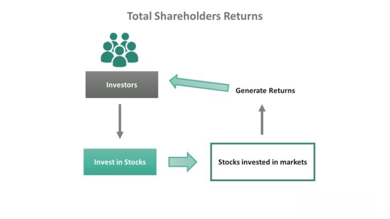

Total Shareholder Return (TSR) is a critical financial metric utilized by investors to evaluate the performance of an investment, especially within equity markets. TSR offers a holistic perspective by focusing on two key components of shareholder returns: capital appreciation and dividend payouts. Capital appreciation refers to the increase in the stock price over a specific period, while dividends provide direct income to shareholders. By combining these elements, TSR allows investors to understand the total financial benefits of holding a stock.

This measure has gained prominence in executive compensation schemes and investment analyses, establishing itself as a key performance indicator (KPI). Companies often link executive rewards to TSR benchmarks to align management’s objectives with shareholder interests, promoting long-term value generation. TSR is not only a tool for compensation but also a vital metric in investment decisions. Investors leverage TSR to compare the efficiency of different stocks or portfolios, making informed choices to maximize returns.



Given its comprehensive nature, TSR plays an integral role in various financial applications, including algorithmic trading strategies. Traders use TSR data to create automated systems that aim to enhance investment outcomes by executing trades based on predefined criteria. This article aims to explore the detailed aspects of TSR, such as its calculation, incorporation in algo trading, and broader impact on investment strategies.

## Table of Contents

## Understanding Total Shareholder Return (TSR)

Total Shareholder Return (TSR) is expressed as a percentage that indicates the total gains shareholders receive over a specific period. This metric is calculated by blending the changes in stock price with dividend payments, thus providing a comprehensive evaluation of an investment's performance. TSR is a critical tool for investors, offering insights into both immediate and long-term value creation by a company. It is particularly beneficial for assessing the sustained performance and value generation capability, as it encapsulates both realized returns through dividends and potential gains via changes in stock prices. This dual focus makes TSR an integral measure for evaluating the effectiveness of corporate strategies aimed at enhancing shareholder value.

## The Formula of Total Shareholder Return

The formula for calculating Total Shareholder Return (TSR) is given by: 

$$
\text{TSR} = \frac{(\text{Current Price} - \text{Purchase Price}) + \text{Dividends}}{\text{Purchase Price}}
$$

This formula provides a comprehensive measure of shareholder wealth generated over a given investment period. The calculation takes into account two primary components: the price change of the stock and the dividends received. The first component, the difference between the current price and the purchase price, reflects the capital appreciation of the investment. Capital appreciation is a crucial indicator of a company's market performance and potential growth, as it represents the investor's gain (or loss) derived from changes in the stock price.

The second component, the dividends, represents the direct income received by the shareholder while holding the stock. Dividends are a tangible return on investment and are particularly significant in the case of companies that regularly distribute a portion of their earnings to shareholders. These payments are typically made quarterly and can significantly contribute to the return, especially in dividend-yielding stocks.

Together, these components offer insights into both realized gains from dividends and hypothetical gains from price changes, painting a holistic picture of the investment's performance. For example, consider a scenario where an investor purchases shares at $20 each. If the current market price per share rises to $24, and the investor has received $4.50 in dividends during the holding period, the TSR can be calculated as follows:

$$
\text{TSR} = \frac{(24 - 20) + 4.50}{20} = \frac{8.50}{20} = 0.425 \text{ or } 42.5\%
$$

This means the investment has yielded a total return of 42.5%, highlighting the effective use of TSR in assessing stock performance, especially when comparing investment opportunities or the performance of a portfolio over time.

## Examples of Total Shareholder Return

For instance, consider an investment that begins with a stock price of $20 per share. Over a certain period, this stock price appreciates to $24 per share, and the shareholder receives a total dividend payout of $4.50 during this time. The Total Shareholder Return (TSR) for this investment can be calculated as follows:

$$
TSR = \left(\frac{(24 - 20) + 4.50}{20}\right) \times 100\%

$$

This calculation yields a TSR of 42.5%, indicating a substantial return on investment when both price appreciation and dividend earnings are considered.

Historical examples further underscore the practicality of TSR in evaluating stock performance. For example, during the fiscal year 2020, Microsoft Corporation achieved a TSR of 59.4%. This impressive figure was driven by a combination of the company's robust stock price growth and its consistent dividend payments, reflecting Microsoft's ability to deliver significant value to its shareholders. Such examples demonstrate how TSR can serve as a crucial metric for assessing the overall performance and value generation potential of a company's equity over time.

## Benefits and Drawbacks of Using TSR

Total Shareholder Return (TSR) offers several advantages that make it a popular metric among investors and businesses. One of the primary advantages is its simplicity. The calculation of TSR incorporates both stock price appreciation and dividends, providing a single percentage figure that represents total shareholder gains over a specific period. This simplicity allows for easy understanding and quick assessment of investment performance.

TSR also provides a comprehensive evaluation of a company's performance. By including both capital gains and dividend payouts, TSR delivers a more rounded picture of shareholder returns compared to metrics that consider only one of these components. This dual inclusion makes TSR particularly valuable for evaluating long-term performance and assessing the value-generation capacity of a business entity.

Furthermore, TSR proves advantageous for its comparability against industry benchmarks and competitors. Investors can easily compare TSR figures across different companies or sectors, making it easier to gauge relative performance in the equity markets. This comparability is crucial for making informed investment decisions and for companies attempting to align their performance with market expectations.

Despite these benefits, TSR has notable limitations. One significant drawback is its focus on past performance. TSR is a backward-looking measure, which might not always accurately predict future performance or potential value. This inherent limitation necessitates the use of complementary predictive tools and metrics for a well-rounded investment analysis.

Additionally, TSR might be sensitive to market [volatility](/wiki/volatility-trading-strategies). Share prices can fluctuate significantly due to market conditions, which can in turn affect TSR calculations. This sensitivity means that short-term changes in market conditions could impact TSR disproportionately, potentially leading to misleading inferences about a company's performance.

Lastly, TSR does not account for non-financial factors or qualitative aspects of a company's operations, such as management quality, innovation, or sustainability practices. Investors relying solely on TSR might overlook these critical elements, which can be vital to a company's long-term success.

In summary, while TSR provides a straightforward and comprehensive means of evaluating shareholder gains, it should be employed alongside other metrics and analyses to form a complete investment strategy that considers both quantitative and qualitative factors.

## TSR as a Key Performance Indicator

Total Shareholder Return (TSR) is increasingly recognized as a crucial Key Performance Indicator (KPI) in the corporate world, often forming a central component of executive compensation structures. Its use stems from the metric's ability to provide a holistic view of shareholder returns, integrating both capital gains and dividend distributions, thus aligning managerial activities with shareholder interests.

Corporate boards and compensation committees often utilize TSR to assess the effectiveness of executive management. By tying part of the executive compensation to TSR performance, companies incentivize executives to make decisions that enhance shareholder value over time. This alignment is designed to ensure that executives pursue strategies that improve TSR, reflecting the dual aspects of stock price growth and dividend payments.

Regular evaluation of TSR is common practice among many firms. Such evaluations are typically conducted annually or at the end of strategic plan cycles to determine whether the company's objectives align with long-term shareholder value creation. This approach allows firms to benchmark their performance against industry peers and overarching market trends.

The use of TSR as a performance indicator is not without complexities. It requires careful consideration of market conditions and industry-specific factors that may influence share price and dividend policy beyond management's control. Nonetheless, its comprehensive nature, combining cash flows and market perceptions of a firm's future prospects, makes TSR a powerful tool in both executive performance assessment and strategic planning.

## Total Shareholder Return in Algorithmic Trading

Total Shareholder Return (TSR) is increasingly utilized in [algorithmic trading](/wiki/algorithmic-trading) to refine and optimize investment strategies. Algorithms are designed to analyze TSR data, which encapsulates both capital appreciation and dividend incomes over specific periods, to automate trading decisions that aim to enhance long-term financial returns.

Algorithmic trading systems can efficiently process vast datasets, identifying trends and patterns in TSR that may be imperceptible to human traders. By evaluating TSR alongside other key performance indicators, these algorithms can dynamically adjust portfolios to maximize return potential while mitigating risk. This systematic approach reduces the need for manual intervention, enabling traders to execute trades with greater precision and at optimal times.

The use of TSR in algorithmic trading also supports [backtesting](/wiki/backtesting) strategies, where historical TSR data is used to simulate various trading scenarios. This process helps in the assessment of performance under different market conditions, thereby fine-tuning algorithms for future trading activities. Python, a favored programming language in financial markets for its versatility and rich libraries, is often employed to develop such algorithms. A basic Python example could involve using historical stock prices and dividends to calculate TSR and inform trading decisions:

```python
def calculate_tsr(current_price, purchase_price, dividends):
    return ((current_price - purchase_price) + dividends) / purchase_price

# Example usage:
historical_data = [
    {"current_price": 24, "purchase_price": 20, "dividends": 4.5},
    # More data points...
]

tsr_values = [calculate_tsr(data['current_price'], data['purchase_price'], data['dividends']) for data in historical_data]

optimal_trade_decisions = [tsr > threshold for tsr in tsr_values]  # threshold is a defined TSR value

print(optimal_trade_decisions)
```

Incorporating TSR into algorithmic models helps traders harness the full potential of data-driven insights, significantly improving the accuracy and timing of trades. This method allows for a balanced integration of TSR measures without being overly reliant on past performance, aligning trading strategies with the evolving dynamics of financial markets.

## Conclusion

Total Shareholder Return (TSR) is an essential metric in evaluating shareholder gains, integrating both dividends and capital appreciation. This comprehensive approach provides investors with a detailed picture of how effective a company's equity has been in generating returns. Unlike singular performance indicators, TSR offers a balanced overview by considering both cash flows and market value changes, making it highly effective for gauging historical performance.

While TSR delivers significant insights, it is crucial to use it in conjunction with other financial metrics to comprehensively evaluate investments. Metrics such as Return on Equity (ROE), Earnings per Share (EPS), and free cash flow are instrumental in offering additional perspectives. Relying solely on TSR can provide an incomplete picture due to its retrospective focus, therefore combining it with forward-looking indicators can enhance investment analysis.

Algorithmic trading platforms increasingly leverage TSR to inform their decision-making processes. These platforms utilize algorithms to systematically analyze TSR data, which aids in identifying patterns and opportunities for optimizing long-term investment outcomes. By incorporating TSR into automated trading strategies, traders can make more informed decisions, minimizing human biases while maximizing potential return through data-driven methodologies.

In summary, TSR remains a pivotal metric for investors and trading platforms alike, providing an inclusive view of shareholder gains through dividend payouts and stock price appreciation. However, for a well-rounded investment evaluation, it is best used alongside other financial measurements and modern trading technologies, ensuring a multidimensional analysis of a company's performance.

## FAQs: Total Shareholder Return

### FAQs: Total Shareholder Return

**What makes TSR a critical performance measure?**

Total Shareholder Return (TSR) is fundamental because it offers a consolidated view of a shareholder’s gains, combining both capital appreciation and dividend income. This comprehensive perspective allows investors to evaluate the effective performance of their holdings over time. By focusing on total returns rather than just price changes, TSR provides a more accurate reflection of an investment’s total value generation. It also serves as an equitable benchmark for comparing the performance of different companies or investment opportunities, as it standardizes returns in percentage terms. TSR is widely used in executive compensation schemes, aligning management's interests with those of shareholders by incentivizing higher returns.

**How often should Total Shareholder Return be calculated?**

The frequency of calculating TSR can depend on the investor's strategy and the context in which TSR is used. For regular investment tracking, a quarterly or annual calculation is common, as it allows investors to assess performance over significant periods and adjust their strategies accordingly. For internal corporate evaluations or executive performance reviews, TSR might be calculated at the end of each fiscal year to align with business cycles and financial reporting. In algorithmic trading or more dynamic investment environments, TSR might be calculated more frequently, potentially even on a monthly basis, to tweak trading strategies and optimize performance outcomes.

**What limitations should investors be aware of when using TSR?**

Despite its comprehensive nature, TSR has some limitations. Firstly, it is historically focused, meaning it reflects past performance rather than predicting future potential. This retrospective view can sometimes mislead investors if future market conditions or company prospects differ considerably from the past. Additionally, TSR is sensitive to short-term market volatility, which might distort performance assessments if measured over a very short period. It also doesn’t account for the different risk profiles between companies, which means that a high TSR does not necessarily indicate a low-risk investment. Investors should therefore use TSR alongside other financial metrics and qualitative assessments to gain a holistic understanding of their investments.

## References & Further Reading

[1]: ["Advances in Financial Machine Learning"](https://www.amazon.com/Advances-Financial-Machine-Learning-Marcos/dp/1119482089) by Marcos Lopez de Prado.

[2]: ["Principles of Corporate Finance"](https://www.mheducation.com/highered/product/principles-corporate-finance-brealey-myers/M9781264080946.html) by Richard A. Brealey, Stewart C. Myers, and Franklin Allen.

[3]: ["Quantitative Trading: How to Build Your Own Algorithmic Trading Business"](https://www.amazon.com/Quantitative-Trading-Build-Algorithmic-Business/dp/1119800064) by Ernest P. Chan.

[4]: ["Machine Learning for Algorithmic Trading"](https://github.com/PacktPublishing/Machine-Learning-for-Algorithmic-Trading-Second-Edition) by Stefan Jansen.

[5]: Damodaran, A. (2012). ["Investment Valuation: Tools and Techniques for Determining the Value of Any Asset."](https://books.google.com/books/about/Investment_Valuation.html?id=5SRHAAAAQBAJ) Wiley Finance.