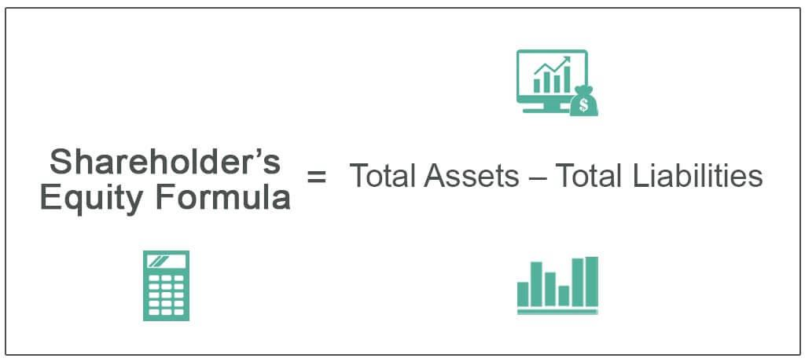

In finance, the ability to interpret financial statements is crucial for investors and traders alike. These documents provide a detailed snapshot of a company's financial condition, influencing strategic decisions and investment choices. This article focuses on the integration of financial statements, specifically stockholders' equity and balance sheets, with algorithmic trading to enhance decision-making. Stockholders' equity represents the ownership value held by shareholders, including initial capital and accumulated retained earnings, while balance sheets offer a comprehensive view of a company's assets, liabilities, and equity at a specific point in time.

By understanding the financial health of companies through these statements, algorithmic traders can develop models that predict market behavior. This predictive capability is achieved by analyzing trends and patterns within the financial data, which can signal potential investment opportunities or risks. For instance, significant fluctuations in stockholders' equity could indicate changes in a company's profitability, reinvestment strategies, or dividend policies, all of which are critical considerations for trading strategies.



Moreover, balance sheets serve as essential tools for determining a company's liquidity, solvency, and capital structure. Financial ratios derived from balance sheet data, such as the debt-to-equity ratio or current ratio, can help algorithmic models assess a company's leverage and liquidity status. This understanding enables traders to make informed decisions based on the perceived stability and risk associated with the company.

We explore how the components of financial statements can be strategically applied in algorithmic trading. This involves not only the identification of key metrics but also the integration of this data into algorithmic models. By embedding financial statement insights within trading algorithms, traders can enhance the accuracy and effectiveness of their strategies. As financial technology continues to evolve, the seamless incorporation of comprehensive financial data into trading systems remains a pivotal factor for competitive advantage in the market.

## Table of Contents

## Understanding Financial Statements

Financial statements are essential documents that provide a comprehensive view of a company's financial health, primarily by detailing its assets, liabilities, and stockholders' equity. These statements are indispensable tools for investors and traders as they enable informed decision-making by thoroughly evaluating a company's financial performance and position.

### Balance Sheet

The balance sheet is a critical component of financial statements, offering insightful data about a company's financial position at a specific point in time. It is structured around the accounting equation:

$$
\text{Assets} = \text{Liabilities} + \text{Equity}
$$

This equation underscores the resources controlled by the company (assets) and the claims against those resources by creditors (liabilities) and shareholders (equity). Understanding the balance sheet allows investors to gauge the financial viability and capitalization structure of a company.

**Assets** are typically categorized into current and non-current: 
- Current assets include cash, inventory, and accounts receivable, which are expected to be converted into cash or consumed within a year. 
- Non-current assets, such as property, plant, and equipment, represent long-term investments.

**Liabilities** are similarly divided:
- Current liabilities, including short-term debt and accounts payable, are obligations due within one year.
- Non-current liabilities, such as long-term debt, are due after one year.

### Stockholders' Equity

Stockholders' equity, a pivotal element of the balance sheet, represents the residual interest of shareholders after all liabilities have been settled. It can be computed as:

$$
\text{Equity} = \text{Total Assets} - \text{Total Liabilities}
$$

Equity comprises:
- **Common Stock**: Reflects the capital raised through issuing shares to investors.
- **Retained Earnings**: Accumulated profits that have been reinvested in the business rather than distributed as dividends.
- **Additional Paid-in Capital**: Represents the excess amount over the par value received from selling shares.

A thorough understanding of these components is crucial for assessing a company's financial stability and growth potential. For instance, a high level of retained earnings might indicate a robust capacity for reinvestment and growth, while substantial common stock issuance may signal efforts to secure more capital for expansion.

By examining a company’s balance sheet and stockholders' equity, investors and traders can make more informed assessments of a company's financial resilience and strategic direction. This comprehensive understanding is particularly valuable when predicting future performance and developing investment strategies.

## The Role of Stockholders' Equity in Financial Analysis

Stockholders' equity is a crucial element in evaluating a company’s value and financial stability. It consists of the initial capital invested by shareholders and the retained earnings that are reinvested back into the company. This metric provides a snapshot of the company’s net worth at a specific point in time by accounting for the total assets minus the total liabilities. Mathematically, it can be expressed as:

$$
\text{Stockholders' Equity} = \text{Total Assets} - \text{Total Liabilities}
$$

The composition of stockholders' equity offers insights into the company’s financial health by showing what proportion of the equity comes from investor funds and what is generated by the company itself through retained earnings. Analyzing changes in stockholders' equity over time can reveal significant information about a company's financial strategies, such as its profit reinvestment tactics and dividend distribution policies.

For instance, an increase in retained earnings suggests that a company is reinvesting its profits to potentially drive future growth rather than distributing dividends to shareholders. Conversely, consistent increases in dividends could indicate a mature company with stable cash flows that prefers rewarding its shareholders. Monitoring these changes can guide investors in interpreting how effectively a company is using its retained earnings to foster growth or sustain its operations versus rewarding its investors.

Besides providing historical context, stockholders' equity also influences investment decisions directly. A higher equity value generally signifies a larger buffer against potential losses, thereby indicating a more stable financial profile for the company. Conversely, an exceptionally low equity could imply high leverage, which might pose greater risk during economic downturns.

For shareholders, stockholders' equity represents their residual interest in the company and acts as a key driver for stock valuation models, such as the price-to-book (P/B) ratio. This metric compares a company’s market value to its book value and is used to assess whether the stock is undervalued or overvalued:

$$
\text{P/B Ratio} = \frac{\text{Market Price per Share}}{\text{Book Value per Share}}
$$

Understanding these dynamics helps investors make informed decisions, as they gauge the attractiveness of investing in a company relative to its underlying financial strength and strategic financial maneuvers. By closely examining stockholders' equity, analysts and investors can better understand a company’s capacity to generate returns on shareholders' investments, thus shaping their financial analysis and portfolio management strategies.

## Applications of Balance Sheets in Algo Trading

Balance sheets play a pivotal role in [algorithmic trading](/wiki/algorithmic-trading) by providing crucial data that can be transformed into actionable trading strategies. These financial statements offer a snapshot of a company's financial condition through its assets, liabilities, and equity, which serve as foundational elements for developing trading algorithms.

Key financial ratios derived from balance sheets, such as [liquidity](/wiki/liquidity-risk-premium) and solvency ratios, are integral to the decision-making processes in algorithmic trading. Liquidity ratios, like the current ratio and quick ratio, assess a company's ability to meet its short-term obligations, providing insights into financial stability. For example, the current ratio is calculated as follows:

$$
\text{Current Ratio} = \frac{\text{Current Assets}}{\text{Current Liabilities}}
$$

Solvency ratios, such as the debt-to-equity ratio, evaluate a company's ability to sustain operations in the long term by comparing its total liabilities to shareholders' equity:

$$
\text{Debt-to-Equity Ratio} = \frac{\text{Total Liabilities}}{\text{Shareholders' Equity}}
$$

These ratios are not only indicative of the financial health of a company but also serve as signals for potential trading opportunities. Algorithmic trading strategies leverage these indicators to anticipate market trends and assess risk levels, enabling traders to optimize trade execution. For instance, a high liquidity ratio might suggest a company is undervalued, prompting an algorithm to buy its stock.

Algorithmic trading systems often integrate these metrics into their models to automate and enhance trading performance. Python, a preferred programming language for algorithmic trading due to its simplicity and robust libraries, can be used to calculate these ratios and integrate them into trading algorithms. Here is a simple Python example to compute the current ratio:

```python
def current_ratio(current_assets, current_liabilities):
    return current_assets / current_liabilities

# Sample data
current_assets = 150000
current_liabilities = 100000

# Calculate current ratio
ratio = current_ratio(current_assets, current_liabilities)
print(f"Current Ratio: {ratio}")
```

By utilizing historical data, algorithms can backtest these indicators to refine strategies and mitigate risks. The integration of balance sheet data into algorithmic models facilitates more informed predictions of stock price movements and enhances trading precision.

In conclusion, the application of balance sheets in algorithmic trading provides a sophisticated approach to quantifying and interpreting critical financial data, empowering traders to make more informed and timely trading decisions. This integration not only improves the accuracy of trading strategies but also offers a competitive edge in the fast-paced financial markets.

## Analyzing a Balance Sheet: Practical Steps

Analyzing a balance sheet is crucial for evaluating a company's financial health. The balance sheet provides a snapshot of a company’s assets, liabilities, and shareholders' equity, which together define its financial position. Understanding and interpreting the key metrics derived from a balance sheet is essential for making informed investment decisions.

### Key Metrics

1. **Debt-to-Equity Ratio**: This metric provides insights into a company's financial leverage by comparing its total liabilities to shareholders' equity. It is calculated as:
$$
   \text{Debt to Equity Ratio} = \frac{\text{Total Liabilities}}{\text{Shareholders' Equity}}

$$

   A high ratio indicates that a company is primarily financed by debt, which could pose risks if the company faces financial difficulties.

2. **Current Ratio**: This ratio measures a company's ability to meet short-term obligations with its short-term assets. It is expressed as:
$$
   \text{Current Ratio} = \frac{\text{Current Assets}}{\text{Current Liabilities}}

$$

   A current ratio above 1 suggests that the company has more current assets than current liabilities, indicating good liquidity.

### Step-by-Step Guidance

1. **Gather Financial Data**: Obtain the latest balance sheet of the company. Financial statements can typically be found in the investor relations section of a company's website or financial data portals.

2. **Calculate Key Ratios**: Use the formulas provided to compute the debt-to-equity and current ratios. This can be done manually or through programming languages such as Python for automation and analysis of multiple companies:

   ```python
   import pandas as pd

   def calculate_ratios(df):
       df['Debt_to_Equity'] = df['Total Liabilities'] / df['Shareholders Equity']
       df['Current_Ratio'] = df['Current Assets'] / df['Current Liabilities']
       return df[['Debt_to_Equity', 'Current_Ratio']]

   # Example DataFrame setup
   data = {'Total Liabilities': [500000, 1200000],
           'Shareholders Equity': [300000, 800000],
           'Current Assets': [200000, 600000],
           'Current Liabilities': [150000, 400000]}

   df = pd.DataFrame(data)
   ratios = calculate_ratios(df)
   print(ratios)
   ```

3. **Interpret Results**: Evaluate the computed ratios relative to industry norms and historical data of the company to gain insights into financial performance. For instance, a higher current ratio compared to industry peers might indicate superior liquidity, whereas a significantly higher debt-to-equity ratio might call for further investigation into the company's debt management.

4. **Real-World Example**: Suppose a company reports total liabilities of $500,000, shareholders' equity of $300,000, current assets of $200,000, and current liabilities of $150,000. Calculating the ratios:

   - Debt to Equity Ratio = 500,000 / 300,000 = 1.67
   - Current Ratio = 200,000 / 150,000 = 1.33

   These results suggest that the company has relatively high leverage and adequate liquidity.

By carefully calculating and interpreting these and other balance sheet metrics, investors and analysts can gain valuable insights into a company's financial stability and make more informed trading decisions.

## Integrating Financial Statements with Algorithmic Models

Algorithmic models in trading rely heavily on the integration of financial statements to improve accuracy in forecasting stock price movements and market trends. Financial statements, such as balance sheets, offer a rich tapestry of historical financial performance metrics that serve as inputs for these models. One of the primary reasons for utilizing these documents is their ability to provide verifiable data on a company's financial health, which can be predictive of future market behavior.

### The Importance of Financial Statements

Financial statements, including balance sheets, profit and loss statements, and cash flow reports, form the backbone of algorithmic trading models. These statements supply valuable data, such as earnings, liabilities, and stockholders' equity, which are essential for modeling and predicting market trends. By analyzing these components, traders can discern patterns and develop algorithms capable of assessing potential risks and returns.

### Enhancing Algorithmic Precision with Balance Sheets

Balance sheets, specifically, contain critical data that can be systematically analyzed to improve the precision of trading algorithms. The balance sheet displays a company's assets, liabilities, and equity at a specific point in time, forming the basis for calculating several key financial ratios such as the current ratio, return on equity, and debt-to-equity ratio. These ratios can be incorporated into trading algorithms to enhance market predictions and trading decisions.

For instance, an algorithm might utilize the debt-to-equity ratio as a threshold indicator to filter stocks. In Python, this could look something like:

```python
import numpy as np
import pandas as pd

def calculate_debt_to_equity_ratio(balance_sheet):
    total_liabilities = balance_sheet['Total Liabilities']
    stockholders_equity = balance_sheet['Stockholders Equity']
    return total_liabilities / stockholders_equity

balance_sheet_data = {
    'Total Liabilities': np.array([100000, 120000, 130000]),
    'Stockholders Equity': np.array([50000, 60000, 55000])
}

ratios = calculate_debt_to_equity_ratio(balance_sheet_data)
print(ratios)
```

This approach demonstrates how balance sheet analysis can be systematically applied to develop or refine algorithmic trading models.

### Techniques for Integration

Several sophisticated techniques facilitate the integration of financial statement data into algorithmic models. One such technique involves [machine learning](/wiki/machine-learning) algorithms, which excel at identifying complex, non-linear relationships within financial data. These algorithms can be trained on historical balance sheet data to predict stock price movements based on a company's financial health indicators.

Another technique is the use of statistical methods, such as regression analysis, which helps quantify the relationship between financial metrics and stock performance. Regression models can predict future stock prices based on changes in balance sheet components like net assets and liabilities.

Lastly, natural language processing can be used to analyze qualitative information found within financial reports, such as management discussions or footnotes, providing additional insights that are not readily quantifiable.

### Conclusion

Incorporating financial statement analysis into algorithmic trading models significantly boosts the accuracy and efficacy of trading strategies. Techniques such as financial ratio analysis, machine learning, and statistical methods offer powerful tools for decoding the wealth of information contained within financial documents. As algorithms become more sophisticated, the fusion of financial statement analysis and trading models will continue to evolve, providing traders with substantial competitive advantages.

## Conclusion

Financial statements, particularly balance sheets and stockholders' equity, are integral to informing trading strategies and investment decisions. These documents provide crucial insights into a company's financial health, offering data that is essential for evaluating investment opportunities. For algorithmic traders, the ability to synthesize this information into their trading models provides a competitive edge through improved data-driven insights. By leveraging detailed financial metrics, traders can refine their algorithms to account for variables such as liquidity, solvency, and profitability, potentially forecasting stock price movements and market trends with greater accuracy.

Incorporating financial analysis into algorithmic trading enables the creation of robust strategies that adapt to market conditions. Algorithms can be coded to react to changes in financial ratios derived from balance sheets, offering automated responses to complex financial signals. This approach not only enhances the precision of trading operations but also allows for a systematic evaluation of risk and return factors. For example, metrics like the debt-to-equity ratio or current ratio can be directly translated into algorithmic parameters, providing real-time assessment of financial leverage and liquidity positions.

As financial technology continues to advance, the integration of complex financial data into trading algorithms will become even more sophisticated. Emerging technologies such as machine learning and [artificial intelligence](/wiki/ai-artificial-intelligence) are paving the way for more nuanced interpretations of financial statements, enabling traders to uncover patterns and correlations that were previously imperceptible. This evolution underscores the importance of staying informed on the latest developments in financial data analysis and technology integration. Maintaining an adaptive and effective trading strategy necessitates constant vigilance and willingness to embrace these innovations.

In conclusion, the utilization of financial statements, and specifically balance sheets and stockholders' equity, in algorithmic trading strategies provides significant advantages. By fostering a deeper understanding of financial health and market dynamics, traders can enhance the effectiveness of their decision-making processes. As technological capabilities expand, the fusion of financial analysis with algorithmic trading is likely to become an indispensable asset for traders aiming to achieve sustained success in the financial markets.

## FAQs

### What is the purpose of a balance sheet in financial statements?

A balance sheet is a financial statement that provides a snapshot of a company's financial position at a specific point in time. It details the company's assets, liabilities, and stockholders' equity, enabling stakeholders to assess the company's financial health and stability. The balance sheet follows the accounting equation: 
$$
\text{Assets} = \text{Liabilities} + \text{Stockholders' Equity}
$$
This equation underscores the balance between what a company owns and owes, as well as the residual interest of shareholders. Understanding this relationship helps investors and creditors evaluate a company's ability to meet its financial obligations and its capacity for growth and profitability.

### How is stockholders' equity calculated and why is it important?

Stockholders' equity is calculated by subtracting a company's total liabilities from its total assets, as shown in the formula:

$$
\text{Stockholders' Equity} = \text{Total Assets} - \text{Total Liabilities}
$$

It represents the net value of a company available to shareholders after all liabilities have been paid. Stockholders' equity is crucial because it indicates the company's financial resilience and stability. It reflects the capital provided by shareholders and accumulated earnings not distributed as dividends. A positive and growing stockholders' equity suggests financial health, while a decline might indicate potential financial distress.

### What are some common financial ratios used in algorithmic trading?

In algorithmic trading, several financial ratios derived from balance sheets are used to evaluate company performance and market trends. Key ratios include:

1. **Current Ratio**: Measures a company's ability to meet short-term obligations with its current assets.
   \[ \text{Current Ratio} = \frac{\text{Current Assets}}{\text{Current Liabilities}}
$$

2. **Debt-to-Equity Ratio**: Evaluates financial leverage by comparing total liabilities to stockholders' equity.
   \[ \text{Debt-to-Equity Ratio} = \frac{\text{Total Liabilities}}{\text{Stockholders' Equity}}
$$

3. **Return on Equity (ROE)**: Assesses a company's profitability relative to shareholder equity.
   \[ \text{ROE} = \frac{\text{Net Income}}{\text{Stockholders' Equity}}
$$

These ratios help algorithmic traders identify potential investment opportunities and risks by quantifying a company's financial health.

### How can balance sheets and stockholders' equity improve trading strategies?

Balance sheets and stockholders' equity provide essential data for algorithmic trading models, enhancing their predictive capabilities. By integrating balance sheet analysis, traders can develop strategies based on a company's liquidity, leverage, and capital efficiency. For instance, a strong current ratio might indicate a company's sound liquidity position, prompting algorithms to favor long positions. Conversely, a high debt-to-equity ratio might signal financial risk, leading to protective or short trade strategies. This data-driven approach enables traders to execute more informed and precise trades, leveraging financial stability indicators to stay competitive in rapidly changing markets.

## References & Further Reading

[1]: Bergstra, J., Bardenet, R., Bengio, Y., & Kégl, B. (2011). ["Algorithms for Hyper-Parameter Optimization."](https://dl.acm.org/doi/10.5555/2986459.2986743) Advances in Neural Information Processing Systems 24.

[2]: ["Advances in Financial Machine Learning"](https://www.amazon.com/Advances-Financial-Machine-Learning-Marcos/dp/1119482089) by Marcos Lopez de Prado

[3]: ["Evidence-Based Technical Analysis: Applying the Scientific Method and Statistical Inference to Trading Signals"](https://www.amazon.com/Evidence-Based-Technical-Analysis-Scientific-Statistical/dp/0470008741) by David Aronson

[4]: ["Machine Learning for Algorithmic Trading"](https://github.com/stefan-jansen/machine-learning-for-trading) by Stefan Jansen

[5]: ["Quantitative Trading: How to Build Your Own Algorithmic Trading Business"](https://www.amazon.com/Quantitative-Trading-Build-Algorithmic-Business/dp/1119800064) by Ernest P. Chan