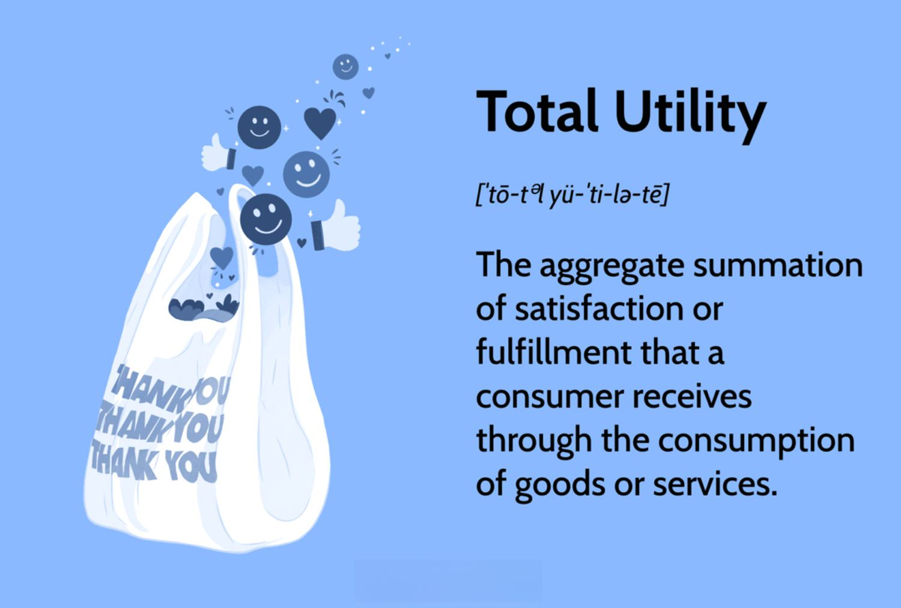

In the world of economics, utility is a fundamental concept that serves as a cornerstone for understanding consumer behavior and decision-making processes. Utility is a measure of satisfaction or happiness that consumers derive from consuming goods and services. It is divided into two essential types: total utility and marginal utility. Total utility represents the overall satisfaction obtained by consuming a certain quantity of goods or services, while marginal utility refers to the additional satisfaction gained from consuming an extra unit of a good or service. These concepts enable economists to quantify and analyze the levels of satisfaction, thus predicting consumer demand patterns and decision-making.

On a different front, algorithmic trading is revolutionizing financial markets by leveraging technological advancements. It employs computer algorithms to automate trading strategies, relying heavily on economic theories and principles. By integrating these quantitative frameworks with vast computational power, algorithmic trading systems can execute complex trading strategies with speed and efficiency.



This article will explore the intersection of total utility in economics and its practical application in algorithmic trading. Through the exploration of key concepts, real-world examples, and practical demonstrations, we will show how the principles of utility enhance decision-making processes in trading environments. From assessing consumer satisfaction to optimizing trading decisions, these economic concepts provide valuable insights for both economists and financial professionals seeking to innovate within their respective fields.

## Table of Contents

## Understanding Total Utility

Total utility represents the cumulative satisfaction or fulfillment a consumer derives from consuming a specific quantity of goods or services. This concept is pivotal for economists as it aids in assessing demand patterns and forecasting consumer behavior within an economy. By quantifying utility in hypothetical units known as 'utils', economists can perform comparative analyses to better understand consumer preferences.

The notion of total utility is fundamental to consumer choice theory, which often integrates rational choice theory to comprehend decision-making processes. Rational choice theory posits that consumers make decisions based on maximizing their satisfaction given constraints such as income and prices. Therefore, total utility serves as an essential gauge of this satisfaction.

Central to the understanding of total utility is the law of diminishing marginal utility. This principle states that as a consumer increases the consumption of a good or service, the additional satisfaction gained from each extra unit decreases. For instance, the first slice of pizza may provide high satisfaction, but by the fourth or fifth slice, the additional enjoyment diminishes significantly. This law helps explain consumer behavior in terms of balancing the quantity consumed with the marginal utility gained.

To mathematically express total utility, consider $TU = \sum_{i=1}^{n} MU_i$, where $TU$ is the total utility and $MU_i$ represents the marginal utility of each unit $i$ consumed, summed across all units. This formula highlights how total utility accumulates as the sum of individual marginal utilities, thereby informing consumer decision-making.

Moreover, understanding total utility is key to explaining why consumers choose particular goods over others. By evaluating the total utility gained versus the cost, consumers aim to obtain the highest possible satisfaction from their available wealth. This understanding facilitates predictions about consumption patterns and the subsequent impact on economic markets.

## Calculating and Maximizing Total Utility

The calculation of total utility is a fundamental concept in economics, representing the aggregate satisfaction a consumer derives from consuming multiple units of goods or services. This is achieved by summing the marginal utilities of each consumed unit. Marginal utility refers to the additional satisfaction obtained from consuming an additional unit of a good or service. Therefore, the total utility (TU) can be expressed as:

$$
TU = \sum_{i=1}^{n} MU_i
$$

where $MU_i$ is the marginal utility of the i-th unit consumed, and $n$ is the total number of units.

To illustrate, consider a simple scenario involving the purchase of chocolate bars. Suppose the utility derived from consuming one chocolate bar is 10 utils, the second provides 8 utils, the third 6 utils, and so on, following the law of diminishing marginal utility. The total utility from consuming these bars would be the sum of the utilities from each bar consumed.

Economics posits that consumers aim to maximize their utility within budget constraints. This involves assessing the price of goods and the associated satisfaction derived from their consumption. Rational consumers will continue to purchase additional units until the marginal utility per dollar spent is equalized across all goods and services within their consumption bundle.

For example, a consumer with a budget constraint might choose between chocolate bars and ice cream. If the marginal utility of the last chocolate bar is 6 utils and it costs $2, while the marginal utility of ice cream is 9 utils costing $3, the consumer would aim to balance these utilities. The decision criterion would involve comparing the marginal utility per dollar spent (MU/price), favoring the good with the higher ratio until parity is reached.

Understanding these calculations is vital for economists and businesses as they create detailed consumer profiles. Through analyzing total utility, businesses can predict purchasing patterns, tailor their offerings, and adjust pricing strategies to maximize consumer satisfaction.

Incorporating these insights into algorithmic models can provide predictive analytics for various economic behaviors, contributing to strategic decision-making processes.

## Total Utility in Algorithmic Trading

Algorithmic trading integrates computational algorithms with economic theories to automate and enhance investment strategies. A critical aspect of [algorithmic trading](/wiki/algorithmic-trading) is the incorporation of total utility—a concept from economics that quantifies consumer satisfaction—to optimize decision-making processes.

Algorithms analyze vast amounts of historical financial data and consumer behavior patterns to forecast market movements. By understanding the utility or perceived value of assets, these algorithms can make more informed trading decisions. This is done by evaluating expected returns and adjusting portfolios to align with market conditions and maximize potential returns.

To illustrate, consider an algorithm that evaluates the utility of a stock based on expected market behavior. By assigning a utility score to different assets, the algorithm can prioritize trades that offer the highest aggregate utility. This approach ensures that investment strategies are not solely based on price movements but also consider the broader economic satisfaction derived from trading specific assets.

Simulating various market scenarios where utility is maximized allows traders to predict future conditions more accurately. This simulation process is akin to stress testing financial models, offering insights into potential profitability and risk across different market environments. For example, algorithms can use Monte Carlo simulations to optimize portfolios by generating random price paths and calculating the utility of each potential path. The following is a simplified Python code example demonstrating this concept:

```python
import numpy as np

def monte_carlo_simulation(initial_price, num_simulations, num_days, mu, sigma):
    dt = 1/num_days
    prices = np.zeros((num_days, num_simulations))
    prices[0] = initial_price

    for t in range(1, num_days):
        rand = np.random.standard_normal(num_simulations)
        prices[t] = prices[t-1] * np.exp((mu - 0.5 * sigma**2) * dt + sigma * np.sqrt(dt) * rand)

    return prices

# Parameters for the simulation
initial_stock_price = 100
num_simulations = 1000
num_days = 252
expected_return = 0.05
volatility = 0.2

simulated_prices = monte_carlo_simulation(initial_stock_price, num_simulations, num_days, expected_return, volatility)
```

This code generates simulations to evaluate possible outcomes and their associated utilities, informing strategic decisions in algorithmic trading.

The integration of total utility in trading systems exemplifies the application of economic principles to achieve efficient and profitable outcomes. By leveraging utility functions, algorithmic traders can improve decision-making processes, offering more refined strategies to capitalize on market opportunities. This approach not only aligns trading strategies with economic theories, but also enhances the efficacy of investments through strategic optimization.

## Examples of Total Utility in Economics and Trading

Consider a scenario where a consumer decides how many chocolate bars to purchase, each providing a certain level of utility based on the satisfaction it delivers. Suppose the utility derived from the first chocolate bar is 10 utils, the second bar provides an additional 8 utils, the third 5 utils, and the fourth 2 utils. Here, the law of diminishing marginal utility is apparent, as each successive chocolate bar adds a smaller increase in satisfaction. If each chocolate bar costs a fixed price, the consumer’s decision hinges on maximizing their total utility while considering their budget constraints. Consumers will continue purchasing up to the point where the utility gained from an additional bar equals the cost, ensuring that their expenditure is justified by the derived satisfaction.

In algorithmic trading, similar principles are applied to asset evaluation. An algorithm assesses the utility of assets by analyzing expected returns, adjusting portfolios to optimize total utility. For instance, an algorithm may predict that holding a particular stock provides an expected utility of 15 units, while another offers 10 units. However, if acquiring these stocks costs the same, the algorithm prioritizes the one with higher utility. By incorporating historical data and market trends, the algorithm adapts, shifting investments to maintain a portfolio that maximizes utility. 

Furthermore, economic theories like the law of diminishing marginal utility also inform trading algorithms. As traders acquire more of an asset, the incremental benefit of additional units typically declines. Algorithms account for this diminishing return by reallocating resources to maintain an optimal balance of satisfaction (or profitability) per unit investment. This balancing act, guided by the utility maximization framework, aligns resource constraints with desired outcomes, whether in consumer purchases or investment strategies.

In both economics and trading, the concept of utility plays a critical role in decision-making. Consumers and algorithms strive to balance costs against satisfaction or potential profits, demonstrating utility's pivotal role in resource allocation and strategic planning.

## Limitations and Criticisms

Total utility, while a central concept in economic theory, has notable limitations due to its inherently subjective nature. Utility attempts to quantify satisfaction, yet satisfaction levels can vary significantly between individuals, making it difficult to apply universally. Each person derives different levels of pleasure or fulfillment from consuming the same goods or services, complicating efforts to model consumer behavior accurately.

One of the primary challenges in working with utility is its quantification. Measuring utility in precise numerical terms is a complex task, often requiring economists to rely on simplifications, such as hypothetical units called 'utils'. These simplifications might not capture the nuanced realities of individual preferences and consumption patterns. As a result, economic models based on utility calculations can fall short in accurately reflecting consumer behavior.

Additionally, the assumption of rational behavior, foundational to traditional utility theory, doesn't always hold in practice. Real-world consumer decisions are influenced by a variety of external factors — social norms, cultural influences, emotions, and cognitive biases — which can lead to irrational behaviors that deviate from the predictions of classical economic models. This deviation presents a significant obstacle to using total utility as a sole predictor of consumer decisions.

Behavioral economics has emerged as a field that addresses these shortcomings by examining how psychological factors and cognitive biases affect economic decisions. It provides more comprehensive insights when used alongside traditional utility-based theories. By incorporating elements of behavioral economics, researchers can better understand the complexities of consumer decision-making. For instance, factors such as loss aversion, where consumers prefer to avoid losses rather than seek equivalent gains, and the endowment effect, where people ascribe higher value to things just because they own them, play critical roles in consumption choices that traditional utility theory might overlook.

In sum, while total utility is a valuable framework for analyzing consumer behavior, its limitations highlight the need for a multifaceted approach that considers both traditional economic principles and behavioral insights. This combined methodology enhances the accuracy and relevance of economic models, offering a more nuanced understanding of market dynamics and consumer decision-making.

## Conclusion

Total utility remains a foundational concept in economics, playing a crucial role in understanding consumer behavior and market dynamics. By quantifying the satisfaction derived from goods and services, it allows economists and traders to better gauge demand patterns and forecast economic activities. In algorithmic trading, the application of total utility contributes significantly to strategy development. By integrating total utility into trading algorithms, traders can gain insights into potential returns and perform comprehensive risk assessments. This integration helps optimize trading decisions and improve profitability.

While total utility's subjective nature poses challenges in measurement and application, it nevertheless offers a robust framework for analyzing consumer choices and financial trading scenarios. The conventional utility framework, with its foundations in rational choice theory, still provides valuable insights, but its effectiveness can be enhanced by incorporating behavioral insights. By understanding the nuances of human behavior and its deviations from traditional economic models, utility-based analyses can gain greater precision, leading to more accurate economic predictions and efficient trading systems.

Ultimately, the study of utility bridges the gap between economic theory and its practical applications. It fosters innovation and efficiency across different fields by providing an analytical structure to evaluate choices and drive strategic decisions in both consumer markets and financial sectors. As trading systems continue to evolve with technology, total utility remains integral to the development of sophisticated, adaptive trading strategies that can navigate complex market environments.

## References & Further Reading

[1]: Bergstra, J., Bardenet, R., Bengio, Y., & Kégl, B. (2011). ["Algorithms for Hyper-Parameter Optimization."](https://papers.nips.cc/paper/4443-algorithms-for-hyper-parameter-optimization) Advances in Neural Information Processing Systems 24.

[2]: ["Advances in Financial Machine Learning"](https://www.amazon.com/Advances-Financial-Machine-Learning-Marcos/dp/1119482089) by Marcos Lopez de Prado

[3]: ["Evidence-Based Technical Analysis: Applying the Scientific Method and Statistical Inference to Trading Signals"](https://www.amazon.com/Evidence-Based-Technical-Analysis-Scientific-Statistical/dp/0470008741) by David Aronson

[4]: ["Machine Learning for Algorithmic Trading"](https://github.com/PacktPublishing/Machine-Learning-for-Algorithmic-Trading-Second-Edition) by Stefan Jansen

[5]: ["Quantitative Trading: How to Build Your Own Algorithmic Trading Business"](https://books.google.com/books/about/Quantitative_Trading.html?id=j70yEAAAQBAJ) by Ernest P. Chan