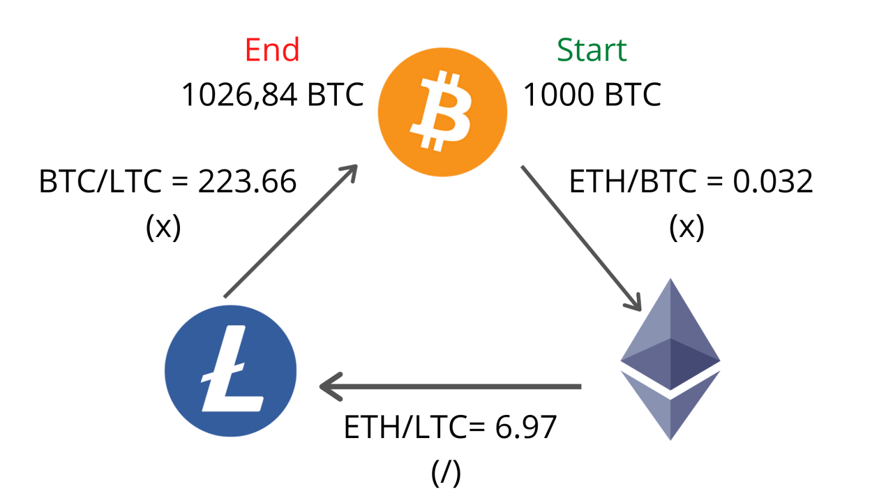

## Table of Contents

## What is Total Value Locked (TVL) in cryptocurrency?

Total Value Locked, or TVL, is a term used in the world of cryptocurrency to show how much money is being used in a specific platform or project. It's like a measure of how popular and trusted a platform is. When people put their money into a platform, like a decentralized finance (DeFi) app, that money is "locked" in the platform. The more money that is locked, the higher the TVL, and the more people trust and use the platform.

TVL is important because it helps people see which platforms are doing well and which ones might be worth investing in. If a platform has a high TVL, it means a lot of people believe in it and are using it. But, TVL isn't everything. Sometimes, a high TVL can be a sign that a platform is risky because it might be growing too fast. So, it's good to look at TVL along with other information to make smart choices about where to put your money.

## Why is TVL important in the crypto ecosystem?

TVL, or Total Value Locked, is a big deal in the world of cryptocurrencies because it shows how much money people are putting into different platforms. It's like a popularity contest where the platforms with the most money locked in them are seen as the most trusted and used. When a platform has a high TVL, it means a lot of people believe in it and are willing to use it for things like lending, borrowing, or trading. This can attract even more users because people often want to go where others are already going.

But TVL isn't just about showing which platforms are popular. It also helps investors and users make decisions. If a platform has a high TVL, it might be a good place to invest because it shows that others trust it. However, a high TVL can sometimes be a warning sign too. If a platform's TVL is growing really fast, it might mean it's getting too risky. So, while TVL is a helpful tool, it's important to look at other things too, like the platform's security and how it works, to make the best choices.

## How is TVL calculated in decentralized finance (DeFi) platforms?

TVL, or Total Value Locked, in DeFi platforms is figured out by adding up all the money that people have put into the platform. This money can be in different forms like cryptocurrencies or tokens. To get the TVL, you take the total amount of these assets and then convert them into a common currency, usually the U.S. dollar, so you can compare different platforms easily. This conversion uses the current market price of the assets.

Sometimes, calculating TVL can be a bit tricky because different platforms might count things differently. For example, some platforms might include money that's just sitting there and not being used, while others might only count money that's actively being used in things like lending or staking. Also, the value of the assets can change all the time, so the TVL number can go up and down a lot. Even with these challenges, TVL is still a really helpful way to see how much people trust and use a DeFi platform.

## What are the main factors that affect TVL in a DeFi project?

The main factors that affect TVL in a DeFi project are the platform's reputation and how much people trust it. When a platform is known for being safe and reliable, more people are likely to use it and lock their money into it. This trust can come from things like having a good security record, being around for a long time, or having a strong team behind it. Also, if a platform offers good rewards or interest rates for using it, more people might be attracted to it, which can increase the TVL.

Another big factor is how easy and useful the platform is. If a DeFi project has a simple and friendly interface that makes it easy for people to do things like lend, borrow, or trade, more people will use it. Plus, if the platform has a lot of different services or features that people find helpful, it can attract more users and increase the TVL. The overall market conditions and trends in the crypto world can also play a role. If the market is doing well and people are excited about DeFi, more money might flow into these platforms, pushing up the TVL.

## Can TVL be used as a measure of a DeFi platform's success?

TVL can be a good way to see if a DeFi platform is doing well. It shows how much money people are putting into the platform, which means they trust it and think it's worth using. When a platform has a high TVL, it often means it's popular and doing a good job. People look at TVL to compare different platforms and decide where to put their money.

But TVL isn't the only thing that matters. Sometimes, a high TVL can mean the platform is growing too fast and might be risky. It's important to look at other things too, like how safe the platform is, how easy it is to use, and what kind of services it offers. So while TVL can help show if a platform is successful, it's best to use it along with other information to get the full picture.

## How does TVL fluctuate and what causes these fluctuations?

TVL, or Total Value Locked, goes up and down all the time in DeFi platforms. This happens because the value of the cryptocurrencies and tokens locked in the platform can change a lot. If the price of a token goes up, the TVL will go up too, even if no one added more money to the platform. On the other hand, if the price goes down, the TVL will drop. Also, when people decide to put more money into a platform or take their money out, this can make the TVL change. If a platform is offering really good rewards or if it's getting a lot of attention, more people might want to use it, which can push the TVL higher.

Another reason TVL fluctuates is because of what's happening in the whole crypto market. If the market is doing well and people are feeling good about cryptocurrencies, they might be more willing to try out new DeFi platforms, which can increase TVL. But if the market is doing badly or if there's bad news about a platform, people might pull their money out, making the TVL go down. Sometimes, big events like new features being added to a platform or security issues can cause quick changes in TVL too. So, TVL can move around a lot because of many different things happening both inside and outside the platform.

## What are some of the most popular platforms for tracking TVL in cryptocurrencies?

Some of the most popular platforms for tracking TVL in cryptocurrencies are DefiLlama and DeFi Pulse. DefiLlama is really easy to use and gives you a clear picture of TVL across different DeFi platforms. It shows you the total TVL for each platform and even breaks it down by the different blockchains like Ethereum, Binance Smart Chain, and others. This makes it simple to see which platforms are doing well and where people are putting their money.

DeFi Pulse is another go-to place for checking TVL. It's been around for a while and is trusted by a lot of people in the crypto world. Like DefiLlama, DeFi Pulse shows you the TVL for different DeFi platforms and updates the numbers in real time. It also gives you extra info like how the TVL has changed over time, which can help you understand trends and make better decisions about where to invest your money.

## How can TVL be compared across different blockchain networks?

TVL can be compared across different blockchain networks by looking at the total amount of money locked in DeFi platforms on each network. To do this, you need to convert the value of all the cryptocurrencies and tokens locked on each blockchain into a common currency, usually the U.S. dollar. This way, you can see which blockchain has the highest TVL and understand where people are putting their money. Websites like DefiLlama and DeFi Pulse make this easy by showing you the TVL for different blockchains side by side.

Comparing TVL across blockchains helps you see which ones are more popular and trusted for DeFi. For example, if Ethereum has a much higher TVL than other blockchains, it means more people are using Ethereum for DeFi projects. But it's important to remember that a high TVL doesn't always mean a blockchain is better or safer. You should also look at other things like the blockchain's security, how fast transactions are, and what kind of DeFi projects are available on it.

## What are the risks associated with high TVL in a DeFi protocol?

When a DeFi protocol has a high TVL, it can mean that a lot of people trust it and are using it. But it can also mean there are more risks. One big risk is that the platform might be growing too fast. If a lot of money is coming in quickly, the platform might not be able to handle it well. This can lead to problems like slow transactions or even crashes. Also, if something goes wrong, like a security hack, there's more money at risk because so much is locked in the platform.

Another risk is that high TVL can attract bad actors. If a platform has a lot of money locked in it, hackers might see it as a big target. They might try to steal the money or find other ways to take advantage of the platform. Plus, when a lot of people are using a platform, there's more chance for mistakes or fraud. If people aren't careful, they might lose their money. So, while a high TVL can be a good sign, it's important to be aware of these risks and be careful when using DeFi platforms with a lot of money locked in them.

## How does TVL impact the security and stability of DeFi platforms?

When a DeFi platform has a high TVL, it means a lot of people are using it and putting their money into it. This can be a good sign that the platform is trusted and popular. But it can also make the platform a bigger target for hackers. If there's a lot of money locked in the platform, bad people might try to steal it. This means that platforms with high TVL need to be extra careful about their security. They need strong systems to keep the money safe and protect users from losing their investments.

A high TVL can also affect the stability of a DeFi platform. If a lot of money is coming in quickly, the platform might struggle to handle it. This can lead to slow transactions or even crashes, which can make people lose trust in the platform. Also, if something goes wrong, like a security issue or a big market change, there's more money at risk. So, while a high TVL can show that a platform is doing well, it also means the platform needs to work hard to stay stable and secure.

## What advanced metrics should be considered alongside TVL to evaluate a DeFi project?

When looking at a DeFi project, it's good to consider more than just TVL. One important thing to look at is the amount of money that's actually being used, not just locked. This is called "active users" or "utilization rate." It shows how many people are really using the platform for things like lending or borrowing, not just storing their money there. Another useful metric is the "revenue" the platform makes. If a platform is making a lot of money from fees or other services, it might be doing well even if the TVL isn't the highest.

Also, it's good to check the "risk metrics" of a DeFi project. This includes things like the "loan-to-value" ratio, which shows how risky the loans on the platform are, and the "liquidation rate," which tells you how often people are losing their money because they can't pay back their loans. Looking at the "audit reports" can also help. These reports are done by experts who check the platform's code to make sure it's safe. By looking at these advanced metrics along with TVL, you can get a better idea of how healthy and safe a DeFi project really is.

## How might future developments in blockchain technology influence TVL trends?

Future developments in blockchain technology could change how TVL works in big ways. If new blockchains come out that are faster and cheaper to use, more people might want to use them for DeFi projects. This could make the TVL go up on these new blockchains because people would move their money to where it's easier and less expensive to do things like lending and borrowing. Also, if new technology makes it easier to move money between different blockchains, this could help spread TVL around more evenly. People might not keep all their money on one blockchain if they can easily use it on others too.

Another way future tech could affect TVL is by making DeFi platforms safer and easier to use. If new tools help catch security problems before they happen, people might feel more comfortable putting their money into DeFi projects. This could make TVL go up because more people would trust the platforms. Plus, if new technology makes it simpler for people to understand and use DeFi, more people might try it out. This could also push TVL higher as more money flows into these platforms. So, as blockchain technology keeps getting better, it could make TVL grow in new and exciting ways.

## How do you calculate and interpret TVL?

Total Value Locked (TVL) is a crucial metric in evaluating the landscape of decentralized finance (DeFi) projects. It signifies the total U.S. dollar value of digital assets staked or locked within a DeFi protocol. Calculating TVL involves aggregating the value of all assets, including cryptocurrencies like Bitcoin and Ethereum, and stablecoins such as USDC and DAI, that are deposited in a project for purposes like lending, liquidity provision, or governance participation.

To compute TVL, one can use the formula:

$$

\text{TVL} = \sum \left( \text{Quantity of Asset}_i \times \text{Current Price of Asset}_i \right)
$$

where the summation runs over all assets $i$ in the protocol.

These calculations are often facilitated by data platforms like DefiLlama, which utilize various APIs to assess and report TVL, providing granular insights into how assets are distributed across different blockchain networks. This aggregation takes into account the fluctuations in asset prices, thus offering a dynamic measure of the protocol's market value.

Understanding TVL is beneficial for investors as it acts as a barometer for the risk and potential returns associated with investing in a DeFi project. A higher TVL generally suggests a more secure and robust ecosystem, indicating investor confidence and ample liquidity, which are vital for the protocol's operations and growth. Conversely, a low or declining TVL might be a sign of dwindling trust or inadequate liquidity, posing potential risks.

By analyzing TVL, investors can make informed decisions on where to allocate their resources, assess the relative strength of different DeFi projects, and anticipate market trends, thus aligning their investment strategies with prevailing DeFi opportunities.

## References & Further Reading

[1]: Kissel, R. (2013). ["The Science of Algorithmic Trading and Portfolio Management."](https://www.sciencedirect.com/book/9780124016897/the-science-of-algorithmic-trading-and-portfolio-management) Academic Press.

[2]: Narayanan, A., Bonneau, J., Felten, E., Miller, A., & Goldfeder, S. (2016). ["Bitcoin and Cryptocurrency Technologies: A Comprehensive Introduction."](https://press.princeton.edu/books/hardcover/9780691171692/bitcoin-and-cryptocurrency-technologies) Princeton University Press.

[3]: Schär, F. (2021). ["Decentralized Finance: On Blockchain- and Smart Contract-based Financial Markets."](https://papers.ssrn.com/sol3/papers.cfm?abstract_id=3571335) Journal of Economic Perspectives, 35(3), 267-288.

[4]: Chuen, D. L. K., Guo, L., & Wang, Y. (2017). ["Cryptocurrency: A New Investment Opportunity?"](https://www.researchgate.net/publication/318558837_Cryptocurrency_A_New_Investment_Opportunity) The Journal of Alternative Investments, 20(3), 16-40.

[5]: DefiLlama. ["Decentralized Finance Dashboard."](https://defillama.com/) A platform for metrics and analytics related to DeFi and TVL. 

[6]: Kharif, O. (2021). ["Explaining Total Value Locked and Its Importance in DeFi."](https://medium.com/hackless/what-is-total-value-locked-tvl-and-why-its-important-in-defi-1f829f1468ad) Bloomberg.