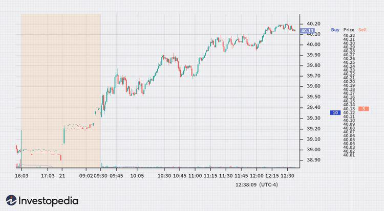

In the world of finance and sports, trading algorithms and soccer each come with their own distinct terminologies and intricate rules. While they operate in different domains, both require a deep understanding to fully appreciate their complexities and rewards. Soccer's touchline terminology defines boundaries on the field, influencing game dynamics and strategies, while algorithmic trading relies on pre-defined codes to execute trades efficiently. 

This article sheds light on the significance of the touchline in soccer, explores the rules and dynamics that stem from it, and examines how the financial concept of a touchline functions in trading. Furthermore, it discusses algorithmic trading strategies that leverage these touchlines for optimized trading outcomes. By navigating through these themes, we aim to offer insights into the subtle intersection of sports and finance. Whether you're a soccer enthusiast or trading professional, understanding these cross-disciplinary concepts can provide unique advantages and deepen your comprehension of each field.



## Table of Contents

## Understanding Touchline in Soccer

The touchline is an essential element of soccer, marking the boundaries on the sides of the field. This line determines when the ball is out of play; if the entire ball crosses the touchline, either on the ground or in the air, the play stops, and a throw-in is awarded to the opposing team. This mechanism ensures the game is played within a defined and controlled space, preventing chaos and maintaining the game's flow.

Beyond merely serving as a boundary, the touchline significantly influences the rules and dynamics of soccer, affecting both strategies and team tactics. Coaches often devise strategies around managing and leveraging the space near the touchline. Players may use it to create width in their play, stretching the opposition's defense and creating opportunities to advance the ball or center it for a goal-scoring opportunity. It can also serve a defensive purpose, as players often use the touchline to press opponents and limit their movement options, effectively trapping them or forcing turnovers.

According to FIFA's Laws of the Game, the touchline's dimensions are strictly specified to ensure uniformity across various levels of play. The length of the touchline must be greater than the length of the goal line. Specifically, for international matches, the touchline must measure between 100 to 110 meters (110 to 120 yards), maintaining consistency in the field size for fair play and standardization globally. This uniformity in dimensions allows players and teams to transition seamlessly across different venues and competitions.

In essence, the touchline's role extends far beyond a mere boundary, embedding itself deeply within the strategic and rule-based framework of soccer. This line holds the power to influence the game's play, dictating certain tactical maneuvers while providing a structured space that encourages skillful and strategic player interactions.

## Soccer Rules and Dynamics Involving the Touchline

The touchline, a boundary line that runs along the sides of a soccer field, plays a significant role in the game's structure and tactics. Its interaction with other field markings, such as the goal lines and center circle, is essential in determining the flow and progression of a soccer match.

The primary function of the touchline is to define the lateral limits of the playing area. When the ball crosses this boundary, it results in a throw-in, offering the opposing team a chance to regain possession. This rule ensures that the game maintains a continuous flow while also adding strategic elements to play. Teams frequently exploit the touchline in various defensive and offensive scenarios. For instance, defenders may guide attackers towards the touchline, using it as an additional means of containment. Offensively, players might use the width provided by the touchline to stretch the opposing defense, creating opportunities for crosses or penetrating runs.

Historically, numerous memorable incidents in soccer have underscored the strategic importance of the touchline. It is not uncommon for critical goals or game-defining moments to arise from plays initiated near or along the touchline, demonstrating its impact on the outcomes of matches. The strategic deployment along the touchline can influence the positioning and movement of players, dictating the rhythm and pace of the game. 

In conclusion, understanding the interaction of the touchline with other field elements and its tactical importance can offer deeper insights into soccer's complex dynamics and enrich one's appreciation of this globally cherished sport.

## Touchline in Trading: The Financial Perspective

In trading, 'touchline' refers to the best bid and ask prices available for a security, pivotal in providing insights into the market's [liquidity](/wiki/liquidity-risk-premium). The bid price represents the maximum price a buyer is willing to pay for a security, while the ask price indicates the minimum price a seller is willing to accept. The 'touchline' is essentially a live indication of the highest bid and lowest ask at a given moment.

The difference between these two prices is known as the bid-ask spread. A narrower spread typically indicates a more liquid market, as there is less difference between the price buyers are willing to pay and the price sellers are asking. Conversely, a wider spread may signal lower liquidity, suggesting fewer participants in the market or a higher level of uncertainty about the asset's value.

Traders and market makers exploit the touchline to capitalize on pricing differences. For instance, a market maker might buy at the bid price and sell at the ask price, thereby [earning](/wiki/earning-announcement) a profit equal to the spread. This activity is critical in providing liquidity to markets, ensuring that there are always buyers and sellers for a security.

Moreover, understanding and monitoring the touchline is crucial for formulating effective trading strategies. For example, a trader could design an algorithm to execute trades only when the spread is favorable, maximizing potential gains by minimizing costs. Algorithms might be used to track changes in the touchline in real-time and trigger trades automatically when certain criteria are met. This requires sophisticated technology and methodologies to react to market changes instantaneously.

To illustrate this in a simplified Python example:

```python
def trading_algorithm(bid_price, ask_price, threshold=0.02):
    spread = ask_price - bid_price
    if spread < threshold:
        # Assuming a hypothetical scenario where a buy is followed by a sell
        profit = ask_price - bid_price
        execute_trade(buy_price=bid_price, sell_price=ask_price, profit=profit)
    else:
        print("Spread too wide, no trade executed.")

def execute_trade(buy_price, sell_price, profit):
    print(f"Trade executed: Buy at {buy_price}, Sell at {sell_price}, Profit: {profit}")
```

While this is a rudimentary example, in real-world settings, algorithms can be far more complex, factoring in various market indicators and conditions. Through such mechanisms, traders can optimize their strategies by leveraging the nuances of the touchline, thereby influencing their profitability and market effectiveness.

## Algorithmic Trading and Touchline Strategies

Algorithmic trading, commonly known as algo trading, employs computer systems to autonomously execute trades on behalf of traders. These systems follow a set of predetermined strategies which are often based on complex mathematical models. The primary advantage of algo trading lies in its ability to process market information and execute orders at speeds that far surpass human capabilities. This speed is crucial, as financial markets can be highly volatile, with opportunities appearing and disappearing in fractions of a second.

One key target in [algorithmic trading](/wiki/algorithmic-trading) is the "touchline," a term that refers to the best bid and ask price available for a security. These prices represent the highest price a buyer is willing to pay and the lowest price a seller will accept, respectively. Algorithms designed to engage with the touchline focus on achieving optimal execution prices. By interacting with the best available bid and ask prices, these algorithms aim to minimize market impact and reduce trading costs.

The effectiveness of touchline strategies in algorithmic trading is often determined by the size of the bid-ask spread. A narrower spread typically indicates higher liquidity and lower transaction costs, providing an advantage to traders. Conversely, a wider spread might suggest lower liquidity and higher costs. Algorithms monitor these spreads in real time, adjusting their trading strategies accordingly to ensure efficient execution.

The process involves sophisticated statistical and analytical techniques. Python, a popular programming language in finance, is often used to develop these algorithms. The following Python snippet illustrates the basic concept of a simple trading algorithm targeting the touchline:

```python
import numpy as np

def calculate_best_bid_ask(order_book):
    bids = order_book['bids']
    asks = order_book['asks']
    best_bid = max(bids, key=lambda x: x['price'])
    best_ask = min(asks, key=lambda x: x['price'])
    return best_bid, best_ask

def execute_trade(strategy, order_book):
    best_bid, best_ask = calculate_best_bid_ask(order_book)
    if strategy == 'buy' and is_profitable(best_ask):
        # Execute buy order at best ask
        return f"Buying at {best_ask['price']}"
    elif strategy == 'sell' and is_profitable(best_bid):
        # Execute sell order at best bid
        return f"Selling at {best_bid['price']}"
    return "No trade executed"

def is_profitable(price):
    # Placeholder function to determine if a trade is profitable
    threshold_price = 100  # Example threshold
    return price <= threshold_price

# Example order book structure
order_book_example = {
    'bids': [{'price': 99, 'volume': 10}, {'price': 98, 'volume': 5}],
    'asks': [{'price': 101, 'volume': 15}, {'price': 103, 'volume': 10}]
}

# Running the trading algorithm
print(execute_trade('buy', order_book_example))
```

In this example, the algorithm evaluates the [order book](/wiki/order-book-trading-strategies) to identify the best bid and ask prices. It then decides whether to execute a buy or sell order based on a simple profitability criterion. This simplified model highlights the fundamental operations of an algorithmic strategy centered on the touchline.

In conclusion, algo trading systems designed to leverage touchline strategies seek to exploit minimal delays in trade execution to maximize returns. These algorithms continuously adjust to market conditions, optimizing the trading process by interacting swiftly and strategically with the best available prices. As technology continues to evolve, the sophistication and precision of these trading strategies are expected to improve further, enabling even greater efficiency in financial markets.

## Intersection of Soccer and Trading Strategies

Both soccer and trading are arenas where strategic thinking and quick decision-making are paramount, albeit in distinct contexts. In soccer, the touchline represents the physical boundary and plays a strategic role, providing teams with opportunities to execute specific plays, such as throw-ins or creating space for offensive maneuvers. Similarly, in trading, the touchline refers to the best bid and ask prices, which are indicative of market boundaries where opportunities for profit and risk manage to coexist.

The concept of a touchline serves as a metaphor for boundaries and opportunities in both soccer and trading. In soccer, the touchline defines the field of play, presenting limitations yet also guiding players on where and how to maneuver for strategic advantage. It represents a line where players must decide whether to take a defensive or offensive action. In a similar manner, trading strategies assess the bid-ask spread—the touchline in financial terms—to determine optimal entry and [exit](/wiki/exit-strategy) points for transactions. This boundary influences trading strategies to either capture profit potential or mitigate losses based on market conditions.

Understanding the cross-disciplinary concepts of strategy and boundary management in soccer and trading can enhance one’s skills in both arenas. For example, a soccer coach might pay attention to how players anticipate and react near the touchline, translating this understanding to make quick, informed decisions. A trader, on the other hand, might design algorithms that analogously respond to market fluctuations around the financial "touchline" to optimize trade executions.

Both fields require a blend of analytical and instinctual decision-making. The soccer player and the trader must make rapid decisions while balancing risk and reward, continuously evaluating their positions relative to the boundaries set by the touchline—be it the field's edge or the financial market's price spread. By embracing this metaphor, individuals in either field can refine their skills to identify and exploit opportunities, ensuring strategic advantages on the field and in financial markets.

## Conclusion

The touchline, integral to both soccer and trading, fundamentally influences strategies and outcomes in these seemingly distinct fields. In soccer, the touchline delineates the playing area, guiding tactics and game-flow, while in trading, it represents the best bid and ask price, crucial for optimizing trades.

Even though soccer and trading might appear unrelated, they share commonalities in dynamics, rules, and strategic planning. In soccer, quick decisions on handling the ball near the touchline can change the game's [course](/wiki/best-algorithmic-trading-courses) just as decisive trading actions based on touchline prices can affect a trader’s success. Both fields demand sharp strategic thinking and the ability to adapt in real-time, highlighting the importance of boundaries—physical in soccer and figurative in trading.

Understanding and drawing parallels between soccer and trading can enrich one’s perspective and approach in both domains. The strategic importance of the touchline underscores the universal themes of boundary management and tactical maneuvering, providing an interesting framework for those interested in the intersection of sports and finance. Embracing insights from soccer’s field dynamics and trading’s market mechanics can offer unique advantages, potentially leading to enhanced decision-making and improved outcomes in both areas.

## References & Further Reading

[1]: Bergstra, J., Bardenet, R., Bengio, Y., & Kégl, B. (2011). ["Algorithms for Hyper-Parameter Optimization."](https://dl.acm.org/doi/10.5555/2986459.2986743) Advances in Neural Information Processing Systems 24.

[2]: ["Advances in Financial Machine Learning"](https://www.amazon.com/Advances-Financial-Machine-Learning-Marcos/dp/1119482089) by Marcos Lopez de Prado

[3]: ["Evidence-Based Technical Analysis: Applying the Scientific Method and Statistical Inference to Trading Signals"](https://www.amazon.com/Evidence-Based-Technical-Analysis-Scientific-Statistical/dp/0470008741) by David Aronson

[4]: ["Machine Learning for Algorithmic Trading"](https://github.com/stefan-jansen/machine-learning-for-trading) by Stefan Jansen

[5]: ["Quantitative Trading: How to Build Your Own Algorithmic Trading Business"](https://www.amazon.com/Quantitative-Trading-Build-Algorithmic-Business/dp/1119800064) by Ernest P. Chan

[6]: FIFA. ["Laws of the Game."](https://www.theifab.com/laws-of-the-game-documents/?language=all&year=2022%2F23) 

[7]: Cartea, Á., Jaimungal, S., & Penalva, J. (2015). ["Algorithmic and High-Frequency Trading."](https://assets.cambridge.org/97811070/91146/frontmatter/9781107091146_frontmatter.pdf) Cambridge University Press.