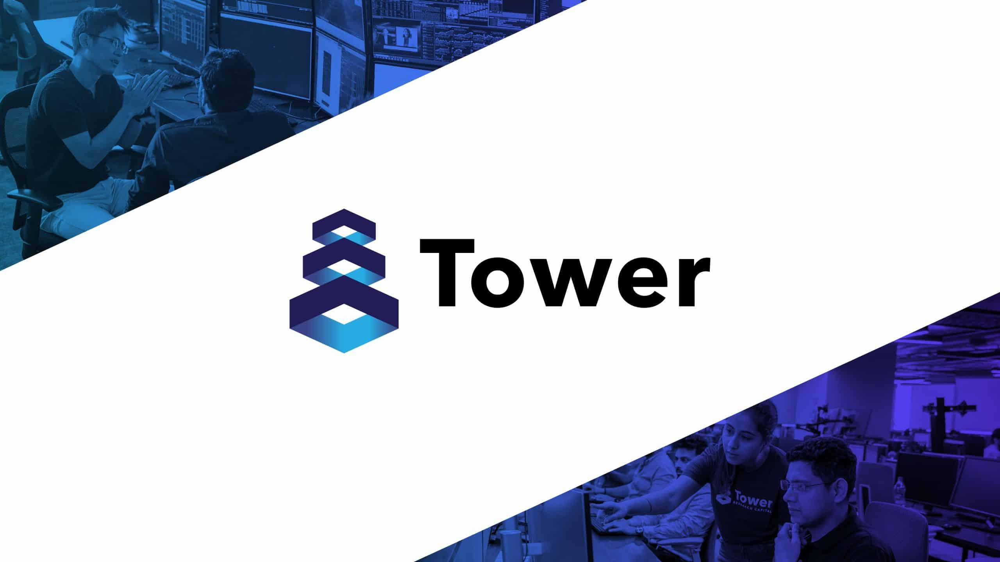

## Table of Contents

## What is Tower Research Capital?

Tower Research Capital is a company that works in the financial industry. They use computers and technology to help buy and sell things like stocks and other financial products. The company was started in 1998 and is based in New York City. They have offices in other places around the world too.

The main thing Tower Research Capital does is called "market making." This means they help make sure there are always buyers and sellers for financial products. They use special computer programs to do this quickly and efficiently. This helps keep the financial markets running smoothly.

## When was Tower Research Capital founded?

Tower Research Capital was founded in 1998. It is a company that works in the financial industry, using computers and technology to help buy and sell things like stocks and other financial products.

The company is based in New York City but also has offices in other places around the world. Tower Research Capital helps keep the financial markets running smoothly by doing something called "[market making](/wiki/market-making)." This means they make sure there are always buyers and sellers for financial products, using special computer programs to do this quickly and efficiently.

## Who are the founders of Tower Research Capital?

Tower Research Capital was started by Mark Gorton. He is the main person who came up with the idea for the company. Mark Gorton is also known for starting other companies, like LimeWire, which was a popular way to share music on the internet.

Mark Gorton wanted to use technology to help make the financial markets work better. He thought that using computers could help buy and sell things like stocks more quickly and efficiently. That's why he started Tower Research Capital in 1998. Since then, the company has grown and now has offices in many places around the world.

## What is the primary business of Tower Research Capital?

The main thing Tower Research Capital does is called "market making." This means they help make sure there are always buyers and sellers for financial products like stocks. They use special computer programs to do this quickly and efficiently. This helps keep the financial markets running smoothly.

Tower Research Capital was started by Mark Gorton in 1998. The company is based in New York City but also has offices in other places around the world. Mark Gorton wanted to use technology to help make the financial markets work better. He thought that using computers could help buy and sell things like stocks more quickly and efficiently.

## In which countries does Tower Research Capital operate?

Tower Research Capital is a company that helps buy and sell things like stocks. They started in the United States and their main office is in New York City. They also have offices in other parts of the United States, like Chicago and San Francisco.

Besides the United States, Tower Research Capital works in many other countries too. They have offices in places like Canada, the United Kingdom, and Singapore. They also have offices in India, which helps them reach more people around the world.

Tower Research Capital uses computers to make sure there are always buyers and sellers for financial products. This helps keep the financial markets running smoothly. They started in 1998 and have grown a lot since then.

## How does Tower Research Capital generate revenue?

Tower Research Capital makes money by doing something called market making. This means they help make sure there are always people buying and selling things like stocks. They use special computer programs to do this very quickly. When they help people buy and sell, they make a little bit of money on each trade. This adds up to a lot of money because they do a lot of trades every day.

They also make money by using their computer programs to predict what will happen in the financial markets. If they can guess right, they can buy and sell things at the right time to make more money. This is called trading. They use all the information they have to make smart guesses and try to make as much money as they can.

## What are the main services offered by Tower Research Capital?

Tower Research Capital mainly helps with something called market making. This means they make sure there are always people who want to buy and sell things like stocks. They use special computer programs to do this quickly. When they help with buying and selling, they make a little bit of money on each trade. Because they do a lot of trades every day, this adds up to a lot of money.

They also offer services where they use their computer programs to predict what will happen in the financial markets. If they can guess right, they can buy and sell things at the right time to make more money. This is called trading. They use all the information they have to make smart guesses and try to make as much money as they can.

## What role does technology play in Tower Research Capital's operations?

Technology is very important for Tower Research Capital. They use special computer programs to help buy and sell things like stocks very quickly. This is called market making. They need technology to make sure there are always buyers and sellers for these financial products. Without technology, they wouldn't be able to do so many trades every day and make money from each one.

They also use technology to predict what will happen in the financial markets. Their computer programs look at a lot of information to make smart guesses about when to buy and sell. This helps them make more money through trading. Technology helps them do all of this faster and better than they could without it.

## How has Tower Research Capital evolved since its inception?

Since it started in 1998, Tower Research Capital has grown a lot. At first, it was just an idea from Mark Gorton to use computers to help buy and sell stocks better. Now, it's a big company with offices all over the world, like in the United States, Canada, the United Kingdom, Singapore, and India. They have more people working for them and they use even better technology to do their job.

Tower Research Capital still does the same main thing, which is called market making. This means they make sure there are always people buying and selling stocks. But now, they use much more advanced computer programs to do this even faster and better. They also do more trading, which means they use their computers to predict what will happen in the markets and try to make more money. So, while the main idea hasn't changed, the way they do it and the size of their business has grown a lot.

## What are some notable achievements or milestones of Tower Research Capital?

Since it started in 1998, Tower Research Capital has grown from a small idea to a big company. One big milestone was when they opened offices in different countries like Canada, the United Kingdom, Singapore, and India. This helped them reach more people and do more business around the world. Another important achievement was how they kept improving their technology. They use special computer programs to buy and sell stocks quickly, and these programs have gotten better and faster over time.

Tower Research Capital also became known for being really good at market making. This means they help make sure there are always people buying and selling stocks. They do this so well that they are trusted by many people in the financial world. Another milestone was how they started doing more trading. They use their computers to predict what will happen in the markets and try to make more money this way. All these achievements show how Tower Research Capital has grown and become a big part of the financial industry.

## Who are the key competitors of Tower Research Capital in the financial industry?

Tower Research Capital has many competitors in the financial industry. Some of the main ones are companies like Citadel Securities, Virtu Financial, and Jane Street. These companies also use computers and technology to help buy and sell stocks and other financial products. They do something called market making, which means they make sure there are always buyers and sellers for these products. Just like Tower Research Capital, they use special computer programs to do this quickly and efficiently.

Another competitor is Jump Trading. They are also known for using technology to predict what will happen in the financial markets and make money from trading. These companies all try to be the best at using technology to help the financial markets work smoothly. They compete with each other to have the fastest and smartest computer programs. This competition helps make the financial markets better for everyone.

## What are the future plans or strategic directions for Tower Research Capital?

Tower Research Capital wants to keep growing and getting better at what they do. They plan to use even more advanced technology to help buy and sell stocks faster and more efficiently. They are always working on improving their computer programs so they can do more trades and make more money. They also want to reach more people around the world, so they might open new offices in other countries. This will help them do business with more people and make their company even bigger.

Another important part of their future plans is to keep being a leader in the financial industry. They want to stay ahead of their competitors by always having the best technology and the smartest people working for them. They also want to keep helping the financial markets work smoothly by doing market making and trading. By focusing on these things, Tower Research Capital hopes to keep growing and being successful for a long time.

## References & Further Reading

[1]: ["Advances in Financial Machine Learning"](https://www.amazon.com/Advances-Financial-Machine-Learning-Marcos/dp/1119482089) by Marcos Lopez de Prado

[2]: ["Algorithmic Trading and DMA: An introduction to direct access trading strategies"](https://www.amazon.com/Algorithmic-Trading-DMA-introduction-strategies/dp/0956399207) by Barry Johnson

[3]: ["Quantitative Trading: How to Build Your Own Algorithmic Trading Business"](https://www.amazon.com/Quantitative-Trading-Build-Algorithmic-Business/dp/1119800064) by Ernest P. Chan

[4]: ["Evidence-Based Technical Analysis: Applying the Scientific Method and Statistical Inference to Trading Signals"](https://www.amazon.com/Evidence-Based-Technical-Analysis-Scientific-Statistical/dp/0470008741) by David Aronson

[5]: Aldridge, I. (2013). ["High-Frequency Trading: A Practical Guide to Algorithmic Strategies and Trading Systems"](https://www.amazon.com/High-Frequency-Trading-Practical-Algorithmic-Strategies/dp/1118343506). Wiley Finance.

[6]: ["Flash Boys: A Wall Street Revolt"](https://en.wikipedia.org/wiki/Flash_Boys) by Michael Lewis
