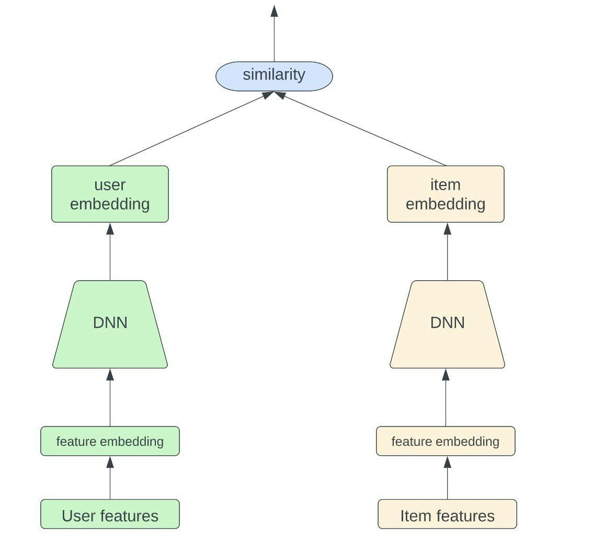

## Table of Contents

## What is Tower in the context of machine learning?

In machine learning, a Tower refers to a part of a model architecture that is specifically designed to handle different subsets of data or different tasks within the same model. Imagine you have a model that needs to process data from different sources or for different purposes. Instead of building separate models for each source or task, you can use a single model with multiple Towers. Each Tower processes its own subset of data or focuses on a specific task, but they all share a common base or backbone of the model. This approach helps in improving efficiency and performance by allowing the model to learn from all subsets of data simultaneously.

For example, in a recommendation system, you might have one Tower for user data and another for item data. The user Tower processes information about users, such as their preferences and behavior, while the item Tower processes information about items, like their features and popularity. Both Towers feed into a common part of the model that combines this information to make recommendations. This setup allows the model to learn intricate patterns across different data types, leading to more accurate and personalized recommendations. By sharing the backbone, the model can also benefit from the learning across Towers, enhancing overall performance.

## How does Tower differ from traditional machine learning models?

In traditional machine learning models, you typically have one model that handles all the data and performs a single task. For example, if you're predicting house prices, you would use one model that takes in all the relevant features like size, location, and age of the house to make its prediction. This approach works well when the data and the task are straightforward and similar across all inputs. However, when dealing with complex data from different sources or multiple tasks, a traditional model might struggle to capture all the nuances effectively.

A Tower model, on the other hand, is designed to handle such complexity by dividing the model into multiple parts, or Towers, each specialized for a subset of data or a specific task. For instance, in a recommendation system, you might have one Tower for user data and another for item data. Each Tower processes its own type of information, but they all connect to a common part of the model that combines this information to make a final prediction or decision. This setup allows the model to learn more effectively from diverse data sources and perform multiple tasks within the same model, leading to better performance and more personalized outcomes.

## What are the key components of a Tower model?

A Tower model consists of multiple specialized parts called Towers, each handling a different subset of data or a specific task. For example, in a recommendation system, one Tower might process user data like their preferences and history, while another Tower processes item data like features and popularity. These Towers are the key components that allow the model to focus on different aspects of the data, improving the model's ability to learn complex patterns and make accurate predictions.

The Towers in a Tower model connect to a common part of the model, often referred to as the backbone or base. This backbone combines the information from all the Towers to make the final prediction or decision. By sharing this backbone, the model can benefit from the learning across different Towers, leading to better overall performance. For instance, in a recommendation system, the backbone would take the outputs from the user and item Towers and use them to generate personalized recommendations.

In summary, the key components of a Tower model are the individual Towers, which specialize in different data subsets or tasks, and the shared backbone, which integrates the information from all Towers to produce the final output. This structure allows the model to handle complex data and multiple tasks more effectively than traditional models.

## Can you explain the basic architecture of a Tower model?

A Tower model is like a big machine with different parts working together. Each part, called a Tower, looks at a specific kind of information. For example, if you're trying to suggest movies to people, one Tower might look at what the person likes to watch, while another Tower looks at what movies are available. Each Tower does its job separately, but they all share a common part called the backbone. This backbone takes what each Tower has learned and puts it all together to make a final decision or prediction.

The backbone is really important because it helps the model use what it learns from all the Towers at the same time. This way, the model can understand more about the data and make better guesses or recommendations. For example, in a movie recommendation system, the backbone would take what the user Tower knows about a person's tastes and what the movie Tower knows about the movies, and then use that to suggest the best movies for that person. By working together like this, the Tower model can handle complicated data and make smart decisions.

## What types of problems can Tower be used to solve?

Tower models are really helpful when you have a lot of different kinds of information that you need to use together to solve a problem. For example, if you're trying to recommend movies to people, you might have information about what movies are out there and what people like to watch. A Tower model can use one Tower to look at the movies and another Tower to look at what people like. Then, it combines this information to make good recommendations.

Another problem that Tower models can solve is when you're trying to do more than one thing at the same time. Imagine you're building a system that not only recommends movies but also suggests what snacks to eat while watching them. You could use one Tower for the movie recommendations and another Tower for the snack suggestions. The model can then use both Towers to give you personalized movie and snack pairings, making your movie night even better.

In short, Tower models are great for handling complex data from different sources or for solving multiple related tasks. They make it easier for the model to learn from all this information and make smart decisions, whether it's suggesting movies, recommending snacks, or anything else where you need to combine different types of data.

## How is data processed and utilized in a Tower model?

In a Tower model, data is processed by breaking it into different pieces and sending each piece to a special part of the model called a Tower. For example, if you're trying to recommend movies, one Tower might look at what movies are available, while another Tower looks at what people like to watch. Each Tower takes its piece of data and learns from it, figuring out what's important about that specific type of information. This way, the model can pay close attention to different aspects of the data without getting confused.

Once each Tower has done its job, the information they've learned gets sent to a common part of the model called the backbone. The backbone is like a meeting place where all the Towers come together to share what they've learned. It takes the information from each Tower and combines it to make a final decision or prediction. For example, in a movie recommendation system, the backbone would use what the movie Tower knows about the movies and what the user Tower knows about the person's tastes to suggest the best movies for that person. This way, the model can use all the different pieces of data together to make smart and personalized recommendations.

## What are the advantages of using Tower over other machine learning approaches?

Using a Tower model has some big advantages over other [machine learning](/wiki/machine-learning) methods. One main benefit is that it can handle different kinds of data really well. For example, if you're trying to recommend movies, you might have information about the movies themselves and also about what people like to watch. A Tower model can use one Tower to focus on the movies and another Tower to focus on what people like. This way, the model can learn from both types of information at the same time and make better recommendations. It's like having different experts working together to solve a problem, which makes the model smarter and more accurate.

Another advantage of Tower models is that they can do more than one thing at the same time. Imagine you're building a system that not only recommends movies but also suggests what snacks to eat while watching them. With a Tower model, you could use one Tower for the movie recommendations and another Tower for the snack suggestions. The model can then combine these two pieces of information to give you personalized movie and snack pairings. This makes the system more useful and fun to use because it can handle multiple tasks without getting confused. By breaking down the problem into smaller parts and then putting them back together, Tower models can solve complex problems more effectively than other approaches.

## What are some common challenges faced when implementing Tower models?

One common challenge when implementing Tower models is managing the complexity of the architecture. Since Tower models break down data into different parts and process them separately, it can be tricky to set up and fine-tune all the Towers correctly. Each Tower needs to be carefully designed to handle its specific type of data, and making sure they all work well together requires a lot of testing and adjustments. If one Tower isn't working right, it can throw off the whole model, making it hard to get good results.

Another challenge is making sure the shared backbone of the model combines the information from all the Towers effectively. The backbone has to take what each Tower has learned and put it all together in a way that makes sense. This can be difficult because the data from different Towers might be very different, and figuring out how to blend it all together to make accurate predictions or decisions takes a lot of work. If the backbone isn't designed well, the model might not be able to use all the information it has, which can lead to poor performance.

## How can one evaluate the performance of a Tower model?

To evaluate the performance of a Tower model, you need to look at how well it does its job. One way to do this is by using metrics like accuracy, precision, recall, and F1 score. These metrics help you see if the model's predictions are correct and how well it handles different kinds of data. For example, if you're using a Tower model to recommend movies, you might check how often it suggests movies that people actually end up watching. You can also use a confusion matrix to see where the model makes mistakes and where it gets things right. This helps you understand which parts of the model, like the Towers or the backbone, might need more work.

Another important way to evaluate a Tower model is by doing cross-validation. This means you split your data into different parts and train the model on some of the data while testing it on the rest. By doing this several times with different splits, you can get a good idea of how well the model performs overall. It's also helpful to look at how each Tower contributes to the final results. You can do this by turning off one Tower at a time and seeing how the model's performance changes. This way, you can figure out if all the Towers are working together well or if some need to be improved.

## What are some advanced techniques for optimizing Tower models?

One advanced technique for optimizing Tower models is fine-tuning the hyperparameters of each Tower and the backbone. Hyperparameters are settings that you can change to make the model work better. For example, you might adjust the learning rate or the number of layers in each Tower. By carefully choosing these settings, you can make sure each Tower is learning the right things from its data. You can use techniques like grid search or random search to try out different combinations of hyperparameters and see which ones work best. This can take a lot of time and computing power, but it can really improve how well the model performs.

Another technique is to use transfer learning. This means you start with a model that has already been trained on a similar task and then adjust it for your specific problem. For example, if you're building a Tower model for movie recommendations, you might start with a model that was trained on general user preferences and then fine-tune it with movie-specific data. This can save time and make your model more accurate because it's already learned a lot from the earlier task. You can also use techniques like feature engineering to create new data points that each Tower can use to make better predictions. For example, you might create a new feature that combines a user's movie ratings with their watching history, which could help the user Tower understand their preferences better.

## Can you provide examples of successful applications of Tower in industry?

One successful application of Tower models in industry is in e-commerce, particularly for personalized product recommendations. For example, Amazon uses a Tower model to suggest products to its users. One Tower focuses on user data, such as their browsing and purchase history, while another Tower looks at product data, like item features and popularity. The backbone of the model then combines this information to recommend products that are likely to interest each user. This approach helps Amazon provide highly personalized shopping experiences, which can increase customer satisfaction and sales.

Another example is in the field of online advertising, where companies like Google use Tower models to optimize ad placements. One Tower might analyze user data, such as their search history and demographics, while another Tower looks at ad data, like the ad's content and performance metrics. The backbone then uses this information to decide which ads to show to which users, maximizing the chances that users will click on the ads. This method helps Google deliver more relevant ads, improving both user experience and advertiser returns.

## What future developments are expected in the field of Tower machine learning?

In the future, Tower machine learning models are expected to become even better at handling different types of data and solving multiple tasks at the same time. Researchers are working on ways to make each Tower smarter and more specialized, so they can learn more from their specific data. For example, they might use new techniques like transfer learning, where a Tower can start with what it already knows from one task and then learn a new task faster. This can make the model more efficient and accurate, helping it give better recommendations or predictions.

Another area where Tower models might see big improvements is in how they combine information from all the Towers. The backbone of the model, which takes what each Tower has learned and puts it all together, could become more advanced. Scientists are exploring new ways to make the backbone smarter, like using more complex algorithms or even artificial neural networks. This could help the model understand the data better and make even more personalized and useful suggestions, whether it's for movies, products, or ads.