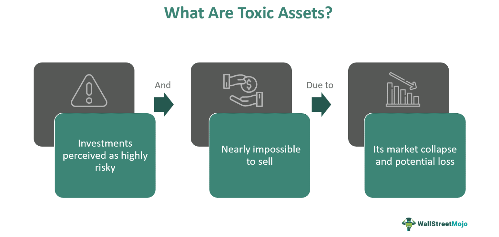

The financial landscape is dynamic and multifaceted, exerting a substantial influence on the broader economy. Within this sphere, asset valuation, toxic assets, and financial crises form a complex web of interconnections that significantly impact financial markets. Algorithmic trading has become increasingly prevalent, reshaping traditional market dynamics through its reliance on automation and complex algorithms for executing trades at unprecedented speeds.

Asset valuation is essential for determining the fair market value of assets, influencing investment strategies and risk management decisions. The collapse in demand for certain investments can render them toxic, as observed during the 2008 financial crisis, which substantially impacted mortgage-backed securities and collateralized debt obligations. Such toxic assets can destabilize financial systems, highlighting the importance of understanding their intricate relationships with asset valuation and financial crises.

Algorithmic trading, now a cornerstone of modern financial markets, adds a layer of complexity to these interconnections. This form of trading enhances market efficiency and liquidity but also presents challenges, such as increased market volatility during periods of stress. It is essential for financial professionals and investors to grasp the nuances of these components to navigate the financial landscape effectively.

This article examines the interplay between asset valuation, toxic assets, financial crises, and algorithmic trading, offering insights into their implications for both markets and individual investors. Understanding these elements is crucial for making informed decisions and ensuring robust risk management practices, which are vital for financial stability and growth.

## Table of Contents

## Asset Valuation: Concepts and Importance

Asset valuation is a fundamental aspect of financial analysis and investing, aiming to determine the fair market value of a variety of assets ranging from equity and fixed income to real estate and derivatives. Accurate asset valuation supports investors in making informed investment decisions and is crucial for effective risk management, as misvaluations can lead to significant financial instability and misallocation of resources.

Various methods are employed for asset valuation, each with unique applications and limitations. One commonly used approach is the Discounted Cash Flow (DCF) analysis, which estimates an asset's value based on its expected future cash flows. The DCF method involves calculating the present value of projected cash flows by discounting them using an appropriate discount rate, reflecting the risk and opportunity cost of capital. The formula for DCF is expressed as:

$$
V = \sum_{t=1}^{n} \frac{CF_t}{(1 + r)^t}
$$

where $V$ is the asset's value, $CF_t$ represents the cash flow at time $t$, $r$ is the discount rate, and $n$ is the number of periods.

Another prevalent technique is the Comparable Company Analysis (CCA), which values an asset by comparing it with similar companies in the industry using metrics like price-to-earnings (P/E), enterprise value-to-EBITDA, and price-to-book ratios. This approach assumes that similar companies with analogous market conditions and operational performances should have comparable valuation metrics.

The accuracy of both methods depends on the precision of inputs and assumptions used, such as growth rates, market conditions, and risk factors. Miscalculated asset values, arising from improper assumptions or data, can heavily impact economic stability by distorting the perception of the asset's true worth, leading to flawed investment strategies and risk management practices.

The critical importance of asset valuation extends beyond individual investments; it influences broader financial stability. For instance, during financial downturns, overestimated asset values can exacerbate market instability, triggering panicked selloffs and [liquidity](/wiki/liquidity-risk-premium) shortages. Therefore, accurate asset valuation serves as a cornerstone for maintaining financial equilibrium and fostering investor confidence within markets.

## Understanding Toxic Assets

Toxic assets are a category of investments that, due to their severely diminished demand, become challenging or impossible to sell at any reasonable price. These assets notoriously rose to prominence during the 2008 financial crisis, spotlighting mortgage-backed securities (MBS) and collateralized debt obligations (CDOs) that rapidly lost value as the underlying mortgages defaulted. Such devaluations revealed the systemic risks these assets posed to financial institutions, shaking the foundations of global financial markets.

At the heart of the crisis was the aggressive promotion and packaging of subprime mortgages into securities, which were then sold to investors under the guise of high yield, low-risk instruments. When homeowners began to default on their loans, the value of these bundled securities plummeted, rendering them effectively unsellable. This collapse in demand and valuation forced banks and financial institutions to write down billions in losses, as reflected in their financial statements.

The repercussions of holding toxic assets are profound. Financial institutions faced liquidity shortages as the collateral value of toxic assets was compromised, diminishing their ability to secure short-term financing and triggering broader credit market freezes. Consequently, this led to a chain reaction of financial instability, insolvency fears, and mergers or sell-offs of distressed institutions.

In response to the growing crisis, the U.S. government initiated several intervention strategies, most notably the Troubled Asset Relief Program (TARP). Established by the Emergency Economic Stabilization Act of 2008, TARP aimed to stabilize the financial sector by purchasing toxic assets from banks and other financial institutions. This intervention provided liquidity and restored a degree of confidence in the markets, albeit temporarily.

Beyond government interventions, an interesting player in the toxic asset landscape is the vulture investor. These investors specialize in acquiring distressed or undervalued assets, including toxic ones, with the intent to restructure and rehabilitate them for potential profitability. Vulture investors employ sophisticated analyses to assess the risk and potential value in these assets, often stepping in where traditional investors fear to tread.

The handling and implications of toxic assets have prompted financial markets to reassess risk management practices and regulatory oversight. The 2008 crisis underscored the need for transparency in financial instruments and the perils of mispricing risk. Moving forward, recognizing and addressing the complexities of toxic assets remain an ongoing challenge in maintaining financial stability and preventing future crises.

## Financial Crises and Their Impact

Financial crises are pivotal events in the global economy, often characterized by the swift devaluation of assets, which precipitates a cascade of liquidity shortages. These crises exert profound impacts on economies, as evidenced by the global financial crisis of 2008. The 2008 crisis was largely triggered by the underestimation of toxic assets, such as mortgage-backed securities and collateralized debt obligations, which were initially perceived as secure investments but rapidly lost value as underlying mortgage defaults soared.

The consequences of financial crises extend far beyond immediate asset devaluation. They precipitate severe economic downturns, marked by escalating unemployment rates, contracting Gross Domestic Product (GDP), and a significant erosion of market confidence. For instance, during the 2008 crisis, the U.S. unemployment rate doubled from approximately 5% in 2007 to over 10% by 2009, while global GDP growth plummeted from 3.8% in 2007 to a mere 0.1% in 2009 (International Monetary Fund).

The roles of governments and central banks are crucial in managing these crises. They are tasked with implementing a suite of interventions and policy changes aimed at stabilizing the economy. During the 2008 financial crisis, the U.S. government enacted the Troubled Asset Relief Program (TARP), injecting capital into financial institutions to prevent systemic collapse. Similarly, central banks, including the Federal Reserve, employed unconventional monetary policies such as quantitative easing to enhance liquidity and foster economic recovery.

The imperative of learning from past financial crises cannot be overstated. Comprehensive analysis and understanding of previous crises provide invaluable insights for improving future financial stability and preventing systemic failures. Post-2008, various regulatory reforms, such as the Dodd-Frank Act in the United States, were undertaken to enhance transparency, improve risk management, and bolster the resilience of financial institutions. These measures are vital to mitigating the risks of future financial upheavals and ensuring a more robust financial system.

Addressing the intricate challenges posed by financial crises necessitates a collaborative approach, drawing on lessons from historical precedents while fostering innovation and vigilance in the ongoing development of robust economic policies and frameworks.

## The Role of Algorithmic Trading

Algorithmic trading employs automated systems to execute trades at unprecedented speeds and volumes, drastically transforming financial markets. These systems leverage complex mathematical models and computational analysis to make quick and precise trading decisions. By automating the trading process, [algorithmic trading](/wiki/algorithmic-trading) enhances market efficiency through tighter bid-ask spreads and increased liquidity, facilitating better price discovery.

Mathematically, algorithmic trading strategies often revolve around quantitative models. For instance, they might use statistical [arbitrage](/wiki/arbitrage), which involves identifying price inefficiencies between correlated securities and executing trades to capitalize on even the smallest discrepancies. A basic model for [statistical arbitrage](/wiki/statistical-arbitrage) could involve assessing the expected return $E[R]$ based on historical price relationships and executing trades when the deviation exceeds a threshold $\delta$:

$$

\text{Trade Signal} = 
\begin{cases} 
\text{Buy,} & \text{if } E[R] > \delta \\
\text{Sell,} & \text{if } E[R] < -\delta \\
\text{Hold,} & \text{otherwise} 
\end{cases} 
$$

The efficacy of algorithmic trading, however, introduces new challenges. Notably, its capacity to execute trades almost instantly can trigger flash crashes, where rapid sell-offs lead to significant market destabilization within seconds. An infamous example is the 2010 Flash Crash, where the Dow Jones Industrial Average plunged nearly 1,000 points in mere minutes.

Additionally, algorithmic trading can amplify market [volatility](/wiki/volatility-trading-strategies) during periods of stress. This is because trading algorithms often react to the same market signals, leading to simultaneous large-scale buying or selling. Such synchronized actions can exacerbate price swings and impact asset valuations.

Therefore, effective regulation and oversight are paramount to mitigate the risks associated with algorithmic trading. Regulatory authorities must ensure transparency, implement circuit breakers to halt trading during abnormal activity, and enforce stringent testing and risk management protocols for trading algorithms. These measures aim to preserve market stability while harnessing the benefits of technological advancements in trading practices.

## Interconnections and Implications

Asset valuation, toxic assets, and financial crises are intricately related through myriad factors including market dynamics and investor behavior. These elements interact within financial systems, leading to varied outcomes based on economic conditions and regulatory environments.

Algorithmic trading further complicates these relationships by introducing high-speed trading mechanisms that can significantly influence market stability. This form of trading utilizes advanced mathematical models to execute trades at unprecedented speeds, often relying on real-time data analysis. While this can enhance market efficiency, it also amplifies potential risks during volatile periods. High-frequency trading algorithms can unintentionally exacerbate market downturns, leading to scenarios such as flash crashes—rapid, deep market drops followed by swift recoveries. 

For investors, these intertwined factors present challenges in portfolio management and risk assessment. A comprehensive understanding of how asset valuation methodologies, the presence of toxic assets, and algorithmic trading impact financial markets is vital for developing sound investment strategies. For example, accurately assessing an asset's fair value mitigates the risk of overvaluation or undervaluation, thus serving as a buffer against financial instability.

Financial institutions face the dual challenge of innovating while maintaining stringent risk management protocols. As the environment evolves, these institutions must adapt by integrating advanced analytical tools and risk management systems to navigate the complex interplay of asset valuations and market dynamics. Continuous monitoring of market conditions and regulatory changes is necessary to manage the risks associated with toxic assets and algorithmic trading, thereby ensuring financial stability.

The future of economic stability is contingent upon the ability of market participants to adapt to an ever-evolving financial landscape. This requires not only technological innovation but also the development of policies and frameworks that can effectively manage and mitigate systemic risks. Collaboration between regulatory bodies, financial institutions, and investors will be crucial in shaping a resilient financial ecosystem capable of withstanding future crises. Thus, the interconnections among asset valuation, toxic assets, financial crises, and algorithmic trading are key considerations for fostering a stable and dynamic financial environment.

## Conclusion

Asset valuation, toxic assets, financial crises, and algorithmic trading are fundamental components of the financial ecosystem, each playing a distinct role while collectively shaping the global financial landscape. An astute understanding of these elements is essential for financial professionals who must navigate complex markets and make informed decisions. 

Asset valuation underpins the accuracy of investment assessments and risk management, with miscalculations potentially destabilizing entire economies. Toxic assets, notably highlighted during the 2008 financial crisis, serve as a reminder of the catastrophic impact that poor asset quality can have on financial institutions and the broader market. The repercussions of these assets demonstrate the systemic risks that can arise when demand collapses and values plummet, stressing the importance of vigilant monitoring and proactive management strategies.

Algorithmic trading, while advancing market efficiency through high-speed and large-[volume](/wiki/volume-trading-strategy) transactions, introduces its own set of challenges. It can exacerbate volatility, as seen during events like flash crashes, thereby affecting market stability. This underscores the need for sophisticated algorithms, effective regulation, and oversight to ensure that automation serves to enhance rather than hinder market dynamics.

The interconnections among asset valuation, toxic assets, financial crises, and algorithmic trading highlight the necessity for ongoing research and policy development. Policymakers and financial institutions must focus on creating robust frameworks that can adapt to the evolving financial environment. Future stability and growth are contingent on the lessons learned from past experiences, paving the way for innovations in risk management and investment strategies. By leveraging historical insights and adapting to technological advancements, the financial sector can better prepare for potential challenges ahead, ensuring resilience and sustainability.

## References & Further Reading

[1]: Gorton, G. B. (2012). ["Misunderstanding Financial Crises: Why We Don't See Them Coming."](https://www.amazon.com/Misunderstanding-Financial-Crises-Dont-Coming/dp/019992290X) Oxford University Press.

[2]: Shiller, R. J. (2008). ["The Subprime Solution: How Today's Global Financial Crisis Happened, and What to Do about It."](https://www.jstor.org/stable/j.cttq94jd) Princeton University Press.

[3]: Hull, J. (2018). ["Options, Futures, and Other Derivatives."](https://www.amazon.com/Options-Futures-Other-Derivatives-9th/dp/0133456315) Pearson.

[4]: MacKenzie, D. (2019). ["Trading at the Speed of Light: How Ultrafast Algorithms Are Transforming Financial Markets"](https://www.jstor.org/stable/j.ctv191kx1k) Princeton University Press.

[5]: Taleb, N. N. (2010). ["The Black Swan: The Impact of the Highly Improbable."](https://www.amazon.com/Black-Swan-Improbable-Robustness-Fragility/dp/081297381X) Random House.

[6]: Fama, E. F. (1991). ["Efficient Capital Markets: II."](https://onlinelibrary.wiley.com/doi/full/10.1111/j.1540-6261.1991.tb04636.x) The Journal of Finance, 46(5), 1575–1617.

[7]: Lewis, M. (2010). ["The Big Short: Inside the Doomsday Machine."](https://books.google.com/books/about/The_Big_Short_Inside_the_Doomsday_Machin.html?id=eParwQ0YdrcC) W.W. Norton & Company. 

[8]: Financial Crisis Inquiry Commission. (2011). ["The Financial Crisis Inquiry Report."](https://www.govinfo.gov/app/details/GPO-FCIC/) 

[9]: U.S. Department of the Treasury. ["Treasury Department Troubled Asset Relief Program (TARP)"](https://home.treasury.gov/data/troubled-asset-relief-program).

[10]: Federal Reserve Bank of Chicago. ["Algorithmic Trading: Pros and Cons"](https://usauctionbrokers.com/auctions/924/lot/3774201-superb-crisp-1950e-10-note-chicago-key-e-series).