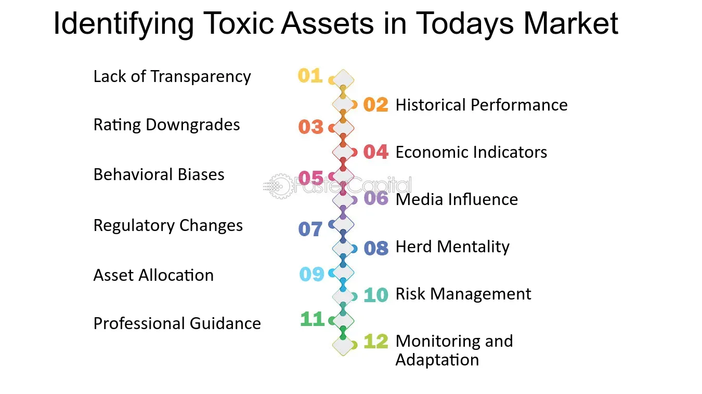

## Table of Contents

## What are toxic assets?

Toxic assets are financial assets that have lost a lot of their value and are hard to sell. They are called "toxic" because they can cause big problems for banks and other financial companies that own them. These assets often include things like loans that people can't pay back, or investments in companies that are not doing well.

When banks have a lot of toxic assets, it can make them weak and less able to lend money to people and businesses. This can hurt the whole economy. During the 2008 financial crisis, toxic assets, especially bad home loans, played a big role in causing problems for banks and leading to the crisis.

Governments and financial regulators sometimes step in to help manage or get rid of toxic assets. They might buy them or help banks sell them to try to make the financial system healthier. This can be a tricky process, but it's important for keeping the economy stable.

## How do toxic assets form?

Toxic assets form when the value of financial products drops a lot. This often happens when people or businesses can't pay back their loans. For example, if many people lose their jobs and can't pay their home loans, those loans become worth less. Banks and other financial companies that own these loans then have assets that are hard to sell and not worth much.

Sometimes, toxic assets come from risky investments that don't pay off. Companies might invest in new businesses or projects that seem good at first but then fail. When these investments fail, the assets linked to them lose value and become toxic. This can spread problems through the financial system because other companies might also have invested in the same failing projects.

During big economic problems, like a housing market crash or a recession, many assets can turn toxic at the same time. This happened in 2008 when lots of home loans went bad, causing a chain reaction that hurt banks and the whole economy. When this happens, it's hard for the financial system to recover because everyone is trying to sell off their toxic assets at the same time, which makes their value drop even more.

## What are some examples of toxic assets?

Toxic assets are financial products that have lost a lot of their value. One common example is bad loans, like home loans that people can't pay back. When people lose their jobs or the housing market crashes, many home loans can turn into toxic assets. Banks that own these loans have a hard time selling them because no one wants to buy a loan that won't be paid back.

Another example of toxic assets is investments in companies that fail. If a company goes bankrupt, any stocks or bonds linked to that company can become toxic. Investors who own these stocks or bonds lose a lot of money, and it's hard to sell them because they're not worth much anymore. This can cause big problems for banks and other financial companies that have invested in these failed businesses.

During the 2008 financial crisis, many different types of assets became toxic at the same time. This included not just home loans and failed company investments, but also complex financial products like mortgage-backed securities. These securities were bundles of home loans that were sold to investors. When the home loans inside these securities went bad, the securities lost their value and became toxic assets, spreading the crisis through the financial system.

## Why are toxic assets harmful to financial institutions?

Toxic assets hurt financial institutions because they lose a lot of their value. When a bank owns a lot of these bad assets, it can make the bank weaker. For example, if a bank has many home loans that people can't pay back, those loans become worth less. This means the bank's overall value goes down, and it might not have enough money to do its regular work, like giving out new loans to people and businesses.

Also, toxic assets are hard to sell. When a bank tries to get rid of these bad assets, it's tough to find buyers because no one wants to buy something that's not worth much. This can lead to a situation where the bank is stuck with these toxic assets, making it even harder for the bank to stay healthy. If many banks face this problem at the same time, it can cause big problems for the whole economy, like what happened during the 2008 financial crisis.

## How can toxic assets affect the broader economy?

Toxic assets can hurt the whole economy because they make banks weaker. When banks have a lot of toxic assets, like bad loans that people can't pay back, they lose money. This means banks have less money to lend to people and businesses. When people and businesses can't get loans, they can't buy things or start new projects. This slows down the economy because less money is moving around.

If many banks have toxic assets at the same time, it can cause a big problem. Banks might start to worry about each other and stop lending money not just to people and businesses, but also to other banks. This can lead to a financial crisis, like what happened in 2008. When the financial system gets shaky, it can make people lose their jobs and make it harder for everyone to get the money they need. This can lead to a recession, where the whole economy struggles.

## What are the common characteristics of toxic assets?

Toxic assets are financial products that have lost a lot of their value and are hard to sell. They often come from loans that people or businesses can't pay back, like home loans during a housing market crash. When people can't pay their loans, the loans become worth less. This makes them hard to sell because no one wants to buy a loan that won't be paid back.

Another common characteristic of toxic assets is that they come from risky investments that fail. For example, if a company goes bankrupt, any stocks or bonds linked to that company can become toxic. These investments lose their value, and it's hard to find buyers for them. When many toxic assets build up in the financial system, it can cause big problems for banks and the economy, like during the 2008 financial crisis.

Toxic assets can spread problems through the financial system because they make banks weaker. When banks own a lot of toxic assets, they have less money to lend to people and businesses. This slows down the economy because less money is moving around. If many banks have toxic assets at the same time, it can lead to a financial crisis and even a recession, where the whole economy struggles.

## What role did toxic assets play in the 2008 financial crisis?

Toxic assets played a big role in the 2008 financial crisis. A lot of these toxic assets were home loans that people couldn't pay back. When the housing market crashed, many people lost their jobs and couldn't pay their loans. These bad loans made banks lose money and become weaker. Banks had a hard time selling these loans because no one wanted to buy them. This made the banks even weaker and less able to lend money to people and businesses.

When many banks had toxic assets at the same time, it caused big problems for the whole economy. Banks stopped lending money to each other because they were worried about who might have toxic assets. This made the financial system shaky and led to a financial crisis. People lost their jobs, and it became hard for everyone to get the money they needed. This led to a recession, where the whole economy struggled. Toxic assets were a big reason why the 2008 financial crisis happened and caused so much trouble.

## How are toxic assets identified and valued?

Toxic assets are identified when their value drops a lot and they become hard to sell. This often happens when people can't pay back their loans, like home loans during a housing market crash. When many people stop paying their loans, the loans lose value. Banks and other financial companies then have assets that are not worth much anymore. These assets are called toxic because they cause big problems for the banks that own them.

Valuing toxic assets can be tricky because their value keeps changing. When no one wants to buy these assets, their value goes down even more. Banks and financial experts use different methods to figure out how much these assets are worth. They look at things like how likely people are to pay back their loans and what similar assets are selling for. Sometimes, they have to guess because there's not a clear answer. This makes it hard for banks to know exactly how much their toxic assets are worth and how much trouble they might be in.

## What strategies can financial institutions use to manage toxic assets?

Financial institutions can use different strategies to manage toxic assets. One way is to sell the toxic assets to other companies or investors who are willing to take the risk. Sometimes, the government steps in and buys these toxic assets to help banks stay healthy. Another strategy is to hold onto the toxic assets and wait for their value to go up again. This can be risky because no one knows when or if the value will go up, but it might be better than selling the assets at a big loss.

Another way to manage toxic assets is to package them with other, better assets. This can make the toxic assets easier to sell because they are mixed with assets that are worth more. Financial institutions can also try to work with the people or businesses who owe money on the toxic assets. They might change the loan terms to make it easier for people to pay back their loans. This can help turn toxic assets into good assets again. By using these strategies, financial institutions can try to reduce the harm caused by toxic assets and keep the economy stable.

## What are the regulatory responses to toxic assets?

When toxic assets cause big problems, governments and financial regulators step in to help. They might create special programs to buy toxic assets from banks. This helps banks get rid of the bad assets and stay healthy. For example, during the 2008 financial crisis, the U.S. government started the Troubled Asset Relief Program (TARP) to buy toxic assets and help banks. Regulators also set rules to make sure banks don't take too many risks with their investments. This can help prevent toxic assets from building up in the first place.

Regulators also keep a close eye on banks to make sure they are managing their toxic assets well. They might ask banks to hold more money in reserve to cover any losses from toxic assets. This makes banks stronger and less likely to fail. Sometimes, regulators work with banks to change the terms of loans that have turned into toxic assets. This can help people pay back their loans and turn the toxic assets into good assets again. By doing these things, regulators try to keep the financial system stable and protect the economy from the harm caused by toxic assets.

## How can investors protect themselves from toxic assets?

Investors can protect themselves from toxic assets by being careful about what they invest in. They should do a lot of research before buying any financial product. This means looking at things like how likely a company is to pay back its loans and how stable the economy is. Investors should also spread their money around instead of putting it all into one thing. This way, if one investment turns toxic, they won't lose everything. It's also a good idea to stay away from very risky investments that promise big returns but could easily fail.

Another way investors can protect themselves is by keeping an eye on the news and understanding what's happening in the economy. If they see signs that the economy might be in trouble, like a lot of people losing their jobs or a housing market crash, they can adjust their investments to be safer. Talking to a financial advisor can also help. A good advisor can give advice on how to avoid toxic assets and keep money safe. By being careful and staying informed, investors can lower their chances of getting stuck with toxic assets.

## What are the latest trends and developments in managing toxic assets?

Lately, financial institutions have been using new ways to manage toxic assets. One big trend is using technology, like artificial intelligence and big data, to figure out how risky an asset is before it turns toxic. This helps banks make better choices about what to invest in. Another trend is setting up special companies, called "bad banks," to hold onto the toxic assets. This keeps the bad assets away from the main bank, making it easier for the bank to stay healthy and keep lending money.

Governments and regulators are also coming up with new rules to help manage toxic assets. They're making sure banks have enough money saved up to cover losses from toxic assets. This makes the whole financial system stronger. There's also more focus on working with people who owe money on toxic assets. Banks are trying to change loan terms to make it easier for people to pay back their loans, which can help turn toxic assets into good assets again. By using these new strategies, financial institutions and regulators are trying to keep the economy stable and prevent big problems from toxic assets.

## What are the concepts and importance of asset valuation?

Asset valuation is a fundamental aspect of financial analysis and investing, aiming to determine the fair market value of a variety of assets ranging from equity and fixed income to real estate and derivatives. Accurate asset valuation supports investors in making informed investment decisions and is crucial for effective risk management, as misvaluations can lead to significant financial instability and misallocation of resources.

Various methods are employed for asset valuation, each with unique applications and limitations. One commonly used approach is the Discounted Cash Flow (DCF) analysis, which estimates an asset's value based on its expected future cash flows. The DCF method involves calculating the present value of projected cash flows by discounting them using an appropriate discount rate, reflecting the risk and opportunity cost of capital. The formula for DCF is expressed as:

$$
V = \sum_{t=1}^{n} \frac{CF_t}{(1 + r)^t}
$$

where $V$ is the asset's value, $CF_t$ represents the cash flow at time $t$, $r$ is the discount rate, and $n$ is the number of periods.

Another prevalent technique is the Comparable Company Analysis (CCA), which values an asset by comparing it with similar companies in the industry using metrics like price-to-earnings (P/E), enterprise value-to-EBITDA, and price-to-book ratios. This approach assumes that similar companies with analogous market conditions and operational performances should have comparable valuation metrics.

The accuracy of both methods depends on the precision of inputs and assumptions used, such as growth rates, market conditions, and risk factors. Miscalculated asset values, arising from improper assumptions or data, can heavily impact economic stability by distorting the perception of the asset's true worth, leading to flawed investment strategies and risk management practices.

The critical importance of asset valuation extends beyond individual investments; it influences broader financial stability. For instance, during financial downturns, overestimated asset values can exacerbate market instability, triggering panicked selloffs and [liquidity](/wiki/liquidity-risk-premium) shortages. Therefore, accurate asset valuation serves as a cornerstone for maintaining financial equilibrium and fostering investor confidence within markets.

## What is the Role of Algorithmic Trading?

Algorithmic trading employs automated systems to execute trades at unprecedented speeds and volumes, drastically transforming financial markets. These systems leverage complex mathematical models and computational analysis to make quick and precise trading decisions. By automating the trading process, [algorithmic trading](/wiki/algorithmic-trading) enhances market efficiency through tighter bid-ask spreads and increased liquidity, facilitating better price discovery.

Mathematically, algorithmic trading strategies often revolve around quantitative models. For instance, they might use statistical [arbitrage](/wiki/arbitrage), which involves identifying price inefficiencies between correlated securities and executing trades to capitalize on even the smallest discrepancies. A basic model for [statistical arbitrage](/wiki/statistical-arbitrage) could involve assessing the expected return $E[R]$ based on historical price relationships and executing trades when the deviation exceeds a threshold $\delta$:

$$

\text{Trade Signal} = 
\begin{cases} 
\text{Buy,} & \text{if } E[R] > \delta \\
\text{Sell,} & \text{if } E[R] < -\delta \\
\text{Hold,} & \text{otherwise} 
\end{cases} 
$$

The efficacy of algorithmic trading, however, introduces new challenges. Notably, its capacity to execute trades almost instantly can trigger flash crashes, where rapid sell-offs lead to significant market destabilization within seconds. An infamous example is the 2010 Flash Crash, where the Dow Jones Industrial Average plunged nearly 1,000 points in mere minutes.

Additionally, algorithmic trading can amplify market [volatility](/wiki/volatility-trading-strategies) during periods of stress. This is because trading algorithms often react to the same market signals, leading to simultaneous large-scale buying or selling. Such synchronized actions can exacerbate price swings and impact asset valuations.

Therefore, effective regulation and oversight are paramount to mitigate the risks associated with algorithmic trading. Regulatory authorities must ensure transparency, implement circuit breakers to halt trading during abnormal activity, and enforce stringent testing and risk management protocols for trading algorithms. These measures aim to preserve market stability while harnessing the benefits of technological advancements in trading practices.

## References & Further Reading

[1]: Gorton, G. B. (2012). ["Misunderstanding Financial Crises: Why We Don't See Them Coming."](https://www.amazon.com/Misunderstanding-Financial-Crises-Dont-Coming/dp/019992290X) Oxford University Press.

[2]: Shiller, R. J. (2008). ["The Subprime Solution: How Today's Global Financial Crisis Happened, and What to Do about It."](https://www.jstor.org/stable/j.cttq94jd) Princeton University Press.

[3]: Hull, J. (2018). ["Options, Futures, and Other Derivatives."](https://www.amazon.com/Options-Futures-Other-Derivatives-9th/dp/0133456315) Pearson.

[4]: MacKenzie, D. (2019). ["Trading at the Speed of Light: How Ultrafast Algorithms Are Transforming Financial Markets"](https://www.jstor.org/stable/j.ctv191kx1k) Princeton University Press.

[5]: Taleb, N. N. (2010). ["The Black Swan: The Impact of the Highly Improbable."](https://www.amazon.com/Black-Swan-Improbable-Robustness-Fragility/dp/081297381X) Random House.

[6]: Fama, E. F. (1991). ["Efficient Capital Markets: II."](https://onlinelibrary.wiley.com/doi/full/10.1111/j.1540-6261.1991.tb04636.x) The Journal of Finance, 46(5), 1575–1617.

[7]: Lewis, M. (2010). ["The Big Short: Inside the Doomsday Machine."](https://books.google.com/books/about/The_Big_Short_Inside_the_Doomsday_Machin.html?id=eParwQ0YdrcC) W.W. Norton & Company. 

[8]: Financial Crisis Inquiry Commission. (2011). ["The Financial Crisis Inquiry Report."](https://www.govinfo.gov/app/details/GPO-FCIC/) 

[9]: U.S. Department of the Treasury. ["Treasury Department Troubled Asset Relief Program (TARP)"](https://home.treasury.gov/data/troubled-asset-relief-program).

[10]: Federal Reserve Bank of Chicago. ["Algorithmic Trading: Pros and Cons"](https://usauctionbrokers.com/auctions/924/lot/3774201-superb-crisp-1950e-10-note-chicago-key-e-series).