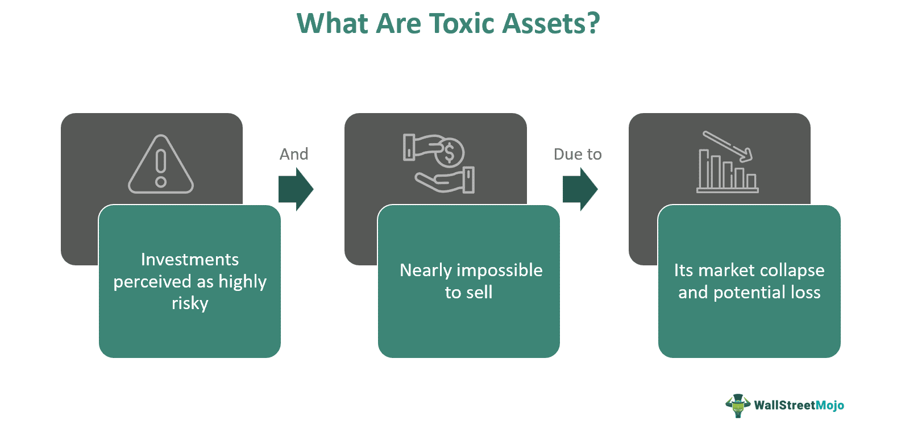

In today's interconnected financial world, understanding the risks posed by toxic debt and toxic assets is crucial for maintaining economic stability. Toxic debt refers to loans or financial obligations that have a high probability of default, posing significant risks to lenders and investors. Toxic assets, on the other hand, are investments that become difficult to sell or have significantly depreciated in value, often due to external market factors or a collapse in demand. These financial instruments can affect the broader economy, as evidenced by historical events like the 2008 financial crisis.

The financial landscape is further complicated by algorithmic trading, a practice involving the use of computer programs to make rapid trading decisions. While algorithmic trading can enhance market efficiency and liquidity, it also has the potential to amplify risks associated with toxic debt and assets. High-frequency trading algorithms, for instance, might exacerbate market volatility during periods of financial instability, thus spreading and amplifying systemic risk.

Exploring the definitions, historical examples, and strategies for managing these financial hazards is essential for financial institutions aiming to mitigate potential crises. The 2008 financial crisis serves as a pertinent case study, illustrating how toxic debt, particularly subprime mortgages, can lead to widespread economic distress. Learning from past events enables the development of effective strategies to manage current and future financial risks. These strategies include improving regulatory oversight, enhancing transparency in financial transactions, and implementing robust risk management practices.

This article intends to provide insights into the complexities and challenges associated with managing financial risks linked to toxic debt and assets. Through understanding these dynamics, along with the role of algorithmic trading, financial stakeholders can better navigate the potential threats within the modern economic system.

## Table of Contents

## Understanding Toxic Debt and Toxic Assets

Toxic debt refers to loans and other types of debt that have a low probability of being repaid, often due to the poor credit quality of the borrower or the deteriorating market conditions. As a result of their high risk of default, these debts become detrimental to financial institutions and investors who hold them. A prime characteristic of toxic debt is its potential to become unserviceable, meaning that borrowers might fail to meet their payment obligations, leading to financial losses for creditors.

Toxic assets, on the other hand, are financial assets, such as securities or investments, that have become difficult to sell. This difficulty arises mainly due to a collapse in demand from the market, which can occur for various reasons, including an economic downturn or a loss of confidence in the inherently risky nature of these assets. The difficulties associated with selling toxic assets lead to liquidity problems, as investors are unable to convert these assets into cash without significantly affecting their market prices.

A prominent example of the ramifications of toxic debt and toxic assets was observed during the 2008 financial crisis. This crisis highlighted the extensive impact that such toxic financial elements could have on the global financial system. The crisis was largely precipitated by the collapse of the subprime mortgage market in the United States. Subprime mortgages were loans extended to individuals with poor credit histories who were, therefore, at a higher risk of default. These mortgages, once bundled into mortgage-backed securities and other complex financial products, became part of a network of toxic assets distributed across various financial institutions worldwide.

As the housing market began to decline, the value of these mortgage-backed securities plummeted, leading to significant losses for holders of these assets. The interconnection and interdependence among financial institutions meant that the toxicity inherent in these securities spread throughout the financial system, ultimately triggering a global financial meltdown. Hence, the 2008 crisis serves as a critical case study in understanding how toxic debt and assets can have far-reaching consequences, affecting not only individual financial entities but also the broader economic stability.

## The Financial Risks of Toxic Debt

Toxic debt poses substantial financial risks, influencing the stability of both lending institutions and the wider economy. At its core, toxic debt comprises loans or other credit forms that [carry](/wiki/carry-trading) a high probability of default. When institutions or investors hold such assets, they face potential financial losses, significantly affecting their balance sheets and operational capacities.

When toxic debt is converted into securities, such as mortgage-backed securities (MBS), its risk is not isolated but instead permeates the entire financial system. MBS are derived from pools of mortgages, including subprime loans, that are bundled and sold to investors. The securitization process is intended to diversify risk across multiple parties. However, during the 2008 financial crisis, it became evident that widespread default on these underlying mortgages could trigger a cascading effect of losses. This was partly due to the complex structures and opaque nature of these securities, which obscured the true level of risk involved.

The systemic risks associated with toxic debt manifest in several ways. Firstly, when an asset becomes toxic, its value deteriorates, impairing the financial health of the holders. This can lead to [liquidity](/wiki/liquidity-risk-premium) issues, where institutions may struggle to meet their short-term obligations. As asset values plummet, institutions might need to write down the value of these securities, impacting their capital reserves and increasing the likelihood of insolvency. 

Furthermore, as these toxic assets lose value, financial institutions might undertake fire sales to liquidate holdings and remedy their liquidity deficiencies. This further depresses asset prices, creating a vicious cycle of devaluation and market instability. This cycle can magnify systemic risks, as interconnected financial institutions face correlated losses, potentially endangering the entire financial network. The presence of significant toxic debt within the financial system can erode investor and consumer confidence, increasing market [volatility](/wiki/volatility-trading-strategies) and uncertainty.

In summary, toxic debt has far-reaching implications for financial stability. The securitization of toxic debt increases its potential to cause widespread systemic risks, threatening both individual institutions and the broader economy. Proper risk assessment and stringent regulatory measures are vital to mitigating these risks and ensuring financial stability.

## The Role of Algorithmic Trading in Financial Risk

Algorithmic trading, characterized by the use of computer algorithms to execute trades at high speed and [volume](/wiki/volume-trading-strategy), plays a significant role in modern financial markets. While offering benefits like enhanced market liquidity and efficiency, it also poses risks, particularly when interacting with toxic debt-related securities. These risks are mainly due to the potential for increased market volatility and systemic threats linked to toxic asset fluctuations.

High-frequency trading ([HFT](/wiki/high-frequency-trading-strategies)), a subset of [algorithmic trading](/wiki/algorithmic-trading), involves executing a large number of orders within microseconds. This rapid-fire approach can magnify systemic risk when trading securities connected to toxic debt. If a security's value is tied to toxic assets—such as distressed mortgage-backed securities—price fluctuations can prompt automatic buy or sell actions by these algorithms. Such swift responses can lead to sudden market swings, increasing volatility and potentially destabilizing the broader financial system.

One significant concern is the feedback loop created by algorithmic trading. When toxic debt assets experience price changes, algorithms may react simultaneously, exacerbating the original price movement. This can lead to a cascade effect, where multiple trading systems continuously drive the price in one direction, often detached from the asset's intrinsic value. The 2010 "Flash Crash" is an example of how algorithmic trading can result in rapid market swings, although toxic debt was not a direct [factor](/wiki/factor-investing) in that instance.

Understanding the interactions between algorithmic trading and toxic debt is crucial for robust risk management. This involves several strategies:

1. **Improved Risk Algorithms:** Designing trading algorithms that incorporate sophisticated risk parameters can help mitigate undue influence from toxic asset price volatilities. For instance, incorporating stop-loss mechanisms can prevent excessive losses during turbulent market conditions.

2. **Market Surveillance Tools:** Enhanced monitoring systems can detect unusual trading patterns linked to toxic debt securities, allowing for timely interventions. This involves real-time data analysis and anomaly detection, often using machine learning algorithms.

3. **Regulatory Mechanisms:** Policies that encourage transparency and set boundaries for high-speed trading can help control the risks associated with algorithmic activities. Limitations on order-to-trade ratios and latency reduction requirements are examples of regulatory approaches aimed at curbing excessive volatility.

4. **Stress Testing:** Regular stress testing of algorithms against adverse market conditions related to toxic debt can help identify vulnerabilities. Such tests can simulate scenarios of extreme market movements, providing insight into potential systemic risks.

By understanding these dynamics, financial institutions can develop strategies to mitigate the unintended consequences of algorithmic trading, particularly in relation to the complexities associated with toxic debt.

## Historical Examples and Lessons Learned

The 2008 financial crisis stands as a distinct illustration of the dangers associated with toxic debt and assets. This global financial turmoil was initiated by a substantial rise in mortgage delinquencies and foreclosures in the United States, particularly within the subprime mortgage market. Subprime mortgages were loans extended to borrowers with poor credit histories, characterized by higher interest rates due to their increased risk profile. These loans, while profitable when repaid, possessed a significant risk of default, rendering them toxic.

A key factor that compounded the effect of subprime mortgages was their securitization into mortgage-backed securities (MBS) and collateralized debt obligations (CDOs). Financial institutions bundled these high-risk loans into securities that were then sold to investors. These financial products, marketed as low-risk due to their diversification, were in reality laden with toxic assets. The default of subprime loans led to the devaluation of these securities, resulting in catastrophic losses for financial institutions globally. The interconnected nature of these assets meant that the toxicity spread rapidly, leading to a credit crunch and, subsequently, a global recession [1].

The lessons learned from the 2008 crisis underline the critical importance of understanding and managing the risks posed by toxic debt. Regulatory bodies and financial institutions have recognized the necessity of enhancing transparency and due diligence in the packaging and sale of complex financial products. Moreover, the crisis highlighted the dangers of excessive leverage and inadequate risk assessment models, urging a re-evaluation of lending standards and credit rating systems. 

By examining past financial disruptions, it becomes clear that systemic financial stability hinges on a balanced approach that incorporates robust risk management practices, transparency, and rigorous regulatory oversight. These elements are essential in preempting the kind of cascading failures observed during the 2008 financial crisis, underscoring the enduring importance of vigilance against toxic debt.

**References**
1. Brunnermeier, M. K. (2009). Deciphering the liquidity and credit crunch 2007–2008. Journal of Economic Perspectives, 23(1), 77-100.

## Strategies for Managing and Preventing Toxic Debt

Improving transparency and regulatory oversight are fundamental strategies for mitigating the risks posed by toxic debt. Enhanced transparency ensures that the nature and extent of financial risks are well understood by investors, regulators, and other stakeholders. This can involve the adoption of standardized reporting frameworks that provide clear insights into the quality of assets held by financial institutions. Regulatory oversight plays a crucial role in ensuring that markets function efficiently and that the risks associated with toxic assets are minimized. By imposing stricter requirements on reporting and compliance, regulators can help identify and limit the proliferation of toxic debt within the financial system.

Financial institutions must reinforce their risk management practices to avert excessive exposure to toxic assets. This involves employing robust risk assessment models that can effectively evaluate the creditworthiness of borrowers and the likelihood of repayment. Organizations should develop comprehensive risk management frameworks that incorporate a variety of risk metrics, including credit risk analysis and liquidity risk assessment. Diversification strategies can also be employed to manage exposure to toxic assets. By spreading investments across different asset classes and geographies, institutions can reduce the potential impact of default in a single sector or region.

Implementing stress testing is a crucial tool for identifying potential vulnerabilities associated with toxic debt. Stress testing involves simulating adverse economic scenarios to evaluate how financial institutions would cope with financial distress. These tests can model various factors such as [interest rate](/wiki/interest-rate-trading-strategies) increases, economic downturns, or significant market volatility. By adopting stress testing, institutions can identify weaknesses in their portfolios and develop strategies to mitigate potential risks. Regulators often require banks to conduct regular stress tests as a preventative measure to evaluate their resilience against financial shocks.

In summary, managing the risks associated with toxic debt involves a combination of increased transparency, robust regulatory oversight, strengthened internal risk management practices, and proactive stress testing. Together, these strategies can help to prevent the build-up of toxic debt in the financial system and protect institutions from significant financial losses.

## Conclusion

Managing toxic debt and its associated risks remains a critical component of financial stability. The trajectory of financial markets has repeatedly shown that unchecked toxic debt can precipitate widespread economic disruptions. As a result, continuous efforts in regulatory reform and risk management are paramount. Regulatory bodies must implement stricter oversight to ensure that financial institutions do not accumulate excess toxic assets, which can destabilize the economy.

One effective approach to mitigating the risks posed by toxic debt is enhancing transparency within financial markets. This can be achieved by improving the quality and availability of information, allowing investors to make informed decisions. Moreover, the implementation of advanced financial risk management techniques, such as stress testing and scenario analysis, is crucial for identifying potential vulnerabilities in financial institutions. Stress testing can provide insights into how financial entities might perform under adverse conditions, thereby highlighting areas where additional safeguards are needed.

Furthermore, understanding the dynamics of toxic debt and the role of algorithmic trading is essential. Algorithmic trading, while beneficial in enhancing market efficiency, can exacerbate systemic risks if it responds aggressively to market fluctuations related to toxic assets. By developing algorithms that are sensitive to the potential impacts of toxic debt, financial institutions can better navigate these risks and prevent undue market volatility.

In conclusion, the complexities and challenges associated with toxic debt require a multifaceted approach, integrating regulatory oversight, enhanced transparency, robust risk management practices, and a nuanced understanding of algorithmic trading. Through these efforts, the financial sector can work towards preventing future crises, ensuring stability, and fostering a resilient economic environment.

## References & Further Reading

[1]: Brunnermeier, M. K. (2009). ["Deciphering the Liquidity and Credit Crunch 2007–2008."](https://www.princeton.edu/~markus/research/papers/liquidity_credit_crunch.pdf) Journal of Economic Perspectives, 23(1), 77-100.

[2]: Lewis, M. (2010). ["The Big Short: Inside the Doomsday Machine."](https://books.google.com/books/about/The_Big_Short_Inside_the_Doomsday_Machin.html?id=eParwQ0YdrcC) W. W. Norton & Company.

[3]: Gorton, G. B. (2009). ["The Subprime Panic."](https://onlinelibrary.wiley.com/doi/abs/10.1111/j.1468-036X.2008.00473.x) European Financial Management, 17(3), 287-308.

[4]: Malkiel, B. G. (2015). ["A Random Walk Down Wall Street."](https://www.amazon.com/Random-Walk-Down-Wall-Street/dp/0393358380) W. W. Norton & Company.

[5]: MacKenzie, D. A. (2017). ["An Engine, Not a Camera: How Financial Models Shape Markets."](https://academic.oup.com/mit-press-scholarship-online/book/20588) MIT Press.

[6]: Patterson, S. (2013). ["Dark Pools: The Rise of A.I. Trading Machines and the Looming Threat to Wall Street."](https://archive.org/details/darkpoolsriseofa0000patt) Crown Business.

[7]: Tett, G. (2009). ["Fool's Gold: The Inside Story of J.P. Morgan and How Wall St. Greed Corrupted Its Bold Dream and Created a Financial Catastrophe."](https://web.lancaster.edu.gh/papersCollection/uploaded-files/download/fools_gold_the_inside_story_of_j_p_morgan_and_how_wall_st_greed_corrupted_its_bold_dream_and_created_a_financial_catastrophe.pdf) Free Press.

[8]: Wilmott, P. (2006). ["Paul Wilmott Introduces Quantitative Finance."](https://www.amazon.com/Paul-Wilmott-Introduces-Quantitative-Finance/dp/0470319585) Wiley.