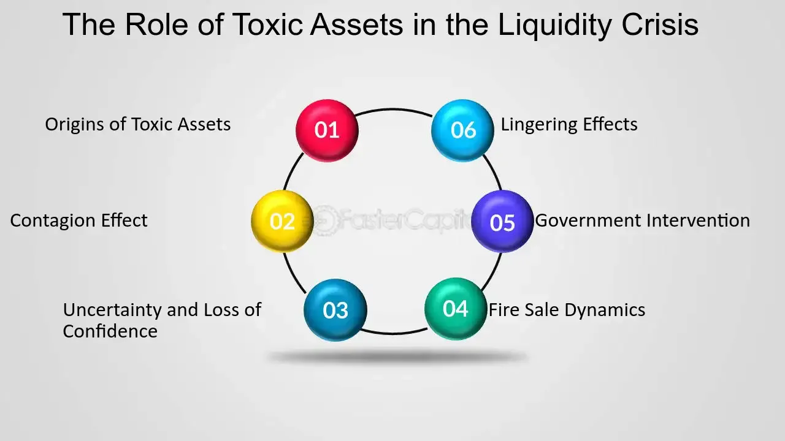

## Table of Contents

## What is toxic debt?

Toxic debt is a term used to describe loans or debts that are very risky and likely to not be paid back. These debts often come from loans given to people or businesses that are not able to pay them back. Banks and other financial institutions can get into big trouble if they have too much toxic debt because it can make them lose a lot of money.

When the economy is not doing well, toxic debt can become a big problem. For example, during the financial crisis in 2008, many banks had given out loans to people who could not afford to pay them back. These loans were bundled together and sold to investors, but when people started defaulting on their loans, the value of these investments dropped a lot. This caused a lot of financial trouble for banks and investors around the world.

## What are toxic assets?

Toxic assets are investments that have lost a lot of their value and are hard to sell. They are called toxic because they can cause big problems for banks and other financial companies that own them. These assets often come from loans that people or businesses cannot pay back, like mortgages on houses that are worth less than the loan amount.

When banks have too many toxic assets, it can make them lose a lot of money and even go out of business. This happened during the 2008 financial crisis when many banks had invested in mortgage-backed securities that turned out to be toxic. The value of these securities dropped a lot when people couldn't pay their mortgages, causing a big problem for the whole financial system.

## How do toxic debts and assets differ from regular debts and assets?

Toxic debts and assets are different from regular debts and assets because they are much riskier. Regular debts, like a car loan or a student loan, are usually paid back over time. The people or businesses that borrow the money are expected to be able to pay it back. On the other hand, toxic debts come from loans that are very unlikely to be paid back. These are often given to people or businesses that are struggling financially, so the risk of not getting the money back is much higher.

Regular assets, like a house or a stock, usually have a clear value and can be sold if needed. They are considered safe investments. Toxic assets, however, are investments that have lost a lot of their value and are hard to sell. They can cause big problems for banks and investors because they can lead to big losses. For example, during the 2008 financial crisis, many mortgage-backed securities became toxic assets when the housing market crashed and people couldn't pay their mortgages.

## What causes debts and assets to become toxic?

Debts and assets can become toxic when they are very risky and likely to lose a lot of value. This often happens when loans are given to people or businesses that can't pay them back. For example, if a bank gives a loan to someone who doesn't have a steady job or enough money, that loan can become toxic because the person might not be able to pay it back. When many of these risky loans are bundled together and sold as investments, they can turn into toxic assets if a lot of people start defaulting on their loans.

Economic conditions can also make debts and assets toxic. If the economy is doing badly, like during a recession, more people might lose their jobs or businesses might struggle. This makes it harder for them to pay back their loans, turning those loans into toxic debts. When the value of things like houses goes down, assets like mortgage-backed securities can lose a lot of their value and become toxic. This happened during the 2008 financial crisis when the housing market crashed, causing many loans and investments to become toxic.

## What are the common examples of toxic assets?

Common examples of toxic assets include mortgage-backed securities and collateralized debt obligations (CDOs). Mortgage-backed securities are investments made up of a bunch of home loans. If a lot of people can't pay their home loans, the value of these securities goes down a lot, making them toxic. CDOs are similar but can include different kinds of loans, like car loans or credit card debt. If too many of these loans go bad, the CDOs can become toxic too.

Another example of a toxic asset is a subprime loan. These are loans given to people who have a hard time getting regular loans because they might not have a good credit score or a steady job. Subprime loans are riskier, so if a lot of people with these loans can't pay them back, the loans can become toxic. During the 2008 financial crisis, many subprime loans turned into toxic assets, causing big problems for banks and investors.

## How do toxic debts and assets impact financial institutions?

Toxic debts and assets can cause big problems for banks and other financial institutions. When a bank has a lot of toxic debts, it means they have given out loans that people or businesses are not paying back. This can make the bank lose a lot of money. If too many loans go bad, the bank might not have enough money to keep operating. This can make the bank go out of business or need help from the government.

Toxic assets are also very bad for financial institutions. These are investments that have lost a lot of their value and are hard to sell. When a bank owns a lot of toxic assets, it can lose a lot of money because the value of these investments goes down. This happened during the 2008 financial crisis when many banks had invested in mortgage-backed securities that became toxic. The banks lost a lot of money, and some even went out of business. This can cause big problems for the whole economy because when banks are in trouble, it's harder for people and businesses to get loans.

## What role did toxic assets play in the 2008 financial crisis?

Toxic assets played a big role in the 2008 financial crisis. Banks had given out a lot of loans to people who couldn't pay them back, especially home loans called subprime mortgages. These loans were bundled together and sold as investments called mortgage-backed securities. When people started defaulting on their home loans, the value of these securities dropped a lot. This turned them into toxic assets because they were worth much less than what the banks had paid for them.

The problem got worse because many banks had a lot of these toxic assets on their books. They lost a lot of money, and some banks even went out of business. This caused a big mess in the financial system because banks couldn't lend money to people and businesses who needed it. The crisis spread around the world, causing a lot of economic problems. Governments had to step in to help the banks and try to fix the economy.

## How are toxic debts and assets identified and measured?

Toxic debts and assets are identified by looking at how risky they are and how likely they are to lose value. For example, a loan can be considered toxic if it is given to someone who doesn't have a good credit score or a steady job. This makes it more likely that the person won't be able to pay back the loan. Banks and financial institutions use different methods to figure out if a debt is toxic. They look at things like the borrower's ability to pay, the value of the asset that the loan is based on, and how the economy is doing.

To measure toxic assets, experts look at how much the asset's value has dropped and how hard it is to sell. For example, if a lot of people are not paying their home loans, the value of mortgage-backed securities goes down a lot. This makes them toxic because they are worth much less than what was paid for them. Financial institutions use special models and data to measure how much these assets have lost in value and how much risk they pose. This helps them understand the impact of toxic assets on their overall financial health.

## What strategies can financial institutions use to manage or mitigate toxic debts and assets?

Financial institutions can use several strategies to manage or mitigate toxic debts and assets. One common approach is to sell off these toxic assets to other investors or specialized firms that are willing to take on the risk. By doing this, the bank can get some money back and reduce the amount of toxic assets on their books. Another strategy is to restructure the toxic debts. This means working with borrowers to change the terms of the loan, like lowering the interest rate or extending the repayment period, so it's easier for them to pay back the money. This can help turn toxic debts into less risky ones.

Another way to manage toxic assets is through a process called securitization. This involves bundling toxic loans together and selling them as securities to investors. While this can spread the risk around, it needs to be done carefully to avoid creating more problems. Financial institutions can also set aside more money as reserves to cover potential losses from toxic debts and assets. This helps them stay prepared and reduces the impact if a lot of loans go bad. By using these strategies, banks can better handle the risks and protect themselves from big financial losses.

## What are the regulatory responses to toxic debts and assets?

After the 2008 financial crisis, governments and financial regulators made new rules to deal with toxic debts and assets. They wanted to stop banks from taking too many risks and to make the financial system safer. One big change was the Dodd-Frank Act in the United States. This law made banks hold more money in reserve to cover losses from risky loans. It also created new agencies to watch over the financial industry and make sure banks were not doing anything too dangerous.

Another important rule was Basel III, which set new standards for banks around the world. It made banks keep more capital and better quality assets, so they would be less likely to fail if they had toxic debts and assets. Regulators also started doing more checks on banks to see if they were managing their risks properly. These new rules and checks help make sure that toxic debts and assets don't cause big problems for the economy again.

## How do toxic debts and assets affect the broader economy?

Toxic debts and assets can cause big problems for the whole economy. When banks have a lot of toxic debts, they lose money because people and businesses are not paying back their loans. This makes the banks weaker and less able to lend money to others. When banks can't lend money, it's harder for people to buy homes or cars, and for businesses to grow. This slows down the economy because people and businesses need loans to spend and invest.

If toxic assets spread through the financial system, it can lead to a crisis like the one in 2008. When the value of these assets drops a lot, banks and investors lose a lot of money. This can make them stop lending and investing, which hurts the economy even more. Governments might have to step in to help the banks and try to fix the economy, but it takes time for things to get better. So, toxic debts and assets can make the economy weaker and cause big problems for everyone.

## What are the long-term implications of holding toxic debts and assets for an economy?

Holding toxic debts and assets can have big long-term effects on an economy. When banks have a lot of toxic debts, they lose money because people and businesses can't pay back their loans. This makes the banks weaker and less able to lend money to others. When banks can't lend, it's harder for people to buy homes or cars, and for businesses to grow. This slows down the economy because people and businesses need loans to spend and invest. Over time, this can lead to less economic growth and more unemployment, making it harder for the economy to recover.

If toxic assets spread through the financial system, it can cause a crisis like the one in 2008. When the value of these assets drops a lot, banks and investors lose a lot of money. This can make them stop lending and investing, which hurts the economy even more. Governments might have to step in to help the banks and try to fix the economy, but it takes time for things to get better. The long-term impact can be a weaker economy with less trust in the financial system, making it harder for the economy to grow and for people to feel secure about their money.

## References & Further Reading

[1]: Brunnermeier, M. K. (2009). ["Deciphering the Liquidity and Credit Crunch 2007–2008."](https://www.princeton.edu/~markus/research/papers/liquidity_credit_crunch.pdf) Journal of Economic Perspectives, 23(1), 77-100.

[2]: Lewis, M. (2010). ["The Big Short: Inside the Doomsday Machine."](https://books.google.com/books/about/The_Big_Short_Inside_the_Doomsday_Machin.html?id=eParwQ0YdrcC) W. W. Norton & Company.

[3]: Gorton, G. B. (2009). ["The Subprime Panic."](https://onlinelibrary.wiley.com/doi/abs/10.1111/j.1468-036X.2008.00473.x) European Financial Management, 17(3), 287-308.

[4]: Malkiel, B. G. (2015). ["A Random Walk Down Wall Street."](https://www.amazon.com/Random-Walk-Down-Wall-Street/dp/0393358380) W. W. Norton & Company.

[5]: MacKenzie, D. A. (2017). ["An Engine, Not a Camera: How Financial Models Shape Markets."](https://academic.oup.com/mit-press-scholarship-online/book/20588) MIT Press.

[6]: Patterson, S. (2013). ["Dark Pools: The Rise of A.I. Trading Machines and the Looming Threat to Wall Street."](https://archive.org/details/darkpoolsriseofa0000patt) Crown Business.

[7]: Tett, G. (2009). ["Fool's Gold: The Inside Story of J.P. Morgan and How Wall St. Greed Corrupted Its Bold Dream and Created a Financial Catastrophe."](https://web.lancaster.edu.gh/papersCollection/uploaded-files/download/fools_gold_the_inside_story_of_j_p_morgan_and_how_wall_st_greed_corrupted_its_bold_dream_and_created_a_financial_catastrophe.pdf) Free Press.

[8]: Wilmott, P. (2006). ["Paul Wilmott Introduces Quantitative Finance."](https://www.amazon.com/Paul-Wilmott-Introduces-Quantitative-Finance/dp/0470319585) Wiley.