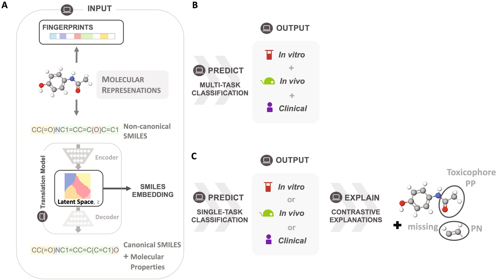

## Table of Contents

## What is toxicity in the context of machine learning?

Toxicity in machine learning refers to harmful or negative content that a machine learning model might generate or classify. This can include hate speech, offensive language, or biased content that discriminates against certain groups of people. When a model is trained on data that contains toxic elements, it can learn and reproduce these patterns, leading to harmful outputs. This is a significant concern because it can perpetuate and amplify societal biases and harm users who interact with the model.

To address toxicity, researchers and developers use various techniques. One common approach is to filter out toxic data from the training set before the model learns from it. Another method involves adding a secondary model that specifically detects and mitigates toxic outputs. Additionally, continuous monitoring and updating of the model help in reducing the chances of toxic content being generated. By being proactive and vigilant, the machine learning community aims to create safer and more inclusive AI systems.

## Why is it important to detect and manage toxicity in machine learning models?

Detecting and managing toxicity in machine learning models is crucial because it helps prevent harm to users. When models generate or classify toxic content, like hate speech or offensive language, it can hurt people's feelings and make them feel unsafe. This is especially important in applications where AI interacts directly with users, such as social media platforms or customer service bots. If these systems produce toxic outputs, they can damage the trust and reputation of the companies that use them.

Moreover, managing toxicity helps in reducing societal biases. Machine learning models often learn from large datasets that can contain biased or harmful content. If these biases are not addressed, the models can perpetuate and even amplify them, leading to unfair treatment of certain groups. By actively working to detect and mitigate toxicity, developers can create more fair and inclusive AI systems that benefit everyone. This ongoing effort is essential for building technology that supports a positive and respectful online environment.

## What are some common sources of toxic data in machine learning?

One common source of toxic data in [machine learning](/wiki/machine-learning) comes from the internet. Websites, social media platforms, and online forums often contain a lot of user-generated content. This content can include hate speech, offensive language, and biased comments. When machine learning models are trained on this data, they can learn and reproduce these toxic patterns. For example, if a model is trained on tweets that contain racist remarks, it might start generating similar racist content itself.

Another source of toxic data is historical records and texts. These can include old [books](/wiki/algo-trading-books), newspapers, or legal documents that reflect the biases and prejudices of the time they were written. If these texts are used to train machine learning models without careful consideration, the models can learn and perpetuate these outdated and harmful views. For instance, if a model is trained on historical texts that use sexist language, it might start producing sexist outputs, even if that's not the intention of the developers.

To manage these sources of toxic data, developers use various techniques. They might filter out toxic content before training their models, or they might use additional models to detect and mitigate toxic outputs. By being proactive and careful about the data they use, developers can create machine learning models that are safer and more inclusive for everyone.

## How can toxicity be measured in text data?

Toxicity in text data can be measured using special tools called toxicity detectors. These tools use machine learning to look at words and phrases in the text to see if they are harmful or offensive. For example, a detector might look for words that are often used in hate speech or to insult people. The detector then gives a score, usually between 0 and 1, where a higher score means the text is more toxic. This helps people understand how harmful a piece of text might be.

One popular tool for measuring toxicity is the Perspective API, which was created by Google. It analyzes text and gives a score based on how likely the text is to be perceived as toxic. The API uses a model trained on lots of different examples of toxic and non-toxic text. By using this tool, developers can check their data and see if it contains harmful content. This helps them make their machine learning models safer and more respectful to everyone.

## What are the ethical considerations when dealing with toxic content in machine learning?

When dealing with toxic content in machine learning, it's important to think about ethics. One big concern is privacy. When we use tools to check for toxic content, we need to make sure we're not sharing people's personal information without their permission. It's also important to be fair. If we're not careful, our methods for detecting toxic content might unfairly target certain groups of people, which can make things worse instead of better. We need to make sure our tools are treating everyone the same way.

Another ethical issue is transparency. People should know when and how their data is being used to train machine learning models. If a model is used to filter out toxic content, it's important to explain how it works and why certain content is considered toxic. This helps build trust and makes sure people understand the process. Overall, dealing with toxic content in machine learning requires a careful balance. We need to protect people from harm while also respecting their privacy and rights.

## What are some popular datasets used for training models to detect toxicity?

One popular dataset for training models to detect toxicity is the Jigsaw Toxic Comment Classification Dataset. This dataset was created by the Google Jigsaw team and includes a large number of comments from Wikipedia's talk page edits. Each comment is labeled with different types of toxicity, like toxic, severe toxic, obscene, threat, insult, and identity hate. This helps models learn to recognize different kinds of harmful content. Researchers and developers use this dataset a lot because it has a lot of examples and clear labels, which makes it easier to train accurate models.

Another commonly used dataset is the Hate Speech and Offensive Language Dataset. This dataset contains tweets that are labeled as hate speech, offensive language, or neither. It's useful for training models to tell the difference between different levels of toxic content. By using this dataset, developers can teach their models to be more sensitive to the nuances of language and better at spotting harmful messages. Both of these datasets help make machine learning models better at detecting and managing toxicity, which is important for creating safer online spaces.

## How do machine learning models identify toxic content?

Machine learning models identify toxic content by learning from examples. They are trained on datasets that contain both toxic and non-toxic text. Each piece of text in these datasets is labeled to show if it is toxic or not. The model looks at the words and phrases in the text and tries to find patterns that are linked to toxic content. For example, if certain words or phrases often show up in toxic comments, the model learns to recognize them as signs of toxicity. Over time, as the model sees more examples, it gets better at telling the difference between toxic and non-toxic content.

Once trained, the model can then be used to check new text. When given a new piece of text, the model looks at the words and phrases and uses what it learned to decide if the text is toxic. It does this by giving the text a score, usually between 0 and 1, where a higher score means the text is more likely to be toxic. This helps developers and users understand how harmful a piece of text might be. By using these models, people can filter out toxic content and make online spaces safer and more respectful for everyone.

## What are the challenges in accurately detecting toxicity across different languages and cultures?

One big challenge in detecting toxicity across different languages and cultures is that words and phrases can mean different things in different places. What is seen as toxic in one culture might not be seen the same way in another. For example, a word that is very bad in one language might be normal in another. This makes it hard for machine learning models to understand and detect toxic content correctly everywhere. They need to learn from lots of examples from different cultures to get better at this.

Another challenge is that there are not enough good datasets for all languages. Most of the big datasets used to train models are in English. This means models are better at detecting toxicity in English than in other languages. To fix this, we need more data in different languages, but it can be hard to find and label this data correctly. Without enough good data, models can miss toxic content or make mistakes in other languages and cultures.

## What techniques can be used to mitigate bias in toxicity detection models?

One way to reduce bias in toxicity detection models is by using diverse datasets. When models are trained on data from many different cultures and languages, they can learn about different types of toxic content. This helps them understand what is harmful in different places. Developers can also use techniques like [data augmentation](/wiki/data-augmentation), where they add more examples of toxic content from underrepresented groups. This makes the model fairer and better at detecting toxicity for everyone.

Another technique is to use fairness-aware algorithms. These algorithms keep an eye on the model's performance across different groups of people. If the model is treating some groups unfairly, the algorithm can adjust it to make things more equal. For example, if the model is too harsh on comments from a certain group, the algorithm can change how the model scores those comments. By using these methods, developers can make sure their models are not biased and are treating everyone the same way.

## How can machine learning models be fine-tuned to improve their performance in detecting subtle forms of toxicity?

To improve their performance in detecting subtle forms of toxicity, machine learning models can be fine-tuned by using more specific training data. This data should include examples of less obvious toxic content, like microaggressions or coded language that can be harmful. By training the model on these examples, it can learn to recognize these subtler forms of toxicity. Developers can also use techniques like transfer learning, where a model trained on a general dataset is further trained on a smaller, more specific dataset focused on subtle toxicity. This helps the model adapt its understanding and become better at spotting the nuances of harmful content.

Another way to fine-tune models is by adjusting the model's architecture and hyperparameters. For example, developers might experiment with different [neural network](/wiki/neural-network) layers or change the learning rate to see if the model can better capture the subtleties of toxic language. They can also use techniques like attention mechanisms, which help the model focus on the most important parts of the text when making decisions. By carefully tweaking these elements, the model can become more sensitive to the context and intent behind words, improving its ability to detect subtle forms of toxicity.

## What are the latest advancements in machine learning algorithms for toxicity detection?

One of the latest advancements in machine learning for toxicity detection is the use of transformer-based models like BERT (Bidirectional Encoder Representations from Transformers). These models are really good at understanding the context of words in a sentence. They look at the whole sentence to figure out if something is toxic, not just single words. This helps them catch subtle forms of toxicity that older models might miss. Researchers have been fine-tuning these models on specific datasets to make them even better at detecting harmful content.

Another advancement is the use of multi-task learning. This means training a model to do more than one thing at the same time, like detecting different types of toxicity, such as hate speech, offensive language, and threats, all in one go. This can make the model more accurate because it learns to understand the different ways toxicity can show up. Also, there's been progress in creating models that can work well in different languages and cultures. By training on diverse datasets, these models can understand what is toxic in different parts of the world, making them more fair and effective.

## How can organizations implement and maintain systems for continuous monitoring and updating of toxicity detection models?

Organizations can implement and maintain systems for continuous monitoring and updating of toxicity detection models by setting up a pipeline that regularly checks the model's performance. This involves using real-time data to see how well the model is doing at spotting toxic content. If the model starts missing harmful messages or making too many mistakes, the system can alert the team. They can then use new data to retrain the model, making sure it stays accurate and up-to-date. It's also important to have a team that keeps an eye on the latest research and updates the model with new techniques and algorithms as they become available.

To keep the system running smoothly, organizations should also use feedback loops where users can report when the model gets things wrong. This feedback helps the team understand where the model needs to improve. They can then add these examples to the training data, making the model better over time. By regularly updating the model and staying informed about new methods, organizations can make sure their toxicity detection system remains effective and fair for everyone.