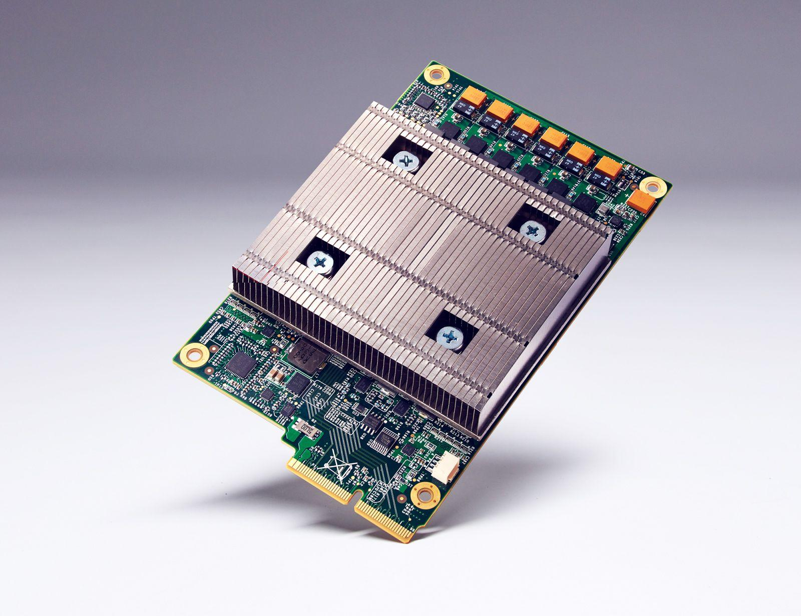

## Table of Contents

## What is a TPU chip and how does it relate to machine learning?

A TPU chip, or Tensor Processing Unit, is a special kind of computer chip made by Google. It's designed to make certain math calculations much faster than regular computer chips. These calculations are important for machine learning, which is a way computers can learn from data and make decisions or predictions.

In machine learning, we often use something called neural networks. These are like computer brains that can recognize patterns in data. TPUs are really good at helping these neural networks work faster. For example, if you want to teach a computer to recognize pictures of cats, a TPU can help the computer learn much quicker than it would with a regular chip. This makes it easier and faster to build and use machine learning models.

## How does a TPU differ from a traditional CPU or GPU in terms of architecture?

A TPU is built differently from a traditional CPU or GPU to focus on the specific math needed for machine learning. CPUs are general-purpose chips that can handle many different kinds of tasks. They have a few powerful cores that can do a lot of different calculations. GPUs, on the other hand, have many smaller cores that are great for doing the same calculation over and over again, like in graphics or some parts of machine learning. TPUs are designed to be even better at the kind of math used in neural networks, like matrix multiplication. They have a lot of cores that work together to do these calculations very quickly.

The architecture of a TPU is optimized for the operations that neural networks use most often. For example, TPUs have special hardware to speed up matrix multiplication, which is a key part of training and running neural networks. This can be shown with the formula for matrix multiplication: $$C = A \times B$$. In this formula, A and B are matrices, and C is the result of multiplying them. TPUs can do this calculation much faster than CPUs or GPUs because they are built specifically for this kind of task. This makes them very efficient for [machine learning](/wiki/machine-learning), where you often need to do a lot of matrix multiplications to train and use a model.

## What are the main benefits of using TPUs for machine learning tasks?

TPUs make machine learning tasks much faster and more efficient. They are built to do the math that neural networks need, like matrix multiplication, really quickly. This means that training a machine learning model, which can take a long time on a regular computer, can be done much faster with a TPU. For example, if you want to train a model to recognize pictures of cats, a TPU can help the computer learn from thousands of pictures in less time than it would take with a regular chip.

Another big benefit of TPUs is that they use less power than GPUs or CPUs for the same amount of work. This is important because training big machine learning models can use a lot of energy. By using less power, TPUs help save money and are better for the environment. So, not only do TPUs speed up the process, but they also make it more cost-effective and eco-friendly to run machine learning tasks.

## Can you explain the evolution of TPUs from their first to the latest generation?

The first generation of TPUs, called TPUv1, was introduced by Google in 2015. These chips were designed to speed up the math needed for machine learning, especially for running neural networks. TPUv1 was focused on inference, which is when a trained model makes predictions. It could do matrix multiplication much faster than regular chips. For example, if you wanted to use a model to recognize a picture of a cat, TPUv1 would help the computer do that quickly. The formula for matrix multiplication that TPUv1 was good at is $$C = A \times B$$, where A and B are matrices and C is the result.

The next big step was TPUv2, released in 2017. This version was better at both training and running models. TPUv2 had more memory and could work with other TPUs to handle bigger and more complex models. Then came TPUv3 in 2018, which was even faster and had more memory than TPUv2. It was designed to help with big projects like training very large language models. The latest generation, TPUv4, was introduced in 2020. TPUv4 is much faster and has more memory than TPUv3, making it even better for big machine learning tasks. Each new generation of TPUs has made machine learning faster and more efficient, helping computers learn from data quicker and with less power.

## How do TPUs handle the computational demands of deep learning models?

TPUs are made to handle the big math problems that [deep learning](/wiki/deep-learning) models need to solve. Deep learning uses neural networks, which are like computer brains that learn from lots of data. These networks do a lot of matrix multiplication, which is a kind of math that TPUs are really good at. For example, if you have two matrices, A and B, TPUs can quickly calculate the result of multiplying them together, which is shown as $$C = A \times B$$. This makes TPUs faster at training and running deep learning models than regular chips.

Each new version of TPUs has gotten better at handling these big math problems. The first TPUs were good at running trained models, but newer ones like TPUv3 and TPUv4 are also great at training big models. They have more memory and can work together to handle even bigger and more complex deep learning tasks. This means that TPUs can help computers learn from data much faster and with less power, making deep learning easier and more efficient.

## What types of machine learning models are best suited for TPUs?

TPUs are really good at helping with deep learning models, especially big ones that need a lot of math to work. Deep learning uses neural networks, which are like computer brains that learn from lots of data. These networks do a lot of something called matrix multiplication, which is a kind of math that TPUs are built to do quickly. For example, if you have two matrices, A and B, TPUs can quickly calculate the result of multiplying them together, which is shown as $$C = A \times B$$. This makes TPUs great for training and running big deep learning models like those used for understanding language or recognizing pictures.

Models that need to learn from a lot of data, like big language models or image recognition models, work really well with TPUs. These models need to do a lot of calculations to learn from the data, and TPUs can handle these calculations much faster than regular chips. For example, if you want to train a model to understand what people are saying in different languages, a TPU can help the computer learn from thousands of sentences much faster than it would with a regular chip. This makes TPUs a great choice for any machine learning task that involves big neural networks and lots of data.

## How can one deploy a machine learning model on a TPU?

To deploy a machine learning model on a TPU, you first need to make sure your code can work with TPUs. This usually means using a programming language like Python and a library like TensorFlow, which has special tools for working with TPUs. You'll need to set up your code to use the TPU, which involves telling TensorFlow to connect to the TPU and move your data and model there. For example, you might use code like ```python
import tensorflow as tf
tpu = tf.distribute.cluster_resolver.TPUClusterResolver()
tf.config.experimental_connect_to_cluster(tpu)
tf.tpu.experimental.initialize_tpu_system(tpu)
``` to get started. Once your code is set up, you can train or run your model on the TPU, which will make it much faster than using a regular computer.

After setting up your code, you can start using the TPU to train or run your model. If you're training a model, you'll need to move your data to the TPU and then start the training process. The TPU will do the math needed for training, like matrix multiplication shown as $$C = A \times B$$, much faster than a regular chip. Once your model is trained, you can use the TPU to run it on new data. This means your model can make predictions or decisions much quicker, which is really helpful if you're working with a lot of data or need fast results.

## What are the common challenges and limitations when using TPUs?

Using TPUs can be tricky because they need special code to work. You have to use libraries like TensorFlow and set up your code to connect to the TPU. This can be hard if you're not used to it. For example, you might need to write code like ```python
import tensorflow as tf
tpu = tf.distribute.cluster_resolver.TPUClusterResolver()
tf.config.experimental_connect_to_cluster(tpu)
tf.tpu.experimental.initialize_tpu_system(tpu)
``` to get started. If you make a mistake, your model might not work right on the TPU, which can be frustrating.

Another challenge is that TPUs are made for certain kinds of math, like matrix multiplication shown as $$C = A \times B$$. If your model needs other types of calculations, TPUs might not be as helpful. Also, TPUs can be expensive and not everyone has access to them. This means you might need to find other ways to run your model if you can't use a TPU.

## How do TPUs contribute to reducing the time and cost of training large models?

TPUs help make training big machine learning models faster and cheaper. They are made to do the kind of math that these models need, like matrix multiplication, which is shown as $$C = A \times B$$. This means that a TPU can do these calculations much quicker than a regular computer chip. When you train a big model, it can take a long time on a regular computer, but with a TPU, it can be done much faster. This saves a lot of time, which is really helpful when you're working on big projects.

TPUs also use less power than other chips for the same amount of work. This is important because training big models can use a lot of energy, which costs money and can be bad for the environment. By using less power, TPUs help save money on electricity bills and are better for the planet. So, not only do TPUs speed up the training of big models, but they also make it more cost-effective and eco-friendly.

## What programming frameworks and tools are optimized for use with TPUs?

The main programming framework that works well with TPUs is TensorFlow. TensorFlow has special tools that help you use TPUs easily. For example, you can use code like ```python
import tensorflow as tf
tpu = tf.distribute.cluster_resolver.TPUClusterResolver()
tf.config.experimental_connect_to_cluster(tpu)
tf.tpu.experimental.initialize_tpu_system(tpu)
``` to connect your model to a TPU. This helps your model do the math it needs, like matrix multiplication shown as $$C = A \times B$$, much faster.

Another tool that's good for TPUs is JAX. JAX is a library that makes it easy to write fast code for TPUs. It's often used for research and can help you train big models quickly. Both TensorFlow and JAX are made to take advantage of the special math that TPUs are good at, which helps you train and run your models faster and more efficiently.

## Can you discuss any significant case studies or applications where TPUs have made a notable impact?

One significant case study where TPUs made a big impact is with Google's language model, BERT. BERT is used to understand what people are saying in different languages. Training BERT used to take a long time on regular computers, but with TPUs, Google was able to train it much faster. This helped them improve their search engine and other products that need to understand language. The TPU did the math needed for training, like matrix multiplication shown as $$C = A \times B$$, much quicker than a regular chip, making it possible to use BERT in many different ways.

Another important application of TPUs is in the field of image recognition. For example, Google used TPUs to train models that can recognize things in pictures. This helped them create better products like Google Photos, where you can search for pictures of specific things, like cats or cars. The TPUs made it possible to train these models quickly and with less power, which saved money and was better for the environment. By using TPUs, Google was able to make their image recognition technology much more powerful and useful.

## What future developments can we expect in TPU technology for machine learning?

In the future, we can expect TPUs to get even better at helping with machine learning. They might become faster and use even less power, which would make training big models like language or image recognition models quicker and cheaper. New versions of TPUs could have more memory and be able to work together even better, letting them handle bigger and more complex tasks. This would help researchers and companies build and use more advanced machine learning models, making things like understanding what people say or recognizing things in pictures even more accurate and useful.

Another thing we might see is TPUs being used in more places, not just in big data centers but also in smaller devices like phones or cars. This would mean that machine learning could happen right where the data is, making things faster and more private. For example, if your phone could use a TPU to understand what you're saying without sending your data to a faraway server, it would be quicker and safer. As TPUs keep getting better, they will help make machine learning easier and more powerful for everyone.

## References & Further Reading

[1]: Jouppi, N. P., Young, C., Patil, N., & Patterson, D. (2017). ["In-Datacenter Performance Analysis of a Tensor Processing Unit."](https://arxiv.org/abs/1704.04760) Proceedings of the 44th Annual International Symposium on Computer Architecture, ACM.

[2]: Patterson, D., Gonzalez, J., Le, Q., Liang, C., Munguia, L. M., Plambec, G., ... & Vasudevan, V. (2021). ["The First Domain-Specific Architecture: The TPU."](https://arxiv.org/abs/2104.10350) Communications of the ACM.

[3]: Google Cloud. (n.d.). ["TPU Chips."](https://blog.google/products/google-cloud/ironwood-tpu-age-of-inference/) 

[4]: Barham, P., Breughe, M., Chen, M., Cheng, R., He, H., Isaacs, R., ... & Wang, W. (2019). ["Machine Learning in a Data Center: Lessons from the Case Study of Google’s Tensor Processing Unit (TPU)."](https://onlinelibrary.wiley.com/doi/full/10.1002/anie.201913767) 

[5]: Dean, J., & Patterson, D. A. (2018). ["Unsolved Opportunities and Nascent Technologies for a New Golden Age of Computer Architecture."](https://fortworth.culturemap.com/news/society/tarrant-heart-ball-2025-aha/) Journal of Emerging Technologies in Computing Systems.