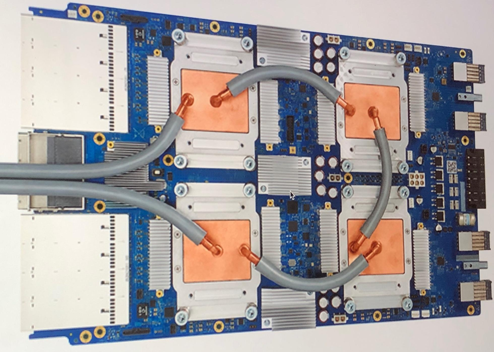

## Table of Contents

## What is a TPU Node and how does it relate to machine learning?

A TPU Node is a special kind of computer hardware designed by Google to make certain types of calculations faster, especially those used in machine learning. Machine learning is a way for computers to learn from data and make predictions or decisions without being explicitly programmed to do so. TPUs, or Tensor Processing Units, are really good at handling the math involved in these machine learning tasks, like matrix multiplications, which are common in neural networks.

In machine learning, models often need to process a lot of data quickly to learn and make predictions. TPUs help by speeding up these processes, making it possible to train larger models in less time. For example, if you're trying to teach a computer to recognize pictures of cats and dogs, a TPU can handle the calculations needed to analyze thousands of images much faster than a regular computer. This makes TPUs very useful for researchers and companies working on big machine learning projects.

## How does a TPU Node differ from a traditional GPU in terms of performance and efficiency?

A TPU Node and a traditional GPU both help speed up calculations, but they do it in different ways. TPUs are designed specifically for the kind of math used in machine learning, like matrix multiplications. This makes them very good at running neural networks, which are a big part of machine learning. GPUs, on the other hand, are more general-purpose and can handle a wider range of tasks, including graphics rendering and other types of scientific computations. Because TPUs are specialized, they can perform certain machine learning tasks much faster than GPUs. For example, a TPU might be able to process a large neural network in half the time it would take a GPU.

In terms of efficiency, TPUs are often more energy-efficient for [machine learning](/wiki/machine-learning) tasks. They use less power to do the same amount of work, which can save a lot of energy over time, especially when running large models that need to be trained for days or weeks. This is because TPUs have been optimized to handle the specific operations needed in machine learning, reducing the energy wasted on less relevant computations. GPUs, while still efficient, are not as tailored to these specific tasks, so they might use more power to achieve the same results. This makes TPUs a good choice for big data centers where energy costs and cooling are important considerations.

## What are the key components of a TPU Node?

A TPU Node is made up of several important parts that work together to make it good at machine learning tasks. The main part is the Tensor Processing Unit itself, which is a special chip designed to do the math needed for neural networks really fast. This chip is connected to a lot of memory, which is important because machine learning models often need to handle big amounts of data. The TPU also has a high-speed interconnect, which lets it talk to other TPUs or other parts of the computer system quickly. This is important for big projects where many TPUs need to work together.

Another key part of a TPU Node is the host processor, which is usually a regular CPU. The host processor helps manage the TPU and does other tasks that the TPU isn't good at. For example, the host processor might handle setting up the data or doing other calculations that don't need the TPU's special abilities. Together, the TPU and the host processor make a powerful team for running machine learning models. The TPU does the heavy lifting for the [neural network](/wiki/neural-network) calculations, while the host processor takes care of everything else.

## How can a beginner set up a TPU Node for machine learning tasks?

Setting up a TPU Node for machine learning tasks can seem hard at first, but it's easier if you follow some simple steps. You'll need to have access to a cloud service like Google Cloud Platform, where you can rent TPU Nodes. Once you have an account, you can go to the Google Cloud Console and choose to create a new TPU Node. You'll need to pick the right type of TPU for your project, like a v2 or v3, and decide how many you need. After you set up the TPU Node, you'll need to connect it to a virtual machine that will act as the host processor. This virtual machine will help you manage the TPU and run your machine learning code.

Once your TPU Node is set up, you can start using it for machine learning. You'll need to write your machine learning code in a way that it can use the TPU. Many machine learning libraries like TensorFlow have special ways to tell your code to use the TPU. For example, you might use a command like `tf.distribute.TPUStrategy()` to tell TensorFlow to use the TPU for your calculations. After your code is ready, you can run it on the TPU Node through the virtual machine. This will let you train your machine learning models much faster than you could on a regular computer.

## What types of machine learning models benefit most from using TPU Nodes?

Machine learning models that do a lot of matrix math really benefit from using TPU Nodes. These models often use neural networks, which are made up of many layers that need to process a lot of data at the same time. TPUs are built to do this kind of math quickly, so they can help train models like convolutional neural networks (CNNs) for image recognition or recurrent neural networks (RNNs) for natural language processing much faster than regular computers. For example, if you're trying to teach a computer to recognize different animals in pictures, a TPU can handle the calculations needed to analyze thousands of images much faster than a regular computer.

Another type of model that benefits from TPUs is large-scale models that need a lot of data to learn. These models, like transformer models used in language translation or text generation, can take a long time to train on regular computers. TPUs can speed this up a lot, making it possible to train bigger models in less time. This is helpful for researchers and companies working on big projects where time is important. For example, if you're building a model to translate languages, a TPU can help you train it faster and get better results sooner.

## What are the common software frameworks used with TPU Nodes for machine learning?

The main software framework used with TPU Nodes for machine learning is TensorFlow. TensorFlow is made by Google, the same company that made TPUs, so it works really well with them. TensorFlow has special parts called `tf.distribute.TPUStrategy()` that help you tell your code to use the TPU. This makes it easy to set up your machine learning models to run on TPUs. For example, if you want to train a model to recognize pictures of cats and dogs, you can use TensorFlow to make sure the TPU does the hard math work.

Another popular framework is PyTorch, which also supports TPUs but needs a bit more setup. PyTorch has a library called PyTorch/XLA that helps it work with TPUs. With PyTorch, you can write your machine learning code and then use PyTorch/XLA to run it on the TPU. This is helpful if you're already used to using PyTorch for your projects and want to speed them up with a TPU. Both frameworks make it possible to train big machine learning models faster and more efficiently.

## How do TPU Nodes handle data parallelism and model parallelism in deep learning?

TPU Nodes handle data parallelism by splitting the training data across multiple TPUs. This means each TPU works on a different part of the data at the same time, making the training process faster. For example, if you have a big dataset of images, you can divide it into smaller chunks and let each TPU process a chunk. This way, the model sees more data in less time, speeding up the learning process. In TensorFlow, you can use `tf.distribute.TPUStrategy()` to set up data parallelism easily. This command tells TensorFlow to split the data and use multiple TPUs to train the model.

Model parallelism, on the other hand, is used when the model itself is too big to fit on one TPU. In this case, the model's layers are split across multiple TPUs. Each TPU handles a different part of the model, and they work together to process the data. This is helpful for very large models, like those used in natural language processing, where the model might have millions of parameters. By spreading the model across multiple TPUs, you can train it faster and handle bigger models than you could with just one TPU. Both data and model parallelism help make the most out of TPU Nodes for [deep learning](/wiki/deep-learning) tasks.

## What are the best practices for optimizing machine learning workloads on TPU Nodes?

To optimize machine learning workloads on TPU Nodes, it's important to make sure your data is ready to go. This means you should organize your data in a way that the TPU can handle it easily. For example, if you're working with images, make sure they're all the same size and format. This helps the TPU process the data faster because it doesn't have to spend time changing things around. Also, try to use big batches of data when you're training your model. TPUs work best when they can do a lot of calculations at once, so using bigger batches can make your training faster. In TensorFlow, you can set the batch size with something like `batch_size = 32` in your code.

Another good practice is to use the right kind of parallelism for your model. If your model is big, you might want to use model parallelism to split it across multiple TPUs. This can help you train bigger models faster. On the other hand, if you have a lot of data, data parallelism can help by letting each TPU work on a different part of the data at the same time. In TensorFlow, you can set up data parallelism with `tf.distribute.TPUStrategy()`. This command helps your code use multiple TPUs to train the model faster. By choosing the right kind of parallelism, you can make the most out of your TPU Nodes and get your machine learning tasks done quicker.

## How do TPU Nodes impact the scalability of machine learning projects?

TPU Nodes make machine learning projects easier to scale up. They do this by letting you train bigger models and handle more data faster. If you have a lot of data, you can use data parallelism to split it across multiple TPUs. This means each TPU can work on a different part of the data at the same time, making the training process much quicker. For example, if you're trying to teach a computer to recognize different kinds of animals in pictures, you can use many TPUs to look at thousands of images at once. This helps you get through all your data faster and train your model more quickly.

If your model is very big, you can use model parallelism to split it across multiple TPUs. This is helpful for models with a lot of layers or parameters, like those used in language translation. By spreading the model across multiple TPUs, you can handle bigger models than you could with just one TPU. This makes it possible to work on more complex projects that need a lot of computing power. For example, if you're building a model to translate languages, using multiple TPUs can help you train it faster and get better results sooner. Overall, TPU Nodes help make machine learning projects bigger and faster, which is really important for big data centers and research projects.

## What are the current limitations and challenges of using TPU Nodes in machine learning?

Using TPU Nodes in machine learning can be tricky because they are very specialized. They are great for certain kinds of math used in neural networks, but they can't do everything a regular computer can do. This means you might need to use a regular CPU or GPU to do other parts of your project that the TPU isn't good at. Also, setting up TPUs can be hard because you need to use cloud services like Google Cloud Platform, and you have to learn how to write your code to use the TPU. This can take time and might be confusing for beginners.

Another challenge is that TPUs can be expensive. Renting them from a cloud service costs money, and if you're working on a big project, the costs can add up quickly. This means you have to think carefully about whether using TPUs will save you enough time to be worth the extra cost. Plus, because TPUs are so fast, they can sometimes make it hard to keep track of what's going on during training. You might need to use special tools to monitor your model and make sure it's learning correctly. All these things can make using TPUs a bit challenging, but they are still very powerful tools for machine learning.

## How do advancements in TPU Node technology influence the future of AI research?

Advancements in TPU Node technology are making a big difference in AI research. They let researchers train bigger and more complex models faster than ever before. This means scientists can try out new ideas and see results quicker, which helps them learn more about how AI works. For example, if someone is working on a new way to teach a computer to understand human language, they can use TPUs to test their ideas on a lot of data in a short time. This speeds up the whole process of making AI smarter and more useful.

These improvements also make it easier for more people to get involved in AI research. Because TPUs are available through cloud services, researchers don't need to buy expensive hardware to work on big projects. This opens up AI research to more people, including those at smaller schools or companies. As TPUs keep getting better, we can expect to see even more exciting developments in AI, like better language translation, more accurate image recognition, and new ways to use AI in everyday life.

## Can you compare the cost-effectiveness of using TPU Nodes versus other hardware solutions for machine learning?

Using TPU Nodes can be very cost-effective for certain machine learning tasks, especially those that involve a lot of data and complex models. TPUs are designed to do the math used in neural networks very quickly, which means they can train models faster than regular computers or GPUs. This speed can save a lot of time, which is important for big projects where every hour counts. However, TPUs are usually rented through cloud services like Google Cloud Platform, so you have to pay for the time you use them. If you're working on a project that needs a lot of computing power for a short time, TPUs might be a good choice because they can finish the job quickly and save you money in the long run.

On the other hand, GPUs are more general-purpose and can be used for a wider range of tasks, which might make them more cost-effective for some projects. GPUs are often cheaper to buy and set up than renting TPUs, especially if you need to use them for a long time. However, GPUs might not be as fast as TPUs for certain machine learning tasks, so they could take longer to train your models. This means you have to think about whether the lower cost of GPUs is worth the extra time they might need. In the end, the best choice depends on your specific project and how much time and money you have to spend.

## References & Further Reading

[1]: Jouppi, N. P., Young, C., Patil, N., Patterson, D., Agrawal, G., Bajwa, R., ... & Woo, Y. (2017). ["In-Datacenter Performance Analysis of a Tensor Processing Unit."](https://arxiv.org/abs/1704.04760) 2017 ACM/IEEE 44th Annual International Symposium on Computer Architecture (ISCA).

[2]: Abadi, M., Barham, P., Chen, J., Chen, Z., Davis, A., Dean, J., ... & Zheng, X. (2016). ["TensorFlow: A System for Large-scale Machine Learning."](https://arxiv.org/abs/1603.04467) Proceedings of the 12th USENIX Conference on Operating Systems Design and Implementation.

[3]: Gupta, U., Talkar, A., Boroumand, A., Lee, J. K., Dave, A., Lee, V., ... & Wenisch, T. F. (2021). ["The Architectural Implications of Facebook’s DNN-based Personalized Recommendation."](https://pubmed.ncbi.nlm.nih.gov/38613592/) IEEE MICRO.

[4]: Zaharia, M., Chen, A. E., Davidson, A. A., Ghodsi, A., Hong, M., Konwinski, A., ... & Stoica, I. (2010). ["Resilient Distributed Datasets: A Fault-tolerant Abstraction for In-memory Cluster Computing."](https://people.eecs.berkeley.edu/~matei/papers/2018/ieee_mlflow.pdf) Proceedings of the 9th USENIX Symposium on Networked Systems Design and Implementation.

[5]: ["High Performance Datacenter and Cloud Computing"](https://cloud.google.com/blog/products/storage-data-transfer/competing-with-supercomputers-hpc-in-the-cloud-becomes-reality) by Bogdan Ionescu and Olivier Bonaventure.

[6]: Rajpurkar, P., Irvin, J., Ball, R. L., Zhu, K., Yang, B., Mehta, H., ... & Ng, A. Y. (2018). ["Deep Learning for Chest Radiograph Diagnosis: A Retrospective Comparison of the CheXNeXt Algorithm to Practicing Radiologists."](https://journals.plos.org/plosmedicine/article?id=10.1371/journal.pmed.1002686) PLOS Medicine.