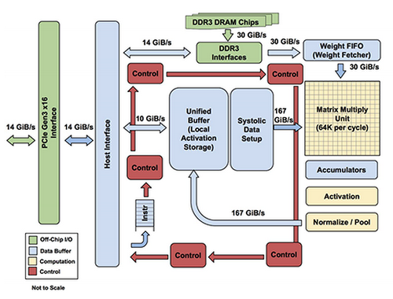

## Table of Contents

## What is a TPU and how does it differ from a GPU?

A TPU, or Tensor Processing Unit, is a type of hardware designed by Google specifically for accelerating machine learning tasks. It is optimized to handle the types of calculations used in neural networks, such as matrix multiplications, very efficiently. This makes TPUs particularly good at tasks like training and running large-scale machine learning models. They are often used in data centers where large amounts of data need to be processed quickly.

A GPU, or Graphics Processing Unit, on the other hand, was originally designed to handle the rendering of graphics for video games and other visual applications. Over time, GPUs have become popular for general-purpose computing, especially in areas like scientific simulations and machine learning, because they can handle many calculations at the same time. While GPUs are versatile and can be used for a wide range of tasks, they might not be as efficient as TPUs for specific machine learning workloads. The key difference is that TPUs are tailored for machine learning, whereas GPUs are more general-purpose but still very powerful for these tasks.

## How can TPUs accelerate machine learning tasks?

TPUs are built to make machine learning faster by focusing on the math that neural networks use a lot. They are really good at doing matrix multiplications, which is a big part of how neural networks learn and make predictions. When you train a machine learning model, you need to do a lot of these calculations over and over. TPUs can do these calculations much faster than regular computers because they have special hardware that is made just for this kind of math.

Another way TPUs speed up [machine learning](/wiki/machine-learning) is by having a lot of memory that can be accessed quickly. This means that the data the model needs can be brought in and used without waiting too long. Because TPUs are made to work well with the way machine learning models are set up, they can handle big models and large amounts of data more easily than other types of hardware. This makes the whole process of training and using machine learning models quicker and more efficient.

## What are the basic components of a TPU?

A TPU has a few main parts that help it do its job well. The first part is the matrix multiply unit, which is really good at doing matrix multiplications. This is important because machine learning models use a lot of these calculations. The matrix multiply unit can do these calculations much faster than a regular computer because it is designed just for this kind of math. Another important part is the high-bandwidth memory, which lets the TPU get data quickly. This means the TPU can work on big models and large amounts of data without waiting too long.

The second part is the scalar unit, which handles other types of calculations that the matrix multiply unit can't do. This helps the TPU be more flexible and handle different parts of machine learning tasks. The TPU also has a unified buffer, which is a special kind of memory that helps the TPU move data around quickly between different parts of the chip. This makes the whole process of training and running machine learning models smoother and faster.

## How do TPUs interact with machine learning frameworks like TensorFlow?

TPUs work well with machine learning frameworks like TensorFlow because they are made to fit together nicely. TensorFlow has special parts in it that let you use TPUs easily. When you write your machine learning code in TensorFlow, you can tell it to use a TPU instead of a regular computer or GPU. This means you can use the fast math and big memory of the TPU to make your machine learning models train and run faster.

To use a TPU with TensorFlow, you need to set up your code to connect to the TPU. This usually means you need to tell TensorFlow where the TPU is and how to talk to it. Once you do this, TensorFlow will send your data and calculations to the TPU, and the TPU will do the work and send the results back. This makes it easier for people who know how to use TensorFlow to also use TPUs without learning a lot of new things.

## What types of machine learning models benefit most from using TPUs?

Machine learning models that do a lot of matrix multiplications benefit the most from using TPUs. These models include big neural networks like [deep learning](/wiki/deep-learning) models used for things like image recognition or natural language processing. TPUs are really good at doing the math these models need quickly, which means they can train and run these models faster than other types of computers.

For example, models like convolutional neural networks (CNNs) used for image tasks and transformer models used for language tasks can see big speed-ups when using TPUs. These models have a lot of layers and need to do a lot of calculations, which is exactly what TPUs are made for. By using TPUs, you can make these models work faster and handle bigger datasets, which can lead to better results in less time.

## How can one set up and configure a TPU for machine learning projects?

To set up and configure a TPU for machine learning projects, you first need to access a TPU. This can be done through cloud services like Google Cloud Platform, where you can request a TPU instance. Once you have access, you'll need to connect your machine learning code to the TPU. This usually involves setting up your environment to use the TPU. For example, in Google Colab, you can connect to a TPU by running a few lines of code that tell the system to use the TPU as the runtime. After connecting, you need to make sure your machine learning framework, like TensorFlow, is set up to work with the TPU. This means you might need to install specific versions of TensorFlow that support TPUs.

Once your environment is set up, you need to configure your machine learning code to use the TPU. In TensorFlow, this means you'll use the `TPUStrategy` to tell your model to run on the TPU. You'll write code to define the TPU as your device, and then you'll wrap your model and training loop with this strategy. For example, you might use code like ```python
tpu = tf.distribute.cluster_resolver.TPUClusterResolver()
tf.config.experimental_connect_to_cluster(tpu)
tf.tpu.experimental.initialize_tpu_system(tpu)
strategy = tf.distribute.experimental.TPUStrategy(tpu)
``` to set up the TPU and then use the strategy to distribute your model's computations across the TPU's cores. This setup makes sure that your model uses the TPU's fast math and big memory to speed up your machine learning tasks.

## What are the performance metrics to consider when evaluating TPUs?

When evaluating TPUs, you should look at how fast they can do calculations, which is often measured in FLOPS (floating-point operations per second). TPUs are designed to do a lot of matrix multiplications quickly, so you want to see how many of these they can do in a second. Another important thing to check is how quickly the TPU can get data from its memory. This is called memory bandwidth, and it's important because if the TPU has to wait for data, it can slow down your machine learning tasks. You also want to see how well the TPU can handle big models and large amounts of data, which is called scalability.

Another performance metric to consider is the TPU's energy efficiency, which measures how much power it uses to do its work. This is important if you want to run your machine learning tasks without using too much electricity. Finally, you should look at how easy it is to use the TPU with your machine learning code. This includes things like how well it works with frameworks like TensorFlow and how easy it is to set up and run your models on the TPU. All these metrics together give you a good idea of how well a TPU will help with your machine learning projects.

## How do TPUs handle data parallelism and model parallelism?

TPUs handle data parallelism by splitting the data into smaller pieces and processing each piece on different parts of the TPU at the same time. This means that if you have a big dataset, the TPU can work on different parts of it all at once, making the training of your machine learning model faster. In TensorFlow, you can use the `TPUStrategy` to set up data parallelism easily. For example, you might write code like ```python
strategy = tf.distribute.TPUStrategy(resolver)
with strategy.scope():
    model = create_model()
    model.fit(train_dataset, epochs=5)
``` to tell the TPU to split the data and train the model in parallel.

Model parallelism, on the other hand, is when the TPU splits the model itself into different parts and processes each part on different cores. This is useful when your model is very big and won't fit on one TPU core. By spreading the model across multiple cores, the TPU can handle bigger models and still run them quickly. In TensorFlow, you can set up model parallelism by using the `tf.distribute.experimental.TPUStrategy` and making sure your model is set up to work across multiple cores. This way, even very large models can be trained efficiently on TPUs.

## What are the current limitations of TPUs in machine learning applications?

TPUs are great for speeding up machine learning tasks, but they have some limits. One big limit is that TPUs are made for certain types of calculations, like matrix multiplications, which are common in neural networks. If your machine learning task needs a lot of different kinds of calculations, a TPU might not be as fast as a GPU, which can handle many types of calculations well. Also, setting up and using TPUs can be tricky. You need to know how to connect your code to the TPU and make sure it works well with your machine learning framework, like TensorFlow. This can take time and might be hard for people who are new to using TPUs.

Another limit is that TPUs are not as flexible as GPUs. If you want to change your machine learning model a lot or try different kinds of models, a GPU might be easier to use. TPUs are best for big models that don't change much, like the ones used for image recognition or language processing. If your project needs to try many different models quickly, a GPU might be a better choice. Also, TPUs are usually available through cloud services, which means you need a good internet connection and might have to pay for using them. This can be a problem if you are working on a project with a tight budget or if you need to work offline.

## How do TPUs compare to other AI accelerators in terms of cost and performance?

TPUs are designed to be very fast at doing the math that machine learning models need, like matrix multiplications. This makes them great for big models and large datasets. Compared to other AI accelerators like GPUs, TPUs can be faster for these specific tasks. For example, a TPU might be able to train a big [neural network](/wiki/neural-network) much quicker than a GPU. But TPUs are not as flexible as GPUs, which can handle many different types of calculations. So, if your project needs a lot of different kinds of math, a GPU might be better. Also, TPUs are usually available through cloud services, so you don't have to buy them, but you do have to pay for using them. This can be cheaper than buying a GPU if you only need to use the TPU for a short time, but it can add up if you need to use it a lot.

In terms of cost, TPUs can be more affordable for big projects that need a lot of computing power for a short time. If you need to train a big model quickly, renting a TPU from a cloud service can be less expensive than buying a high-end GPU. But if you need to use the [accelerator](/wiki/accelerator) for a long time or for many different projects, buying a GPU might be cheaper in the long run. GPUs are also more flexible, so if you want to try different kinds of models or change your project a lot, a GPU might be a better choice even if it's more expensive upfront. Overall, TPUs are great for big, specific machine learning tasks, but they might not be the best choice for every project because of their cost and flexibility.

## What advanced techniques can be used to optimize machine learning models on TPUs?

To optimize machine learning models on TPUs, one advanced technique is to use mixed precision training. This means using both 16-bit and 32-bit floating-point numbers in your model. By using 16-bit numbers for most calculations, you can speed up your model and use less memory. But for some parts of the model, like the gradients, you might still use 32-bit numbers to keep the model accurate. In TensorFlow, you can set up mixed precision training easily by using the `mixed_precision` API. For example, you might write ```python
from tensorflow.keras.mixed_precision import experimental as mixed_precision
policy = mixed_precision.Policy('mixed_float16')
mixed_precision.set_policy(policy)
``` to tell your model to use mixed precision. This can make your model run faster on a TPU without losing much accuracy.

Another technique is to use model sharding, which means splitting your model across multiple TPU cores. This is useful when your model is very big and won't fit on one core. By spreading the model across multiple cores, you can handle bigger models and still run them quickly. In TensorFlow, you can set up model sharding by using the `tf.distribute.experimental.TPUStrategy` and making sure your model is set up to work across multiple cores. This way, even very large models can be trained efficiently on TPUs. For example, you might write ```python
strategy = tf.distribute.experimental.TPUStrategy(resolver)
with strategy.scope():
    model = create_model()
    model.fit(train_dataset, epochs=5)
``` to set up the TPU and train your model across multiple cores.

## What future developments are expected in TPU technology for machine learning?

Future developments in TPU technology for machine learning are expected to focus on making them even faster and more efficient. One big area of improvement is increasing the TPU's ability to do more calculations at the same time. This means that TPUs could handle even bigger models and larger datasets without slowing down. Another important development is improving the TPU's energy efficiency. By using less power to do the same amount of work, TPUs can help make machine learning tasks cheaper and more environmentally friendly. Researchers are also working on making TPUs more flexible, so they can handle a wider range of calculations and be easier to use for different kinds of machine learning projects.

In addition to these improvements, we might see TPUs becoming more integrated with other types of hardware. This could mean that TPUs work better with GPUs and CPUs, allowing for more complex and powerful machine learning systems. Another exciting possibility is the development of smaller, more portable TPUs that can be used in devices like smartphones and laptops. This would make advanced machine learning capabilities available to more people and in more places. Overall, the future of TPU technology looks promising, with a focus on speed, efficiency, and broader applicability in the world of machine learning.