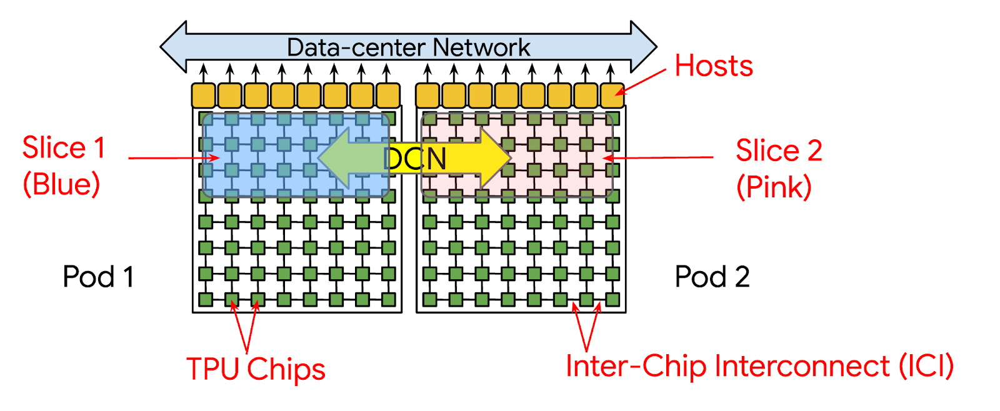

## Table of Contents

## What is a TPU Slice and how does it relate to machine learning?

A TPU Slice is a part of Google's Tensor Processing Unit (TPU), which is a special kind of hardware designed to speed up machine learning tasks. Think of a TPU as a powerful computer chip that's really good at doing the math needed for machine learning. A TPU Slice is a smaller section of this chip, and you can use one slice or connect several slices together to work on bigger problems. This makes TPUs flexible because you can use just what you need for your project.

In machine learning, TPUs are super helpful because they can handle the heavy calculations much faster than regular computer chips. For example, when training a model, you might need to do a lot of matrix multiplications, which can take a long time on a regular computer. With a TPU Slice, these calculations happen much quicker, making it easier and faster to train models and run them. This speed-up can be a big deal, especially when working with large amounts of data or complex models.

## How does a TPU Slice differ from a traditional GPU in terms of performance and efficiency?

A TPU Slice and a traditional GPU differ in how they handle the math needed for machine learning. TPUs are designed specifically for the kind of calculations used in deep learning, like matrix multiplications. This means a TPU Slice can do these calculations much faster than a GPU. For example, if you're training a big neural network, a TPU Slice can speed up the process a lot because it's made just for this kind of work. On the other hand, GPUs are more general-purpose and can handle a wider range of tasks, but they might not be as fast for the specific math used in machine learning.

In terms of efficiency, TPUs are often more energy-efficient than GPUs. This means they can do more work using less power, which is important if you're running a lot of calculations over a long time. For instance, if you're training a model for days or weeks, using a TPU Slice could save a lot of electricity compared to using a GPU. However, GPUs are more widely available and might be easier to use for smaller projects or when you need to do other types of computing besides [machine learning](/wiki/machine-learning). So, the choice between a TPU Slice and a GPU depends on what you need to do and how much you care about speed and energy use.

## What are the basic components of a TPU Slice?

A TPU Slice has a few main parts that help it do its job well. The first part is the Matrix Multiply Unit (MMU), which is really good at doing the math needed for machine learning, like multiplying matrices. This is important because a lot of machine learning involves these kinds of calculations. The second part is the High Bandwidth Memory (HBM), which is like a super-fast storage space that lets the TPU Slice keep a lot of data close by, so it can work on it quickly.

Another important part is the TPU Core, which is like the brain of the TPU Slice. It controls everything and makes sure the MMU and HBM work together smoothly. The TPU Core also has special parts that help it do things like adding numbers or moving data around. All these parts together make the TPU Slice very good at speeding up machine learning tasks.

## How can a beginner set up and use a TPU Slice for machine learning tasks?

To set up and use a TPU Slice for machine learning tasks, a beginner should start by accessing Google's Cloud platform, where TPUs are available. You'll need to create a Google Cloud account and set up a project. Once you have a project, go to the Google Cloud Console and navigate to the AI Platform or Compute Engine section to request a TPU. After your request is approved, you can connect to the TPU using a tool like Google Colab, which is a free online platform that lets you write and run Python code in your browser. In Colab, you can select a TPU runtime and start using the TPU for your machine learning tasks.

Using a TPU Slice in your code involves a few steps. First, you need to tell your code to use the TPU. In TensorFlow, for example, you can do this with a few lines of code that set up the TPU and tell your model to use it. Once your model is set up to use the TPU, you can start training your model. The TPU will handle the heavy math, making your training process much faster. Just remember to keep an eye on your code and make sure it's working with the TPU correctly, as sometimes you might need to tweak things to get the best performance.

## What types of machine learning models are best suited for TPU Slice?

Machine learning models that involve a lot of matrix multiplications are best suited for TPU Slices. This includes [deep learning](/wiki/deep-learning) models like neural networks, especially convolutional neural networks (CNNs) used for image recognition and recurrent neural networks (RNNs) used for natural language processing. These models benefit from the TPU's Matrix Multiply Unit, which can perform these operations very quickly. For example, if you're training a model to recognize objects in pictures, a TPU Slice can speed up the process a lot because it's designed for the kind of math these models need.

Models that don't rely heavily on matrix operations might not see as much benefit from using a TPU Slice. For instance, simpler models like decision trees or support vector machines might not get a big speed boost because they don't use the same kind of math that TPUs are good at. If you're working on a project with these kinds of models, a TPU Slice might not be the best choice. But if your project involves complex neural networks, using a TPU Slice can make a big difference in how fast you can train and run your models.

## How does the architecture of a TPU Slice enhance machine learning computations?

The architecture of a TPU Slice is designed to make machine learning computations faster and more efficient. It includes a special part called the Matrix Multiply Unit (MMU), which is really good at doing the kind of math needed for machine learning, like multiplying matrices. This is important because a lot of machine learning involves these calculations. The TPU Slice also has High Bandwidth Memory (HBM), which lets it keep a lot of data close by, so it can work on it quickly. This means the TPU can handle big chunks of data without slowing down, which is a big help when training complex models.

The TPU Core is another key part of the TPU Slice. It acts like the brain of the TPU, controlling everything and making sure the MMU and HBM work together smoothly. The TPU Core has special parts that help it do things like adding numbers or moving data around. All these parts working together make the TPU Slice very good at speeding up machine learning tasks. For example, if you're training a [neural network](/wiki/neural-network), the TPU Slice can do the calculations much faster than a regular computer, which means you can train your model quicker and with less energy.

## What are the common programming frameworks used with TPU Slice?

The most common programming framework used with TPU Slice is TensorFlow. This is because TensorFlow was developed by Google, the same company that made TPUs, so it works really well with them. In TensorFlow, you can easily set up your model to use a TPU Slice by using a few lines of code. For example, you can use the `tf.distribute.TPUStrategy` to tell TensorFlow to use the TPU for your calculations. This makes it easy for beginners to start using TPUs for their machine learning projects.

Another framework that can be used with TPU Slice is PyTorch, though it requires a bit more setup. PyTorch has a library called PyTorch/XLA that lets you use TPUs. With PyTorch/XLA, you need to move your model and data to the TPU using some extra code. While it's not as straightforward as using TensorFlow, PyTorch users can still take advantage of the speed and efficiency of TPUs for their machine learning tasks. Both frameworks help make the most out of the TPU's ability to do fast matrix calculations, which is key for training big neural networks.

## How can one optimize machine learning models specifically for TPU Slice?

To optimize machine learning models for TPU Slice, you should focus on making your model's math work well with the TPU's strengths. TPUs are really good at doing matrix multiplications, so you want to use models that do a lot of these calculations. For example, convolutional neural networks (CNNs) and recurrent neural networks (RNNs) are great for TPUs because they involve a lot of matrix math. You can also make your data into bigger chunks, called batches, so the TPU can work on more data at once. This helps the TPU use its High Bandwidth Memory (HBM) better, making your model train faster.

Another way to optimize for TPU Slice is to use the right programming tools and settings. In TensorFlow, you can use `tf.distribute.TPUStrategy` to tell your model to use the TPU. This helps the TPU handle the math better. For example, you might use code like this to set up your model:

```python
import tensorflow as tf

resolver = tf.distribute.cluster_resolver.TPUClusterResolver(tpu='grpc://' + os.environ['COLAB_TPU_ADDR'])
tf.config.experimental_connect_to_cluster(resolver)
tf.tpu.experimental.initialize_tpu_system(resolver)
strategy = tf.distribute.TPUStrategy(resolver)

with strategy.scope():
    model = ...  # Define your model here
```

By using this setup, you make sure your model is running on the TPU, which can speed up your training a lot. Also, keep your model's code simple and efficient, so the TPU can do its job without any extra work. This way, you get the most out of the TPU's ability to do fast calculations.

## What are the scalability and deployment options for TPU Slice in a production environment?

In a production environment, TPU Slices offer great scalability and deployment options. You can use one TPU Slice for smaller projects or connect multiple TPU Slices together to work on bigger, more complex tasks. This means you can start with a single TPU Slice and then add more as your project grows, making it easy to scale up your machine learning models. Google's Cloud platform makes it simple to manage these TPU Slices, allowing you to request more resources as needed and pay only for what you use.

Deploying models trained on TPU Slices in production is also straightforward. Once your model is trained, you can use Google's Cloud AI Platform to serve your model, which supports TPU inference. This means your model can keep using the speed and efficiency of TPUs even when it's being used in real-time applications. By setting up your deployment on the cloud, you can ensure that your model runs smoothly and can handle a lot of users without slowing down.

## How do TPU Slices handle data parallelism and model parallelism in deep learning?

TPU Slices handle data parallelism by splitting the data into smaller parts and processing them at the same time on different TPU cores. This means if you have a big dataset, you can use multiple TPU Slices to work on different parts of the data at once. For example, if you're training a neural network, the TPU Slices can each take a batch of data and calculate the model's predictions and updates together. This makes the training process much faster because the work is shared across many TPU cores. In TensorFlow, you can set up data parallelism like this:

```python
import tensorflow as tf

resolver = tf.distribute.cluster_resolver.TPUClusterResolver(tpu='grpc://' + os.environ['COLAB_TPU_ADDR'])
tf.config.experimental_connect_to_cluster(resolver)
tf.tpu.experimental.initialize_tpu_system(resolver)
strategy = tf.distribute.TPUStrategy(resolver)

with strategy.scope():
    model = ...  # Define your model here
    model.compile(optimizer='adam', loss='sparse_categorical_crossentropy', metrics=['accuracy'])

    dataset = ...  # Your dataset here
    dataset = strategy.experimental_distribute_dataset(dataset)

    @tf.function
    def train_step(data):
        # Your training step logic here
        pass

    for data in dataset:
        strategy.run(train_step, args=(data,))
```

TPU Slices also support model parallelism, which means they can split the model itself across different TPU cores. This is useful when you have a very large model that won't fit on one TPU core. For example, if you're working with a huge neural network, you can divide the layers of the network among multiple TPU Slices. Each TPU Slice works on a part of the model, and they all communicate to put the results together. This way, even very big models can be trained efficiently. In TensorFlow, you can set up model parallelism by carefully designing your model to be split across TPU cores, which might involve more complex code depending on your specific model architecture.

## What are the current limitations and challenges of using TPU Slice in machine learning?

Using TPU Slices in machine learning can be challenging because they are designed to work best with certain types of models. If your model doesn't use a lot of matrix multiplications, like simpler models such as decision trees, you might not see much benefit from using a TPU Slice. Also, setting up and using TPUs can be tricky for beginners. You need to use specific programming frameworks like TensorFlow, and even then, you might need to write extra code to make sure your model runs well on the TPU. This can be a learning curve, especially if you're used to working with other types of hardware like GPUs.

Another limitation is the cost and availability of TPUs. They are not as widely available as GPUs, and you usually need to use Google's Cloud platform to access them. This means you might have to pay for cloud computing time, which can add up if you're working on a big project. Plus, TPUs are very powerful, so they use a lot of energy, which can be a concern if you're trying to keep your project eco-friendly. Despite these challenges, TPUs can still be a great choice for speeding up complex machine learning tasks if you're willing to work through the setup and cost issues.

## What future developments can we expect in TPU Slice technology for machine learning?

In the future, we can expect TPU Slice technology to get even better at helping with machine learning. One big change might be making TPUs work well with more types of models, not just the ones that do a lot of matrix math. This could mean TPUs become more flexible and useful for a wider range of machine learning tasks. Another improvement might be in how easy it is to set up and use TPUs. Right now, you need to know how to use specific tools like TensorFlow, but in the future, there could be simpler ways to connect your code to a TPU, making it easier for beginners to use them.

We might also see TPUs become more energy-efficient. Right now, TPUs use a lot of power, but future versions could be designed to use less energy while still being fast. This would make them more eco-friendly and cheaper to run. Additionally, TPUs could become more widely available, not just on Google's Cloud platform. If more companies start making TPUs, or if they become easier to buy and set up at home, more people could use them for their machine learning projects. All these changes would make TPU Slices an even more powerful tool for speeding up machine learning work.