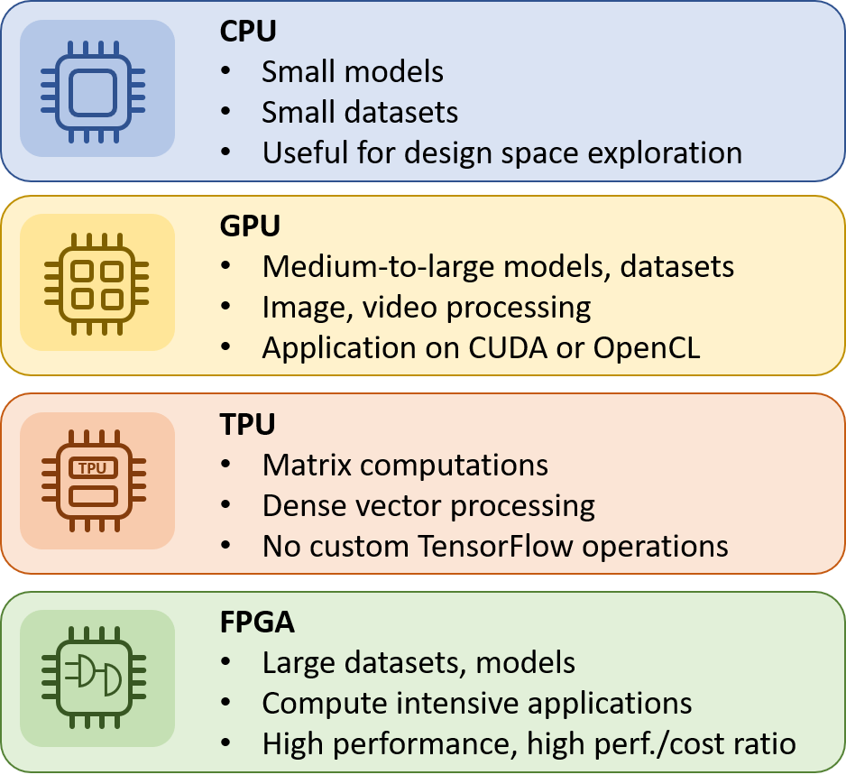

## Table of Contents

## What is a TPU and how does it differ from a CPU or GPU?

A TPU, or Tensor Processing Unit, is a type of hardware designed specifically for accelerating machine learning tasks. It was developed by Google to handle the complex calculations involved in neural networks and other AI models more efficiently than general-purpose processors. TPUs are optimized for the kind of matrix multiplications and other operations that are common in machine learning, which allows them to perform these tasks much faster than traditional processors.

In contrast, a CPU, or Central Processing Unit, is a general-purpose processor found in most computers. CPUs are designed to handle a wide variety of tasks, from running applications to managing system operations. They are versatile but not as efficient as specialized hardware like TPUs for specific tasks like machine learning. On the other hand, a GPU, or Graphics Processing Unit, was originally designed to handle graphics rendering but has become popular for machine learning because it can perform many calculations in parallel. While GPUs are more efficient than CPUs for machine learning, they are still not as specialized as TPUs, which are tailored specifically for these types of computations.

## What are the different types of TPUs available for machine learning?

There are mainly two types of TPUs available for machine learning: the TPU v2 and the TPU v3. The TPU v2 is an older version that was designed to speed up machine learning tasks. It is good at handling the calculations needed for training and running neural networks. The TPU v2 can be used in the cloud or on special hardware called the Cloud TPU Pod, which connects many TPUs together to work on big projects. The TPU v3 is a newer version that is even faster and more powerful. It has more memory and can handle bigger and more complex models. The TPU v3 is also used in the cloud and can be part of a Cloud TPU Pod for large-scale machine learning tasks.

Besides these, there is also the Edge TPU, which is designed for use in smaller devices like smartphones and IoT gadgets. The Edge TPU is made to run [machine learning](/wiki/machine-learning) models directly on the device, without needing to send data to the cloud. This makes it faster and more private. The Edge TPU is smaller and uses less power than the TPU v2 and v3, but it is still very good at running machine learning tasks on the edge.

## How does a TPU enhance the performance of machine learning models?

A TPU, or Tensor Processing Unit, helps machine learning models work faster and better. It does this by being really good at doing the math that machine learning needs. For example, when training a [neural network](/wiki/neural-network), you need to do a lot of matrix multiplications. A TPU can do these calculations much quicker than a regular computer chip like a CPU or even a GPU. This means that your machine learning models can learn from data faster, and you can try out more ideas in less time.

TPUs also have a lot of memory, which is important for handling big and complex models. When you're working with a large dataset or a complicated neural network, you need a lot of space to store all the numbers you're working with. TPUs are designed to have enough memory to do this efficiently. This makes it easier to train big models and get good results without running out of space. So, TPUs help make machine learning faster and more powerful by being good at the math and having enough room to work with big data.

## What are the basic hardware components of a TPU?

A TPU, or Tensor Processing Unit, has some key parts that make it work well for machine learning. The main part is the Matrix Multiply Unit, which is really good at doing the math needed for neural networks. This unit can handle lots of numbers at once, making calculations faster. Another important part is the memory, which is split into two types: high-bandwidth memory for quick access to data and regular memory for storing larger amounts of information. The TPU also has a special part called the Scalar Unit, which helps with simpler calculations that don't need the Matrix Multiply Unit.

The TPU also has a controller that tells all these parts what to do. It makes sure the Matrix Multiply Unit and the Scalar Unit work together smoothly, and it manages how data moves between the memory types. All these parts together help the TPU do machine learning tasks much faster than a regular computer chip. By focusing on the math and memory that machine learning needs, the TPU can make training and running models much quicker and more efficient.

## How can a beginner start using TPUs for machine learning?

If you're a beginner looking to use TPUs for machine learning, the easiest way to start is by using Google Colab. Google Colab is a free online platform where you can write and run Python code in your browser. It comes with built-in support for TPUs, so you don't need to set anything up yourself. All you need to do is to connect your notebook to a TPU, and you can start running your machine learning models on it. Google Colab also has lots of example notebooks that show you how to use TPUs for different kinds of machine learning tasks, which can be really helpful if you're just starting out.

Once you're comfortable with Google Colab, you can start using TPUs with other tools like TensorFlow. TensorFlow is a popular library for machine learning, and it has special support for TPUs. To use a TPU with TensorFlow, you need to set up a TPU strategy, which tells TensorFlow how to use the TPU. Here's a simple example of how you might do this: ```python
import tensorflow as tf
resolver = tf.distribute.cluster_resolver.TPUClusterResolver(tpu='grpc://' + os.environ['COLAB_TPU_ADDR'])
tf.config.experimental_connect_to_cluster(resolver)
tf.tpu.experimental.initialize_tpu_system(resolver)
strategy = tf.distribute.TPUStrategy(resolver)
``` This code connects to a TPU and sets up a strategy for using it. After that, you can write your machine learning code inside the strategy, and TensorFlow will use the TPU to speed up your calculations. As you get more experience, you can try using TPUs with other tools and platforms, but starting with Google Colab and TensorFlow is a good way to learn the basics.

## What programming languages and frameworks are compatible with TPUs?

TPUs work well with the Python programming language, which is popular for machine learning. The main framework that supports TPUs is TensorFlow, which is a powerful tool for building and training machine learning models. To use a TPU with TensorFlow, you need to set up a TPU strategy. Here's a simple example of how you might do this: ```python
import tensorflow as tf
resolver = tf.distribute.cluster_resolver.TPUClusterResolver(tpu='grpc://' + os.environ['COLAB_TPU_ADDR'])
tf.config.experimental_connect_to_cluster(resolver)
tf.tpu.experimental.initialize_tpu_system(resolver)
strategy = tf.distribute.TPUStrategy(resolver)
``` This code helps TensorFlow use the TPU to speed up your calculations. Besides TensorFlow, TPUs can also work with other frameworks like PyTorch, but you might need to use special libraries like PyTorch/XLA to make it work.

Google Colab is a great way to start using TPUs because it's free and easy to use. You can write and run Python code in your browser, and it comes with built-in support for TPUs. All you need to do is connect your notebook to a TPU, and you can start running your machine learning models on it. Google Colab also has lots of example notebooks that show you how to use TPUs for different kinds of machine learning tasks, which can be really helpful if you're just starting out.

## How do TPUs handle large-scale machine learning tasks?

TPUs are really good at handling big machine learning tasks because they are designed to do the math that these tasks need very quickly. When you're working on a large-scale project, like training a huge neural network on a lot of data, TPUs can make things go much faster. They do this by being able to do many calculations at the same time, which is important for the kind of math that machine learning uses. TPUs also have a lot of memory, so they can handle big models and large datasets without running out of space. This makes it easier to train complex models and get good results faster.

One way TPUs handle large-scale tasks is by working together in something called a TPU Pod. A TPU Pod is a group of TPUs that are connected and work together to solve big problems. When you use a TPU Pod, all the TPUs can share the work, so you can train even bigger models and use even more data. This is really helpful for tasks like training models for image recognition or natural language processing, where you need a lot of power to get good results. By using TPUs and TPU Pods, you can make your large-scale machine learning projects run much faster and more efficiently.

## What are the benefits of using TPUs for deep learning?

TPUs are really helpful for [deep learning](/wiki/deep-learning) because they make the training of neural networks much faster. When you're working on deep learning projects, you need to do a lot of math, especially matrix multiplications. TPUs are built to do these calculations very quickly, which means your models can learn from data faster. This is important because it lets you try out more ideas and make changes to your models without waiting too long. TPUs also have a lot of memory, so they can handle big models and large datasets without running out of space. This makes it easier to work on complex projects and get good results.

Another benefit of using TPUs is that they can work together in groups called TPU Pods. When TPUs are connected in a TPU Pod, they can share the work and handle even bigger tasks. This is really useful for large-scale deep learning projects, like training models for image recognition or natural language processing. By using TPUs and TPU Pods, you can make your deep learning projects run much faster and more efficiently. This saves time and helps you get better results from your models.

## How do you optimize machine learning models specifically for TPUs?

To optimize machine learning models for TPUs, you need to think about how TPUs work best. TPUs are really good at doing the math that machine learning needs, especially matrix multiplications. So, you should try to use operations that TPUs can do quickly. For example, if you can, use matrix multiplication instead of a lot of smaller calculations. Also, TPUs like to work with big batches of data at once. So, if you can, use bigger batch sizes when training your model. This helps the TPU use its power more efficiently. Another thing to think about is how you move data around. TPUs have special memory that's fast but small, and regular memory that's slower but bigger. Try to keep the data you need most often in the fast memory.

Another way to optimize for TPUs is to use the right tools and settings. When you're using TensorFlow with TPUs, you can set up a TPU strategy to tell TensorFlow how to use the TPU. Here's how you might do that: ```python
import tensorflow as tf
resolver = tf.distribute.cluster_resolver.TPUClusterResolver(tpu='grpc://' + os.environ['COLAB_TPU_ADDR'])
tf.config.experimental_connect_to_cluster(resolver)
tf.tpu.experimental.initialize_tpu_system(resolver)
strategy = tf.distribute.TPUStrategy(resolver)
``` This code helps TensorFlow use the TPU to speed up your calculations. You should also make sure your model is set up to use the TPU's strengths. For example, if you're using a convolutional neural network, you might want to use operations that TPUs can do quickly, like $$ \text{Conv2D} $$ layers. By thinking about how TPUs work and using the right tools, you can make your machine learning models run faster and more efficiently on TPUs.

## What are some real-world applications of TPUs in machine learning?

TPUs are used in many real-world applications to make machine learning faster and better. For example, in image recognition, TPUs help companies like Google train big models to understand pictures. They use TPUs to quickly teach their models to tell the difference between things like cats and dogs or to find objects in photos. This helps make services like Google Photos work well and fast. Another use is in natural language processing, where TPUs help with tasks like translating languages or understanding what people are saying. For example, Google's language translation service uses TPUs to make translations happen quickly and accurately.

Another important application of TPUs is in healthcare. Researchers use TPUs to train models that can help doctors understand medical images like X-rays or MRIs. These models can find problems in the images faster than humans, which can help with early diagnosis and better treatment. TPUs also help in drug discovery, where they speed up the process of finding new medicines by analyzing large amounts of data. By using TPUs, researchers can try out many different ideas quickly and find the best solutions for health problems.

## How do TPUs compare to other specialized hardware for machine learning?

TPUs are special chips made by Google to make machine learning faster. They are really good at doing the math that machine learning needs, like matrix multiplications. This makes them faster than regular computer chips like CPUs for training big models. GPUs, which are also used a lot for machine learning, can do many calculations at once, but TPUs are even better at the specific math that machine learning uses. TPUs also have a lot of memory, so they can handle big models and large datasets without running out of space. This makes them a good choice for big projects where you need a lot of power.

Another type of specialized hardware for machine learning is the FPGA, or Field-Programmable Gate Array. FPGAs can be changed to do different tasks, which makes them flexible. But they are not as fast as TPUs for the specific math that machine learning needs. FPGAs are good for tasks where you need to change what the hardware does often, but for big machine learning projects, TPUs are usually faster and more efficient. By using TPUs, you can make your machine learning models learn faster and handle bigger tasks, which is important for things like image recognition and natural language processing.

## What future developments can we expect in TPU technology for machine learning?

In the future, TPU technology is likely to keep getting better and faster. One big change might be that TPUs will have even more memory. This will let them handle even bigger and more complicated machine learning models. Another thing that could happen is that TPUs will become more energy-efficient. This means they will use less power while still doing a lot of work. This is important because it can help save energy and make machine learning more sustainable. Companies like Google are always working on new ways to make TPUs better, so we can expect to see new versions that are even more powerful and efficient.

Another possible development is that TPUs might become easier to use with different machine learning frameworks. Right now, TPUs work really well with TensorFlow, but it can be harder to use them with other tools like PyTorch. In the future, we might see better support for TPUs in more frameworks, making them easier to use for more people. Also, TPUs might get better at working with other types of hardware, like GPUs and CPUs. This could let you use TPUs together with other chips to make your machine learning projects even faster and more flexible. By making these improvements, TPUs can help make machine learning easier and more powerful for everyone.