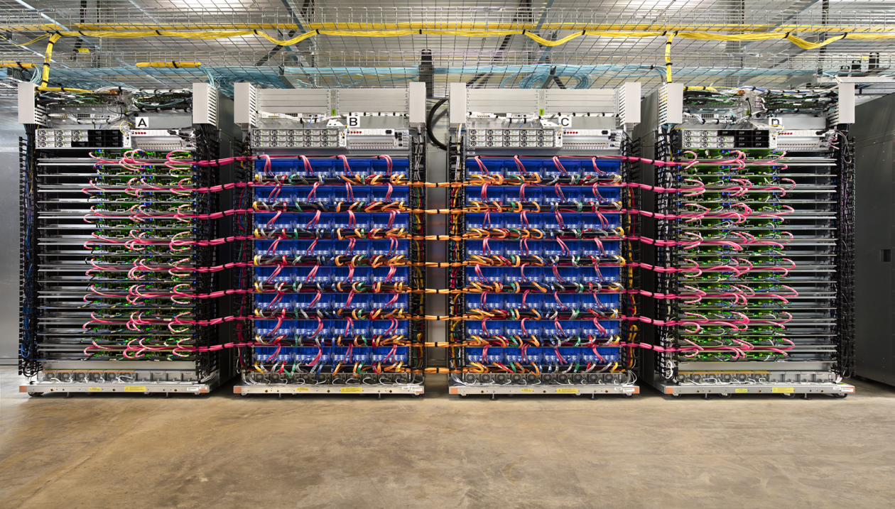

## Table of Contents

## What is a TPU and how does it differ from a GPU?

A TPU, or Tensor Processing Unit, is a type of hardware designed by Google specifically to speed up machine learning tasks. It's made to handle the kinds of math that are common in neural networks, like multiplying matrices. This makes TPUs really good at training and running big AI models quickly. They are often used in data centers where lots of AI work is done.

A GPU, or Graphics Processing Unit, was originally made to handle the visuals in video games and computers. But, because GPUs are good at doing many calculations at the same time, they've become popular for machine learning too. The main difference between a TPU and a GPU is that TPUs are built from the ground up for machine learning, so they can be faster and more efficient for those specific tasks. GPUs, on the other hand, are more versatile and can be used for a wider range of computing jobs, not just AI.

## How does a TPU worker contribute to machine learning tasks?

A TPU worker is like a special helper in a big team working on machine learning projects. It's made to do the math that machine learning needs really fast. When you're training a big AI model, you break the work into smaller pieces. Each TPU worker takes one of these pieces and does its part of the math. By working together, all the TPU workers can finish the job much quicker than if just one was doing it all.

Imagine you're trying to solve a giant puzzle. Each TPU worker is like a person working on a different section of the puzzle. They all talk to each other to make sure their pieces fit together right. This teamwork lets them solve the puzzle faster. In [machine learning](/wiki/machine-learning), this means the TPU workers help the AI learn and get better at its job more quickly.

## What are the basic components of a TPU?

A TPU has a few main parts that help it do its job well. The heart of a TPU is its matrix multiply unit (MMU). This part is really good at doing a special kind of math called matrix multiplication, which is super important for machine learning. The MMU can handle big chunks of data at once, making it faster than regular computer chips. Another key part is the unified buffer, which is like a fast memory space right next to the MMU. It helps the TPU keep data close by, so it can work on it quickly without waiting.

The TPU also has a host interface that lets it talk to the main computer. This part makes sure the TPU can get the data it needs and send back the results. There's also a scalar unit, which does simpler math that doesn't need the MMU. This helps the TPU handle different kinds of calculations. All these parts work together to make the TPU really good at speeding up machine learning tasks.

## How can one set up a TPU worker for machine learning?

Setting up a TPU worker for machine learning involves a few steps that make sure everything is ready to go. First, you need to have access to a TPU, which is usually through a cloud service like Google Cloud Platform. Once you have access, you'll need to set up your development environment. This means installing the right software, like TensorFlow, which has special support for TPUs. You'll also need to configure your TPU in the cloud, which often involves creating a TPU instance and setting up a connection between your local machine and the TPU.

After the setup, you can start using the TPU in your machine learning projects. You'll write your code to use the TPU, which might look a bit different from code that runs on a regular computer or GPU. For example, you'll need to tell TensorFlow to use the TPU as the device for your computations. This usually involves a few lines of code to set up the TPU strategy and distribute your model across the TPU workers. Once everything is running, the TPU will handle the heavy math, making your machine learning tasks faster and more efficient.

## What types of machine learning models benefit most from using TPUs?

Machine learning models that do a lot of matrix multiplication, like neural networks, benefit the most from using TPUs. These models often have many layers, and each layer needs to do a lot of math to learn from data. TPUs are built to handle this kind of math really fast, so they can speed up training and running these models. For example, big models like those used in image recognition or natural language processing can train much quicker on a TPU than on a regular computer or even a GPU.

Models that need to process a lot of data at once also do well with TPUs. This includes models used for things like recommendation systems or large-scale data analysis. TPUs can handle big chunks of data and do the calculations in parallel, which means they can work on many pieces of data at the same time. This makes them very efficient for tasks where you need to look at a lot of information quickly.

## How does the architecture of a TPU enhance machine learning performance?

The architecture of a TPU is designed to make machine learning faster and more efficient. The main part of a TPU is called the matrix multiply unit (MMU), which is great at doing a kind of math called matrix multiplication. This is really important for machine learning because many models, like neural networks, need to do this kind of math a lot. The MMU can handle big chunks of data at once, which means it can do the math much faster than a regular computer chip. There's also a special memory space called the unified buffer that sits right next to the MMU. This helps the TPU keep the data it needs close by, so it doesn't have to wait to get it from far away, making everything run smoother and quicker.

Another important part of the TPU's architecture is how it's set up to work with other TPUs. When you have a lot of TPUs working together, they can split up a big machine learning task into smaller pieces. Each TPU can work on its own piece of the puzzle, and they all talk to each other to make sure everything fits together right. This teamwork, or parallelism, means that the whole job can get done much faster than if just one TPU was working alone. This is especially helpful for training big models, like those used for understanding pictures or language, because these models need to do a lot of math on a lot of data.

## What are the key performance metrics to consider when evaluating TPU workers?

When evaluating TPU workers, it's important to look at how fast they can do the math needed for machine learning. A key metric is the TPU's performance in terms of FLOPS, or floating-point operations per second. This tells you how many calculations the TPU can do in a second, which is important because machine learning models often need to do a lot of math. Another important metric is the TPU's memory bandwidth, which is how quickly it can move data in and out of its memory. High memory bandwidth means the TPU can work on more data at once, making it faster and more efficient.

Another thing to consider is how well the TPU can work with other TPUs. This is called scalability. When many TPUs work together, they can split up a big machine learning task into smaller pieces and work on them at the same time. This can make the whole job much faster. You should also look at the TPU's power efficiency, which is how much energy it uses compared to how much work it can do. A more power-efficient TPU will save energy and be cheaper to run over time. These metrics together give you a good idea of how well a TPU worker will perform in machine learning tasks.

## How can TPUs be integrated with popular machine learning frameworks like TensorFlow?

TPUs can be easily integrated with TensorFlow, a popular machine learning framework, to speed up your machine learning tasks. To use TPUs with TensorFlow, you need to set up your TPU instance on a cloud platform like Google Cloud. Once your TPU is ready, you can start using it in your TensorFlow code. You do this by telling TensorFlow to use the TPU as the device for your computations. This involves setting up a TPU strategy, which helps TensorFlow distribute your model across the TPU workers. This way, your model can use the power of the TPU to do its math much faster.

Using TPUs with TensorFlow can be as simple as adding a few lines of code. For example, you might use code like ```python
import tensorflow as tf
resolver = tf.distribute.cluster_resolver.TPUClusterResolver(tpu='grpc://' + os.environ['COLAB_TPU_ADDR'])
tf.config.experimental_connect_to_cluster(resolver)
tf.tpu.experimental.initialize_tpu_system(resolver)
strategy = tf.distribute.TPUStrategy(resolver)
``` to set up the TPU strategy. Once you've done this, you can put your model training inside the strategy scope, and TensorFlow will take care of using the TPU to speed up your work. This makes it easy to take advantage of TPUs without having to change your machine learning code too much.

## What are some common challenges faced when deploying machine learning models on TPUs?

One common challenge when deploying machine learning models on TPUs is making sure the model is compatible with the TPU's architecture. TPUs are designed to do certain types of math really fast, like matrix multiplication, which is great for neural networks. But if your model uses operations that TPUs aren't as good at, it might not run as fast as you expect. You might need to change your model a bit to make it work better with the TPU, which can take some time and effort.

Another challenge is setting up and managing the TPU environment. TPUs are often used in the cloud, so you need to know how to set up your TPU instance and connect it to your machine learning code. This can be tricky, especially if you're new to cloud computing. You also need to make sure your code is set up to use the TPU correctly, which might mean adding special lines of code to tell TensorFlow to use the TPU. If something goes wrong, figuring out what's causing the problem can be hard because TPUs work differently from regular computers or GPUs.

## How do TPUs handle scaling and parallel processing in machine learning?

TPUs are really good at scaling and doing things at the same time in machine learning. When you have a big machine learning job, you can split it into smaller pieces and let different TPUs work on each piece. This is called parallel processing. Each TPU can do its part of the math quickly, and they all talk to each other to make sure their work fits together right. This teamwork helps finish the big job much faster than if just one TPU was doing it all. For example, if you're training a big model, like one for understanding pictures, you can use many TPUs to work on different parts of the model at the same time.

Setting up TPUs to work together like this involves using special code in your machine learning program. In TensorFlow, you can use a TPU strategy to tell the program to use the TPUs for your work. This strategy helps spread your model across the TPUs so they can all work on it together. You might write code like ```python
import tensorflow as tf
resolver = tf.distribute.cluster_resolver.TPUClusterResolver(tpu='grpc://' + os.environ['COLAB_TPU_ADDR'])
tf.config.experimental_connect_to_cluster(resolver)
tf.tpu.experimental.initialize_tpu_system(resolver)
strategy = tf.distribute.TPUStrategy(resolver)
``` to set this up. Once you have this in place, your machine learning model can take advantage of the TPUs' ability to scale and do things in parallel, making your work faster and more efficient.

## What advanced techniques can be used to optimize TPU performance for specific machine learning tasks?

To optimize TPU performance for specific machine learning tasks, one advanced technique is to use model parallelism. This means breaking your big model into smaller parts and letting different TPUs work on each part at the same time. For example, if you're training a huge [neural network](/wiki/neural-network), you can split it across multiple TPUs so that each TPU can handle a different layer or section of the model. This helps speed up the training because the TPUs can work together to finish the job faster. You might use code like ```python
strategy = tf.distribute.experimental.TPUStrategy(resolver)
with strategy.scope():
    model = create_model()
    model.compile(optimizer='adam', loss='sparse_categorical_crossentropy', metrics=['accuracy'])
``` to set this up in TensorFlow.

Another technique is to use mixed precision training. This means using both 32-bit and 16-bit numbers in your calculations. Using 16-bit numbers can make the TPU work faster because they take up less memory and can be processed quicker. But you still use 32-bit numbers for some parts to keep the model accurate. This can be especially helpful for big models where memory and speed are important. In TensorFlow, you can enable mixed precision with a few lines of code like ```python
from tensorflow.keras.mixed_precision import experimental as mixed_precision
policy = mixed_precision.Policy('mixed_float16')
mixed_precision.set_policy(policy)
```. These techniques can make your TPU work better for your specific machine learning tasks.

## How do TPUs compare to other specialized hardware in terms of cost and performance for machine learning applications?

When it comes to cost and performance for machine learning applications, TPUs often stand out because they are designed specifically for the kind of math that machine learning needs. They can do matrix multiplication really fast, which is a big part of training neural networks. This means TPUs can be much faster than regular CPUs for these tasks. But TPUs can be more expensive to use because you usually need to rent them from cloud services like Google Cloud. So, if you have a big project that needs to train a large model quickly, TPUs might be worth the cost. But for smaller projects, the cost might not be worth it if you don't need that extra speed.

Compared to GPUs, which are also used a lot for machine learning, TPUs can be faster for certain types of models, especially very large ones. GPUs are more versatile and can be used for many different kinds of computing jobs, not just machine learning. They are also easier to get because you can buy them and use them in your own computers. This can make GPUs a better choice if you need to do a mix of different tasks or if you're working on a smaller budget. But if your main focus is training big machine learning models and you can afford the cloud costs, TPUs might give you better performance for the money.

## References & Further Reading

[1]: Jouppi, N. P., Young, C., Patil, N., & Patterson, D. (2017). ["In-Datacenter Performance Analysis of a Tensor Processing Unit."](https://arxiv.org/abs/1704.04760) ACM/IEEE 44th Annual International Symposium on Computer Architecture (ISCA).

[2]: Dean, J., & Patterson, D. A. (2018). ["A New Golden Age in Computer Architecture: Empowering the Machine-Learning Revolution."](https://ieeexplore.ieee.org/document/8259424) Communications of the ACM, 61(2), 48-60.

[3]: Google Cloud. ["Using TPUs."](https://cloud.google.com/kubernetes-engine/docs/tutorials/optimum-tpu) Accessed 2023.

[4]: Chen, Y., Emer, J., & Sze, V. (2016). ["Eyeriss: A Spatial Architecture for Energy-Efficient Dataflow for Convolutional Neural Networks."](https://ieeexplore.ieee.org/document/7551407) IEEE International Symposium on Computer Architecture (ISCA).

[5]: Abadi, M., Barham, P., Chen, J., Chen, Z., Davis, A., Dean, J., ... & Zheng, X. (2016). ["TensorFlow: A System for Large-Scale Machine Learning."](https://arxiv.org/abs/1603.04467) 12th USENIX Symposium on Operating Systems Design and Implementation (OSDI 16).