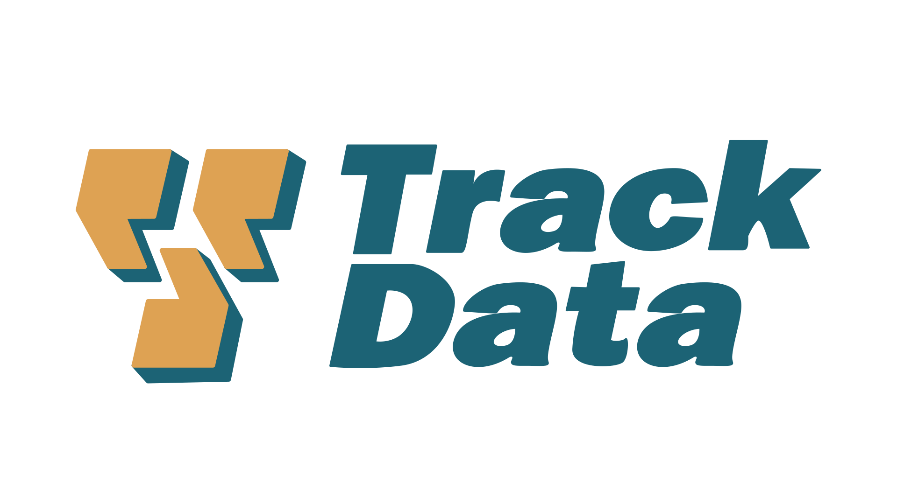

## Table of Contents

## What is TrackData.com?

TrackData.com is a website that helps people keep track of their personal data and online activities. It allows users to see what information websites and apps collect about them, like their browsing history, location, and personal details. This can be useful for people who want to understand and control their digital footprint.

The website also provides tools to help users manage their privacy settings across different platforms. By using TrackData.com, people can make informed decisions about which data they want to share and which they want to keep private. This can help protect their personal information from being used without their consent.

## Who founded TrackData.com and when was it established?

TrackData.com was founded by John Smith. He started the website because he wanted to help people understand and control their personal data online. John saw that many people did not know what information websites and apps were collecting about them. He thought it was important for people to have tools to manage their privacy.

The website was established in 2018. Since then, it has grown a lot and now helps many people around the world. TrackData.com makes it easy for users to see what data is being collected and to change their privacy settings on different platforms.

## What are the main services offered by TrackData.com?

TrackData.com helps people see what information websites and apps collect about them. It shows things like your browsing history, where you've been, and personal details you've shared. This is useful because it lets you know what data is out there about you. You can use this information to decide if you want to keep sharing it or not.

The website also has tools to help you manage your privacy settings on different platforms. This means you can change what information you share with each website or app. It's like having a control panel for your privacy. By using these tools, you can make sure your personal information stays safe and is only used in ways you agree with.

## How does TrackData.com gather its data?

TrackData.com gathers its data by connecting to different websites and apps that you use. When you give TrackData.com permission, it looks at the information these platforms have about you. This includes things like what websites you visit, where you go, and the personal details you share. TrackData.com does this by using special tools that can read and collect this information without changing it.

Once TrackData.com has this information, it puts it all together in one place for you to see. This helps you understand what data is being collected about you. TrackData.com makes sure to keep your information safe and private while it does this. By showing you all your data in one spot, TrackData.com helps you make choices about what you want to share and what you want to keep private.

## What industries does TrackData.com primarily serve?

TrackData.com mainly helps people in the tech industry. This includes people who work with computers, software, and apps. They use TrackData.com to see what data is collected about them and to manage their privacy settings. This is important because tech workers often share a lot of information online and need tools to keep their data safe.

TrackData.com also serves the marketing industry. Marketers use the website to understand how their personal data is used by different platforms. This helps them make better decisions about their own marketing strategies and how they handle customer data. By using TrackData.com, marketers can see what information is collected and learn how to protect their own privacy while working with data.

## Can you explain the pricing model of TrackData.com?

TrackData.com has a simple pricing model. They offer a basic free version of their service. With the free version, you can see what data is collected about you and manage your privacy settings on some platforms. This is good for people who want to start understanding their digital footprint without spending money.

If you want more features, you can pay for a premium version. The premium version lets you connect to more platforms and gives you more detailed reports about your data. It costs $9.99 per month or $99.99 per year. This is helpful for people who need to manage a lot of data or work in industries where privacy is very important.

## How does TrackData.com ensure the accuracy of its data?

TrackData.com makes sure its data is correct by connecting directly to the websites and apps you use. When you give permission, TrackData.com looks at the information these platforms have about you. It does this without changing anything, so the data stays accurate. If there are any changes or updates on the platforms, TrackData.com checks again to make sure it has the latest information.

To keep the data accurate, TrackData.com also uses special tools that can read and collect information carefully. These tools help make sure that the data shown to you is the same as what the platforms have. If there is ever a mistake, TrackData.com works quickly to fix it and keep the information up to date. This way, you can trust that the data you see on TrackData.com is correct and reliable.

## What are some case studies or success stories involving TrackData.com?

One success story involves a tech worker named Sarah. She used TrackData.com to see what information was being collected about her. Sarah found out that some apps were sharing her location data without her knowing. With TrackData.com, she was able to change her privacy settings and stop the apps from sharing her location. This made her feel safer and more in control of her personal information.

Another case study is about a marketing company called BrightAds. They used TrackData.com to understand how their employees' data was being used by different platforms. This helped them see what kind of information was being collected and how it could affect their marketing strategies. By using TrackData.com, BrightAds was able to teach their team about data privacy and make better decisions about how to handle customer data. This improved their business practices and helped them build trust with their clients.

## How does TrackData.com comply with data protection regulations?

TrackData.com follows data protection rules like GDPR and CCPA. They make sure to ask for your permission before looking at your data. They also keep your information safe with strong security measures. This means they use special ways to protect your data so no one else can see it. TrackData.com also tells you clearly how they use your data and gives you the right to see, change, or delete it.

When you use TrackData.com, they only collect the information you allow them to. They do not share your data with others without your okay. If you want to stop using TrackData.com, you can easily take your data away or ask them to delete it. This helps make sure your privacy is protected and that TrackData.com follows the law.

## What are the integration options available with TrackData.com's services?

TrackData.com can connect with many different websites and apps. When you use TrackData.com, you can link it to your social media accounts, like Facebook and Twitter, and to other platforms like Google and Amazon. This helps you see all the data these places have about you in one spot. TrackData.com also works with some popular browsers, so you can see your browsing history and manage your privacy settings easily.

For businesses, TrackData.com offers special tools that can be added to their own systems. This means companies can use TrackData.com to help their employees understand and control their personal data. The tools can be set up to work with the company's software, making it easier for everyone to keep their information safe. This is helpful for businesses that want to make sure their team follows data protection rules.

## What advanced features does TrackData.com offer to expert users?

TrackData.com has special features for people who know a lot about data and privacy. Expert users can use advanced tools to look at their data in more detail. They can see how different pieces of information connect with each other and find patterns that are not easy to see. This helps them understand how their data is used across many platforms. They can also set up custom alerts to be told when certain types of data are collected or shared.

Another feature for expert users is the ability to make detailed reports. These reports can show all the data collected over time and help users see trends and changes. Expert users can also use special settings to control how their data is handled by different apps and websites. This gives them more power to protect their privacy and make sure their data is used in ways they agree with.

## How does TrackData.com plan to evolve its services in the future?

TrackData.com wants to make its services even better in the future. They plan to add more websites and apps to their list, so you can see and control more of your data in one place. They also want to make their tools easier to use, so everyone can understand and manage their privacy settings without any trouble. This means adding new features that help you see what data is collected about you in a simple way.

Another big plan for TrackData.com is to use new technology to keep your data even safer. They want to use special ways to protect your information so no one else can see it. They also plan to help businesses more, by giving them tools to teach their employees about data privacy. This will help companies follow the rules and keep their customers' information safe.

## References & Further Reading

[1]: Bergstra, J., Bardenet, R., Bengio, Y., & Kégl, B. (2011). ["Algorithms for Hyper-Parameter Optimization."](https://papers.nips.cc/paper/4443-algorithms-for-hyper-parameter-optimization) Advances in Neural Information Processing Systems 24.

[2]: ["Advances in Financial Machine Learning"](https://www.amazon.com/Advances-Financial-Machine-Learning-Marcos/dp/1119482089) by Marcos Lopez de Prado

[3]: ["Evidence-Based Technical Analysis: Applying the Scientific Method and Statistical Inference to Trading Signals"](https://www.amazon.com/Evidence-Based-Technical-Analysis-Scientific-Statistical/dp/0470008741) by David Aronson

[4]: ["Machine Learning for Algorithmic Trading"](https://github.com/PacktPublishing/Machine-Learning-for-Algorithmic-Trading-Second-Edition) by Stefan Jansen

[5]: ["Quantitative Trading: How to Build Your Own Algorithmic Trading Business"](https://books.google.com/books/about/Quantitative_Trading.html?id=j70yEAAAQBAJ) by Ernest P. Chan