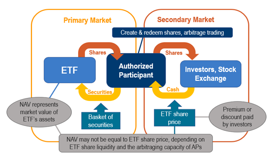

## Table of Contents

## What is a Tracker Fund?

A Tracker Fund, also known as an index fund, is a type of investment fund that aims to match the performance of a specific market index, like the S&P 500 or the Hang Seng Index. Instead of trying to beat the market, a Tracker Fund simply tries to replicate the returns of the index it follows. This is done by holding all or a representative sample of the securities in the index, in the same proportions as the index itself.

Tracker Funds are popular because they offer a low-cost way to invest in the market. Since they are passively managed, meaning they don't need a team of analysts to pick stocks, the fees are usually much lower than those of actively managed funds. This makes them a good choice for investors who want to grow their money over the long term without taking on too much risk or paying high fees.

## How does a Tracker Fund differ from other types of funds?

A Tracker Fund, or index fund, is different from other types of funds because it tries to copy the performance of a specific market index, like the S&P 500. It does this by holding the same stocks or bonds that are in the index, in the same amounts. This means it doesn't try to pick winners or beat the market, it just aims to match the market's performance. Other types of funds, like actively managed funds, have managers who try to choose the best stocks or bonds to beat the market. This means they are always buying and selling to try and do better than the index.

Because Tracker Funds just follow an index, they don't need a lot of people to manage them. This makes them cheaper to run, so the fees you pay are usually lower than with other funds. Actively managed funds, on the other hand, have higher fees because they need to pay for the managers and analysts who are always looking for the best investments. So, if you're looking for a simple, low-cost way to invest in the market, a Tracker Fund might be a good choice. But if you want someone to try and beat the market for you, you might look at other types of funds.

## What are the benefits of investing in a Tracker Fund?

Investing in a Tracker Fund can be a smart choice for many people. One big benefit is that they are usually cheaper than other types of funds. Since Tracker Funds just follow an index and don't need a lot of people to manage them, the fees you pay are lower. This means more of your money stays in your pocket and can grow over time.

Another benefit is that Tracker Funds are easy to understand and use. You don't need to be an expert to invest in them. They give you a simple way to invest in a whole market or a big part of it, like all the big companies in the U.S. or all the companies in a certain industry. This can help spread out your risk because you're not betting on just one or two companies.

Lastly, Tracker Funds can help you stay calm during ups and downs in the market. Since they follow the market, you know what to expect over the long term. You don't have to worry about a fund manager making bad choices. Over many years, Tracker Funds have often done as well or better than many other types of funds, especially after you take out the higher fees of those other funds.

## What are the risks associated with Tracker Funds?

One risk of Tracker Funds is that they won't beat the market. They are designed to match the performance of an index, so if the market goes down, your Tracker Fund will go down too. This means you won't do better than the market, and if the market has a bad year, your investment will too. Also, Tracker Funds can be affected by something called tracking error. This is when the fund doesn't perfectly match the index it's supposed to follow, which can happen because of fees or how the fund is managed. This might mean your returns are a bit different from the index.

Another risk is that Tracker Funds might not be as good for people who want to invest in specific things. If you think certain stocks or industries will do better than the market, a Tracker Fund won't help you take advantage of that. It just gives you the average performance of the market. Also, if you invest in a Tracker Fund that follows a small or specific part of the market, it can be riskier. For example, if you invest in a Tracker Fund that follows only tech companies and the tech industry has a bad year, your investment could lose a lot of value.

## How is the performance of a Tracker Fund measured?

The performance of a Tracker Fund is measured by how well it matches the performance of the index it follows. If the fund goes up or down by the same amount as the index, it's doing a good job. People look at something called the tracking error to see how well the fund is doing. Tracking error is the difference between the returns of the fund and the returns of the index. A smaller tracking error means the fund is doing a better job of matching the index.

Another way to measure the performance of a Tracker Fund is by looking at its total return over time. This includes any dividends or interest the fund earns, minus any fees it charges. Investors want to see if the fund is growing their money at the same rate as the index. They also compare the fund's performance to other similar funds to see if it's a good choice. By looking at these things, investors can decide if a Tracker Fund is helping them reach their investment goals.

## What is the underlying index that a Tracker Fund follows?

A Tracker Fund follows an underlying index, which is like a list of stocks or bonds that represents a part of the market. This index could be something big like the S&P 500, which includes 500 of the biggest companies in the U.S., or it could be smaller, like an index that only includes tech companies. The Tracker Fund tries to copy the performance of this index by holding the same stocks or bonds in the same amounts as the index.

The choice of the underlying index is important because it decides what the Tracker Fund will invest in. If you pick a Tracker Fund that follows the S&P 500, you're investing in a broad part of the U.S. market. But if you choose a Tracker Fund that follows a smaller or more specific index, like one for green energy companies, your investment will be more focused and might be riskier. The index sets the path for the Tracker Fund, and the fund's job is to stay as close to that path as possible.

## How are Tracker Funds managed and what are the management fees?

Tracker Funds are managed in a way that's different from other types of funds. They are what we call passively managed, which means they don't have a team of people trying to pick the best stocks or bonds to beat the market. Instead, they just try to match the performance of an index, like the S&P 500. To do this, the fund managers buy and hold the same stocks or bonds that are in the index, in the same amounts. This makes managing a Tracker Fund simpler and less costly than managing other types of funds.

The management fees for Tracker Funds are usually lower than for other types of funds. This is because they don't need a lot of people to manage them, so the costs are lower. These fees can be as low as 0.03% to 0.2% per year, but they can go up to around 1% for some Tracker Funds. The exact fee depends on the fund and the company that runs it. Lower fees mean more of your money stays in the fund and can grow over time, which is one of the big reasons people like Tracker Funds.

## What is the process of creating and redeeming shares in a Tracker Fund?

Creating and redeeming shares in a Tracker Fund is a bit like how a factory makes and takes back products. When someone wants to buy shares in a Tracker Fund, they give money to the fund company. The company then uses that money to buy the stocks or bonds that are in the index the fund follows. They then create new shares of the Tracker Fund and give them to the person who invested the money. This process is called creation, and it helps the Tracker Fund keep matching the index.

On the other hand, when someone wants to sell their shares in a Tracker Fund, they give their shares back to the fund company. This is called redemption. The fund company then sells the stocks or bonds that the shares represent and gives the money back to the person who sold the shares. This process helps keep the number of shares in the fund in line with how much money people are putting in or taking out. It's all about keeping the fund working smoothly and matching the index as closely as possible.

## How does market capitalization weighting affect a Tracker Fund's composition?

Market capitalization weighting is a way of deciding how much of each stock a Tracker Fund should hold. It means the fund has more of the stocks from bigger companies and less from smaller ones. For example, if a company is worth a lot more than others in the index, the Tracker Fund will have more shares of that company. This makes the fund's performance depend a lot on how the biggest companies in the index do.

This way of weighting can make the Tracker Fund a bit riskier because if the biggest companies in the index have a bad time, the whole fund can go down a lot. But it also means the fund can do well if those big companies do well. It's like putting more eggs in the baskets of the biggest companies, hoping they will do better than the smaller ones.

## What are the tax implications of investing in Tracker Funds?

When you invest in Tracker Funds, you need to think about taxes. One thing to know is that Tracker Funds can create something called capital gains. This happens when the fund sells stocks or bonds for more than it paid for them. If the fund does this, you might have to pay taxes on those gains, even if you don't sell your shares in the fund. But Tracker Funds usually don't trade a lot, so they might not create as many capital gains as other types of funds.

Another thing to consider is dividends. If the companies in the index pay dividends, the Tracker Fund will pass those dividends on to you. You'll have to pay taxes on those dividends, but the tax rate can be different depending on what kind of dividends they are. Also, if you sell your shares in the Tracker Fund for more than you paid, you'll have to pay capital gains tax on that profit. The tax rate for this can depend on how long you held the shares. So, it's a good idea to think about these taxes when you're planning your investments.

## How can investors use Tracker Funds for portfolio diversification?

Investors can use Tracker Funds to spread out their money and reduce risk. By investing in a Tracker Fund that follows a broad market index, like the S&P 500, you're putting your money into a lot of different companies all at once. This means if one company does badly, it won't hurt your whole investment as much because the other companies might still do well. It's like not putting all your eggs in one basket.

You can also use Tracker Funds to invest in different parts of the market or different countries. For example, you might buy a Tracker Fund that follows tech companies, another that follows healthcare companies, and another that follows companies in Europe. This way, your money is spread out across different industries and places. If one part of the market or one country has a bad time, the others might still do well, helping to balance out your overall investment.

## What advanced strategies can be employed with Tracker Funds for expert investors?

Expert investors can use Tracker Funds in smart ways to make their investments better. One way is to use something called tactical asset allocation. This means they change how much they put into different Tracker Funds based on what they think will happen in the market. For example, if they think tech companies will do well, they might put more money into a tech Tracker Fund. This can help them take advantage of changes in the market and maybe make more money.

Another strategy is called sector rotation. This is when investors move their money from one industry to another, depending on where they think the economy is going. They might use Tracker Funds that focus on different sectors like energy, healthcare, or consumer goods. By moving money around, they can try to do better than just following the whole market. These strategies need a lot of watching and understanding of the market, but they can help expert investors get more out of their Tracker Funds.

## What is a Tracker Fund?

Tracker funds, often referred to as index funds, are investment vehicles designed to closely replicate the performance of a specific market index, such as the S&P 500 or the FTSE 100. These funds achieve this by holding the same assets, or a representative sample, of the components within the index they aim to track. The primary advantage of tracker funds lies in their passive management strategy, which contrasts with actively managed funds that rely on fund managers to select stocks, often incurring higher costs.

Due to their passive nature, tracker funds typically have lower management fees and operating costs. Management expenses, known as expense ratios, tend to be minimal as there is no need for continuous buying and selling of securities, reducing transaction costs. This cost-effectiveness is one of the key benefits, allowing investors to retain more of their returns over time.

Another significant feature of tracker funds is diversification. By investing in all or a broad selection of the securities within an index, these funds provide exposure to a wide range of companies, industries, or sectors. This diversification reduces the unsystematic risk associated with investing in individual companies, aligning the fund's risk with that of the broader market. For instance, an investor in an S&P 500 tracker fund gains exposure to 500 of the largest U.S. companies, mitigating the impact of poor performance by any single entity.

Transparency is another hallmark of tracker funds. Their investment strategy and holdings are publicly available and easy to understand, as they strictly follow the index's composition. Investors can readily determine which assets are included and how their money is being allocated.

Mathematically, a tracker fund's performance can be represented by the formula:

$$
R_T = R_I - E
$$

Where:
- $R_T$ is the return on the tracker fund.
- $R_I$ is the return on the index.
- $E$ encompasses the expenses associated with managing the fund, including management fees and any tracking error.

Tracking error, although generally minimal, is a [factor](/wiki/factor-investing) to consider. It refers to the difference between the actual returns of the fund and the index it tracks, often caused by replication methods and fees.

In summary, tracker funds provide a straightforward, cost-effective way for investors to engage with the financial markets, ensuring broad exposure and minimizing costs while maintaining transparency.

## References & Further Reading

[1]: ["Advances in Financial Machine Learning"](https://www.amazon.com/Advances-Financial-Machine-Learning-Marcos/dp/1119482089) by Marcos Lopez de Prado

[2]: ["Machine Learning for Algorithmic Trading"](https://www.amazon.com/Machine-Learning-Algorithmic-Trading-alternative/dp/1839217715) by Stefan Jansen

[3]: ["Quantitative Trading: How to Build Your Own Algorithmic Trading Business"](https://github.com/LucindaYa/quant-resources/blob/master/Quantitative%20Trading%20How%20to%20Build%20Your%20Own%20Algorithmic%20Trading%20Business.pdf) by Ernest P. Chan

[4]: ["A Random Walk Down Wall Street: The Time-Tested Strategy for Successful Investing"](https://www.amazon.com/Random-Walk-Down-Wall-Street/dp/0393358380) by Burton G. Malkiel

[5]: ["The Little Book of Common Sense Investing: The Only Way to Guarantee Your Fair Share of Stock Market Returns"](https://www.amazon.com/Little-Book-Common-Sense-Investing/dp/1119404509) by John C. Bogle