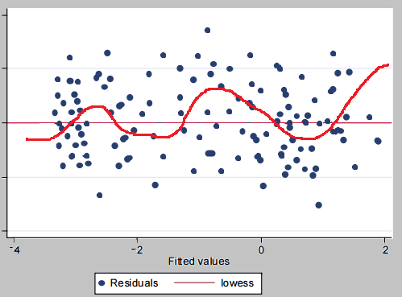

Understanding investment performance is pivotal for successful portfolio management and the development of algorithmic trading strategies. Tracking error, defined as the standard deviation of the difference in returns between a portfolio and its benchmark index, serves as a fundamental measure in this context. It provides a quantifiable assessment of how closely a portfolio follows its chosen benchmark, thereby offering insights into the effectiveness of active management.

The significance of tracking error extends across various facets of investment, particularly in its role in assessing a fund manager’s performance. In portfolio management, tracking error helps delineate between passive and active management approaches. A low tracking error indicates that a portfolio's return closely mirrors the benchmark, characteristic of passive management strategies. Conversely, a high tracking error implies greater deviations, often a result of active management aimed at outperforming the benchmark.



Algorithmic trading also benefits from the concept of tracking error, where precision in replicating an index is crucial. By analyzing tracking error, algorithmic strategies can be fine-tuned to improve trade execution and portfolio rebalancing, ensuring that discrepancies from the benchmark are minimized.

This article will explore how tracking error influences investment performance in portfolio management and algorithmic trading. By understanding its calculation methods and management strategies, investors and fund managers can enhance their navigation of the complexities inherent in modern financial markets. Mastering the fundamentals of tracking error is integral not only to optimizing returns but also to mitigating risks associated with deviations from benchmark performance targets.

## Table of Contents

## What is Tracking Error?

Tracking error is a quantitative measure used in finance to assess the degree to which the performance of an investment portfolio differs from that of its benchmark index. Mathematically, tracking error is defined as the standard deviation of the difference between the portfolio's returns and the benchmark's returns. This measure serves as a critical indicator of active management performance within a portfolio.

### Definition and Formula

The mathematical formula for tracking error is expressed as follows:

$$
\text{Tracking Error} = \sqrt{\frac{1}{N-1} \sum_{i=1}^{N} (R_{p,i} - R_{b,i} - \overline{D})^2 }
$$

where:
- $R_{p,i}$ is the return of the portfolio at time $i$,
- $R_{b,i}$ is the return of the benchmark at time $i$,
- $\overline{D}$ is the average of the differences between the portfolio and benchmark returns over $N$ periods.

### Interpretation

A tracking error close to zero indicates that the portfolio closely aligns with the benchmark index, signifying relatively passive management. In contrast, a higher tracking error suggests a greater deviation from the benchmark, indicative of active management strategies being employed by the portfolio manager. Active fund managers may purposefully incur a higher tracking error in pursuit of outperforming the benchmark, indicating their strategy's aggressiveness or divergence from typical index-like performance.

### Evaluation of Performance

For investors and fund managers, understanding tracking error is essential for evaluating how effectively a portfolio is being managed relative to its benchmark. A low tracking error is not inherently favorable or unfavorable without context; it may be desired in passive strategies aiming to replicate the benchmark. Conversely, in actively managed portfolios, a higher tracking error might be pursued to achieve returns that exceed standard benchmark performance, albeit often with increased risk.

By analyzing the tracking error, stakeholders can form judgements on the consistency and predictability of a fund manager's strategies. Ultimately, tracking error complements other metrics to provide a nuanced view of investment performance, aiding in tactical decisions that align with investors' goals and risk tolerance levels.

## Factors Affecting Tracking Error

Several factors can influence tracking error, which represents the degree to which a portfolio's performance diverges from its benchmark index. These factors are crucial for fund managers to understand in order to effectively control tracking error and maintain portfolio alignment with investment objectives.

One of the primary influences on tracking error is management fees. These fees, typically charged by fund managers for their services, can create a differential between the portfolio's returns and the benchmark. Since benchmarks do not account for management fees, the net returns to investors are often reduced, leading to a wider gap between the portfolio and benchmark performances.

Transaction costs also contribute significantly to tracking error. The expenses incurred from buying and selling assets within the portfolio can erode returns and thus impact the portfolio's alignment with its benchmark. This is especially relevant in actively managed funds, where frequent trading might occur.

Cash drag, or the holding of cash reserves within a portfolio, can further amplify tracking error. While necessary for [liquidity](/wiki/liquidity-risk-premium) and covering transaction costs, holding cash reduces exposure to the equity markets tracked by the benchmark. This underinvestment potentially leads to underperformance relative to the benchmark, which is usually fully invested.

Portfolio composition plays a pivotal role in tracking error as well. When the securities held and their weightings differ from those in the benchmark, deviations in performance are likely. This disparity could stem from active management strategies that seek to outperform the benchmark or from restrictions that prevent full replication of the benchmark.

Market [volatility](/wiki/volatility-trading-strategies) is another key [factor](/wiki/factor-investing). During periods of high volatility, the price movements of securities can be more erratic, making it challenging to mirror the benchmark precisely and increasing the likelihood of a larger tracking error.

Trade execution timing is crucial. Delays or misalignments in executing trades can result in mismatches with the benchmark, thereby increasing tracking error. Precise timing ensures that trades are executed at prices that closely match those in the benchmark index.

Recognizing these factors is vital for fund managers. They must adjust their strategies, such as optimizing trade execution methods or reevaluating portfolio compositions, to mitigate these influences and maintain tracking error within acceptable levels. Utilizing a thorough understanding of these components will assist in achieving closer alignment between the portfolio and its benchmark, meeting investor expectations and investment goals effectively.

## Ex-Post vs. Ex-Ante Tracking Error

Ex-post tracking error, often referred to as realized tracking error, measures the historical deviations between a portfolio's returns and those of its benchmark index. It is calculated as the standard deviation of the differences in returns over a specified period. This metric provides tangible insights into how effectively a portfolio has mirrored the benchmark. By analyzing past performance, investors and portfolio managers can assess the accuracy and effectiveness of previous investment strategies and make informed decisions about maintaining or adjusting their current approach.

The formula to calculate ex-post tracking error is:

$$
\text{Ex-post Tracking Error} = \sqrt{\frac{1}{N-1} \sum_{i=1}^{N} (R_{p,i} - R_{b,i})^2}
$$

where $R_{p,i}$ represents the portfolio return for period $i$, $R_{b,i}$ represents the benchmark return for the same period, and $N$ is the number of periods.

Ex-ante tracking error, by contrast, is a predictive measure that estimates the potential deviation of a portfolio's returns from its benchmark in the future. It employs statistical models and assumptions about market conditions, asset correlations, and volatility to forecast the possible tracking error. This forward-looking approach aids in risk management and strategic planning, allowing investors to anticipate and mitigate potential discrepancies before they occur.

Calculating ex-ante tracking error often involves sophisticated risk models, incorporating variables such as expected returns, asset correlations, and volatility forecasts. Tools like Monte Carlo simulations or factor models are commonly used for these estimations.

Both ex-post and ex-ante tracking error are crucial for investment performance evaluation. Ex-post analysis validates the historical accuracy of portfolio management decisions, while ex-ante modeling helps strategize and prepare for future deviations, balancing past insights with future expectations. By leveraging both measures, portfolio managers can enhance decision-making processes and align portfolios more closely with investment objectives.

## Tools for Monitoring Tracking Error

To effectively monitor tracking error, investors and portfolio managers rely on sophisticated tools and platforms designed to offer detailed analytics and real-time insights. Performance analytics software and financial platforms, such as Bloomberg Terminal, are among the primary resources utilized. These tools streamline the process of evaluating a portfolio's deviation from its benchmark, thereby assisting in the management and mitigation of tracking error.

Performance analytics software provides users with a multitude of features, including data visualization, statistical analysis, and scenario simulations. These capabilities enable portfolio managers to dissect the components contributing to tracking error and identify possible corrective measures. The platforms often integrate functionalities such as regression analysis and Monte Carlo simulations to anticipate potential misalignments with the benchmark, optimizing the process of maintaining an acceptable tracking error.

Moreover, advanced financial platforms like Bloomberg Terminal play a pivotal role by offering comprehensive datasets and powerful analytical tools necessary for precise tracking error evaluation. These platforms provide unparalleled access to global financial data, facilitating comparison and benchmarking of portfolio performance. Real-time updates on asset prices, market trends, and economic indicators allow managers to make informed decisions quickly, thus reducing the lag time between market movements and portfolio adjustments.

To predict and mitigate deviations from the benchmark, many advanced platforms deploy risk modeling techniques. These techniques involve assessing the risk factors that might lead to increased tracking error, including market volatility, changes in asset correlations, and liquidity constraints. By modeling these risks, portfolio managers can implement strategies aimed at reducing potential variances.

The availability of such technology is crucial for both individual investors and larger institutional entities. Individual investors gain the ability to independently analyze their portfolios and track performance without reliance solely on external advisors. On the other hand, institutional entities benefit from the scalability these tools provide, enabling them to manage large, diversified portfolios with greater accuracy and efficiency. Consequently, the deployment of these platforms not only enhances investment performance monitoring but also fosters a more disciplined approach to risk management, ultimately ensuring that portfolios remain aligned with their stated investment objectives.

## Impact of Tracking Error on Portfolio Management

Tracking error plays a crucial role in portfolio management, significantly influencing investment decisions and the construction of portfolios, particularly in passive management funds. These funds aim to mimic a benchmark index as closely as possible, thereby keeping tracking error at a minimum. The tracking error is calculated as the standard deviation of the difference in returns between the portfolio and its benchmark index:

$$

\text{Tracking Error} = \sqrt{\frac{1}{n-1} \sum_{i=1}^{n} (R_{p,i} - R_{b,i})^2} 
$$

Where $R_{p,i}$ represents the portfolio return and $R_{b,i}$ represents the benchmark return for time period $i$.

A high tracking error in a fund that purports to track an index may indicate that the portfolio requires adjustments or that the existing management strategy needs reevaluation. This discrepancy can arise due to active management decisions, such as altering the composition or weight of securities within the portfolio compared to the benchmark. Furthermore, factors such as management fees, transaction costs, and cash drag (excess cash holding reducing the overall portfolio return) can also contribute to increased tracking error.

Balancing tracking error is critical for aligning the portfolio with its investment goals and meeting investor expectations. This involves continuously monitoring and adjusting the portfolio to ensure that its performance remains consistent with the benchmark. By minimizing tracking error, fund managers can potentially deliver returns that more accurately reflect the indexed strategies, which is particularly important in passive investment approaches aimed at replicating market indices.

Fund managers strive to maintain an optimal level of tracking error that reflects their risk tolerance and return objectives. This involves a strategic assessment of how much deviation from the benchmark is acceptable, given the desired investment outcomes. Managing this balance effectively involves a trade-off between the cost of aligning a portfolio more closely with a benchmark and the potential benefits of active management that seeks to outperform the benchmark.

In conclusion, the management of tracking error is instrumental in ensuring that portfolio management strategies are both effective and aligned with their respective benchmarks' performance. It aids in the determination of whether a portfolio is succeeding in matching the benchmark returns or if strategic adjustments are necessary to better achieve the portfolio's investment objectives.

## Algorithmic Trading and Tracking Error

In [algorithmic trading](/wiki/algorithmic-trading), tracking error plays a significant role in strategies designed to replicate indices accurately. This precision is crucial because even minute deviations from a benchmark can compound over time, affecting the overall portfolio performance. Algorithmic models are tailored to minimize tracking error through two main methodologies: effective trade execution and optimized portfolio rebalancing.

Effective trade execution is essential for reducing tracking error. Algorithms enable traders to execute orders at optimal prices and times, reducing slippage and market impact costs. By systematically processing large datasets, these algorithms can predict market movements and execute trades more efficiently than manual trading, maintaining closer alignment with the desired index.

Optimized portfolio rebalancing is another critical element in minimizing tracking error. Rebalancing involves realigning the portfolio's asset weights to match the index more precisely. This process often considers factors like changes in stock prices, index reconstitutions, and corporate actions. Algorithms can dynamically evaluate these factors and adjust the portfolio swiftly, ensuring minimal deviation from the benchmark.

Mathematically, tracking error ($TE$) is often calculated as the standard deviation of the difference between the portfolio returns ($R_p$) and the benchmark returns ($R_b$) over a given period:

$$
TE = \sqrt{\frac{1}{N-1} \sum_{i=1}^{N} (R_{p,i} - R_{b,i})^2 }
$$

Where $N$ represents the number of periods. This formula quantifies how consistently a portfolio tracks its benchmark, with lower values indicating closer alignment.

Reducing tracking error results in more reliable performance metrics, which provide better alignment with intended investment strategies. It is particularly significant for institutional investors who manage passive investment funds, as they need to demonstrate their ability to mirror the chosen benchmark accurately.

Integrating algorithmic solutions with tracking error analysis enhances trading efficiency and robustness. For instance, [machine learning](/wiki/machine-learning) algorithms can predict market trends, leading to better timing in trade executions and portfolio adjustments. Through continuous monitoring and automatic recalibration, these models adapt to market conditions, ensuring tracking error remains within acceptable limits.

Developers often implement these strategies using programming languages like Python due to its rich ecosystem for financial analysis and machine learning. A Python function to calculate tracking error, for example, might look like this:

```python
import numpy as np

def calculate_tracking_error(portfolio_returns, benchmark_returns):
    differences = portfolio_returns - benchmark_returns
    tracking_error = np.std(differences)
    return tracking_error

# Example usage:
portfolio_returns = np.array([0.02, 0.05, 0.03, 0.07])
benchmark_returns = np.array([0.01, 0.06, 0.02, 0.06])
print(calculate_tracking_error(portfolio_returns, benchmark_returns))
```

This function computes the standard deviation of the differences between portfolio and benchmark returns, offering a straightforward way to gauge tracking error. By incorporating such analysis into algorithmic trading frameworks, traders and fund managers can ensure that their strategies align closely with investment goals, fostering more predictable and optimal financial outcomes.

## Conclusion

Tracking error is an essential metric in portfolio management and algorithmic trading, offering critical insights into the alignment between a portfolio's performance and its benchmark index. By providing a quantitative measure of deviation, tracking error helps investors and fund managers assess the effectiveness of their investment strategies. Professionals should utilize both ex-post and ex-ante analyses to comprehend past performance and anticipate future trends, respectively. Ex-post tracking error evaluates historical deviations, allowing fund managers to understand how effectively they have followed their benchmark. On the other hand, ex-ante tracking error estimates potential future deviations, guiding decision-making to mitigate risks and maximize returns.

Effective management of tracking error requires a nuanced understanding of various influencing factors, including market volatility, transaction costs, and portfolio composition. By analyzing and adjusting to these factors, investors can ensure that tracking error remains within acceptable levels, aligning investments with desired risk tolerances and return objectives. 

Incorporating tracking error analysis into portfolio management and algorithmic trading can significantly enhance performance metrics, assisting investors in optimizing portfolio returns. By minimizing tracking error, fund managers can not only achieve a closer replication of benchmark performance but also provide more consistent returns, thereby meeting investor expectations while minimizing potential risks.

## References & Further Reading

[1]: De Prado, M. L. (2018). ["Advances in Financial Machine Learning"](https://www.amazon.com/Advances-Financial-Machine-Learning-Marcos/dp/1119482089). Wiley.

[2]: Chan, E. P. (2008). ["Quantitative Trading: How to Build Your Own Algorithmic Trading Business"](https://github.com/ftvision/quant_trading_echan_book). Wiley.

[3]: Aronson, D. R. (2007). ["Evidence-Based Technical Analysis: Applying the Scientific Method and Statistical Inference to Trading Signals"](https://onlinelibrary.wiley.com/doi/book/10.1002/9781118268315). Wiley.

[4]: Jansen, S. (2020). ["Machine Learning for Algorithmic Trading: Predictive Models to Extract Signals of Market Movements with Python"](https://www.nature.com/articles/s41598-024-77101-6). Packt.

[5]: Bergstra, J., Bardenet, R., Bengio, Y., & Kégl, B. (2011). ["Algorithms for Hyper-Parameter Optimization"](https://proceedings.neurips.cc/paper/2011/file/86e8f7ab32cfd12577bc2619bc635690-Paper.pdf). Advances in Neural Information Processing Systems.